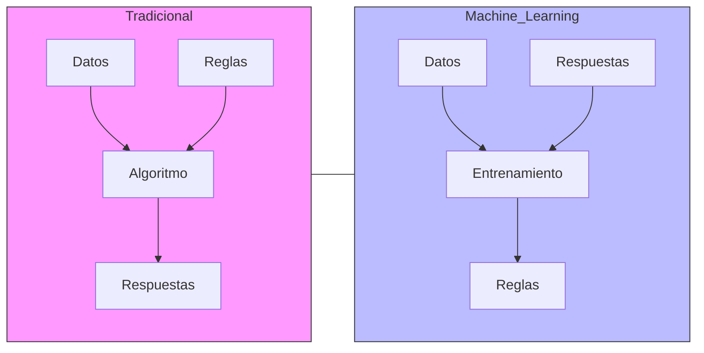

### Introducción

En estas lecciones, introducimos los conceptos fundamentales que sustentan la disciplina del Aprendizaje Automático. Dominar estas nociones resulta indispensable para desarrollar una comprensión profunda de las capacidades y limitaciones inherentes a los modelos de aprendizaje, así como para identificar sus posibles sesgos y escenarios de fallo. Como profesionales responsables, no podemos permitirnos la adopción acrítica de herramientas de Inteligencia Artificial en nuestro trabajo diario y en las aplicaciones destinadas a los usuarios finales, sin una evaluación rigurosa de su seguridad y eficacia para el propósito previsto. Dada la rápida evolución de este campo, una sólida comprensión de los principios clave facilitará nuestra adaptación continua a nuevas metodologías y áreas de aplicación. Buscamos, precisamente, que nuestro conocimiento nos aleje de la percepción que inmortalizó el autor de *2001: Una odisea del espacio*:

> Any sufficiently advanced technology is indistinguishable from magic.

Al comprender los mecanismos internos del Aprendizaje Automático, aspiramos a trascender la mera aplicación superficial de "magia tecnológica" para convertirnos en arquitectos conscientes y críticos de soluciones inteligentes.

### Estadística vs. Ciencia de Datos

Estas son dos disciplinas que se entrelazan y complementan, pero que no son sinónimos. La **Estadística** utiliza métodos matemáticos y probabilísticos rigurosos para extraer conclusiones significativas, probar hipótesis y modelar fenómenos con un fuerte énfasis en la inferencia sobre poblaciones a partir de muestras. Su objetivo principal es comprender la estructura subyacente de los datos, cuantificar la incertidumbre y, a menudo, explicar las relaciones entre variables. La validación del modelo se centra en asegurar que los supuestos estadísticos se cumplan y que las conclusiones sean sólidas y generalizables. A menudo, la estadística trabaja con muestras comparativamente mucho más pequeñas que la Ciencia de Datos. La preocupación primordial radica en explicar los parámetros del modelo en términos del problema del mundo real.

Por otro lado, la **Ciencia de Datos** abarca un enfoque más amplio y multidisciplinario que incluye la estadística como una de sus herramientas esenciales, pero que también incorpora de manera integral técnicas de programación (como Python y R), algoritmos de aprendizaje automático (Machine Learning), visualización de datos avanzada y gestión de grandes volúmenes de datos (Big Data). Su objetivo es resolver problemas complejos y extraer información valiosa a partir de  conjuntos de datos, que a menudo son masivos, no estructurados o provienen de diversas fuentes. Si bien la estadística busca principalmente la inferencia y la explicación, la ciencia de datos se centra más en la capacidad predictiva del modelo. La ciencia de datos se caracteriza por un ciclo iterativo de exploración, modelado y evaluación, con un fuerte componente de ingeniería de datos y despliegue de soluciones.

**En conclusión**:

Mientras que la Estadística proporciona la base teórica y las herramientas fundamentales para el análisis de datos y la inferencia rigurosa, la Ciencia de Datos construye sobre esta base, añadiendo la escalabilidad computacional, los algoritmos de aprendizaje automático y las habilidades de ingeniería necesarias para abordar los desafíos de los grandes volúmenes de datos y extraer valor práctico en una amplia gama de aplicaciones. La estadística busca principalmente entender el porqué, mientras que la ciencia de datos a menudo se enfoca en predecir el qué y cómo actuar basándose en los datos.


### ¿Qué es el aprendizaje automático?

El Aprendizaje Automático es un subcampo de la Inteligencia Artificial que se centra en el desarrollo de algoritmos y modelos que permiten a las computadoras aprender de los datos y hacer predicciones o tomar decisiones sin ser programadas explícitamente para cada tarea. Utiliza técnicas estadísticas y matemáticas para identificar patrones en los datos.



### ¿A qué nos referimos cuando decimos que una máquina "aprende"?
El aprendizaje en el contexto del aprendizaje automático se refiere a la capacidad de un modelo para mejorar su rendimiento en una tarea específica a medida que se le proporciona más datos. Esto implica ajustar los parámetros del modelo para minimizar el error en las predicciones o decisiones que toma. En otras palabras, un modelo "aprende" al identificar patrones y relaciones en los datos de entrenamiento, lo que le permite generalizar y hacer predicciones sobre datos no vistos.

### ¿Qué tipos de aprendizaje automático existen?
El aprendizaje automático se puede clasificar en varias categorías, siendo las más comunes:

1. **Aprendizaje supervisado**: En este enfoque, el modelo se entrena utilizando un conjunto de datos etiquetados, donde cada entrada tiene una salida conocida. El objetivo es aprender una función que mapee las entradas a las salidas. Ejemplos incluyen la regresión y la clasificación.
   
2. **Aprendizaje no supervisado**: Aquí, el modelo se entrena con datos no etiquetados y su objetivo es identificar patrones o estructuras subyacentes en los datos. Ejemplos incluyen el agrupamiento (clustering) y la reducción de dimensionalidad.

3. **Aprendizaje semi-supervisado**: Combina elementos del aprendizaje supervisado y no supervisado, utilizando un pequeño conjunto de datos etiquetados junto con un gran conjunto de datos no etiquetados para mejorar el rendimiento del modelo. Etiquetar datos habitualmente es un proceso costoso ya que suele hacerse de forma manual y requerir un conocimiento experto, este enfoque permite una reducción de coste.

4. **Aprendizaje auto-supervisado**: Es un enfoque en el que el modelo genera sus propias etiquetas a partir de los datos no etiquetados. Este enfoque ha ganado popularidad en tareas como el procesamiento del lenguaje natural y la visión por computadora. Por ejemplo, los LLM (Modelos de Lenguaje Grande) como GPT-3 utilizan aprendizaje auto-supervisado para predecir la siguiente palabra en una secuencia de texto, lo que les permite aprender representaciones útiles del lenguaje sin necesidad de etiquetas explícitas.

5. **Aprendizaje por refuerzo**: En este enfoque, un agente aprende a tomar decisiones mediante la interacción con un entorno. Recibe recompensas o penalizaciones en función de sus acciones y ajusta su comportamiento para maximizar la recompensa acumulada a lo largo del tiempo.
   
6. **Aprendizaje por transferencia**: Este enfoque implica tomar un modelo previamente entrenado en una tarea y adaptarlo a una nueva tarea relacionada, aprovechando el conocimiento adquirido en la tarea original.

7. **IA Generativa**: Este enfoque se centra en la creación de nuevos datos o contenido a partir de patrones aprendidos en un conjunto de datos existente. Las Redes Generativas Antagónicas (GANs) y los Modelos de Lenguaje Grande (LLMs), son ejemplos de este tipo de aprendizaje.

### ¿Qué es un modelo?

Un modelo en el contexto del aprendizaje automático es una representación matemática o computacional de un proceso o fenómeno que se utiliza para hacer predicciones o tomar decisiones basadas en datos. Los modelos pueden variar en complejidad, desde simples ecuaciones lineales hasta redes neuronales profundas. La elección del modelo depende de la naturaleza del problema, la cantidad y calidad de los datos disponibles, y los objetivos específicos del análisis.

### ¿Qué es un modelo lineal?
Un modelo lineal es un tipo de modelo matemático que describe la relación entre una variable dependiente (o respuesta) y una o más variables independientes (o características) mediante una ecuación lineal. En su forma más simple, un modelo lineal puede representarse como:

$y = mx + b$

donde:
- $y$ es la variable dependiente (la que queremos predecir).
- $x$ es la variable independiente (la característica que utilizamos para hacer la predicción).
- $m$ es la pendiente de la línea (coeficiente que representa el cambio en $y$ por cada unidad de cambio en $x$).
- $b$ es el interceptor (el valor de $y$ cuando $x = 0$). También es conocido como el término constante, término independiente u ordenada en el origen.

Los modelos lineales son ampliamente utilizados en estadística y aprendizaje automático debido a su simplicidad y facilidad de interpretación. Sin embargo, su capacidad para capturar relaciones complejas entre variables es limitada, lo que puede llevar a un rendimiento deficiente en problemas no lineales.

Gráficamente:


```python
from plotnine import ggplot, geom_abline, labs, coord_cartesian, theme, xlim, ylim, element_line

plot = (
    ggplot() +
    geom_abline(intercept=4, slope=-2, color='blue') +
    coord_cartesian(xlim=(0, 5), ylim=(0, 5), expand=False) + # Limitar los ejes y que no se expanda
    xlim(0, 5) +
    ylim(0, 5) +
    labs(title='Gráfica de la recta y = -2x + 4', x='x', y='y') +
    theme(
        axis_line_x=element_line(color='black', size=1), # Línea del eje x
        axis_line_y=element_line(color='black', size=1), # Línea del eje y 
    )
)
plot
```


    

    


### Regresión lineal Simple

La regresión lineal es un método estadístico utilizado para modelar la relación entre una variable dependiente y una o más variables independientes. El objetivo de la regresión lineal es encontrar la mejor línea recta (o hiperplano en el caso de múltiples variables) que se ajuste a los datos, minimizando la suma de los errores cuadrados entre las predicciones del modelo y los valores reales.

Ejemplo: ¿Existe relación entre el peso y la altura de una persona?

La ecuación de la recta que describe la relación entre el peso (variable independiente) y la altura (variable dependiente) se puede expresar como:

$ peso = m \cdot altura + b $

Esto se puede ver con el siguiente `dataset`:


```python
import pandas as pd

file = '../datasets/height.csv'
df = pd.read_csv(file)
```


```python
df
```


<div>
<style scoped>
    .dataframe tbody tr th:only-of-type {
        vertical-align: middle;
    }

    .dataframe tbody tr th {
        vertical-align: top;
    }

    .dataframe thead th {
        text-align: right;
    }
</style>
<table border="1" class="dataframe">
  <thead>
    <tr style="text-align: right;">
      <th></th>
      <th>gender</th>
      <th>height</th>
      <th>weight</th>
    </tr>
  </thead>
  <tbody>
    <tr>
      <th>0</th>
      <td>0</td>
      <td>72</td>
      <td>155</td>
    </tr>
    <tr>
      <th>1</th>
      <td>0</td>
      <td>67</td>
      <td>145</td>
    </tr>
    <tr>
      <th>2</th>
      <td>0</td>
      <td>65</td>
      <td>125</td>
    </tr>
    <tr>
      <th>3</th>
      <td>1</td>
      <td>67</td>
      <td>120</td>
    </tr>
    <tr>
      <th>4</th>
      <td>1</td>
      <td>63</td>
      <td>105</td>
    </tr>
    <tr>
      <th>...</th>
      <td>...</td>
      <td>...</td>
      <td>...</td>
    </tr>
    <tr>
      <th>76</th>
      <td>0</td>
      <td>71</td>
      <td>175</td>
    </tr>
    <tr>
      <th>77</th>
      <td>0</td>
      <td>70</td>
      <td>155</td>
    </tr>
    <tr>
      <th>78</th>
      <td>0</td>
      <td>67</td>
      <td>167</td>
    </tr>
    <tr>
      <th>79</th>
      <td>1</td>
      <td>58</td>
      <td>100</td>
    </tr>
    <tr>
      <th>80</th>
      <td>1</td>
      <td>56</td>
      <td>100</td>
    </tr>
  </tbody>
</table>
<p>81 rows × 3 columns</p>
</div>


```python
df[['height', 'weight']].describe()
```


<div>
<style scoped>
    .dataframe tbody tr th:only-of-type {
        vertical-align: middle;
    }

    .dataframe tbody tr th {
        vertical-align: top;
    }

    .dataframe thead th {
        text-align: right;
    }
</style>
<table border="1" class="dataframe">
  <thead>
    <tr style="text-align: right;">
      <th></th>
      <th>height</th>
      <th>weight</th>
    </tr>
  </thead>
  <tbody>
    <tr>
      <th>count</th>
      <td>81.000000</td>
      <td>81.000000</td>
    </tr>
    <tr>
      <th>mean</th>
      <td>68.012346</td>
      <td>154.555556</td>
    </tr>
    <tr>
      <th>std</th>
      <td>4.148776</td>
      <td>34.099853</td>
    </tr>
    <tr>
      <th>min</th>
      <td>54.000000</td>
      <td>82.000000</td>
    </tr>
    <tr>
      <th>25%</th>
      <td>66.000000</td>
      <td>125.000000</td>
    </tr>
    <tr>
      <th>50%</th>
      <td>68.000000</td>
      <td>151.000000</td>
    </tr>
    <tr>
      <th>75%</th>
      <td>71.000000</td>
      <td>175.000000</td>
    </tr>
    <tr>
      <th>max</th>
      <td>75.000000</td>
      <td>240.000000</td>
    </tr>
  </tbody>
</table>
</div>


```python
df.groupby('gender').agg(
    count=('gender', 'count'),
    mean_height=('height', 'mean'),
    mean_weight=('weight', 'mean')
).reset_index()
```


<div>
<style scoped>
    .dataframe tbody tr th:only-of-type {
        vertical-align: middle;
    }

    .dataframe tbody tr th {
        vertical-align: top;
    }

    .dataframe thead th {
        text-align: right;
    }
</style>
<table border="1" class="dataframe">
  <thead>
    <tr style="text-align: right;">
      <th></th>
      <th>gender</th>
      <th>count</th>
      <th>mean_height</th>
      <th>mean_weight</th>
    </tr>
  </thead>
  <tbody>
    <tr>
      <th>0</th>
      <td>0</td>
      <td>57</td>
      <td>69.824561</td>
      <td>168.473684</td>
    </tr>
    <tr>
      <th>1</th>
      <td>1</td>
      <td>24</td>
      <td>63.708333</td>
      <td>121.500000</td>
    </tr>
  </tbody>
</table>
</div>


Vemos que el sexo es una variable categórica pero que se usa 0 para hombres y 1 para mujeres. Además el peso está en libras y la altura en pulgadas. Podemos cambiar las unidades a kilos y metros respectivamente.


```python
df['gender'] = df['gender'].map({0: 'Male', 1: 'Female'})
df['weight'] = df['weight'] * 0.453592
df['height'] = df['height'] * 2.54
df
```


<div>
<style scoped>
    .dataframe tbody tr th:only-of-type {
        vertical-align: middle;
    }

    .dataframe tbody tr th {
        vertical-align: top;
    }

    .dataframe thead th {
        text-align: right;
    }
</style>
<table border="1" class="dataframe">
  <thead>
    <tr style="text-align: right;">
      <th></th>
      <th>gender</th>
      <th>height</th>
      <th>weight</th>
    </tr>
  </thead>
  <tbody>
    <tr>
      <th>0</th>
      <td>Male</td>
      <td>182.88</td>
      <td>70.306760</td>
    </tr>
    <tr>
      <th>1</th>
      <td>Male</td>
      <td>170.18</td>
      <td>65.770840</td>
    </tr>
    <tr>
      <th>2</th>
      <td>Male</td>
      <td>165.10</td>
      <td>56.699000</td>
    </tr>
    <tr>
      <th>3</th>
      <td>Female</td>
      <td>170.18</td>
      <td>54.431040</td>
    </tr>
    <tr>
      <th>4</th>
      <td>Female</td>
      <td>160.02</td>
      <td>47.627160</td>
    </tr>
    <tr>
      <th>...</th>
      <td>...</td>
      <td>...</td>
      <td>...</td>
    </tr>
    <tr>
      <th>76</th>
      <td>Male</td>
      <td>180.34</td>
      <td>79.378600</td>
    </tr>
    <tr>
      <th>77</th>
      <td>Male</td>
      <td>177.80</td>
      <td>70.306760</td>
    </tr>
    <tr>
      <th>78</th>
      <td>Male</td>
      <td>170.18</td>
      <td>75.749864</td>
    </tr>
    <tr>
      <th>79</th>
      <td>Female</td>
      <td>147.32</td>
      <td>45.359200</td>
    </tr>
    <tr>
      <th>80</th>
      <td>Female</td>
      <td>142.24</td>
      <td>45.359200</td>
    </tr>
  </tbody>
</table>
<p>81 rows × 3 columns</p>
</div>


```python
from plotnine import aes, geom_point, scale_color_manual

plot = (
    ggplot(df, aes(x='weight', y='height', color='gender'))
    + geom_point(shape='o', size=3, fill='white', stroke=1.5, alpha=0.6)
    + scale_color_manual(values={'Male': 'lightblue', 'Female': 'orange'}) +
    labs(title='Altura en función del peso para hombres y mujeres', x='Peso', y='Altura') +
    theme(
        axis_line_x=element_line(color='black', size=1),
        axis_line_y=element_line(color='black', size=1),
    )
)
plot

```


    

    


En el gráfico anterior se ve que existe una relación positiva entre el peso y la altura de las personas. A medida que aumenta la altura, también tiende a aumentar el peso. También observamos que la altura y el peso están relacionadas con el sexo. Que exista correlación no implica causalidad. Es decir, no podemos afirmar que el aumento del peso cause un aumento en la altura (o viceversa). La correlación simplemente indica que hay una relación entre las dos variables, pero no necesariamente que una cause la otra, ni que si intervenimos en una de ellas, la otra se vea afectada (ej.: No parece que si engordamos a una persona, esta vaya a crecer más).

Sin embargo, esta correlación puede ser útil para hacer predicciones sobre la altura de una persona en función de su peso, utilizando un modelo de regresión lineal. También podemos predecir el sexo de una persona en función de su altura y de su peso. En este caso, estaríamos hablando de un modelo de clasificación, donde la variable dependiente sería categórica (sexo) y las variables independientes serían continuas (altura y peso). La regresión lineal no es adecuada para este tipo de problemas, ya que este modelo asume que la variable dependiente es continua. Para problemas de clasificación, se utilizan otros modelos como la regresión logística.

Para calcular la recta que mejor se ajusta a los datos se utiliza una función de pérdida, que mide la diferencia entre las predicciones del modelo y los valores reales. En el caso de la regresión lineal, se utiliza la función de pérdida de error cuadrático medio (MSE), que se define como:

$
MSE = \frac{1}{n} \sum_{i=1}^{n} (y_i - \hat{y}_i)^2
$

donde:
- $n$ es el número de observaciones.
- $y_i$ Es es el valor real de la variable dependiente para la observación $i$. En nuestro caso sería el peso.
- $\hat{y}_i$ es el valor predicho por el modelo para la observación $i$. En nuestro caso sería el peso predicho por el modelo.

La función de pérdida se utiliza para ajustar los parámetros del modelo (en este caso, la pendiente $m$ y el intercepto $b$) mediante un proceso llamado optimización. El objetivo es encontrar los valores de $m$ y $b$ que minimicen la función de pérdida, lo que significa que el modelo se ajusta lo mejor posible a los datos.

$\hat{y_i} = m \cdot x_i + b$

Para calcular el Python los coeficientes de los parámetros del modelo de regresión lineal se puede utilizar la librería `scikit-learn`:


```python
from sklearn.linear_model import LinearRegression

# Variables
X = df[['weight']].values  # Peso (kg
y = df['height'].values    # Altura (cm)

# Ajustar modelo de regresión lineal
model = LinearRegression()
model.fit(X, y)

# Obtener pendiente y ordenada
m = model.coef_[0]
b = model.intercept_

print("Pendiente (m):", m)
print("Intercepto (b):", b)
```

    Pendiente (m): 0.5109168957411573
    Intercepto (b): 136.93344548546082


En el modelo ajustado la pendiente ($m$) es 0.51. Esto quiere decir que por cada incremento de 1 kg en el peso, la altura aumenta en 0.51 cm. El intercepto ($b$) es aproximadamente 137. El intercepto no tiene un significado práctico en este caso, ya que no tiene sentido hablar de la altura de una persona con 0 kg de peso. La ecuación de regresión ajustada es:

$ altura = 0.51 \cdot peso + 137 $

A continuación, se muestra el gráfico anterior con la recta de regresión lineal ajustada a los datos. La recta de regresión es la línea continúa que mejor se ajusta a los puntos de datos. Con líneas discontinuas se muestran otras rectas que tienen mayor función de pérdida.


```python
from plotnine import geom_smooth, geom_abline

plot + \
labs(title='Comparación de la recta de ajuste óptima con otras posibles') + \
geom_smooth(method='lm', color='black', se=False) + \
geom_abline(slope=m+0.1, intercept=b, linetype='dashed', color='blue', alpha=0.3) + \
geom_abline(slope=m-.2, intercept=b+5, linetype='dashed', color='blue', alpha=0.3) + \
geom_abline(slope=m, intercept=b-10, linetype='dashed', color='blue', alpha=0.3)
```


    

    


El modelo lo podemos usar para predecir:


```python
import numpy as np

# Predecir la altura para varias personas
pesos_a_predecir = np.array([2, 60, 70, 80])

# Predecir alturas
alturas_predichas = model.predict(pesos_a_predecir.reshape(-1, 1))

# Mostrar alturas con dos decimales
# Lo dejamos a un decimal porque no tiene sentido mostrar más
alturas_formateadas = [f"{altura:.1f}" for altura in alturas_predichas]

print("pesos a predecir:", pesos_a_predecir)
print("alturas predichas:", alturas_formateadas)

```

    pesos a predecir: [ 2 60 70 80]
    alturas predichas: ['138.0', '167.6', '172.7', '177.8']


Observe que las predicciones de la altura tienen sentido sólo en el rango de los datos de entrenamiento. Si se intenta predecir la altura de una persona con un peso muy bajo o muy alto, las predicciones pueden no ser realistas. En el ejemplo anterior, para un recién nacido de 2 kg, la predicción de altura es de 138 cm, lo cual no tiene sentido.

### Entonces, ¿qué quiere decir que un modelo "aprende"?
Un modelo "aprende" al ajustar sus parámetros (en este caso, la pendiente y el intercepto) para minimizar la función de pérdida. Otra forma de entender el "aprendizaje automático" es pensar que un modelo es capaz de encontrar patrones en los datos y hacer predicciones basadas en esos patrones.

### Regresión lineal múltiple

La regresión lineal múltiple es una extensión de la regresión lineal simple que permite modelar la relación entre una variable dependiente y múltiples variables independientes. La ecuación de la regresión lineal múltiple se puede expresar como:

$y = b_0 + b_1x_1 + b_2x_2 + ... + b_nx_n$

Observe que en este caso la variable dependiente $y$ es una función de múltiples variables independientes $x_1, x_2, ..., x_n$. Los coeficientes $b_0, b_1, b_2, ..., b_n$ representan el intercepto y las pendientes de la recta de regresión en un espacio multidimensional, respectivamente.

Por ejemplo, usando el dataset anterior podemos predecir el peso de una persona en función de su sexo y de su altura. En este caso, la variable dependiente sería la altura y las variables independientes serían el sexo y el peso. La ecuación de la regresión lineal múltiple se puede expresar como:

$ altura = b_0 + b_1 \cdot sexo + b_2 \cdot peso $


```python
from sklearn.preprocessing import OneHotEncoder
from sklearn.compose import ColumnTransformer
from sklearn.pipeline import Pipeline

# Variables dependiente e independientes
X = df[['gender', 'weight']]
y = df['height']

# Codificación treatment (como R): drop='first'
preprocessor = ColumnTransformer(
    transformers=[
        ('onehot', OneHotEncoder(drop='first'), ['gender'])
    ],
    remainder='passthrough'
)

# Pipeline con preprocesador y regresión
model = Pipeline([
    ('preprocessor', preprocessor),
    ('regressor', LinearRegression())
])

# Ajustar el modelo
model.fit(X, y)

# Mostrar coeficientes e intercepto
print("Coeficientes:", model.named_steps['regressor'].coef_)
print("Intercepto:", model.named_steps['regressor'].intercept_)

```

    Coeficientes: [7.75642613 0.36508351]
    Intercepto: 141.69889323513996


La ecuación de regresión ajustada sería:

$ height = 7.76 . male + 0.36 \cdot weight + 141,70 $

¿Qué significa que la primera pendiente se multiplique por `male`? Esto es debido a que `gender` es una variable categórica. El modelo asigna un valor de 0 a las mujeres y un valor de 1 a los hombres.

¿Por qué lo hace así? El modelo usa el valor de `Female` como valor de referencia porque alfabéticamente `Female` viene antes que `Male`.

Así que el modelo se puede descomponer en dos ecuaciones:

- Para mujeres: $ altura = 0.36 \cdot peso + 141,70 $
- Para hombres: $ altura = 0.36 \cdot peso + 7.76 + 141,70 $

Es decir, que el modelo predice que el peso de una mujer es casi 8 kilos menor que el de un hombre con la misma altura.

En el siguiente gráfico, se muestran la rectas de regresión ajustada para hombres y mujeres (en negro la recta de regresión simple que sólo usa como variable explicativa únicamente la altura):


```python
plot + \
geom_smooth(method='lm', color='black', se=False) + \
geom_abline(size=1.5,slope=model.named_steps['regressor'].coef_[1], intercept=model.named_steps['regressor'].intercept_ + model.named_steps['regressor'].coef_[0], color='lightblue') + \
geom_abline(size=1,slope=model.named_steps['regressor'].coef_[1], intercept=model.named_steps['regressor'].intercept_ , color='orange')
```


    

    


Observe que las líneas de regresión para hombres y para mujeres son paralelas. Es decir, hombres y mujeres sólo se diferencian en el intercepto. Observe también que la línea de regresión para mujeres parece no estar muy bien ajustada. Esto es así porque en las mujeres se observan algunos valores atípicos (`outliers`). En la parte inferior izquierda se observan pesos y alturas de mujeres muy bajas comparados con el resto. Si hubiéramos hecho una regresión simple del peso para hombres y otra del peso para mujeres, las pendientes hubieran sido diferentes. Los valores atípicos de mujeres habrían ocasionado que la recta de regresión tuviera una pendiente mucho más acusada. Esto hubiera producido que el modelo predijera que las mujeres más pesadas (a partir de 80 kilos) tendrían alturas superiores a los hombres del mismo peso. El modelo de regresión múltiple está teniendo un efecto regularizador al usar mayor cantidad de información. Lo explicado anteriormente se puede ver en el siguiente gráfico:


```python
plot + \
labs(title='Rectas de regresión simple y múltiple para mujeres') + \
geom_abline(size=1.5,slope=model.named_steps['regressor'].coef_[1], intercept=model.named_steps['regressor'].intercept_ + model.named_steps['regressor'].coef_[0], color='lightblue') + \
geom_abline(size=1,slope=model.named_steps['regressor'].coef_[1], intercept=model.named_steps['regressor'].intercept_ , color='orange') + \
geom_smooth(data=df[df['gender'] == 'Female'], color='orange', method='lm', se=False, linetype='dashed')
```


    

    


Entonces, ¿siempre será mejor usar un modelo de regresión múltiple que uno de regresión simple? No necesariamente. A pesar de lo que hemos visto en el gráfico anterior, y de que la función de pérdida siempre será menor en un modelo que incluya variables adicionales, añadir variables espurias en general deteriora la capacidad predictiva del modelo.

Hay una cosa que me gustaría aclarar: Al mostrar el gráfico de la regresión lineal múltiple, se muestran dos rectas de regresión. Una para hombres y otra para mujeres. Pero eso sólo se ha podido hacer porque la variable `gender` es categórica. Cuando hay dos variables independientes continuas, la regresión no se puede representar en un plano bidimensional. En realidad no hay una recta de regresión sino un plano de regresión. Y se puede mostrar en un gráfico 3D como el de la siguiente figura. En el caso de que haya más de dos variables independientes, la recta de regresión se convierte en un hiperplano de regresión. En este caso no es posible representar gráficamente el modelo.


```python
import matplotlib.pyplot as plt

# Crear figura 3D
fig = plt.figure(figsize=(10, 8))
ax = fig.add_subplot(111, projection='3d')

colors = {'Male': 'lightblue', 'Female': 'orange'}
for gender in df['gender'].unique():
    mask = df['gender'] == gender
    ax.scatter(df.loc[mask, 'weight'], 
              [0 if gender == 'female' else 1]*mask.sum(),  # 0=Female, 1=Male en eje Y
              df.loc[mask, 'height'],
              color=colors[gender], label=gender, s=50, edgecolor='k', alpha=0.7)

# Crear malla para hiperplano
weight_range = np.linspace(df['weight'].min(), df['weight'].max(), 20)
gender_range = np.array([0, 1])  # Female=0, Male=1
W, G = np.meshgrid(weight_range, gender_range)

# Aplanar para predecir
X_pred = np.column_stack((G.ravel(), W.ravel()))

# Predecir alturas
Z_pred = model.named_steps['regressor'].predict(X_pred)
Z = Z_pred.reshape(G.shape)

# Graficar hiperplano
ax.plot_surface(W, G, Z, alpha=0.5, color='green')

# Etiquetas y leyenda
ax.set_xlabel('Weight (kg)')
ax.set_ylabel('Gender (0=Female, 1=Male)')
ax.set_zlabel('Height (cm)')
ax.set_yticks([0, 1])
ax.set_yticklabels(['Female', 'Male'])
ax.legend()
ax.set_title('Regresión lineal: Altura vs Sexo y Peso')

# Esto permite rotar la figura interactivamente
#plt.tight_layout()
plt.show()
```


    

    

