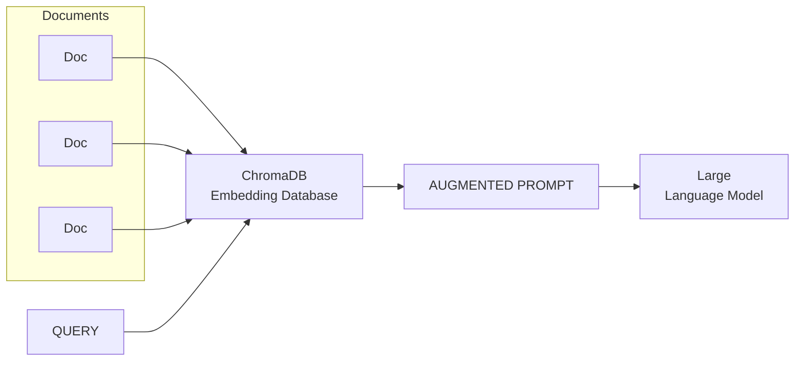

### RAG (Retrieval-Augmented Generation o "Generación Aumentada por Recuperación")

RAG es un enfoque arquitectónico en inteligencia artificial que potencia los Modelos de Lenguaje al integrar un componente de recuperación de información. Esto permite que los LLM accedan y utilicen fuentes de datos externas (como bases de datos, repositorios de documentos o bases de conocimiento) en el momento de generar respuestas, en lugar de depender únicamente de su conocimiento preentrenado y estático.

### ¿Cómo Funciona RAG?

1. **Recuperación de Información:** Cuando el usuario envía una consulta, el sistema RAG primero busca y recupera documentos o datos relevantes de fuentes externas, utilizando técnicas de recuperación de información (a menudo mediante bases de datos vectoriales para búsqueda semántica).
2. **Generación Aumentada:** La información recuperada se combina con la consulta original, creando un *prompt aumentado* que ofrece contexto adicional y actualizado al LLM.
3. **Respuesta Mejorada:** El LLM genera una respuesta basada tanto en su conocimiento preentrenado como en la información recuperada, logrando respuestas más precisas, relevantes y actuales.

### Principales Ventajas de usar RAG

- **Mayor Precisión y Relevancia:** Al fundamentar las respuestas en datos actualizados y autorizados, RAG reduce las alucinaciones (respuestas inventadas o inexactas) y mejora la veracidad.
- **Adaptabilidad a Dominios Específicos:** Permite a los LLM responder usando información privada, específica de un dominio o que cambia rápidamente, sin necesidad de reentrenar el modelo.
- **Transparencia:** Bien implementado, un sistema RAG puede proporcionar citas o referencias de la información utilizada, aumentando la confianza y verificabilidad.

### Tabla comparativa entre LLM Estándar y LLM con RAG

| Característica           | LLM Estándar            | LLM con RAG                        |
|--------------------------|-------------------------|-------------------------------------|
| Fuente de Conocimiento   | Solo datos preentrenados| Preentrenado + datos externos       |
| Actualización de Datos   | Reentrenamiento         | Solo actualizar la base de datos    |
| Precisión Factual        | Limitada al entrenamiento| Mejorada por la recuperación        |
| Adaptación a Dominios    | Difícil                 | Fácil, eligiendo fuentes de datos   |
| Citas/Referencias        | Rara vez                | Posible con metadatos               |


### Etapas de un sistema RAG

1. **Knowledge Storage** (Almacenamiento del conocimiento)
Se recopila y almacena la información relevante en una base de datos, normalmente como vectores para búsqueda semántica. Los datos pueden venir de documentos, bases de datos, páginas web, etc.

2. **Question Reception** (Recepción de la pregunta)
El sistema recibe la pregunta o consulta del usuario, lo que inicia el proceso de búsqueda y generación.

3. **Information Retrieval** (Recuperación de información)
La pregunta se transforma en un vector y se busca en la base de conocimiento los fragmentos más relevantes usando similitud semántica.

4. **Prompt Construction** (Construcción del prompt)
Se construye un mensaje (prompt) que combina la pregunta del usuario con los fragmentos de información recuperados, para proporcionar contexto al modelo.

5. **Calling the Model** (Llamada al modelo)
El prompt se envía al modelo generativo (por ejemplo, un LLM), que utiliza tanto su conocimiento preentrenado como la información contextual proporcionada.

6. Response from the Model (Respuesta del modelo)
El modelo genera y devuelve una respuesta fundamentada, utilizando tanto la información recuperada como su propio conocimiento. Esta respuesta es entregada al usuario.


### Selección de modelos en Hugging Face

Hugging Face tiene en el momento de escribir estas líneas (mayo 2025) casi 2.000.000 de modelos disponibles. Para encontrar un modelo existen los siguientes filtros.

**Tasks (Tareas):**
Permiten filtrar modelos según la tarea de inteligencia artificial que resuelven, como clasificación de texto, generación de texto, traducción automática, análisis de sentimientos, procesamiento de imágenes, reconocimiento de voz, etc.

**Libraries (Librerías):**
Permiten filtrar modelos según la librería o framework con el que fueron desarrollados y pueden ejecutarse, por ejemplo: Transformers, PyTorch, TensorFlow, JAX.

**Datasets (Conjuntos de datos):**
Permiten buscar modelos que han sido entrenados o ajustados usando conjuntos de datos específicos, como Imagenet, GLUE, SQuAD, COCO, entre otros.

**Languages (Idiomas):**
Permiten filtrar modelos según el idioma o los idiomas que soportan, como inglés, español, multilingüe, etc.

**Licenses (Licencias):**
Permiten filtrar modelos según la licencia bajo la que se distribuyen, como MIT, Apache 2.0, GPL, entre otras.


### Bases de datos vectoriales

Una **base de datos vectorial** (o *embedding database*) es un tipo de base de datos diseñada específicamente para almacenar y buscar **vectores numéricos de alta dimensión** de manera eficiente. En el contexto de los LLMs, estos vectores se llaman **embeddings**.

### ¿Cómo se realiza la búsqueda en una base de datos vectorial?


1. **Creación de embeddings:**  
   Cada fragmento de texto (por ejemplo, un párrafo o documento) se transforma en un vector numérico usando un modelo de embeddings. Este vector representa el significado del texto en un espacio de muchas dimensiones.

2. **Almacenamiento:**  
   Los vectores generados se almacenan en la base de datos vectorial, en vez de guardar solo el texto original. Este almacenamiento permite búsquedas eficientes basadas en similitud semántica, no solo coincidencia exacta de palabras.

3. **Búsqueda (Vector Search):**  
   Cuando un usuario realiza una consulta, la pregunta también se convierte en un vector usando el mismo modelo de embeddings.  
   La base de datos compara este vector de consulta con los vectores almacenados, utilizando métricas de similitud como la distancia coseno o euclidiana, para encontrar los fragmentos más cercanos en significado.

4. **Recuperación de información:**  
   Los fragmentos de texto más similares (los vectores más cercanos) se recuperan y pueden usarse como contexto para que el LLM genere una respuesta precisa y relevante.

### Ventajas de las bases de datos vectoriales

- Permite búsquedas por significado, no solo por coincidencia exacta de palabras.
- Es eficiente incluso con grandes volúmenes de datos no estructurados.
- Es fundamental en sistemas de búsqueda semántica y en pipelines RAG.

### Práctica de RAG

En esta práctica vamos a construir una aplicación con soporte RAG utilizando un modelo de lenguaje de código abierto de Hugging Face y la base de datos vectorial de código abierto creada por Hugging Face llamada Chroma Database.



Para ejecutar esta práctica se requiere GPU. Si no se dispone de ella se debe ejecutar en Google Colab o en Kaggle.

Suponiendo que se ha elegido ejecutarla en Google Colab. La siguiente celda monta `drive` para poder almacenar los datos en Google Drive.


```python
from google.colab import drive
drive.mount('/content/drive')
```

    Mounted at /content/drive


El siguiente paso es descargar el dataset que vamos a utilizar. En este caso es el [Topic Labeled News Dataset
](https://www.kaggle.com/datasets/kotartemiy/topic-labeled-news-dataset) de Kaggle. Este conjunto de datos contiene 108.774 artículos etiquetados en 8 categorías en función de la temática del artículo. Se puede descargar el dataset y situarlo en el punto de montaje de `drive`, o se puede hacer eso mismo desde Python. Para hacerlo desde Python hay que instalar el cliente de Kaggle y generar una API Key. En este caso la API Key se baja en un fichero llamado `kaggle.json`. Ese fichero contiene un objeto con dos claves (`username` y `key`). La clave `username` del fichero `kaggle.json` hay que asignarla a la variable de entorno `KAGGLE_USERNAME` y la clave `key` a la variable de entorno `KAGGLE_KEY`. Con estas variables de entorno, se puede descargar el `dataset`:


```python
from google.colab import userdata
import os

os.environ["KAGGLE_USERNAME"] = userdata.get('KAGGLE_USERNAME')
os.environ["KAGGLE_KEY"] = userdata.get('KAGGLE_KEY')
```


```python
!kaggle datasets download -d kotartemiy/topic-labeled-news-dataset
```

    Dataset URL: https://www.kaggle.com/datasets/kotartemiy/topic-labeled-news-dataset
    License(s): CC0-1.0
    topic-labeled-news-dataset.zip: Skipping, found more recently modified local copy (use --force to force download)


El fichero descargado está en formato `zip`. Hay que descomprimirlo:


```python
import zipfile

# Define the path to your zip file
file_path = '/content/topic-labeled-news-dataset.zip'

with zipfile.ZipFile(file_path, 'r') as zip_ref:
    zip_ref.extractall('/content/datasets')
```

El fichero descargado es `labelled_newscatcher_dataset.csv`.  La extensión corresponde a `Comma Separated Values`. Es decir, es un fichero de texto en el que en cada fila hay un registro y los campos están separados por comas (a veces, como en este caso, por punto y coma o espacio). Suelen tener una primera fila de cabacera que contiene los nombres de los campos. Para cargar el `dataset` y visualizarlo, la librería más popular es Pandas. Cuando leemos el fichero en memoria, hablamos de un `dataframe`:


```python
import pandas as pd

df = pd.read_csv('/content/datasets/labelled_newscatcher_dataset.csv', sep=';')
df.head()
```


  <div id="df-93aee2ca-837c-4333-a439-0e72ce1c832d" class="colab-df-container">
    <div>
<style scoped>
    .dataframe tbody tr th:only-of-type {
        vertical-align: middle;
    }

    .dataframe tbody tr th {
        vertical-align: top;
    }

    .dataframe thead th {
        text-align: right;
    }
</style>
<table border="1" class="dataframe">
  <thead>
    <tr style="text-align: right;">
      <th></th>
      <th>topic</th>
      <th>link</th>
      <th>domain</th>
      <th>published_date</th>
      <th>title</th>
      <th>lang</th>
    </tr>
  </thead>
  <tbody>
    <tr>
      <th>0</th>
      <td>SCIENCE</td>
      <td>https://www.eurekalert.org/pub_releases/2020-0...</td>
      <td>eurekalert.org</td>
      <td>2020-08-06 13:59:45</td>
      <td>A closer look at water-splitting's solar fuel ...</td>
      <td>en</td>
    </tr>
    <tr>
      <th>1</th>
      <td>SCIENCE</td>
      <td>https://www.pulse.ng/news/world/an-irresistibl...</td>
      <td>pulse.ng</td>
      <td>2020-08-12 15:14:19</td>
      <td>An irresistible scent makes locusts swarm, stu...</td>
      <td>en</td>
    </tr>
    <tr>
      <th>2</th>
      <td>SCIENCE</td>
      <td>https://www.express.co.uk/news/science/1322607...</td>
      <td>express.co.uk</td>
      <td>2020-08-13 21:01:00</td>
      <td>Artificial intelligence warning: AI will know ...</td>
      <td>en</td>
    </tr>
    <tr>
      <th>3</th>
      <td>SCIENCE</td>
      <td>https://www.ndtv.com/world-news/glaciers-could...</td>
      <td>ndtv.com</td>
      <td>2020-08-03 22:18:26</td>
      <td>Glaciers Could Have Sculpted Mars Valleys: Study</td>
      <td>en</td>
    </tr>
    <tr>
      <th>4</th>
      <td>SCIENCE</td>
      <td>https://www.thesun.ie/tech/5742187/perseid-met...</td>
      <td>thesun.ie</td>
      <td>2020-08-12 19:54:36</td>
      <td>Perseid meteor shower 2020: What time and how ...</td>
      <td>en</td>
    </tr>
  </tbody>
</table>
</div>
    <div class="colab-df-buttons">

  <div class="colab-df-container">
    <button class="colab-df-convert" onclick="convertToInteractive('df-93aee2ca-837c-4333-a439-0e72ce1c832d')"
            title="Convert this dataframe to an interactive table."
            style="display:none;">

  <svg xmlns="http://www.w3.org/2000/svg" height="24px" viewBox="0 -960 960 960">
    <path d="M120-120v-720h720v720H120Zm60-500h600v-160H180v160Zm220 220h160v-160H400v160Zm0 220h160v-160H400v160ZM180-400h160v-160H180v160Zm440 0h160v-160H620v160ZM180-180h160v-160H180v160Zm440 0h160v-160H620v160Z"/>
  </svg>
    </button>

  <style>
    .colab-df-container {
      display:flex;
      gap: 12px;
    }

    .colab-df-convert {
      background-color: #E8F0FE;
      border: none;
      border-radius: 50%;
      cursor: pointer;
      display: none;
      fill: #1967D2;
      height: 32px;
      padding: 0 0 0 0;
      width: 32px;
    }

    .colab-df-convert:hover {
      background-color: #E2EBFA;
      box-shadow: 0px 1px 2px rgba(60, 64, 67, 0.3), 0px 1px 3px 1px rgba(60, 64, 67, 0.15);
      fill: #174EA6;
    }

    .colab-df-buttons div {
      margin-bottom: 4px;
    }

    [theme=dark] .colab-df-convert {
      background-color: #3B4455;
      fill: #D2E3FC;
    }

    [theme=dark] .colab-df-convert:hover {
      background-color: #434B5C;
      box-shadow: 0px 1px 3px 1px rgba(0, 0, 0, 0.15);
      filter: drop-shadow(0px 1px 2px rgba(0, 0, 0, 0.3));
      fill: #FFFFFF;
    }
  </style>

    <script>
      const buttonEl =
        document.querySelector('#df-93aee2ca-837c-4333-a439-0e72ce1c832d button.colab-df-convert');
      buttonEl.style.display =
        google.colab.kernel.accessAllowed ? 'block' : 'none';

      async function convertToInteractive(key) {
        const element = document.querySelector('#df-93aee2ca-837c-4333-a439-0e72ce1c832d');
        const dataTable =
          await google.colab.kernel.invokeFunction('convertToInteractive',
                                                    [key], {});
        if (!dataTable) return;

        const docLinkHtml = 'Like what you see? Visit the ' +
          '<a target="_blank" href=https://colab.research.google.com/notebooks/data_table.ipynb>data table notebook</a>'
          + ' to learn more about interactive tables.';
        element.innerHTML = '';
        dataTable['output_type'] = 'display_data';
        await google.colab.output.renderOutput(dataTable, element);
        const docLink = document.createElement('div');
        docLink.innerHTML = docLinkHtml;
        element.appendChild(docLink);
      }
    </script>
  </div>


    <div id="df-7197585d-a8f8-4c5b-9d39-de0e2de331f5">
      <button class="colab-df-quickchart" onclick="quickchart('df-7197585d-a8f8-4c5b-9d39-de0e2de331f5')"
                title="Suggest charts"
                style="display:none;">

<svg xmlns="http://www.w3.org/2000/svg" height="24px"viewBox="0 0 24 24"
     width="24px">
    <g>
        <path d="M19 3H5c-1.1 0-2 .9-2 2v14c0 1.1.9 2 2 2h14c1.1 0 2-.9 2-2V5c0-1.1-.9-2-2-2zM9 17H7v-7h2v7zm4 0h-2V7h2v10zm4 0h-2v-4h2v4z"/>
    </g>
</svg>
      </button>

<style>
  .colab-df-quickchart {
      --bg-color: #E8F0FE;
      --fill-color: #1967D2;
      --hover-bg-color: #E2EBFA;
      --hover-fill-color: #174EA6;
      --disabled-fill-color: #AAA;
      --disabled-bg-color: #DDD;
  }

  [theme=dark] .colab-df-quickchart {
      --bg-color: #3B4455;
      --fill-color: #D2E3FC;
      --hover-bg-color: #434B5C;
      --hover-fill-color: #FFFFFF;
      --disabled-bg-color: #3B4455;
      --disabled-fill-color: #666;
  }

  .colab-df-quickchart {
    background-color: var(--bg-color);
    border: none;
    border-radius: 50%;
    cursor: pointer;
    display: none;
    fill: var(--fill-color);
    height: 32px;
    padding: 0;
    width: 32px;
  }

  .colab-df-quickchart:hover {
    background-color: var(--hover-bg-color);
    box-shadow: 0 1px 2px rgba(60, 64, 67, 0.3), 0 1px 3px 1px rgba(60, 64, 67, 0.15);
    fill: var(--button-hover-fill-color);
  }

  .colab-df-quickchart-complete:disabled,
  .colab-df-quickchart-complete:disabled:hover {
    background-color: var(--disabled-bg-color);
    fill: var(--disabled-fill-color);
    box-shadow: none;
  }

  .colab-df-spinner {
    border: 2px solid var(--fill-color);
    border-color: transparent;
    border-bottom-color: var(--fill-color);
    animation:
      spin 1s steps(1) infinite;
  }

  @keyframes spin {
    0% {
      border-color: transparent;
      border-bottom-color: var(--fill-color);
      border-left-color: var(--fill-color);
    }
    20% {
      border-color: transparent;
      border-left-color: var(--fill-color);
      border-top-color: var(--fill-color);
    }
    30% {
      border-color: transparent;
      border-left-color: var(--fill-color);
      border-top-color: var(--fill-color);
      border-right-color: var(--fill-color);
    }
    40% {
      border-color: transparent;
      border-right-color: var(--fill-color);
      border-top-color: var(--fill-color);
    }
    60% {
      border-color: transparent;
      border-right-color: var(--fill-color);
    }
    80% {
      border-color: transparent;
      border-right-color: var(--fill-color);
      border-bottom-color: var(--fill-color);
    }
    90% {
      border-color: transparent;
      border-bottom-color: var(--fill-color);
    }
  }
</style>

      <script>
        async function quickchart(key) {
          const quickchartButtonEl =
            document.querySelector('#' + key + ' button');
          quickchartButtonEl.disabled = true;  // To prevent multiple clicks.
          quickchartButtonEl.classList.add('colab-df-spinner');
          try {
            const charts = await google.colab.kernel.invokeFunction(
                'suggestCharts', [key], {});
          } catch (error) {
            console.error('Error during call to suggestCharts:', error);
          }
          quickchartButtonEl.classList.remove('colab-df-spinner');
          quickchartButtonEl.classList.add('colab-df-quickchart-complete');
        }
        (() => {
          let quickchartButtonEl =
            document.querySelector('#df-7197585d-a8f8-4c5b-9d39-de0e2de331f5 button');
          quickchartButtonEl.style.display =
            google.colab.kernel.accessAllowed ? 'block' : 'none';
        })();
      </script>
    </div>

    </div>
  </div>


Observamos que los campos son autoexplicativos.

Definimos algunas constantes:


```python
MAX_NEWS = 1000
DOCUMENT="title"
TOPIC="topic"
ID="id"
```

ChromaDB requiere que los datos tengan un identificador único. Se puede lograr esto con la siguiente sentencia, que creará una nueva columna llamada `id`.


```python
df["id"] = df.index
df.head()
```


  <div id="df-13cb1c54-ae28-4e63-8a50-cac6f08b7458" class="colab-df-container">
    <div>
<style scoped>
    .dataframe tbody tr th:only-of-type {
        vertical-align: middle;
    }

    .dataframe tbody tr th {
        vertical-align: top;
    }

    .dataframe thead th {
        text-align: right;
    }
</style>
<table border="1" class="dataframe">
  <thead>
    <tr style="text-align: right;">
      <th></th>
      <th>topic</th>
      <th>link</th>
      <th>domain</th>
      <th>published_date</th>
      <th>title</th>
      <th>lang</th>
      <th>id</th>
    </tr>
  </thead>
  <tbody>
    <tr>
      <th>0</th>
      <td>SCIENCE</td>
      <td>https://www.eurekalert.org/pub_releases/2020-0...</td>
      <td>eurekalert.org</td>
      <td>2020-08-06 13:59:45</td>
      <td>A closer look at water-splitting's solar fuel ...</td>
      <td>en</td>
      <td>0</td>
    </tr>
    <tr>
      <th>1</th>
      <td>SCIENCE</td>
      <td>https://www.pulse.ng/news/world/an-irresistibl...</td>
      <td>pulse.ng</td>
      <td>2020-08-12 15:14:19</td>
      <td>An irresistible scent makes locusts swarm, stu...</td>
      <td>en</td>
      <td>1</td>
    </tr>
    <tr>
      <th>2</th>
      <td>SCIENCE</td>
      <td>https://www.express.co.uk/news/science/1322607...</td>
      <td>express.co.uk</td>
      <td>2020-08-13 21:01:00</td>
      <td>Artificial intelligence warning: AI will know ...</td>
      <td>en</td>
      <td>2</td>
    </tr>
    <tr>
      <th>3</th>
      <td>SCIENCE</td>
      <td>https://www.ndtv.com/world-news/glaciers-could...</td>
      <td>ndtv.com</td>
      <td>2020-08-03 22:18:26</td>
      <td>Glaciers Could Have Sculpted Mars Valleys: Study</td>
      <td>en</td>
      <td>3</td>
    </tr>
    <tr>
      <th>4</th>
      <td>SCIENCE</td>
      <td>https://www.thesun.ie/tech/5742187/perseid-met...</td>
      <td>thesun.ie</td>
      <td>2020-08-12 19:54:36</td>
      <td>Perseid meteor shower 2020: What time and how ...</td>
      <td>en</td>
      <td>4</td>
    </tr>
  </tbody>
</table>
</div>
    <div class="colab-df-buttons">

  <div class="colab-df-container">
    <button class="colab-df-convert" onclick="convertToInteractive('df-13cb1c54-ae28-4e63-8a50-cac6f08b7458')"
            title="Convert this dataframe to an interactive table."
            style="display:none;">

  <svg xmlns="http://www.w3.org/2000/svg" height="24px" viewBox="0 -960 960 960">
    <path d="M120-120v-720h720v720H120Zm60-500h600v-160H180v160Zm220 220h160v-160H400v160Zm0 220h160v-160H400v160ZM180-400h160v-160H180v160Zm440 0h160v-160H620v160ZM180-180h160v-160H180v160Zm440 0h160v-160H620v160Z"/>
  </svg>
    </button>

  <style>
    .colab-df-container {
      display:flex;
      gap: 12px;
    }

    .colab-df-convert {
      background-color: #E8F0FE;
      border: none;
      border-radius: 50%;
      cursor: pointer;
      display: none;
      fill: #1967D2;
      height: 32px;
      padding: 0 0 0 0;
      width: 32px;
    }

    .colab-df-convert:hover {
      background-color: #E2EBFA;
      box-shadow: 0px 1px 2px rgba(60, 64, 67, 0.3), 0px 1px 3px 1px rgba(60, 64, 67, 0.15);
      fill: #174EA6;
    }

    .colab-df-buttons div {
      margin-bottom: 4px;
    }

    [theme=dark] .colab-df-convert {
      background-color: #3B4455;
      fill: #D2E3FC;
    }

    [theme=dark] .colab-df-convert:hover {
      background-color: #434B5C;
      box-shadow: 0px 1px 3px 1px rgba(0, 0, 0, 0.15);
      filter: drop-shadow(0px 1px 2px rgba(0, 0, 0, 0.3));
      fill: #FFFFFF;
    }
  </style>

    <script>
      const buttonEl =
        document.querySelector('#df-13cb1c54-ae28-4e63-8a50-cac6f08b7458 button.colab-df-convert');
      buttonEl.style.display =
        google.colab.kernel.accessAllowed ? 'block' : 'none';

      async function convertToInteractive(key) {
        const element = document.querySelector('#df-13cb1c54-ae28-4e63-8a50-cac6f08b7458');
        const dataTable =
          await google.colab.kernel.invokeFunction('convertToInteractive',
                                                    [key], {});
        if (!dataTable) return;

        const docLinkHtml = 'Like what you see? Visit the ' +
          '<a target="_blank" href=https://colab.research.google.com/notebooks/data_table.ipynb>data table notebook</a>'
          + ' to learn more about interactive tables.';
        element.innerHTML = '';
        dataTable['output_type'] = 'display_data';
        await google.colab.output.renderOutput(dataTable, element);
        const docLink = document.createElement('div');
        docLink.innerHTML = docLinkHtml;
        element.appendChild(docLink);
      }
    </script>
  </div>


    <div id="df-c9105589-bb93-4686-9694-8f01cab6b698">
      <button class="colab-df-quickchart" onclick="quickchart('df-c9105589-bb93-4686-9694-8f01cab6b698')"
                title="Suggest charts"
                style="display:none;">

<svg xmlns="http://www.w3.org/2000/svg" height="24px"viewBox="0 0 24 24"
     width="24px">
    <g>
        <path d="M19 3H5c-1.1 0-2 .9-2 2v14c0 1.1.9 2 2 2h14c1.1 0 2-.9 2-2V5c0-1.1-.9-2-2-2zM9 17H7v-7h2v7zm4 0h-2V7h2v10zm4 0h-2v-4h2v4z"/>
    </g>
</svg>
      </button>

<style>
  .colab-df-quickchart {
      --bg-color: #E8F0FE;
      --fill-color: #1967D2;
      --hover-bg-color: #E2EBFA;
      --hover-fill-color: #174EA6;
      --disabled-fill-color: #AAA;
      --disabled-bg-color: #DDD;
  }

  [theme=dark] .colab-df-quickchart {
      --bg-color: #3B4455;
      --fill-color: #D2E3FC;
      --hover-bg-color: #434B5C;
      --hover-fill-color: #FFFFFF;
      --disabled-bg-color: #3B4455;
      --disabled-fill-color: #666;
  }

  .colab-df-quickchart {
    background-color: var(--bg-color);
    border: none;
    border-radius: 50%;
    cursor: pointer;
    display: none;
    fill: var(--fill-color);
    height: 32px;
    padding: 0;
    width: 32px;
  }

  .colab-df-quickchart:hover {
    background-color: var(--hover-bg-color);
    box-shadow: 0 1px 2px rgba(60, 64, 67, 0.3), 0 1px 3px 1px rgba(60, 64, 67, 0.15);
    fill: var(--button-hover-fill-color);
  }

  .colab-df-quickchart-complete:disabled,
  .colab-df-quickchart-complete:disabled:hover {
    background-color: var(--disabled-bg-color);
    fill: var(--disabled-fill-color);
    box-shadow: none;
  }

  .colab-df-spinner {
    border: 2px solid var(--fill-color);
    border-color: transparent;
    border-bottom-color: var(--fill-color);
    animation:
      spin 1s steps(1) infinite;
  }

  @keyframes spin {
    0% {
      border-color: transparent;
      border-bottom-color: var(--fill-color);
      border-left-color: var(--fill-color);
    }
    20% {
      border-color: transparent;
      border-left-color: var(--fill-color);
      border-top-color: var(--fill-color);
    }
    30% {
      border-color: transparent;
      border-left-color: var(--fill-color);
      border-top-color: var(--fill-color);
      border-right-color: var(--fill-color);
    }
    40% {
      border-color: transparent;
      border-right-color: var(--fill-color);
      border-top-color: var(--fill-color);
    }
    60% {
      border-color: transparent;
      border-right-color: var(--fill-color);
    }
    80% {
      border-color: transparent;
      border-right-color: var(--fill-color);
      border-bottom-color: var(--fill-color);
    }
    90% {
      border-color: transparent;
      border-bottom-color: var(--fill-color);
    }
  }
</style>

      <script>
        async function quickchart(key) {
          const quickchartButtonEl =
            document.querySelector('#' + key + ' button');
          quickchartButtonEl.disabled = true;  // To prevent multiple clicks.
          quickchartButtonEl.classList.add('colab-df-spinner');
          try {
            const charts = await google.colab.kernel.invokeFunction(
                'suggestCharts', [key], {});
          } catch (error) {
            console.error('Error during call to suggestCharts:', error);
          }
          quickchartButtonEl.classList.remove('colab-df-spinner');
          quickchartButtonEl.classList.add('colab-df-quickchart-complete');
        }
        (() => {
          let quickchartButtonEl =
            document.querySelector('#df-c9105589-bb93-4686-9694-8f01cab6b698 button');
          quickchartButtonEl.style.display =
            google.colab.kernel.accessAllowed ? 'block' : 'none';
        })();
      </script>
    </div>

    </div>
  </div>


```python
#Because it is just a example we select a small portion of News.
subset_news = df.head(MAX_NEWS)
```

Instalamos ChromaDB y la importamos junto con sus `settings` para poder configurar la base de datos.


```python
!pip install -q chromadb
```


```python
import chromadb
from chromadb.config import Settings
```

ChromaDB puede trabajar en memoria, pero si se desa persistir, descomentar y ejecutar la líena correspondiente de la siguiente celda apuntando a un directorio de Google Drive.


```python
chroma_client = chromadb.EphemeralClient() # Este es el cliente específicamente para uso en memoria
#chroma_client = chromadb.PersistentClient(path="/content/drive/MyDrive/chromadb")
```

ChromaDB trabaja con colecciones, normalmente cada `dataset` se almacena en una colección. Si se intenta crear una colección con un nombre existente, se produce un error. En la siguiente celda se crea una colección con un nombre diferente para cada ejecución. También se borran las colecciones anteriores si se hubieran creado:


```python
from datetime import datetime

collection_name = "news_collection"+datetime.now().strftime("%s")
if len(chroma_client.list_collections()) > 0 and collection_name in [chroma_client.list_collections()[0].name]:
        chroma_client.delete_collection(name=collection_name)

collection = chroma_client.create_collection(name=collection_name)
```

Una colección es un contenedor de `embeddings` con un identificador único y, opcionalmente, metadatos. Los metadatos son datos adicionales clave-valor asociados a cada `embedding`. Esto es muy útil para filtrar resultados antes o después de la búsqueda de similitud (ej., `{"autor": "Juan", "fecha": "2023-01-15"}`). Junto con el `embedding` se pueden almacenar los documentos originales que los produjeron. Las colecciones proporcionan un aislamiento lógico, lo que significa que las búsquedas de similitud se realizan solo dentro de la colección específica que se está consultando. Los resultados de diferentes conjuntos de datos no se mezclan a menos que así se explicite.

Dependiendo de la longitud de los documentos almacenados se puede considerar dividirlos en fragmentos más pequeños (como páginas o capítulos). Esto se debe a que los LLM tienen una "ventana de contexto" limitada para la información que pueden procesar en un `prompt`. En proyectos más avanzados, en lugar de pasar directamente los fragmentos recuperados al `prompt`, a menudo se usa otro modelo para generar un resumen más corto y relevante de esa información, que luego se incluye en el `prompt` para el LLM principal. En esta práctica, se va a usar el documento entero para crear el `propmt`.


Para añadir los datos a la colección se una la función ***add***, se debe informar, al menos, de ***documents***, ***metadatas*** e ***ids***. En nuestro caso:

* En **document** será el `title` de la noticia.
* En **metadatas** será el `topic` de la noticia.
* En **id** debe informarse un identificador único para cada fila. Campo `id`


```python
collection.add(
    documents=subset_news[DOCUMENT].tolist(),
    metadatas=[{TOPIC: topic} for topic in subset_news[TOPIC].tolist()],
    ids=subset_news[ID].map(lambda x: f"id-{x}").tolist()
)
```

Vamos a consultar los 10 documentos que más relación tengan con la palabra `laptop`:


```python
results = collection.query(query_texts=["laptop"], n_results=10 )

print(results)
```

    {'ids': [['id-173', 'id-829', 'id-117', 'id-535', 'id-141', 'id-218', 'id-390', 'id-273', 'id-56', 'id-900']], 'embeddings': None, 'documents': [['The Legendary Toshiba is Officially Done With Making Laptops', '3 gaming laptop deals you can’t afford to miss today', 'Lenovo and HP control half of the global laptop market', 'Asus ROG Zephyrus G14 gaming laptop announced in India', 'Acer Swift 3 featuring a 10th-generation Intel Ice Lake CPU, 2K screen, and more launched in India for INR 64999 (US$865)', "Apple's Next MacBook Could Be the Cheapest in Company's History", "Features of Huawei's Desktop Computer Revealed", 'Redmi to launch its first gaming laptop on August 14: Here are all the details', 'Toshiba shuts the lid on laptops after 35 years', 'This is the cheapest Windows PC by a mile and it even has a spare SSD slot']], 'uris': None, 'included': ['metadatas', 'documents', 'distances'], 'data': None, 'metadatas': [[{'topic': 'TECHNOLOGY'}, {'topic': 'TECHNOLOGY'}, {'topic': 'TECHNOLOGY'}, {'topic': 'TECHNOLOGY'}, {'topic': 'TECHNOLOGY'}, {'topic': 'TECHNOLOGY'}, {'topic': 'TECHNOLOGY'}, {'topic': 'TECHNOLOGY'}, {'topic': 'TECHNOLOGY'}, {'topic': 'TECHNOLOGY'}]], 'distances': [[0.8593594431877136, 1.0294400453567505, 1.0793331861495972, 1.093001127243042, 1.1329679489135742, 1.2130440473556519, 1.214331865310669, 1.216414213180542, 1.2220635414123535, 1.2754170894622803]]}


Ahora vamos importar de la librería `transformers` de Hugging Face los siguientes elementos:

* **AutoTokenizer**: Esta herramienta se usa para tokenizar texto y es compatible con muchos de los modelos preentrenados disponibles en la librería de Hugging Face.
* **AutoModelForCasualLM**: Proporciona una interfaz para usar modelos diseñados específicamente para tareas de generación de texto, como los basados en GPT. En esta práctica, se usará el modelo `TinyLlama/TinyLlama-1.1B-Chat-v1.0`.
* **Pipeline**: Al usar pipelines, la librería transformers se encarga de la mayoría de las tareas. Cuando creas un pipeline de generación de texto, solo se necesita pasar el prompt al modelo y recibir el resultado.


```python
from transformers import AutoTokenizer, AutoModelForCausalLM, pipeline
```

Para poder usar un modelo de Hugging Face, la API Key `HF_TOKEN` debe estar cargada en el entorno.


```python
model_id = "TinyLlama/TinyLlama-1.1B-Chat-v1.0"
tokenizer = AutoTokenizer.from_pretrained(model_id)
lm_model = AutoModelForCausalLM.from_pretrained(model_id, trust_remote_code=True)
```


    tokenizer_config.json:   0%|          | 0.00/1.29k [00:00<?, ?B/s]


    tokenizer.model:   0%|          | 0.00/500k [00:00<?, ?B/s]


    tokenizer.json:   0%|          | 0.00/1.84M [00:00<?, ?B/s]


    special_tokens_map.json:   0%|          | 0.00/551 [00:00<?, ?B/s]


    config.json:   0%|          | 0.00/608 [00:00<?, ?B/s]


    model.safetensors:   0%|          | 0.00/2.20G [00:00<?, ?B/s]


    generation_config.json:   0%|          | 0.00/124 [00:00<?, ?B/s]


Pasamos estas variables al `pipeline`. El primer parámetro es la tarea que la `pipeline` debe realizar, y debe coincidir con la tarea para la que el modelo ha sido entrenado.


```python
pipe = pipeline(
    "text-generation",
    model=lm_model,
    tokenizer=tokenizer,
    max_new_tokens=256,
    device_map="auto",
)
```

    Device set to use cuda:0


Después aumentamos el `prompt` con los resutados de la consulta:


```python
question = "¿Cuánto cuesta un Acer 3 en India?"
context = " ".join([f"#{str(i)}" for i in results["documents"][0]])
#context = context[0:5120]
prompt_template = f"""
Relevant context: {context}
Considering the relevant context, answer the question.
Question: {question}
Answer: """
prompt_template
```


    "\nRelevant context: #The Legendary Toshiba is Officially Done With Making Laptops #3 gaming laptop deals you can’t afford to miss today #Lenovo and HP control half of the global laptop market #Asus ROG Zephyrus G14 gaming laptop announced in India #Acer Swift 3 featuring a 10th-generation Intel Ice Lake CPU, 2K screen, and more launched in India for INR 64999 (US$865) #Apple's Next MacBook Could Be the Cheapest in Company's History #Features of Huawei's Desktop Computer Revealed #Redmi to launch its first gaming laptop on August 14: Here are all the details #Toshiba shuts the lid on laptops after 35 years #This is the cheapest Windows PC by a mile and it even has a spare SSD slot\nConsidering the relevant context, answer the question.\nQuestion: ¿Cuán cuesta un Acer 3 en India?\nAnswer: "


Para obtener una respuesta, le pasamos al `pipeline` el `prompt`:


```python
lm_response = pipe(prompt_template)
print(lm_response[0]["generated_text"])
```

    
    Relevant context: #The Legendary Toshiba is Officially Done With Making Laptops #3 gaming laptop deals you can’t afford to miss today #Lenovo and HP control half of the global laptop market #Asus ROG Zephyrus G14 gaming laptop announced in India #Acer Swift 3 featuring a 10th-generation Intel Ice Lake CPU, 2K screen, and more launched in India for INR 64999 (US$865) #Apple's Next MacBook Could Be the Cheapest in Company's History #Features of Huawei's Desktop Computer Revealed #Redmi to launch its first gaming laptop on August 14: Here are all the details #Toshiba shuts the lid on laptops after 35 years #This is the cheapest Windows PC by a mile and it even has a spare SSD slot
    Considering the relevant context, answer the question.
    Question: ¿Cuán cuesta un Acer 3 en India?
    Answer: 64999 (US$865)

