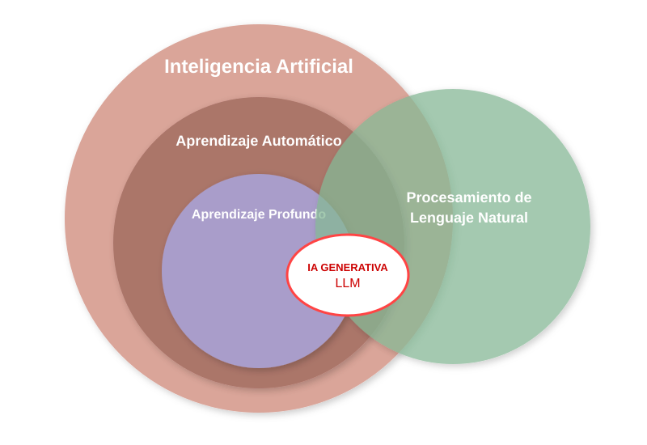

## Conceptos clave



* **Inteligencia Artificial (IA):** Campo de la informática que busca crear sistemas capaces de realizar tareas que normalmente requieren inteligencia humana, como el razonamiento y la resolución de problemas.

* **Aprendizaje Automático (Machine Learning):** Rama de la IA centrada en algoritmos que permiten a las computadoras aprender y mejorar sus predicciones a partir de datos, sin ser programadas explícitamente para cada paso.

* **Aprendizaje Profundo (Deep Learning):** Evolución del Machine Learning que utiliza redes neuronales multicapa para procesar datos complejos (imágenes, audio, texto), imitando la estructura del cerebro.

* **Procesamiento de Lenguaje Natural (NLP):** Disciplina que permite a las máquinas entender, interpretar y generar lenguaje humano, sirviendo de puente entre personas y computadoras.

* **IA Generativa:** Categoría de la IA diseñada para **crear contenido original** (texto, imágenes, código) en lugar de solo clasificar o analizar datos existentes.

*   **LLM (Modelos de Lenguaje Extensos):** Un tipo de IA Generativa entrenada con volúmenes masivos de datos. Son el motor de herramientas como ChatGPT y representan la intersección perfecta entre el *Deep Learning* y el *NLP*.


## Aprendizaje Automático

```{mermaid}
flowchart LR
    subgraph Tradicional
        D1[Datos] --> T1[Algoritmo]
        R1[Reglas] --> T1
        T1 --> S1[Respuestas]
    end

    subgraph Machine_Learning
        D2[Datos] --> M1[Entrenamiento]
        S2[Respuestas] --> M1
        M1 --> R2[Reglas]
    end

    Tradicional --> Machine_Learning
    style Tradicional fill:#f9f,stroke:#333,stroke-width:1px
    style Machine_Learning fill:#bbf,stroke:#333,stroke-width:1px
```

El aprendizaje automático se puede clasificar en varias categorías, siendo las más comunes:

* **Aprendizaje supervisado**: En este enfoque, el modelo se entrena utilizando un conjunto de datos etiquetados, donde cada entrada tiene una salida conocida. El objetivo es aprender una función que mapee las entradas a las salidas. Ejemplos incluyen la regresión y la clasificación.

* **Aprendizaje no supervisado**: Aquí, el modelo se entrena con datos no etiquetados y su objetivo es identificar patrones o estructuras subyacentes en los datos. Ejemplos incluyen el agrupamiento (clustering) y la reducción de dimensionalidad.

* **Aprendizaje semi-supervisado**: Combina elementos del aprendizaje supervisado y no supervisado, utilizando un pequeño conjunto de datos etiquetados junto con un gran conjunto de datos no etiquetados para mejorar el rendimiento del modelo. Etiquetar datos habitualmente es un proceso costoso ya que suele hacerse de forma manual y requerir un conocimiento experto, este enfoque permite una reducción de coste.

* **Aprendizaje auto-supervisado**: Es un enfoque en el que el modelo genera sus propias etiquetas a partir de los datos no etiquetados. Este enfoque ha ganado popularidad en tareas como el procesamiento del lenguaje natural y la visión por computadora. Por ejemplo, los LLM (Modelos de Lenguaje Grande) utilizan aprendizaje auto-supervisado para predecir la siguiente palabra en una secuencia de texto, lo que les permite aprender representaciones útiles del lenguaje sin necesidad de etiquetas explícitas.

* **Aprendizaje por refuerzo**: En este enfoque, un agente aprende a tomar decisiones mediante la interacción con un entorno. Recibe recompensas o penalizaciones en función de sus acciones y ajusta su comportamiento para maximizar la recompensa acumulada a lo largo del tiempo.

* **Aprendizaje por transferencia**: Este enfoque implica tomar un modelo previamente entrenado en una tarea y adaptarlo a una nueva tarea relacionada, aprovechando el conocimiento adquirido en la tarea original.


## ¿Qué es un modelo?

Un modelo en el contexto del aprendizaje automático es una representación matemática o computacional de un proceso o fenómeno que se utiliza para hacer predicciones o tomar decisiones basadas en datos. Los modelos pueden variar en complejidad, desde simples ecuaciones lineales hasta redes neuronales profundas. La elección del modelo depende de la naturaleza del problema, la cantidad y calidad de los datos disponibles, y los objetivos específicos del análisis.

Por ejemplo, supongamos que preguntamos a varias personas adultas sobre su peso y altura, obteniendo los siguientes datos:

```{python}
import pandas as pd
from plotnine import *

df = pd.DataFrame({
    'nombre': ['Leo', 'Sara', 'Marta', 'Elena', 'Javier'],
    'peso': [100.0, 60.0, 50.0, 80.0, 70.0],
    'altura': [190.0, 154.0, 145.0, 172.0, 163.0]
})
df.set_index('nombre', inplace=True)
df
```

```{python}
p = (
    ggplot(df, aes(x='peso', y='altura'))
    + geom_point(color='#FF4136', fill='#FF851B', size=5, stroke=1.5) 
    + scale_x_continuous(breaks=df['peso'], labels=df.index, limits=(40, 110))
    + scale_y_continuous(breaks=None, labels=None, limits=(140, 200))
    + theme_minimal()
    + theme(
        panel_grid_major=element_blank(),
        panel_grid_minor=element_blank(),
        axis_line=element_line(color='#666666', size=1.5),
        axis_text_x=element_text(rotation=45, hjust=1)
    )
)

p
``` 


En este ejemplo vemos claramente que:

$$ \text{altura} = 100 + 0,9 \cdot \text{peso} $$

```{python}
p + geom_abline(intercept=100, slope=0.9, color='#04101b', size=1.5, linetype='dashed')
```

El problema es que normalmente la relación entre peso y altura no es tan perfecta.


:::: {.columns}

::: {.column width="50%"}
```{python}
df.altura = [
  180.0,
  160.0,
  145.0,
  175.0,
  165.0
]
```

:::
::: {.column width="50%"}


```{python}
#| fig-height: 6
#| fig-width: 4
#| echo: false
#| fig-align: center
p
```

:::
:::


## ¿Qué modelo se ajusta mejor a los datos?

::: {layout-ncol=3}

```{python}
#| echo: false
p + geom_smooth(
        method='lm', 
        formula='y ~ x', 
        color='black', 
        size=1.5, 
        se=False 
    ) + theme(
      figure_size=(3, 4),
      axis_title_x=element_blank(),
      axis_title_y=element_blank(),
      axis_text_x=element_blank()
    )
```

```{python}
#| echo: false
p + geom_smooth(
        method='lm', 
        formula='y ~ x + I(x**2)', 
        color='green', 
        size=1.5, 
        se=False 
    ) + theme(
      figure_size=(3, 4),
      axis_title_x=element_blank(),
      axis_title_y=element_blank(),
      axis_text_x=element_blank()
    )
```

```{python}
#| echo: false

nine_grade = "y ~ x + " + " + ".join([f"I(x**{i})" for i in range(2, 10)])

p + geom_smooth(
        method='lm', 
        formula=nine_grade, 
        color='red', 
        size=1.5, 
        se=False 
    ) + theme(
      figure_size=(3, 4),
      axis_title_x=element_blank(),
      axis_title_y=element_blank(),
      axis_text_x=element_blank()
    )
```
:::

Para responder a esa pregunta, primero debemos entender para qué queremos construir un modelo. Un modelo se puede construir para tres propósitos principales no excluyentes:

1. **Predicción**: El objetivo es construir un modelo que pueda predecir con precisión la **variable de interés** (en este caso, la altura) a partir de las **variables explicativas** (en este caso, el peso). En este contexto, el modelo que mejor se ajusta a los datos es aquel que minimiza el error de predicción en nuevos datos no vistos.  Por ejemplo, ¿qué peso tendría una persona de 85 kg? El mejor modelo es el que **generaliza** mejor a nuevos datos. Posiblemente el segundo modelo generalice un poco mejor que el primero. Sin embargo, el tercer modelo, aunque se ajusta perfectamente a los **datos de entrenamiento**, pero no generaliza bien a nuevos datos debido al **sobreajuste (overfitting)**. Por eso para evaluar un modelo hay que hacerlo con datos que no se han utilizado para entrenar el modelo (**datos de prueba**).

2. **Explicación**: El objetivo es construir un modelo que nos permita entender la relación entre las variables. En este caso, el primer modelo es el más interpretable, ya que establece una relación lineal entre el peso y la altura. Es un modelo para el que hay que estimar únicamente dos parámetros (la pendiente y la ordenada en el origen, también llamada sesgo o intersección), lo que facilita la comprensión de cómo el peso afecta a la altura. La fórmula del modelo lineal es:

$$ altura = b + m \cdot peso $$

El parámetro $b$ representa la altura cuando el peso es cero, lo cual no tiene sentido en este contexto y no es interpretable directamente, pero es necesario para ajustar la línea a los datos. Por otro lado, el parámetro $m$ representa la pendiente de la línea, es decir, el cambio en la altura por cada unidad de cambio en el peso. Los valores de $b$ y $m$ ajustados son:


```{python}
#| echo: false
import numpy as np

# Grado 1 significa una línea recta: y = b + mx 
m, b = np.polyfit(df['peso'], df['altura'], 1)

nuevo_peso = 85.0

print(f"Pendiente (m): {m:.4f}")
print(f"Sesgo (b): {b:.4f}")
print(f"La ecuación es: altura = {b:.2f} + {m:.2f} * peso")
```

En este caso, con valor de $m$ igual a `{python} f"{m:.2f}"` indica que por cada kilogramo adicional de peso, se espera que la altura aumente en `{python} f"{m:.2f}"` centímetros.

Si quisiéramos utilizar este modelo para predecir la altura de una persona que pesa `{python} f"{nuevo_peso}"` kg, simplemente sustituimos el valor del peso en la ecuación:


```{python}
#| echo: false
from IPython.display import Markdown

Markdown(rf"$$altura =  {b:.2f} +{m:.2f} \cdot {nuevo_peso: .0f} = {b + m * nuevo_peso:.0f} \text{{ cm}}$$")
```

Lo podemos mostrar gráficamente:

```{python}
#| echo: false
p + geom_smooth(
        method='lm',  
        color='black', 
        size=1.5, 
        se=False 
    ) + annotate("point", x = nuevo_peso, y = b + m * nuevo_peso, color='#2e56e7', fill='#99b4d4', size=5, stroke=1.5) + geom_vline(xintercept=nuevo_peso, color='#2e56e7', linetype='dashed') + geom_hline(yintercept=b + m * nuevo_peso, color='#2e56e7', linetype='dashed') + annotate("text", x = nuevo_peso + 4 , y = b + m * nuevo_peso - 3, label=f"({nuevo_peso: .0f} kg, {b + m * nuevo_peso:.0f} cm)", color='#2e56e7', size=10, ha='left')
```

El que el peso y la altura estén correlacionados no implica que el peso cause la altura. Esta correlación lo que indica es que si conozco el peso de una persona puedo decir algo sobre su altura, ya que normalmente las personas más altas suelen pesar más. Es importante tener en cuenta que la **correlación no implica causalidad**. La causalidad es una hipótesis del investigador que se puede probar con experimentos controlados, pero no se puede inferir directamente a partir de la correlación observada en los datos. Por ejemplo, un modelo en que la variable explicativa y explicada están correlacionadas con causalidad es las horas de estudio y la nota obtenida en un examen. En este caso, es razonable suponer que estudiar más horas causa una mejor nota en el examen, aunque también podría haber otros factores que influyan en la nota, como la calidad del estudio o el nivel de dificultad del examen. En ocasiones, la correlación entre dos variables puede ser causada por una tercera **variable oculta**. Por ejemplo, la correlación entre el consumo de helados y el número de ahogamientos podría ser causada por la variable oculta "temperatura", ya que en los meses más cálidos se consume más helado y también hay más personas nadando, lo que aumenta el riesgo de ahogamiento. Por último, en ocasiones, la **correlación** entre dos variables puede ser **negativa**, lo que significa que a medida que una variable aumenta, la otra disminuye. Por ejemplo, existe una correlación negativa entre los goles que recibe un equipo y sus puntos en la clasificación, ya que a medida que un equipo recibe más goles, es probable que pierda más partidos y, por lo tanto, tenga menos puntos en la clasificación.

 El segundo modelo, aunque es mejor para predecir, introduce una relación cuadrática, lo que complica la interpretación ya que tiene un tercer parámetro que no es fácil de interpretar:

 $$ altura = \theta_0 + \theta_1 \cdot peso + \theta_2 \cdot peso^2 $$

En este caso, $\theta_1$ representa el cambio en la altura por cada unidad de cambio en el peso (lo mismo que $m$ en el modelo lineal), pero este efecto no es constante debido al término cuadrático. El parámetro $\theta_2$ representa la curvatura de la relación entre el peso y la altura, lo que hace que la interpretación sea más compleja.

3.- **Generación**: El objetivo es construir un modelo que pueda generar nuevos datos que sean similares a los datos de entrenamiento.

## ¿Qué modelo modelo lineal es mejor? {#best_model}

Aunque hemos visto que el modelo lineal en el caso planteado es más interpretable, no todos los modelos son igual de buenos. Por ejemplo, en la figura siguiente se muestra el modelo lineal (línea verde) y un modelo con curvatura (línea azul) ajustados a los datos. ¿Cuál de los dos modelos es mejor?

```{python}
#| echo: false

b2 = b + 20
m2 = m * 0.50

p + geom_segment(
        aes(x=df.peso.min(), y=b+df.peso.min()*m, xend=df.peso.max(), yend=b+df.peso.max()*m),
        color="green",
        size=1.5 
    ) + geom_segment(
        aes(x=df.peso.min(), y=b2+df.peso.min()*m2, xend=df.peso.max(), yend=b2+df.peso.max()*m2),
        color="blue",
        size=1.5
    )
```

Obviamente la línea verde es mejor que la azul, pero ¿por qué? Para responder a esta pregunta, necesitamos entender el concepto de **error**. El error es la diferencia entre las predicciones del modelo y los valores reales de los datos. En este caso, el error se puede calcular como la distancia vertical entre cada punto de datos y la línea verde (modelo lineal). El modelo que minimiza el error total es el que mejor se ajusta a los datos. En este caso, el modelo lineal (línea verde) tiene un error total menor que el modelo con curvatura (línea azul), lo que indica que el modelo lineal es una mejor representación de la relación entre el peso y la altura en este conjunto de datos específico.


Por ejemplo, para uno de los puntos con los que hemos ajustado los modelos, vemos que la línea verde tiene un error menor que la línea azul, lo que indica que el modelo lineal representado en verde se ajusta mejor a ese punto específico. Si tuviéramos en cuenta todos los puntos, podríamos calcular el error total para cada modelo y comparar cuál tiene el menor error total para determinar cuál es el mejor modelo en términos de ajuste a los datos.

```{python}
#| echo: false
#| warning: false
import copy

p2 = copy.deepcopy(p)

df2 = df[df.peso == df.peso.max()]

p2.data = df2

p2  + geom_segment(
        aes(x=df.peso.min(), y=b+df.peso.min()*m, xend=df.peso.max(), yend=b+df.peso.max()*m),
        color="green",
        size=1.5
    ) + geom_segment(
        aes(x=df.peso.min(), y=b2+df.peso.min()*m2, xend=df.peso.max(), yend=b2+df.peso.max()*m2),
        color="blue",
        size=1.5
    ) + annotate(
        "errorbar", 
        x = df2.peso.iloc[0],
        ymin = df2.altura.iloc[0],
        ymax = b+df2.peso.iloc[0]*m,
        width = 2,        # Ancho de los topes horizontales
        color = "#82e782",
        size = 1.2        
    ) + annotate(
        "errorbar", 
        x = df2.peso.iloc[0],
        ymin = b2+df2.peso.iloc[0]*m2,
        ymax = df2.altura.iloc[0],
        width = 2,        # Ancho de los topes horizontales
        color = "#82bbe7",
        size = 1.2        
    ) + scale_y_continuous(breaks=None, labels=None, limits=(150, 190))
```
