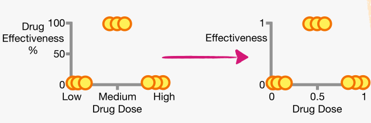
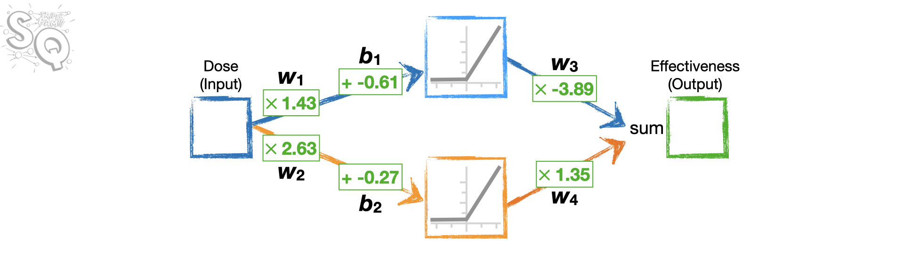
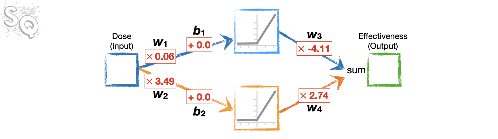

## Introducción

En la lección anterior, vimos cómo la regresión logística puede ser utilizada para resolver problemas de clasificación. Sin embargo, la regresión logística es un modelo lineal, lo que significa que solo puede aprender relaciones lineales entre las características y la variable objetivo. Para abordar problemas más complejos, necesitamos modelos que puedan aprender relaciones no lineales. Aquí es donde entran en juego las redes neuronales.

Veamos un problema de clasificación. Supongamos que tenemos el siguiente `dataset` que representa las puertas lógica AND, OR y XOR:

```{python}
import pandas as pd

X = [(0,0), (0,1), (1,0), (1,1)]
df = pd.DataFrame(X, columns=["P", "Q"])
df["OR"] = df["P"] | df["Q"]
df["AND"] = df["P"] & df["Q"]
df["XOR"] = df["P"] ^ df["Q"]

df.style.hide(axis='index')
```

Podemos tratar cada una de las columnas `AND`, `OR` y `XOR` como una variable objetivo para un problema de clasificación. 

Si representamos gráficamente los puntos para cada función, podemos ver que las funciones `AND` y `OR` son linealmente separables, mientras que la función `XOR` no lo es:

```{python}
from plotnine import *

df_melt = df.melt(id_vars=["P", "Q"], value_vars=["AND", "OR", "XOR"], 
                  var_name="func", value_name="y")

p = (
    ggplot(df_melt, aes(x='P', y='Q', color='factor(y)', fill='factor(y)')) 
    + facet_wrap("~func")
    + geom_point(size=5)
    + scale_color_manual(values=['red', 'blue']) 
    + theme_minimal()
    + scale_x_continuous(breaks=[0, 1])
    + scale_y_continuous(breaks=[0, 1])
    + theme_bw()
    + theme(
        legend_position='none',
        panel_grid_major=element_blank(),
        panel_grid_minor=element_blank(),
    )
)

p
``` 

Que sean linealmente separables significa que podemos resolver este problema usando una regresión logística. Sin embargo, la función `XOR` no es linealmente separable. No obstante, mediante dos rectas, podemos separar los puntos de la función `XOR`. Así que podríamos usar dos modelos de regresión logística y combinarlos los resultados con una tercera. Por ejemplo, la primera regresión logística podría aprender la función `OR` y la segunda regresión logística podría aprender la función `AND`. Finalmente, la tercera regresión logística podría la resta y así, combinados las dos primeras con la tercera, hemos aprendido la función `XOR`.

La solución anterior puede parecer excesivamente complicada para aprender una función tan sencilla como `XOR`. Sin embargo, esto es esencialmente lo que hace una red neuronal: combina múltiples modelos lineales para aprender relaciones no lineales.


```{mermaid}
graph LR
    %% Configuración de estilos visuales
    classDef entrada fill:#f9f9f9,stroke:#333,stroke-width:2px;
    classDef capa1 fill:#ffe5b4,stroke:#ff9900,stroke-width:2px;
    classDef capa2 fill:#d1e8ff,stroke:#0066cc,stroke-width:2px;
  
    %% Entradas
    subgraph Capa_Entrada [Entradas]
        In_P((p)):::entrada
        In_Q((q)):::entrada
    end

    %% Capa Oculta (Capa 1)
    subgraph Capa_Oculta [Capa Oculta]
        N_OR((Neurona 1<br><b>OR</b>)):::capa1
        N_AND((Neurona 2<br><b>AND</b>)):::capa1
    end

    %% Capa de Salida (Capa 2)
    subgraph Capa_Salida [Capa de Salida]
        N_XOR((Neurona Salida<br><b>Resta</b><br>OR - AND)):::capa2
    end

    Out((Salida<br><b>XOR</b>)):::entrada

    %% Conexiones de Entrada a Capa Oculta
    In_P --> N_OR
    In_P --> N_AND
    In_Q --> N_OR
    In_Q --> N_AND

    %% Conexiones de Capa Oculta a Capa de Salida
    N_OR -- "+" --> N_XOR
    N_AND -- "-" --> N_XOR

    N_XOR --> Out
```

::: {.callout-note collapse="true"}
## Clic aquí una demostración numérica.

Supongamos que una red neuronal ha aprendido las funciones anteriores con los siguientes pesos:

---

## 1. Parámetros Propuestos para la Red

### Capa 1: Neuronas Ocultas

*   **Neurona 1 (OR):** 
    *   Pesos: $w_{11} = 20$, $w_{12} = 20$
    *   Sesgo: $b_1 = -10$
    *   Ecuación del logit: $$z_{\text{OR}} = 20p + 20q - 10$$

*   **Neurona 2 (AND):** 
    *   Pesos: $w_{21} = 20$, $w_{22} = 20$
    *   Sesgo: $b_2 = -30$
    *   Ecuación del logit: $$z_{\text{AND}} = 20p + 20q - 30$$

### Capa 2: Neurona de Salida

*   **Neurona de Salida (Resta / XOR):**
    *   Pesos aplicados a las activaciones anteriores: $w_{\text{out,1}} = 20$ (positivo para el OR), $w_{\text{out,2}} = -20$ (negativo para el AND)
    *   Sesgo: $b_{\text{out}} = -10$
    *   Ecuación del logit: $$z_{\text{XOR}} = 20 \cdot a_{\text{OR}} - 20 \cdot a_{\text{AND}} - 10$$

---

## 2. Demostración Matemática Paso a Paso

Recordemos que la salida (o probabilidad) de cada neurona viene dada por aplicar la función sigmoide a su respectivo logit: $a = \sigma(z)$.

### Caso A: Entradas $(p=0, q=0)$

*   **Neurona OR:**
    *   Logit: $z_{\text{OR}} = 20(0) + 20(0) - 10 = -10$
    *   Probabilidad: $a_{\text{OR}} = \sigma(-10) = \frac{1}{1 + e^{10}} \approx 0.00005 \approx 0$
*   **Neurona AND:**
    *   Logit: $z_{\text{AND}} = 20(0) + 20(0) - 30 = -30$
    *   Probabilidad: $a_{\text{AND}} = \sigma(-30) = \frac{1}{1 + e^{30}} \approx 0$
*   **Neurona XOR (Salida):**
    *   Logit: $z_{\text{XOR}} = 20(0) - 20(0) - 10 = -10$
    *   Probabilidad final: $$a_{\text{XOR}} = \sigma(-10) \approx \mathbf{0} \quad \text{(Resultado correcto: 0)}$$

### Caso B: Entradas $(p=1, q=0)$

*   **Neurona OR:**
    *   Logit: $z_{\text{OR}} = 20(1) + 20(0) - 10 = 10$
    *   Probabilidad: $a_{\text{OR}} = \sigma(10) = \frac{1}{1 + e^{-10}} \approx 0.99995 \approx 1$
*   **Neurona AND:**
    *   Logit: $z_{\text{AND}} = 20(1) + 20(0) - 30 = -10$
    *   Probabilidad: $a_{\text{AND}} = \sigma(-10) \approx 0$
*   **Neurona XOR (Salida):**
    *   Logit: $z_{\text{XOR}} = 20(1) - 20(0) - 10 = 10$
    *   Probabilidad final: $$a_{\text{XOR}} = \sigma(10) \approx \mathbf{1} \quad \text{(Resultado correcto: 1)}$$

### Caso C: Entradas $(p=0, q=1)$

*(Por simetría con el Caso B, los valores se comportan de manera idéntica)*

*   **Neurona OR:** $z_{\text{OR}} = 10 \implies a_{\text{OR}} \approx 1$
*   **Neurona AND:** $z_{\text{AND}} = -10 \implies a_{\text{AND}} \approx 0$
*   **Neurona XOR (Salida):** $z_{\text{XOR}} = 20(1) - 20(0) - 10 = 10 \implies a_{\text{XOR}} \approx \mathbf{1} \quad \text{(Resultado correcto: 1)}$

### Caso D: Entradas $(p=1, q=1)$

*   **Neurona OR:**
    *   Logit: $z_{\text{OR}} = 20(1) + 20(1) - 10 = 30$
    *   Probabilidad: $a_{\text{OR}} = \sigma(30) \approx 1$
*   **Neurona AND:**
    *   Logit: $z_{\text{AND}} = 20(1) + 20(1) - 30 = 10$
    *   Probabilidad: $a_{\text{AND}} = \sigma(10) \approx 1$
*   **Neurona XOR (Salida):**
    *   Logit: $z_{\text{XOR}} = 20(1) - 20(1) - 10 = -10$
    *   Probabilidad final: $$a_{\text{XOR}} = \sigma(-10) \approx \mathbf{0} \quad \text{(Resultado correcto: 0)}$$

---

## 3. Tabla Resumen de Estados

| Entrada $(p, q)$ | $z_{\text{OR}}$ | $a_{\text{OR}}$ | $z_{\text{AND}}$ | $a_{\text{AND}}$ | $z_{\text{XOR}}$ (Logit Salida) | $a_{\text{XOR}}$ (Prob. Salida) |
| :--- | :---: | :---: | :---: | :---: | :---: | :---: |
| $(0, 0)$ | $-10$ | $\approx 0$ | $-30$ | $\approx 0$ | $-10$ | $\mathbf{\approx 0}$ |
| $(1, 0)$ | $+10$ | $\approx 1$ | $-10$ | $\approx 0$ | $+10$ | $\mathbf{\approx 1}$ |
| $(0, 1)$ | $+10$ | $\approx 1$ | $-10$ | $\approx 0$ | $+10$ | $\mathbf{\approx 1}$ |
| $(1, 1)$ | $+30$ | $\approx 1$ | $+10$ | $\approx 1$ | $-10$ | $\mathbf{\approx 0}$ |

:::

## ¿Qué es una red neuronal?

Una red neuronal es un modelo de aprendizaje automático inspirado en el funcionamiento del cerebro humano. Está compuesta por capas de neuronas artificiales que se conectan entre sí. Cada neurona recibe entradas, las procesa y produce una salida que se transmite a las neuronas de la siguiente capa. Las redes neuronales pueden tener múltiples capas ocultas, lo que les permite aprender representaciones cada vez más complejas de los datos. La capacidad de las redes neuronales para aprender relaciones no lineales las hace especialmente poderosas para resolver problemas de clasificación y regresión que no pueden ser resueltos por modelos lineales como la regresión logística.

Los cálculos que se realizan en cada neurona son simples transformaciones lineales seguidas de una función de activación no lineal. La función de activación introduce no linealidad en el modelo, lo que permite a la red neuronal aprender relaciones complejas entre las características y la variable objetivo.

## Funciones de activación

Las funciones de activación son funciones no lineales que se aplican a la salida de cada neurona. Algunas de las funciones de activación más comunes son:

::: {.panel-tabset}

##  Sigmoide

$\sigma(z) = \frac{1}{1 + e^{-z}}$ 

Comprime la salida entre 0 y 1, lo que la hace útil para problemas de clasificación binaria. Es popular en la capa de salida de las redes neuronales para problemas de clasificación binaria, ya que su salida puede interpretarse como una probabilidad.

```{python}
import numpy as np

df = pd.DataFrame({'z': np.linspace(-10, 10, 100), 'y': 1/(1+np.exp(-np.linspace(-10, 10, 100)))})
p = ggplot(df, aes(x='z', y='y')) + geom_line() + theme_minimal() + ggtitle("Función Sigmoide")
p
```

##  Tangente hiperbólica

$\tanh(z) = \frac{e^z - e^{-z}}{e^z + e^{-z}}$ 

Comprime la salida entre -1 y 1.

```{python}
df = pd.DataFrame({'z': np.linspace(-10, 10, 100), 'y': (np.exp(np.linspace(-10, 10, 100)) - np.exp(-np.linspace(-10, 10, 100))) / (np.exp(np.linspace(-10, 10, 100)) + np.exp(-np.linspace(-10, 10, 100)))})
p = ggplot(df, aes(x='z', y='y')) + geom_line() + theme_minimal() + ggtitle("Función Tangente Hiperbólica")
p
```

##  ReLU (Rectified Linear Unit)

$f(z) = \max(0, z)$ 

Es ampliamente utilizada en redes neuronales profundas por su simplicidad y eficiencia computacional.

```{python}
df = pd.DataFrame({'z': np.linspace(-10, 10, 100), 'y': np.maximum(0, np.linspace(-10, 10, 100))})
p = ggplot(df, aes(x='z', y='y')) + geom_line() + theme_minimal() + ggtitle("Función ReLU")
p
```

## Softmax

$\text{softmax}(z_i) = \frac{e^{z_i}}{\sum_{j} e^{z_j}}$

Convierte un vector de outputsogits en una distribución de probabilidad, lo que la hace útil para problemas de clasificación multiclase.

## Linear (identidad)

$f(z) = z$

La neurona simplemente devuelve su logit sin aplicar ninguna función de activación. Es comúnmente utilizada en la capa de salida de las redes neuronales para problemas de regresión.

 
:::
## Forward pass

El proceso de calcular la salida de una red neuronal a partir de las entradas se llama "forward pass". Durante el **forward pass**, cada neurona calcula su logit (una combinación lineal de sus entradas) y luego aplica la función de activación para producir su salida. Este proceso se repite capa por capa hasta llegar a la capa de salida, donde se obtiene la predicción final del modelo.

Supongamos que hemos entrenado una red neuronal para calcular la efectividad de un medicamento dada la dosis de una medicina:



Observe que la medicina es efectiva para dosis medias y poco efectiva para dosis altas y bajas.

Vamos como hace las predicciones la red neuronal pre-entrenada que se muestra en la siguiente imagen:



Observe que se trata de una red neuronal con dos capas:

* La primera tiene dos neuronas con un parámetro de peso y un sesgo cada una. Aplica la función de activación ReLU a sus logits.
* La segunda capa tiene una neurona que combina las salidas de la primera. Tiene un peso para cada una de las salidas de la primera capa, pero no tiene sesgo. No aplica ninguna función de activación a su logit, por lo que se trata de una neurona lineal.

:::{.callout-note}

En lo que sigue se va a utilizar código del [repo](https://github.com/StatQuest/signa/tree/main) del libro The StatQuest Illustrated Guide to Neural Networks and AI

:::

En el siguiente código se muestra cómo se implementa el forward pass de esta red neuronal ya entrenada usando PyTorch para calcular las predicciones del modelo:

```{python}
import torch
import torch.nn as nn
import torch.nn.functional as F

class myNN(nn.Module):

    def __init__(self):
        ## The __init__() method is called when we create an object
        ## from this class. This is where we create and initialize the
        ## weights and biases in the neural network.

        ## When you create a class that inherits from another class
        ## then you always call the parent's __init__() method.
        ## Otherwise, there is no point in inheriting...
        super().__init__()

        ## Now we create and initialize all of the Weights and Biases
        ## in the model with pre-trained values. Each Weight and Bias
        ## is a torch.tensor() object.
        ##
        ## NOTE: w1 = weight 1, b1 = bias 1 etc. (as seen in the
        ## figure above).
        self.w1 = torch.tensor(1.43)
        self.b1 = torch.tensor(-0.61)

        self.w2 = torch.tensor(2.63)
        self.b2 = torch.tensor(-0.27)

        self.w3 = torch.tensor(-3.89)
        self.w4 = torch.tensor(1.35)


    def forward(self, input_values):
        ## The forward() method is called by default when we pass
        ## values to an object created from this class.
        ## This is where we do the math associated with running
        ## data through the neural network.

        top_x_axis_values = (input_values * self.w1) + self.b1
        bottom_x_axis_values = (input_values * self.w2) + self.b2

        top_y_axis_values = F.relu(top_x_axis_values)
        bottom_y_axis_values = F.relu(bottom_x_axis_values)

        output_values = (top_y_axis_values * self.w3) + (bottom_y_axis_values * self.w4)

        return output_values
```

Creamos una instancia de la clase `myNN`:

```{python}
## First, let's create an instance of our neural network.
## We'll call it "model" since that is the standard
## terminology in the field.
model = myNN()
``` 

Generamos un conjunto de dosis de entrada para alimentar a la red neuronal:
```{python}
input_doses = torch.linspace(start=0, end=1, steps=11)

input_doses
```

Realizamos las predicciones del modelo:

```{python}
predicted_effectiveness = model(input_doses)
predicted_effectiveness
```

Podemos constatar que la red se comporta adecuadamente dibujando las predicciones:

```{python}
p = (
    ggplot(pd.DataFrame({'dose': input_doses.numpy(), 'effectiveness': predicted_effectiveness.detach().numpy()}), aes(x='dose', y='effectiveness')) 
    + geom_line(size=1.5, color='blue')
    + geom_point(size=5, color='blue', fill="lightblue") 
    + theme_minimal() 
    + ggtitle("Predicciones de la Red Neuronal")
)
p
```

:::{.callout-note collapse="true"}

## ¿Qué se ha aprendido en cada capa?

Veamos la salida de las neuronas superior e inferior de la primera capa:

```{python}
top_x_axis_values = (input_doses * model.w1) + model.b1
top_y_axis_values = F.relu(top_x_axis_values)
bottom_x_axis_values = (input_doses * model.w2) + model.b2
bottom_y_axis_values = F.relu(bottom_x_axis_values)

df = pd.DataFrame({
    'dose': input_doses.numpy(),
    'top_y_axis_values': top_y_axis_values.detach().numpy(),
    'bottom_y_axis_values': bottom_y_axis_values.detach().numpy()
})
(
    ggplot(df, aes(x='dose'))
    + geom_line(aes(y='top_y_axis_values'), size=1.5, color='red')
    + geom_point(aes(y='top_y_axis_values'), size=5, color='red', fill="pink") 
    + geom_line(aes(y='bottom_y_axis_values'), size=1.5, color='blue') 
    + geom_point(aes(y='bottom_y_axis_values'), size=5, color='blue', fill="lightblue")
    + theme_minimal() 
    + labs(y='ReLU outputs')
    + ggtitle("Salida de las Neuronas de la Primera Capa")
)
```

Estas salidas son las entradas de la neurona de la segunda capa. La neurona de la segunda capa multiplica estas salidas con sus respectivos pesos:

```{python}
final_top_y_axis_values = top_y_axis_values * model.w3
final_bottom_y_axis_values = bottom_y_axis_values * model.w4
df = pd.DataFrame({
    'dose': input_doses.numpy(),
    'final_top_y_axis_values': final_top_y_axis_values.detach().numpy(),
    'final_bottom_y_axis_values': final_bottom_y_axis_values.detach().numpy()
})
(
    ggplot(df, aes(x='dose'))
    + geom_line(aes(y='final_top_y_axis_values'), size=1.5, color='red')
    + geom_point(aes(y='final_top_y_axis_values'), size=5, color='red', fill="pink") 
    + geom_line(aes(y='final_bottom_y_axis_values'), size=1.5, color='blue') 
    + geom_point(aes(y='final_bottom_y_axis_values'), size=5, color='blue', fill="lightblue")
    + theme_minimal() 
    + labs(y='Weighted outputs')
    + ggtitle("Salida de las Neuronas de la Segunda Capa (antes de sumar)")
)
```

Se suman las salidas de la segunda capa para obtener la predicción final:

```{python}
final_bent_shape = final_top_y_axis_values + final_bottom_y_axis_values
df = pd.DataFrame({
    'dose': input_doses.numpy(),
    'final_bent_shape': final_bent_shape.detach().numpy()
})
(
    ggplot(df, aes(x='dose', y='final_bent_shape')) 
    + geom_line(size=1.5, color='purple') 
    + geom_point(size=5, color='purple', fill="lavender") 
    + theme_minimal() 
    + labs(y='Final output (before activation)')
    + ggtitle("Predicción Final de la Red Neuronal")
)
```
:::

## Backward pass

El **backward pass** es el proceso mediante el cual se calculan los gradientes de los pesos y sesgos de la red neuronal con respecto a una función de pérdida. Este proceso es esencial para entrenar la red neuronal, ya que permite ajustar los pesos y sesgos para minimizar la función de pérdida y mejorar la precisión del modelo. El algoritmo más utilizado para realizar el backward pass es el algoritmo de retropropagación (backpropagation), que utiliza la regla de la cadena para calcular los gradientes de manera eficiente a través de las capas de la red neuronal.

Supongamos que queremos entrenar la red neuronal anterior y que tenemos los siguientes pesos iniciales:



El objetivo es que la red aprenda los pesos que vimos en la sección anterior:


Supongamos que tenemos un simple dataset de entrenamiento:


En esta ocasión vamos a usar el paquete `Lightning` de PyTorch para entrenar la red neuronal. `Lightning` es un marco de trabajo que se construye sobre PyTorch y que hace que el código de entrenamiento sea más limpio y organizado. Nos permite separar claramente la definición del modelo, el proceso de entrenamiento y el proceso de validación, lo que facilita la lectura y el mantenimiento del código.

```{python}
import torch ## torch let's us create tensors and also provides helper functions
import torch.nn as nn ## torch.nn gives us nn.Module(), nn.Embedding() and nn.Linear()
import torch.nn.functional as F # This gives us relu()
from torch.optim import SGD, Adam # SGD is short of Stochastic Gradient Descent, but
                            # the way we'll use it, passing in all of the training
                            # data at once instead of passing it random subsets,
                            # it will act just like plain old Gradient Descent.

import lightning as L ## Lightning makes it easier to write, optimize and scale our code
from torch.utils.data import TensorDataset, DataLoader ## We'll store our data in DataLoaders
```

Aunque no es obligatorio, vamos a poner nuestros datos de entrenamiento en un `DataLoader`. Los `DataLoaders` son fáciles de crear y ofrecen un montón de funciones geniales. Por ejemplo, si tuviéramos un conjunto de datos grande, un `DataLoader` nos proporciona una forma súper fácil de acceder a los datos en lotes (*batches*) en lugar de todos a la vez. Esto es fundamental cuando tenemos más datos de los que caben en la memoria RAM. Un `DataLoader` también puede mezclar (*shuffle*) los datos por nosotros en cada época (*epoch*) y hace que sea fácil usar solo una fracción de los datos si queremos hacer un entrenamiento rápido y superficial para depurar errores (*debugging*).

```{python}
## The inputs are the x-axis coordinates for each data point
## These values represent different doses
training_inputs = torch.tensor([0.0, 0.5, 1.0])

## The labels are the y-axis coordinates for each data point
## These values represent the effectiveness
training_labels = torch.tensor([0.0, 1.0, 0.0])

## Now let's package everything up into a DataLoader...
training_dataset = TensorDataset(training_inputs, training_labels)
dataloader = DataLoader(training_dataset)
```

Ahora construiremos una red neuronal que tenga pesos (*Weights*) y sesgos (*Biases*) entrenables. Para esto, usaremos `L.LightningModule`, que tiene todo lo que incluye `nn.Module`, además de que nos permite definir el optimizador que queremos usar, así como indicarle a PyTorch cómo debe funcionar cada paso de entrenamiento (*training step*).

```{python}
class myNN(L.LightningModule):

    def __init__(self):

        super().__init__()

        ## Create all of the weights and biases for the network.
        ## However, this time they are initialized with random values.
        ## We are also wrapping the tensors up in nn.Parameter() objects.
        ## PyTorch will only optimize parameters. There are a lot of
        ## different ways to create parameters, and we'll see those
        ## in later examples, but nn.Parameter() is the most basic.
        self.w1 = nn.Parameter(torch.tensor(0.06))
        self.b1 = nn.Parameter(torch.tensor(0.0))

        self.w2 = nn.Parameter(torch.tensor(3.49))
        self.b2 = nn.Parameter(torch.tensor(0.0))

        self.w3 = nn.Parameter(torch.tensor(-4.11))
        self.w4 = nn.Parameter(torch.tensor(2.74))

        self.loss = nn.MSELoss(reduction='sum')


    def forward(self, input_values):
        ## The forward() method is identical to what we used in Chapter 1.

        top_x_axis_values = (input_values * self.w1) + self.b1
        bottom_x_axis_values = (input_values * self.w2) + self.b2

        top_y_axis_values = F.relu(top_x_axis_values)
        bottom_y_axis_values = F.relu(bottom_x_axis_values)

        output_values = (top_y_axis_values * self.w3) + (bottom_y_axis_values * self.w4)

        return output_values


    def configure_optimizers(self): # this configures the optimizer we want to use for backpropagation.
        return SGD(self.parameters(), lr=0.01)
        ## NOTE: PyTorch doesn't have a Gradient Descent optimizer, just a
        ## Stochastic Gradient Descent (SGD) optimizer. However, since we
        ## are running all 3 doses through the NN each time, rather than a
        ## random subset, we are essentially doing Gradient Descent instead of
        ## SGD.


    def training_step(self, batch, batch_idx): # take a step during gradient descent.
        ## NOTE: When training_step() is called it calculates the loss with the code below...
        inputs, labels = batch # collect input
        outputs = self.forward(inputs) # run input through the neural network
        loss = self.loss(outputs, labels) ## the `loss` quantifies the difference between
                                          ## the observed drug effectiveness in `labels`
                                          ## and the outputs created by the neural network

        return loss
```

Creamos el modelo y mostramos los parámetros iniciales:

```{python}
model = myNN() # First, make model from the class

## Now print out the name and value for each named parameter
## parameter in the model. Remember parameters are variables,
## like Weights and Biases, that we can train.
for name, param in model.named_parameters():
    print(name, torch.round(param.data, decimals=2))
```

Creamos las dosis que deseamos usar para evaluar el modelo:

```{python}
## Create the different doses we want to run through the neural network.
## torch.linspace() creates the sequence of numbers between, and including, 0 and 1.
input_doses = torch.linspace(start=0, end=1, steps=11)

# now print out the doses to make sure they are what we expect...
input_doses
```

Mostramos las predicciones del modelo antes de entrenar:

```{python}
output_values = model(input_doses)
output_values
```

Representamos gráficamente las predicciones del modelo antes de entrenar y lso datos de entrenamiento y constatamos que el modelo no se ajusta a los datos:

```{python}
df = pd.DataFrame({
    'dose': input_doses.numpy(),
    'effectiveness': output_values.detach().numpy()
})

p = (
    ggplot(pd.DataFrame(df), aes(x='dose', y='effectiveness')) 
    + geom_line(size=1.5, color='green')
    + geom_point(size=5, color='green', fill="lightgreen") 
    + geom_point(aes(x='dose', y='effectiveness'), size=5, color='green', fill="lightgreen") 
    + geom_point(aes(x='dose', y='effectiveness'), data=pd.DataFrame({'dose': training_inputs.numpy(), 'effectiveness': training_labels.numpy()}), size=5, color='#919c12', fill="#c7c196")
    + theme_minimal() 
    + ggtitle("Predicciones del Modelo Antes de Entrenar")
)
p
```

Entrenamos el modelo:

```{python}
#! warning: false
model = myNN()
## Now train the model...
trainer = L.Trainer(max_epochs=500, # how many times to go through the training data
                    logger=False,
                    enable_checkpointing=False,
                    enable_progress_bar=False)

trainer.fit(model, train_dataloaders=dataloader)
```

Mostramos los parámetros finales del modelo después de entrenar:

```{python}
## Now that we've trained the model, let's print out the
## new values for each Weight and Bias.
for name, param in model.named_parameters():
    print(name, torch.round(param.data, decimals=3))
```

Volvemos a dibujar las predicciones del modelo después de entrenar y constatamos que el modelo se ajusta a los datos:

```{python}
output_values = model(input_doses)
df = pd.DataFrame({
    'dose': input_doses.numpy(),
    'effectiveness': output_values.detach().numpy()
})
p = (
    ggplot(pd.DataFrame(df), aes(x='dose', y='effectiveness')) 
    + geom_line(size=1.5, color='green')
    + geom_point(size=5, color='green', fill="lightgreen") 
    + geom_point(aes(x='dose', y='effectiveness'), size=5, color='green', fill="lightgreen") 
    + geom_point(aes(x='dose', y='effectiveness'), data=pd.DataFrame({'dose': training_inputs.numpy(), 'effectiveness': training_labels.numpy()}), size=5, color='#919c12', fill="#c7c196")
    + theme_minimal() 
    + ggtitle("Predicciones del Modelo Después de Entrenar")
)
p
```


## Entrenamiento de NMIST usando PyTorch Lightning

Cargamos los `datasets` de entrenamiento y validación:

```{python}
from torchvision import datasets, transforms
transform = transforms.Compose([transforms.ToTensor()])
train_dataset = datasets.MNIST(root='./data', train=True, transform=transform, download=True)
test_dataset = datasets.MNIST(root='./data', train=False, transform=transform, download=True)
```

Creamos los `DataLoaders` de entrenamiento y validación:

```{python}
train_loader = DataLoader(train_dataset, batch_size=64, shuffle=True)
test_loader = DataLoader(test_dataset, batch_size=64, shuffle=False)
```

Definimos el modelo de red neuronal:

```{python}
class MNISTModel(L.LightningModule):
    def __init__(self):
        super().__init__()

        ## Now we the seed for the random number generorator.
        ## This ensures that when you create a model from this class, that model
        ## will start off with the exact same random numbers that I started out with when
        ## I created this demo. At least, I hope that is what happens!!! :)
        L.seed_everything(seed=42)

        self.layer_1 = nn.Linear(28 * 28, 128)
        self.layer_2 = nn.Linear(128, 64)
        self.layer_3 = nn.Linear(64, 10)
        self.loss = nn.CrossEntropyLoss()

    def forward(self, x):
        x = x.view(x.size(0), -1) # Flatten the input
        x = F.relu(self.layer_1(x))
        x = F.relu(self.layer_2(x))
        x = self.layer_3(x)
        return x

    def configure_optimizers(self):
        return Adam(self.parameters(), lr=0.001)

    def training_step(self, batch, batch_idx):
        ## The first thing we do is split 'batch'
        ## into the input and label values.
        inputs, labels = batch

        ## Then we run the input through the neural network
        outputs = self.forward(inputs)

        ## Then we calculate the loss.
        loss = self.loss(outputs, labels)

        ## Lastly, we could add the loss a log file
        ## so that we can graph it later. This would
        ## help us decide if we have done enough training
        ## Ideally, if we do enough training, the loss
        ## should be small and not getting any smaller.
        # self.log("loss", loss)

        return loss
```

Creamos una instancia del modelo y entrenamos:

```{python}
#! warning: false
model = MNISTModel()
trainer = L.Trainer(max_epochs=5)
trainer.fit(model, train_dataloaders=train_loader)
```

Obtenemos las predicciones del modelo en el conjunto de validación:

```{python}
model.eval() # set the model to evaluation mode
predictions = []
labels = []
with torch.no_grad(): # disable gradient calculation
    for batch in test_loader:
        inputs, batch_labels = batch
        outputs = model(inputs)
        predicted_labels = torch.argmax(outputs, dim=1)
        predictions.extend(predicted_labels.cpu().numpy())
        labels.extend(batch_labels.cpu().numpy())
```

Calculamos la exactitud del modelo:

```{python}
accuracy = np.mean(np.array(predictions) == np.array(labels))
print(f"Exactitud del modelo: {accuracy:.4f}")
```

Vemos que el modelo es bastante mejor que la regresión logística que vimos en el capítulo anterior.

## Redes neuronales convolucionales

Las redes neuronales convolucionales (CNNs) son un tipo de red neuronal especialmente diseñada para procesar datos con una estructura de cuadrícula, como las imágenes. Las CNNs utilizan capas convolucionales que aplican filtros a las entradas para extraer características relevantes, lo que les permite aprender patrones espaciales en los datos. Estas redes son ampliamente utilizadas en tareas de visión por computadora, como clasificación de imágenes, detección de objetos y segmentación semántica.

No vamos a explicar aquí cómo funcionan, simplemente como superar las  Fully Connected Feedforward Neural Networks (que son las que hemos visto hasta ahora).

Veamos cómo se implementa una red neuronal convolucional usando PyTorch para clasificar imágenes del dataset MNIST. En este caso hemos aprovechado la ventaja que proporciona `Lightning` para calcular y registrar la exactitud del modelo durante el entrenamiento y la validación.

```{python}
import torchmetrics

class CNNModel(L.LightningModule):
    def __init__(self):
        super().__init__()
        self.conv1 = nn.Conv2d(1, 32, kernel_size=3, stride=1, padding=1)
        self.conv2 = nn.Conv2d(32, 64, kernel_size=3, stride=1, padding=1)
        self.pool = nn.MaxPool2d(kernel_size=2, stride=2)
        self.fc1 = nn.Linear(64 * 7 * 7, 128)
        self.fc2 = nn.Linear(128, 10)
        self.loss = nn.CrossEntropyLoss()

        self.train_acc = torchmetrics.Accuracy(
            task="multiclass", num_classes=10
        )
        self.test_acc = torchmetrics.Accuracy(
            task="multiclass", num_classes=10
        )

    def forward(self, x):
        x = F.relu(self.conv1(x))
        x = self.pool(x)
        x = F.relu(self.conv2(x))
        x = self.pool(x)
        x = x.view(x.size(0), -1) # Flatten the output
        x = F.relu(self.fc1(x))
        x = self.fc2(x)
        return x
   
    def configure_optimizers(self):
        return Adam(self.parameters(), lr=0.001)
   
    def training_step(self, batch, batch_idx):
        inputs, labels = batch
        outputs = self.forward(inputs)
        loss = self.loss(outputs, labels)

        # Calcular y registrar accuracy de entrenamiento
        self.train_acc(outputs, labels)
        self.log(
            "train_loss", loss, on_step=False, on_epoch=True, prog_bar=True
        )
        self.log(
            "train_acc",
            self.train_acc,
            on_step=False,
            on_epoch=True,
            prog_bar=True,
        )
        return loss

    def test_step(self, batch, batch_idx):
        x, y = batch
        outputs = self(x)
        loss = F.cross_entropy(outputs, y)

        # Calcular y registrar accuracy de test
        self.test_acc(outputs, y)
        self.log("test_loss", loss, on_epoch=True)
        self.log("test_acc", self.test_acc, on_epoch=True)
```

Creamos una instancia del modelo y entrenamos:

```{python}
#! warning: false
model = CNNModel()
trainer = L.Trainer(max_epochs=5)
trainer.fit(model, train_dataloaders=train_loader)
```

Evaluamos la exactitud del modelo en el conjunto de validación y comprobamos que es mejor que la red neuronal completamente conectada que vimos antes:

```{python}
#! warning: false
trainer.test(model, dataloaders=test_loader)
```