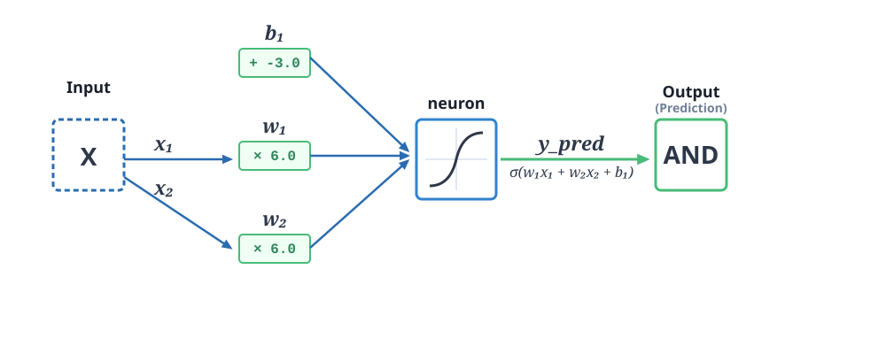
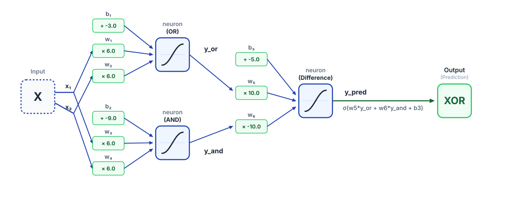

## Introducción

En la lección anterior, vimos cómo la regresión logística puede ser utilizada para resolver problemas de clasificación. Sin embargo, la regresión logística es un modelo lineal, lo que significa que solo puede aprender relaciones lineales entre las características y la variable objetivo. Para abordar problemas más complejos, necesitamos modelos que puedan aprender relaciones no lineales. Aquí es donde entran en juego las redes neuronales.

Veamos un problema de clasificación aparentemente simple. Supongamos que tenemos el siguiente `dataset` que representa las puertas lógica AND, OR y XOR:

```{python}
import pandas as pd

X = [(0,0), (0,1), (1,0), (1,1)]
df = pd.DataFrame(X, columns=["x1", "x2"])
df["OR"] = df["x1"] | df["x2"]
df["AND"] = df["x1"] & df["x2"]
df["XOR"] = df["x1"] ^ df["x2"]

df.style.hide(axis='index')
```

Podemos tratar cada una de las columnas `AND`, `OR` y `XOR` como una variable objetivo para un problema de clasificación. 

Si representamos gráficamente los puntos para cada función, podemos ver que las funciones `AND` y `OR` son linealmente separables, mientras que la función `XOR` no lo es:

```{python}
from plotnine import *

df_melt = df.melt(id_vars=["x1", "x2"], value_vars=["AND", "OR", "XOR"], 
                  var_name="func", value_name="y")

p = (
    ggplot(df_melt, aes(x='x1', y='x2', color='factor(y)', fill='factor(y)')) 
    + facet_wrap("~func")
    + geom_point(size=5)
    + scale_color_manual(values=['red', 'blue']) 
    + theme_minimal()
    + scale_x_continuous(breaks=[0, 1])
    + scale_y_continuous(breaks=[0, 1])
    + theme_bw()
    + theme(
        legend_position='none',
        panel_grid_major=element_blank(),
        panel_grid_minor=element_blank(),
    )
)

p
``` 

Que sean linealmente separables significa que podemos resolver este problema usando una regresión logística^[La regresión logística puede resolver también problemas de clasificación no separables linealmente, pero no podrá conseguir una exactidud del 100%.]. Sin embargo, la función `XOR` no es linealmente separable. No obstante, mediante dos rectas, podemos separar los puntos de la función `XOR`. Así que podríamos usar dos modelos de regresión logística y combinarlos los resultados con una tercera. Por ejemplo, la primera regresión logística podría aprender la función `OR` y la segunda regresión logística podría aprender la función `AND`. Finalmente, la tercera regresión logística podría aprender la resta y así, enviando la salida de las neuronas de la primera capa a la neurona de la segunda habrá aprendido la función `XOR`.

La solución anterior puede parecer excesivamente complicada para aprender una función tan sencilla como `XOR`. Sin embargo, esto es esencialmente lo que hace una red neuronal: combina múltiples modelos lineales con funciones de activación (ver más adelante) para aprender relaciones no lineales.

En las siguientes secciones se implementa todo esto. De momento podemos comprobar que, efectivamente, combinado `OR` y `AND` con la diferencia produce `XOR`: 

```{python}
df["OR - AND = XOR"] = df["OR"] - df["AND"]

df.style.hide(axis='index')
```

::: {.callout-note collapse="true"}
## El operador lógico diferencia

La tabla de verdad de la del operador lógico diferencia realmente tiene dos salidas porque se debe consideran la posibilidad del acarreo:

```{python}
pd.DataFrame({
    'x1': [0, 0, 1, 1],
    'x2': [0, 1, 0, 1],
    'x1 - x2': [0, 1, 0, 1],
    'carry': [0, 0, 1, 0], 
})
```

Con la implentación de `XOR` como la diferencia entre `OR` y `AND` se ha despreciado el acarreo ya que matemáticamente nunca se va a alimentar a la función diferencia con los valores `(x1=0, x2=1)`. Esto es así porque `x1` es el resultado de la operación `OR` y `x2` es el resultado de la operación `AND`. Si `OR` es 0, entonces es seguro que `AND`es 0.

Aunque matemáticamente esta situación no se puede producir, durante el entrenamiento de la red neuronal sí puede suceder. Ya que durante el aprendizaje, la red puede cometer errores que va a ir corrigiendo poco a poco. Tampoco esto debería ser un problema ya que en realidad, como demostraremos, la red realmente no aprende la función `XOR` derivándola de otras operaciones lógicas, sino que únicamente busca construir un modelo que minimice la función de pérdida. 
:::

## ¿Qué es una red neuronal?

Una red neuronal es un modelo de aprendizaje automático inspirado en el funcionamiento del cerebro humano. Está compuesta por capas de neuronas artificiales que se conectan entre sí. Cada neurona recibe entradas, las procesa y produce una salida que se transmite a las neuronas de la siguiente capa. Las redes neuronales pueden tener múltiples capas ocultas, lo que les permite aprender representaciones cada vez más complejas de los datos. La capacidad de las redes neuronales para aprender relaciones no lineales las hace especialmente poderosas para resolver problemas de clasificación y regresión que no pueden ser resueltos por modelos lineales como la regresión logística.

Los cálculos que se realizan en cada neurona son simples transformaciones lineales seguidas de una función de activación no lineal. La función de activación introduce no linealidad en el modelo, lo que permite a la red neuronal aprender relaciones complejas entre las características y la variable objetivo.

## Funciones de activación

Las funciones de activación son funciones no lineales que se aplican a la salida de cada neurona. Algunas de las funciones de activación más comunes son:

::: {.panel-tabset}

##  Sigmoide

$\sigma(z) = \frac{1}{1 + e^{-z}}$ 

Comprime la salida entre 0 y 1, lo que la hace útil para problemas de clasificación binaria. Es popular en la capa de salida de las redes neuronales para problemas de clasificación binaria, ya que su salida puede interpretarse como una probabilidad.

```{python}
import numpy as np

df = pd.DataFrame({'z': np.linspace(-10, 10, 100), 'y': 1/(1+np.exp(-np.linspace(-10, 10, 100)))})
p = ggplot(df, aes(x='z', y='y')) + geom_line() + theme_minimal() + ggtitle("Función Sigmoide")
p
```

##  Tangente hiperbólica

$\tanh(z) = \frac{e^z - e^{-z}}{e^z + e^{-z}}$ 

Comprime la salida entre -1 y 1.

```{python}
df = pd.DataFrame({'z': np.linspace(-10, 10, 100), 'y': (np.exp(np.linspace(-10, 10, 100)) - np.exp(-np.linspace(-10, 10, 100))) / (np.exp(np.linspace(-10, 10, 100)) + np.exp(-np.linspace(-10, 10, 100)))})
p = ggplot(df, aes(x='z', y='y')) + geom_line() + theme_minimal() + ggtitle("Función Tangente Hiperbólica")
p
```

##  ReLU (Rectified Linear Unit)

$f(z) = \max(0, z)$ 

Es ampliamente utilizada en redes neuronales profundas por su simplicidad y eficiencia computacional.

```{python}
df = pd.DataFrame({'z': np.linspace(-10, 10, 100), 'y': np.maximum(0, np.linspace(-10, 10, 100))})
p = ggplot(df, aes(x='z', y='y')) + geom_line() + theme_minimal() + ggtitle("Función ReLU")
p
```

## Leaky ReLU

$f(z) = \begin{cases} z & \text{si } z > 0 \\ \alpha z & \text{si } z \leq 0 \end{cases}$

Es una variante de ReLU que permite un pequeño gradiente cuando la unidad está inactiva (cuando $z \leq 0$), lo que ayuda a evitar el problema de los "gradientes muertos" en redes neuronales profundas. La función Leaky ReLU se puede parametrizar con un valor de $\alpha$ que controla la pendiente para los valores negativos de $z$. Por ejemplo, si $\alpha = 0.01$, entonces para $z \leq 0$, la función devolverá $0.01z$ en lugar de 0, lo que permite que el modelo siga aprendiendo para valores negativos de $z$.

```{python}
alpha = 0.1
df = pd.DataFrame({'z': np.linspace(-10, 10, 100), 'y': np.where(np.linspace(-10, 10, 100) > 0, np.linspace(-10, 10, 100), alpha * np.linspace(-10, 10, 100))})
p = ggplot(df, aes(x='z', y='y')) + geom_line() + theme_minimal() + ggtitle("Función Leaky ReLU")
p
```

## Softmax

$\text{softmax}(z_i) = \frac{e^{z_i}}{\sum_{j} e^{z_j}}$

Convierte un vector de outputsogits en una distribución de probabilidad, lo que la hace útil para problemas de clasificación multiclase.

## Linear (identidad)

$f(z) = z$

La neurona simplemente devuelve su logit sin aplicar ninguna función de activación. Es comúnmente utilizada en la capa de salida de las redes neuronales para problemas de regresión.

 
:::

## Neurona AND

La función lógica AND se puede representar mediante una única neurona con una función de activación sigmoide. La neurona toma dos entradas, las multiplica por sus respectivos pesos, suma un sesgo y luego aplica la función de activación sigmoide para producir una salida entre 0 y 1. Para que la neurona aprenda la función AND, los pesos deben ser positivos y el sesgo debe ser negativo, de manera que solo cuando ambas entradas sean 1, la salida sea cercana a 1. Una neurona es la red neuronal más simple que podemos construir: una única capa con un única neurona. Todos los modelos que hemos construido hasta ahora, como la regresión lineal y la regresión logística, pueden ser vistos como redes neuronales.


### Forward pass

El proceso de calcular la salida de una red neuronal a partir de las entradas se llama "forward pass". Durante el **forward pass**, cada neurona calcula su logit (una combinación lineal de sus entradas) y luego aplica la función de activación para producir su salida. Este proceso se repite capa por capa hasta llegar a la capa de salida, donde se obtiene la predicción final del modelo.

La siguiente imagen muestra una posible solución para calcular la función lógica `AND` usando una red neuronal con una única neurona:


Vamos a comprobar que realmente funciona:

```{python}
import numpy as np

b1 = -9
w1 = 6
w2 = 6

def sigmoid(z):
    return 1 / (1 + np.exp(-z))

def logit(x1, x2):
    return (x1 * w1) + (x2 * w2) + b1

def predict(x1, x2):
    z = logit(x1, x2)
    return sigmoid(z)

df = pd.DataFrame([(x1, x2, logit(x1, x2), predict(x1, x2)) for x1 in [0, 1] for x2 in [0, 1]], columns=["x1", "x2", "logit", "sigmoid(logit)"])

df.style.hide(axis='index')
```

En el siguiente código se muestra cómo se implementa el forward pass de esta red neuronal ya entrenada usando PyTorch para calcular las predicciones del modelo. Comprobamos que las predicciones son las mismas que las obtenidas con la implementación manual anterior:

```{python}
import torch
import torch.nn as nn

class AndNN(nn.Module):
    def __init__(self, b1 =0 , w1 = 0, w2 = 0):
        super().__init__()
        # Subimos los valores para que la sigmoide sature bien en 0 y 1
        self.b1 = torch.tensor(b1) 
        self.w1 = torch.tensor(w1)
        self.w2 = torch.tensor(w2)

    def forward(self, input_values):

        # input_values.shape = 4 x 2
        z = (input_values[:, 0] * self.w1) + (input_values[:, 1] * self.w2) + self.b1
        probs = torch.sigmoid(z)        
        return probs

model = AndNN(b1, w1, w2)
X = torch.tensor([[0,0], [0,1], [1,0], [1,1]], dtype=torch.float)
y_pred = model(X)

pd.DataFrame({
    'x1': X[:, 0].numpy(),
    'x2': X[:, 1].numpy(),
    'prediction': y_pred.detach().numpy(),
    'AND': y_pred.detach().numpy().round()
}).style.hide(axis='index')
```


### Backward pass

El **backward pass** es el proceso mediante el cual se calculan los gradientes de los pesos y sesgos de la red neuronal con respecto a una función de pérdida. Este proceso es esencial para entrenar la red neuronal, ya que permite ajustar los pesos y sesgos para minimizar la función de pérdida y mejorar la precisión del modelo. El algoritmo más utilizado para realizar el backward pass es el algoritmo de retropropagación (backpropagation). En realidad, es simplemente el resultado de aplicar la regla de la cadena para calcular los gradientes de manera eficiente a través de las capas de la red neuronal.

Vamos a usar la implementación de la red neuronal anterior, `AndNN` pero indicándola a Pytorch que debe tratar los tensores del método ` __init__` como parámetros entrenables:

```{python}
class AndNN(nn.Module):
    def __init__(self, b1 =0 , w1 = 0, w2 = 0):
        super().__init__()
        # Subimos los valores para que la sigmoide sature bien en 0 y 1
        self.b1 = nn.Parameter(torch.tensor(b1, dtype=torch.float))
        self.w1 = nn.Parameter(torch.tensor(w1, dtype=torch.float))
        self.w2 = nn.Parameter(torch.tensor(w2, dtype=torch.float))

    def forward(self, input_values):
        # input_values.shape = 4 x 2
        z = (input_values[:, 0] * self.w1) + (input_values[:, 1] * self.w2) + self.b1
        probs = torch.sigmoid(z)        
        return probs


model = AndNN()
X = torch.tensor([[0,0], [0,1], [1,0], [1,1]], dtype=torch.float)
y_pred = model(X)

pd.DataFrame({
    'x1': X[:, 0].numpy(),
    'x2': X[:, 1].numpy(),
    'prediction': y_pred.detach().numpy(),
    'AND': y_pred.detach().numpy().round()
}).style.hide(axis='index')
```

Entrenamos la red y volvemos a mostrar las predicciones y comprobamos que el modelo ha aprendido la función `AND`:

```{python}
import torch.optim as optim

# El target (Y) para la compuerta AND.
Y = torch.tensor([0.0, 0.0, 0.0, 1.0], dtype=torch.float)

criterion = nn.BCELoss()  # Pérdida de entropía cruzada binaria
optimizer = optim.SGD(model.parameters(), lr=0.5)

epochs = 1000
for epoch in range(epochs):
    # Forward
    outputs = model(X)
    loss = criterion(outputs, Y)
    
    # Backward y optimización
    optimizer.zero_grad()
    loss.backward()
    optimizer.step()
    
    if (epoch + 1) % 100 == 0:
        print(f"Época [{epoch+1}/{epochs}], Pérdida: {loss.item():.4f}")

y_pred = model(X)

pd.DataFrame({
    'x1': X[:, 0].numpy(),
    'x2': X[:, 1].numpy(),
    'prediction': y_pred.detach().numpy(),
    'AND': y_pred.detach().numpy().round()
}).style.hide(axis='index')
```

Mostramos los parámetros finales del modelo después de entrenar:

```{python} 
for name, param in model.named_parameters():
    print(name, torch.round(param.data, decimals=3))
```

Mostramos gráficamente la frontera de decisión aprendida por el modelo y constatamos que, efectivamente, la frontera de decisión es lineal.^[Este gráfico se ha construido pidiéndole al modelo que prediga cientos de puntos a lo largo de todo el espacio de entrada y pintando cada punto con un color diferente dependiendo de la predicción del modelo.].Se constata que la frontera de decisión está alejada de los puntos de entrenamiento, lo que es un indicativo de que el modelo ha aprendido a generalizar correctamente y no se ha limitado a memorizar los puntos de entrenamiento:

```{python}
# 1. Crear el grid de puntos para la frontera de decisión (espacio entre -0.5 y 1.5)
x1_range = np.linspace(-0.5, 1.5, 200)
x2_range = np.linspace(-0.5, 1.5, 200)
X1, X2 = np.meshgrid(x1_range, x2_range)

# Convertir el grid a un tensor para PyTorch
mesh_points = np.c_[X1.ravel(), X2.ravel()]
mesh_tensor = torch.tensor(mesh_points, dtype=torch.float)

# 2. Predecir con el modelo OR entrenado anteriormente
model.eval() # Modo evaluación
with torch.no_grad():
    probs = model(mesh_tensor).numpy()
    preds = probs.round()

# DataFrame para pintar la región de fondo
df_mesh = pd.DataFrame({
    'x1': X1.ravel(),
    'x2': X2.ravel(),
    'prob': probs,
    'pred': preds
})

# 3. DataFrame con los 4 puntos reales de la compuerta OR
df_points = pd.DataFrame({
    'x1': [0, 0, 1, 1],
    'x2': [0, 1, 0, 1],
    'real': [0, 0, 0, 1]
})

# Mapas de colores: Verde para 1, Rojo para 0
color_map = {1: 'green', 0: 'red'}

# 4. Construir el gráfico
(ggplot()
 + geom_tile(df_mesh, aes(x='x1', y='x2', fill='factor(pred)'), alpha=0.15, show_legend=False)
 + geom_point(df_points, aes(x='x1', y='x2', color='factor(real)'), size=4)
 + scale_fill_manual(values=['red', 'green'])
 + scale_color_manual(values=color_map)
 + labs(title='Frontera de decisión - Neurona OR',
        x='Entrada X1', 
        y='Entrada X2',
        color='Resultado Real')
 + theme(
    legend_position='none',
    panel_background=element_rect(fill='white'),
    plot_background=element_rect(fill='white'),
    figure_size=(6, 5)
))
```


## Neurona OR

De forma similar, podemos repetir los pasos para crear una neurona que aprenda la función OR.

### Forward pass


La siguiente imagen muestra una posible solución para calcular la función lógica `OR` usando una red neuronal con una única neurona:



Vamos a comprobar que realmente funciona:

```{python}
import numpy as np
import pandas as pd

b1 = -3
w1 = 6
w2 = 6

df = pd.DataFrame([(x1, x2, logit(x1, x2), predict(x1, x2)) for x1 in [0, 1] for x2 in [0, 1]], columns=["x1", "x2", "logit", "sigmoid(logit)"])

df.style.hide(axis='index')
```

Implementación en Pytorch de la red con lo parámetros entrenados:

```{python}
class OrNN(nn.Module):
    def __init__(self, b1 = 0, w1 = 0, w2 = 0):
        super().__init__()
        # Subimos los valores para que la sigmoide sature bien en 0 y 1
        self.b1 = torch.tensor(b1) 
        self.w1 = torch.tensor(w1)
        self.w2 = torch.tensor(w2)

    def forward(self, input_values):
        # input_values.shape = 4 x 2
        z = (input_values[:, 0] * self.w1) + (input_values[:, 1] * self.w2) + self.b1
        probs = torch.sigmoid(z)        
        return probs

model = OrNN(b1, w1, w2)
X = torch.tensor([[0,0], [0,1], [1,0], [1,1]], dtype=torch.float)
y_pred = model(X)

pd.DataFrame({
    'x1': X[:, 0].numpy(),
    'x2': X[:, 1].numpy(),
    'prediction': y_pred.detach().numpy(),
    'OR': y_pred.detach().numpy().round()
}).style.hide(axis='index')

```

### Backward pass

Implementación en Pytorch del modelo y predicción sin entrenar:

```{python}
class OrNN(nn.Module):
    def __init__(self, b1 = 0, w1 = 0, w2 = 0):
        super().__init__()
        self.b1 = nn.Parameter(torch.tensor(b1, dtype=torch.float))
        self.w1 = nn.Parameter(torch.tensor(w1, dtype=torch.float))
        self.w2 = nn.Parameter(torch.tensor(w2, dtype=torch.float))

    def forward(self, input_values):
        # input_values.shape = 4 x 2
        z = (input_values[:, 0] * self.w1) + (input_values[:, 1] * self.w2) + self.b1
        probs = torch.sigmoid(z)        
        return probs

model = OrNN()
X = torch.tensor([[0,0], [0,1], [1,0], [1,1]], dtype=torch.float)
y_pred = model(X)

pd.DataFrame({
    'x1': X[:, 0].numpy(),
    'x2': X[:, 1].numpy(),
    'prediction': y_pred.detach().numpy(),
    'OR': y_pred.detach().numpy().round()
}).style.hide(axis='index')
```

Entrenamos la red y volvemos a mostrar las predicciones y comprobamos que el modelo ha aprendido la función OR:

```{python}
import torch.optim as optim

# El target (Y) para la compuerta OR.
Y = torch.tensor([0.0, 1.0, 1.0, 1.0], dtype=torch.float)

criterion = nn.BCELoss()  # Pérdida de entropía cruzada binaria
optimizer = optim.SGD(model.parameters(), lr=0.5)

epochs = 1000
for epoch in range(epochs):
    # Forward
    outputs = model(X)
    loss = criterion(outputs, Y)
    
    # Backward y optimización
    optimizer.zero_grad()
    loss.backward()
    optimizer.step()
    
    if (epoch + 1) % 100 == 0:
        print(f"Época [{epoch+1}/{epochs}], Pérdida: {loss.item():.4f}")

y_pred = model(X)

pd.DataFrame({
    'x1': X[:, 0].numpy(),
    'x2': X[:, 1].numpy(),
    'prediction': y_pred.detach().numpy(),
    'OR': y_pred.detach().numpy().round()
}).style.hide(axis='index')
```

Mostramos los parámetros finales del modelo después de entrenar:

```{python} 
for name, param in model.named_parameters():
    print(name, torch.round(param.data, decimals=3))
```

Mostramos gráficamente la frontera de decisión aprendida por el modelo:

```{python}
# 1. Crear el grid de puntos para la frontera de decisión (espacio entre -0.5 y 1.5)
x1_range = np.linspace(-0.5, 1.5, 200)
x2_range = np.linspace(-0.5, 1.5, 200)
X1, X2 = np.meshgrid(x1_range, x2_range)

# Convertir el grid a un tensor para PyTorch
mesh_points = np.c_[X1.ravel(), X2.ravel()]
mesh_tensor = torch.tensor(mesh_points, dtype=torch.float)

# 2. Predecir con el modelo OR entrenado anteriormente
model.eval() # Modo evaluación
with torch.no_grad():
    probs = model(mesh_tensor).numpy()
    preds = probs.round()

# DataFrame para pintar la región de fondo
df_mesh = pd.DataFrame({
    'x1': X1.ravel(),
    'x2': X2.ravel(),
    'prob': probs,
    'pred': preds
})

# 3. DataFrame con los 4 puntos reales de la compuerta OR
df_points = pd.DataFrame({
    'x1': [0, 0, 1, 1],
    'x2': [0, 1, 0, 1],
    'real': [0, 1, 1, 1]
})

# Mapas de colores: Verde para 1, Rojo para 0
color_map = {1: 'green', 0: 'red'}

# 4. Construir el gráfico
(ggplot()
 + geom_tile(df_mesh, aes(x='x1', y='x2', fill='factor(pred)'), alpha=0.15, show_legend=False)
 + geom_point(df_points, aes(x='x1', y='x2', color='factor(real)'), size=4)
 + scale_fill_manual(values=['red', 'green'])
 + scale_color_manual(values=color_map)
 + labs(title='Frontera de decisión - Neurona OR',
        x='Entrada X1', 
        y='Entrada X2',
        color='Resultado Real')
 + theme(
    legend_position='none',
    panel_background=element_rect(fill='white'),
    plot_background=element_rect(fill='white'),
    figure_size=(6, 5)
))
```
.
## Neurona XOR

En la introducción de este capítulo vimos gráficamente con una sola neurona no es posible aprender la función `XOR` por no ser un problema linealmente separable. De todas formas es ilustrativo comprobar que, efectivamente, una neurona con función de activación sigmoide no es capaz de aprender la función `XOR`. Por ello, vamos a entrenar la red con una sola neurona para ver qué sucede. Como es de esperar, antes de entrenar no es capaz de predecir la función `XOR`.

```{python}
class XorNN(nn.Module):
    def __init__(self, b1 = 0, w1 = 0, w2 = 0):
        super().__init__()
        self.b1 = nn.Parameter(torch.tensor(b1, dtype=torch.float))
        self.w1 = nn.Parameter(torch.tensor(w1, dtype=torch.float))
        self.w2 = nn.Parameter(torch.tensor(w2, dtype=torch.float))

    def forward(self, input_values):
        # input_values.shape = 4 x 2
        z = (input_values[:, 0] * self.w1) + (input_values[:, 1] * self.w2) + self.b1
        probs = torch.sigmoid(z)        
        return probs

model = XorNN()
X = torch.tensor([[0,0], [0,1], [1,0], [1,1]], dtype=torch.float)
y_pred = model(X)

pd.DataFrame({
    'x1': X[:, 0].numpy(),
    'x2': X[:, 1].numpy(),
    'prediction': y_pred.detach().numpy(),
    'XOR': y_pred.detach().numpy().round()
}).style.hide(axis='index')
```

```{python}
import torch.optim as optim

# El target (Y) para la compuerta OR.
Y = torch.tensor([0.0, 1.0, 1.0, 0.0], dtype=torch.float)

criterion = nn.BCELoss()  # Pérdida de entropía cruzada binaria
optimizer = optim.SGD(model.parameters(), lr=0.5)

epochs = 1000
for epoch in range(epochs):
    # Forward
    outputs = model(X)
    loss = criterion(outputs, Y)
    
    # Backward y optimización
    optimizer.zero_grad()
    loss.backward()
    optimizer.step()
    
    if (epoch + 1) % 100 == 0:
        print(f"Época [{epoch+1}/{epochs}], Pérdida: {loss.item():.4f}")

y_pred = model(X)

pd.DataFrame({
    'x1': X[:, 0].numpy(),
    'x2': X[:, 1].numpy(),
    'prediction': y_pred.detach().numpy(),
    'XOR': y_pred.detach().numpy().round()
}).style.hide(axis='index')
```


:::{.callout-warning collapse="true"}
Habrá observado que la función de pérdida no ha cambiado. Esto ocurre un problema frecuente en redes neuronales llamado "vanishing gradients". En este caso, el modelo ha encontrado un punto en el espacio de parámetros donde la función de pérdida es plana, lo que significa que los gradientes son cero o muy cercanos a cero. Esto impide que el modelo pueda aprender y mejorar su rendimiento, ya que no hay una dirección clara para ajustar los pesos y sesgos. Esta situación es muy común con la función de activación sigmoide. Esta función de activación puede saturarse fácilmente, lo que significa que para valores de entrada muy grandes o muy pequeños, la salida se acerca a 0 o 1, respectivamente. En estas regiones saturadas, los gradientes son muy pequeños, lo que dificulta el aprendizaje del modelo. Por esta razón, en la práctica se suelen utilizar funciones de activación como ReLU o Leaky ReLU, que no sufren tanto de este problema.
:::

Al no haber aprendido nada, los parámetros del modelo siguen siendo los mismos que al principio:

```{python} 
for name, param in model.named_parameters():
    print(name, torch.round(param.data, decimals=3))
```

## Red neuronal XOR

Como hemos visto, con una sola neurona no es posible aprender la función `XOR`. Sin embargo, si combinamos varias neuronas en una red neuronal con una capa oculta, sí es posible aprender la función `XOR`. De hecho, con una capa oculta de dos neuronas es suficiente para aprender la función `XOR`. POr ejemplo:



### Forward pass

Podemos comprobar que la red de la imagen anterior precide correctamente la función `XOR`:

```{python}
class XorNN(nn.Module):
    def __init__(self):
        super().__init__()
        self.b1 = torch.tensor(-3.0) 
        self.w1 = torch.tensor(6.0)
        self.w2 = torch.tensor(6.0)

        self.b2 = torch.tensor(-9.0) 
        self.w3 = torch.tensor(6.0)
        self.w4 = torch.tensor(6.0)

        self.b3 = torch.tensor(-5.0)
        self.w5 = torch.tensor(10.0)
        self.w6 = torch.tensor(-10.0)

    def forward(self, input_values):
        y_or = torch.sigmoid((input_values[:, 0] * self.w1) + (input_values[:, 1] * self.w2) + self.b1)
        y_and = torch.sigmoid((input_values[:, 0] * self.w3) + (input_values[:, 1] * self.w4) + self.b2)
        y_pred = torch.sigmoid((y_or * self.w5) + (y_and * self.w6) + self.b3)

        return y_pred

model = XorNN()
X = torch.tensor([[0,0], [0,1], [1,0], [1,1]], dtype=torch.float)
y_pred = model(X)
pd.DataFrame({
    'x1': X[:, 0].numpy(),
    'x2': X[:, 1].numpy(),
    'prediction': y_pred.detach().numpy(),
    'XOR': y_pred.detach().numpy().round()
}).style.hide(axis='index')
```
### Backward pass

Definimos la red entrenable y comprobamos que no produce la función `XOR`:

:::{.callout-warning collapse="true"}
## Cuestiones importantes para que el entrenamiento converja

Para conseguir que en entrenamiento converga hemos tenido que hacer los siguientes ajustes:

* Inicializar los pesos y sesgos usando el esquema utilizado por PyTorch.
* Cambiar el optimizador a Adam.
* Usar la función de activación Leaky ReLU en lugar de la función sigmoide en la capa oculta.
* Fijar la semilla para asegurar la reproducibilidad de los resultados^[Si no se fija la semilla, cada vez que se ejecute el código se obtendrán resultados diferentes debido a la aleatoriedad en la inicialización de los pesos y en el proceso de entrenamiento. Se ha elegido una semilla que alcanza la convergencia.].

```{python}
import torch
import random
import numpy as np

def fijar_semilla(seed=42):
    # 1. Semilla para el módulo nativo de Python
    random.seed(seed)
    
    # 2. Semilla para NumPy (por si manipulas arrays o datos con él)
    np.random.seed(seed)
    
    # 3. Semilla para PyTorch en la CPU
    torch.manual_seed(seed)
    
    # 4. Semilla para PyTorch en la GPU (si usas CUDA)
    if torch.cuda.is_available():
        torch.cuda.manual_seed(seed)
        torch.cuda.manual_seed_all(seed) # Para entornos multi-GPU
        
        # 5. Configurar el motor de operaciones de NVIDIA (cuDNN)
        # Esto hace que las operaciones en la GPU sean deterministas
        torch.backends.cudnn.deterministic = True
        torch.backends.cudnn.benchmark = False

```
:::

```{python}
import math

class XorNN(nn.Module):
    def __init__(self):
        super().__init__()
        # --- CAPA 1 (Oculta): 2 entradas, 2 neuronas ---
        # El "fan-in" de esta capa es 2 (el número de entradas)
        fan_in_oculta = 2
        # Calculamos el límite superior/inferior del rango uniforme de Kaiming
        limite_oculta = 1.0 / math.sqrt(fan_in_oculta)
        
        # Inicializamos pesos y sesgos uniformemente dentro de [-limite, limite]
        self.w1 = nn.Parameter(torch.empty(1).uniform_(-limite_oculta, limite_oculta))
        self.w2 = nn.Parameter(torch.empty(1).uniform_(-limite_oculta, limite_oculta))
        self.b1 = nn.Parameter(torch.empty(1).uniform_(-limite_oculta, limite_oculta))
        
        self.w3 = nn.Parameter(torch.empty(1).uniform_(-limite_oculta, limite_oculta))
        self.w4 = nn.Parameter(torch.empty(1).uniform_(-limite_oculta, limite_oculta))
        self.b2 = nn.Parameter(torch.empty(1).uniform_(-limite_oculta, limite_oculta))
        
        # --- CAPA 2 (Salida): 2 entradas (y_or, y_and), 1 neurona ---
        # El "fan-in" de esta capa también es 2 (recibe 2 entradas de la capa anterior)
        fan_in_salida = 2
        limite_salida = 1.0 / math.sqrt(fan_in_salida)
        
        self.w5 = nn.Parameter(torch.empty(1).uniform_(-limite_salida, limite_salida))
        self.w6 = nn.Parameter(torch.empty(1).uniform_(-limite_salida, limite_salida))
        self.b3 = nn.Parameter(torch.empty(1).uniform_(-limite_salida, limite_salida))

    def forward(self, input_values):
        y_or = torch.nn.functional.leaky_relu((input_values[:, 0] * self.w1) + (input_values[:, 1] * self.w2) + self.b1)
        y_and = torch.nn.functional.leaky_relu((input_values[:, 0] * self.w3) + (input_values[:, 1] * self.w4) + self.b2)
        y_pred = torch.sigmoid((y_or * self.w5) + (y_and * self.w6) + self.b3)

        return y_pred

model = XorNN()
X = torch.tensor([[0,0], [0,1], [1,0], [1,1]], dtype=torch.float)
y_pred = model(X)
pd.DataFrame({
    'x1': X[:, 0].numpy(),
    'x2': X[:, 1].numpy(),
    'prediction': y_pred.detach().numpy(),
    'XOR': y_pred.detach().numpy().round()
}).style.hide(axis='index')
```
Ahora vamos a entrenar la red neuronal y vemos que es capaz de aprender la función `XOR`:


```{python}
fijar_semilla(12)
model = XorNN()
Y = torch.tensor([0.0, 1.0, 1.0, 0.0], dtype=torch.float)   
criterion = nn.BCELoss()  # Pérdida de entropía cruzada binaria
optimizer = optim.Adam(model.parameters(), lr=0.5)   
epochs = 1000
for epoch in range(epochs):
    # Forward
    outputs = model(X)
    loss = criterion(outputs, Y)
    # Backward y optimización
    optimizer.zero_grad()
    loss.backward()
    optimizer.step()
    if (epoch + 1) % 100 == 0:
        print(f"Época [{epoch+1}/{epochs}], Pérdida: {loss.item():.4f}")
y_pred = model(X)
pd.DataFrame({
    'x1': X[:, 0].numpy(),
    'x2': X[:, 1].numpy(),
    'prediction': y_pred.detach().numpy(),
    'XOR': y_pred.detach().numpy().round()  }).style.hide(axis='index')
```


Mostramos gráficamente la frontera de decisión aprendida por el modelo:

```{python}
# 1. Crear el grid de puntos para la frontera de decisión (espacio entre -0.5 y 1.5)
x1_range = np.linspace(-0.5, 1.5, 200)
x2_range = np.linspace(-0.5, 1.5, 200)
X1, X2 = np.meshgrid(x1_range, x2_range)

# Convertir el grid a un tensor para PyTorch
mesh_points = np.c_[X1.ravel(), X2.ravel()]
mesh_tensor = torch.tensor(mesh_points, dtype=torch.float)

# 2. Predecir con el modelo OR entrenado anteriormente
model.eval() # Modo evaluación
with torch.no_grad():
    probs = model(mesh_tensor).numpy()
    preds = probs.round()

# DataFrame para pintar la región de fondo
df_mesh = pd.DataFrame({
    'x1': X1.ravel(),
    'x2': X2.ravel(),
    'prob': probs,
    'pred': preds
})

# 3. DataFrame con los 4 puntos reales de la compuerta OR
df_points = pd.DataFrame({
    'x1': [0, 0, 1, 1],
    'x2': [0, 1, 0, 1],
    'real': [0, 1, 1, 0]
})

# Mapas de colores: Verde para 1, Rojo para 0
color_map = {1: 'green', 0: 'red'}

# 4. Construir el gráfico
(ggplot()
 + geom_tile(df_mesh, aes(x='x1', y='x2', fill='factor(pred)'), alpha=0.15, show_legend=False)
 + geom_point(df_points, aes(x='x1', y='x2', color='factor(real)'), size=4)
 + scale_fill_manual(values=['red', 'green'])
 + scale_color_manual(values=color_map)
 + labs(title='Frontera de decisión - Neurona OR',
        x='Entrada X1', 
        y='Entrada X2',
        color='Resultado Real')
 + theme(
    legend_position='none',
    panel_background=element_rect(fill='white'),
    plot_background=element_rect(fill='white'),
    figure_size=(6, 5)
))
```

Esto es muy interesante: La red ha aprendido a separar mediante dos líneas rectas el espacio de entrada en tres regiones. Como ya hemos dicho, esto es algo que no es posible con una sola neurona. Pero es interesante que la red haya "comprendido" por sí misma que la mejor frontera de decisión sea una línea recta, realmente no tendría por qué haberlo hecho así, podría haber aprendido una frontera de decisión con forma curva. Observe que las líneas no son paralelas entre sí, es lo que habría sucedido si la red hubiera hecho un aprendizaje perfecto.

En 3D:

```{python}
import numpy as np
import pandas as pd
import torch
import matplotlib.pyplot as plt
from matplotlib import cm

# --- (Esto mantiene tu lógica original de datos) ---

# 1. Crear el grid de puntos (lo cambiamos a 50x50 para que el gráfico 3D no sea pesado)
x1_range = np.linspace(-0.5, 1.5, 50)
x2_range = np.linspace(-0.5, 1.5, 50)
X1, X2 = np.meshgrid(x1_range, x2_range)

mesh_points = np.c_[X1.ravel(), X2.ravel()]
mesh_tensor = torch.tensor(mesh_points, dtype=torch.float)

# 2. Predecir con el modelo OR
model.eval()
with torch.no_grad():
    probs = model(mesh_tensor).numpy()

# Redimensionar las probabilidades para que tengan la forma del grid (50x50)
Z_probs = probs.reshape(X1.shape)

# 3. Puntos reales de la compuerta OR
# Nota: Corregí el último punto de tu 'real' [0, 1, 1, 0] a [0, 1, 1, 1] ya que es una compuerta OR
df_points = pd.DataFrame({
    'x1': [0, 0, 1, 1],
    'x2': [0, 1, 0, 1],
    'real': [0, 1, 1, 1] 
})

# --- 4. CONSTRUIR EL GRÁFICO 3D ---

fig = plt.figure(figsize=(10, 8))
ax = fig.add_subplot(1, 1, 1, projection='3d')

# Dibujar la superficie de probabilidad (Frontera de decisión en 3D)
# Usamos un mapa de color de Rojo (0) a Verde (1) como querías
cmap_custom = cm.get_cmap('RdYlGn') 
surf = ax.plot_surface(X1, X2, Z_probs, cmap=cmap_custom, alpha=0.6, edgecolor='none')

# Dibujar los 4 puntos reales de la compuerta
for idx, row in df_points.iterrows():
    color = 'green' if row['real'] == 1 else 'red'
    # Graficamos el punto en su posición (x1, x2) y la altura real (0 o 1)
    ax.scatter(row['x1'], row['x2'], row['real'], color=color, s=100, edgecolor='black', linewidth=1.5)

# Configuración de etiquetas y límites
ax.set_title('Superficie de Decisión 3D - Neurona OR', fontsize=14, pad=20)
ax.set_xlabel('Entrada X1', fontsize=11)
ax.set_ylabel('Entrada X2', fontsize=11)
ax.set_zlabel('Probabilidad / Resultado', fontsize=11)

ax.set_zlim(-0.1, 1.1)

# Añadir una barra de color para la probabilidad
fig.colorbar(surf, ax=ax, shrink=0.5, aspect=10, label='Probabilidad de ser 1')

# Ajustar el ángulo de visión inicial para que se aprecie bien la pendiente
ax.view_init(elev=25, azim=-135)

plt.show()
``` 

Los parámetros aprendidos por el modelo son:

```{python} 
for name, param in model.named_parameters():
    print(name, torch.round(param.data, decimals=3))
```

### ¿Qué ha aprendido cada neurona?

Vemos que las salidas de las neuronas de la capa oculta (top_hidden y bottom_hidden) ya no son probabilidades al haber cambiado la función de activación a Leaky ReLU. La neurona de la capa oculta superior está detectando cuando ambas entradas son 1 y la inferior cuando ambas son cero. Cuando esto ocurre las dos valores producen un valor alto, en caso contrario producen un valor cercano a cero.

```{python}
params = model.state_dict()

df = pd.DataFrame({
    'x1': X[:, 0].numpy(),
    'x2': X[:, 1].numpy(),
    'top_hidden': torch.nn.functional.leaky_relu((X[:, 0] * params['w1']) + (X[:, 1] * params['w2']) + params['b1']).detach().numpy(),
    'bottom_hidden': torch.nn.functional.leaky_relu((X[:, 0] * params['w3']) + (X[:, 1] * params['w4']) + params['b2']).detach().numpy(),
    'prediction': model(X).detach().numpy(),
    'XOR': model(X).detach().numpy().round()
})
df.style.hide(axis='index')
```

Gráficamente:

```{python}
df["input_values"] = df.apply(lambda r: f"({int(r['x1'])}, {int(r['x2'])})", axis=1)

np.random.seed(41)

df['top_hidden'] = df['top_hidden'] + np.random.uniform(-0.2, 0.2, size=len(df))
df['bottom_hidden'] = df['bottom_hidden'] + np.random.uniform(-.2, 0.2, size=len(df))
(
    ggplot(df, aes(x='top_hidden', y='bottom_hidden', color='factor(XOR)', fill='factor(XOR)'))
    + geom_point(size=5)
    + geom_text(
        aes(label='input_values'),
        va='bottom',
        ha='left',
        nudge_x=-0.3,
        nudge_y=-0.3,
        color='black',
        show_legend=False
    )
    + scale_color_manual(values=['red', 'blue']) 
    + theme_minimal()
    + scale_x_continuous(breaks=[0, 1])
    + scale_y_continuous(breaks=[0, 1])
    + theme_bw()
    + theme(
        legend_position='none',
        panel_grid_major=element_blank(),
        panel_grid_minor=element_blank(),
    )
)
```

La capa oculta ha modificado el espacio de entrada colapsando los puntos (0, 0) y (1, 1) en un mismo punto. De esta forma, la neurona de salida puede separar los puntos (0, 1) y (1, 0) de los puntos (0, 0) y (1, 1) con una línea recta.

En el siguiente gráfico vemos en el gráfico de la izquierda el espacio de decisión aprendido por el modelo. Este espacio no es linealmente separable, pero la capa oculta ha deformado el espacio de entrada para que en el gráfico de la derecha sí sea linealmente separable. Lo que hace es trasladar cada uno de los puntos del área de decisión a un nuevo espacio donde ya sí es posible separar los puntos con una línea recta.

```{python}
import numpy as np
import pandas as pd
import torch
from plotnine import ggplot, aes, geom_raster, geom_point, geom_text, facet_wrap, scale_fill_gradient2, scale_color_manual, theme_minimal, theme, element_blank

# 1. Bajamos la densidad de la malla dramáticamente (de 100 a 40)
# Esto genera 40x40 = 1600 puntos en lugar de crear una matriz gigante más adelante
x_range = np.linspace(-0.1, 1.1, 40)
y_range = np.linspace(-0.1, 1.1, 40)
xx, yy = np.meshgrid(x_range, y_range)

# Estructuramos la malla de entrada de forma compacta
malla_input = torch.tensor(np.c_[xx.ravel(), yy.ravel()], dtype=torch.float32)

# 2. Paso Forward por la Red
params = model.state_dict()
with torch.no_grad():
    h_top = torch.nn.functional.leaky_relu((malla_input[:, 0] * params['w1']) + (malla_input[:, 1] * params['w2']) + params['b1']).numpy()
    h_bottom = torch.nn.functional.leaky_relu((malla_input[:, 0] * params['w3']) + (malla_input[:, 1] * params['w4']) + params['b2']).numpy()
    preds = model(malla_input).numpy().flatten()

# 3. El truco clave: Construimos el "Antes" y "Después" sin obligar a plotnine a rellenar pixeles vacíos gigantes
df_antes = pd.DataFrame({
    'X': malla_input[:, 0].numpy(),
    'Y': malla_input[:, 1].numpy(),
    'pred': preds,
    'Espacio': '1. Espacio Original (Entrada)'
})

df_despues = pd.DataFrame({
    'X': h_top,
    'Y': h_bottom,
    'pred': preds,
    'Espacio': '2. Espacio Oculto (Deformado)'
})

malla_long = pd.concat([df_antes, df_despues])

# 4. Preparar los 4 puntos del XOR
df_puntos = pd.DataFrame({
    'x1': X[:, 0].numpy(),
    'x2': X[:, 1].numpy(),
    'top_hidden': df['top_hidden'], 
    'bottom_hidden': df['bottom_hidden'],
    'XOR': Y.numpy().flatten().astype(int).astype(str),
    'label': [f"({int(a)},{int(b)})" for a, b in X.numpy()]
})

puntos_antes = pd.DataFrame({
    'X': df_puntos['x1'], 'Y': df_puntos['x2'], 'XOR': df_puntos['XOR'], 'label': df_puntos['label'], 'Espacio': '1. Espacio Original (Entrada)'
})

# Añadimos un micro-ruido controlado a los puntos para evitar solapamientos exactos
np.random.seed(42)
puntos_despues = pd.DataFrame({
    'X': df_puntos['top_hidden'] + np.random.uniform(-0.02, 0.02, 4), 
    'Y': df_puntos['bottom_hidden'] + np.random.uniform(-0.02, 0.02, 4), 
    'XOR': df_puntos['XOR'], 'label': df_puntos['label'], 'Espacio': '2. Espacio Oculto (Deformado)'
})
puntos_long = pd.concat([puntos_antes, puntos_despues])

# 5. Graficar (Cambiamos geom_raster por geom_point para la malla de fondo)
# Nota: Al usar geom_point con un tamaño intermedio para el fondo, creamos el mapa de calor 
# sin el riesgo de que la interpolación de geom_raster intente reservar Terabytes de RAM.
grafico_deformacion = (
    ggplot()
    # Usamos puntos semi-transparentes juntos para simular el fondo continuo de forma segura
    + geom_point(malla_long, aes(x='X', y='Y', color='pred'), size=4, alpha=0.3)
    + scale_color_gradient2(low='red', mid='white', high='blue', midpoint=0.5, name="Predicción")
    
    # Dibujamos los 4 puntos reales del XOR más grandes y con bordes para resaltar
    + geom_point(puntos_long, aes(x='X', y='Y', fill='XOR'), size=6, color='black', stroke=1.5, show_legend=False)
    + scale_fill_manual(values={'0': 'red', '1': 'blue'})
    
    # Etiquetas de coordenadas
    + geom_text(puntos_long, aes(x='X', y='Y', label='label'), color='black', size=10, va='bottom', ha='left', nudge_x=0.03, nudge_y=0.03)
    
    + facet_wrap('~Espacio', scales='free')
    + theme_minimal()
    + theme(
        legend_position='none',
        panel_grid_major=element_blank(),
        panel_grid_minor=element_blank(),
        figure_size=(12, 5)
    )
)

grafico_deformacion
```

### Entrenamiento con nn.Linear

Anteriormente hemos definido los pesos y sesgos de la red neuronal como parámetros individuales. Esto es útil para entender cómo funciona una red neuronal, pero no es la forma más eficiente de definir una red neuronal en PyTorch. En PyTorch, podemos usar `nn.Linear` para definir capas lineales que incluyen tanto los pesos como los sesgos. Esto hace que el código sea más limpio y fácil de leer, además de que nos permite aprovechar las optimizaciones internas de PyTorch.

Vamos a definir la misma red neuronal que antes, pero esta vez usando `nn.Linear` para definir las capas lineales. La estructura de la red seguirá siendo la misma, con una capa oculta de dos neuronas y una capa de salida de una neurona. La red es capaz de aprender la función `XOR`.


```{python}
class XorNN(nn.Module):
    def __init__(self):
        super(XorNN, self).__init__()
        # Capa 1 (Oculta): 2 entradas (X1, X2) -> 2 neuronas ocultas
        self.capa_oculta = nn.Linear(2, 2)
        
        # Capa 2 (Salida): 2 entradas -> 1 neurona de salida (Y)
        self.capa_salida = nn.Linear(2, 1)
        
    def forward(self, x):
        # Activación ReLU en la capa oculta (evita que el gradiente muera)
        x = torch.nn.functional.leaky_relu(self.capa_oculta(x))
        # Sigmoid en la salida para obtener un valor entre 0 y 1
        x = torch.sigmoid(self.capa_salida(x))
        return x

# 2. Preparar los datos del XOR
# Entradas posibles (X1, X2)
X = torch.tensor([[0.0, 0.0],
                  [0.0, 1.0],
                  [1.0, 0.0],
                  [1.0, 1.0]], dtype=torch.float32)

# Resultados esperados (Y)
Y = torch.tensor([[0.0],
                  [1.0],
                  [1.0],
                  [0.0]], dtype=torch.float32)

fijar_semilla(194) # Fijamos la semilla para reproducibilidad
# 3. Inicializar el modelo, la pérdida y el optimizador
modelo = XorNN()

# BCELoss (Binary Cross Entropy) es la ideal para problemas binarios (0 o 1)
criterio = nn.BCELoss()

# Usamos Adam, que maneja mucho mejor los gradientes que el SGD simple en este problema
optimizador = optim.Adam(modelo.parameters(), lr=0.1)

# 4. Bucle de entrenamiento
epochs = 1000

print("Entrenando la red...")
for epoch in range(epochs):
    # Resetear los gradientes del optimizador
    optimizador.zero_grad()
    
    # Paso forward: predicción
    predicciones = modelo(X)
    
    # Calcular el error (pérdida)
    loss = criterio(predicciones, Y)
    
    # Paso backward: calcular gradientes
    loss.backward()
    
    # Actualizar los pesos
    optimizador.step()
    
    # Imprimir el progreso cada 100 épocas
    if epoch % 100 == 0:
        print(f"Época {epoch:3d} | Pérdida (Loss): {loss.item():.4f}")

print("\n--- Entrenamiento Finalizado ---")

# 5. Evaluar el modelo (Verificar si aprendió)
with torch.no_grad(): # Desactivamos gradientes para la evaluación
    print("\nResultados finales:")
    resultados = modelo(X)
    for i in range(len(X)):
        # Redondeamos el resultado para ver la predicción binaria final (0 o 1)
        prediccion_binaria = torch.round(resultados[i]).item()
        print(f"Entrada: {X[i].tolist()} | Predicción Raw: {resultados[i].item():.4f} -> Predicción Final: {int(prediccion_binaria)}")
```


### Entranamiento con mayor número de neuronas

Si aumentamos el número de neuronas tenemos más parámeros y mayor oportunidad de que el modelo aprende. En este ejemplo hemos aumentado el número de neuronas de la capa oculta a 5. Con este cambio hemos conseguido que el modelo aprenda con el optimizador SGD, y las funciones d e activación ReLU.

```{python}
class XorNN(nn.Module):
    def __init__(self):
        super(XorNN, self).__init__()
        # Capa 1 (Oculta): 2 entradas (X1, X2) -> 2 neuronas ocultas
        self.capa_oculta = nn.Linear(2, 5)
        # Capa 2 (Salida): 5 entradas -> 1 neurona de salida (Y)
        self.capa_salida = nn.Linear(5, 1)
        
    def forward(self, x):
        # Activación ReLU en la capa oculta (evita que el gradiente muera)
        x = torch.relu(self.capa_oculta(x))
        # Sigmoid en la salida para obtener un valor entre 0 y 1
        x = torch.sigmoid(self.capa_salida(x))
        return x

# 2. Preparar los datos del XOR
# Entradas posibles (X1, X2)
X = torch.tensor([[0.0, 0.0],
                  [0.0, 1.0],
                  [1.0, 0.0],
                  [1.0, 1.0]], dtype=torch.float32)

# Resultados esperados (Y)
Y = torch.tensor([[0.0],
                  [1.0],
                  [1.0],
                  [0.0]], dtype=torch.float32)

fijar_semilla(1) # Fijamos la semilla para reproducibilidad
# 3. Inicializar el modelo, la pérdida y el optimizador
modelo = XorNN()

# BCELoss (Binary Cross Entropy) es la ideal para problemas binarios (0 o 1)
criterio = nn.BCELoss()

# Usamos Adam, que maneja mucho mejor los gradientes que el SGD simple en este problema
optimizador = optim.SGD(modelo.parameters(), lr=0.1)

# 4. Bucle de entrenamiento
epochs = 1000

print("Entrenando la red...")
for epoch in range(epochs):
    # Resetear los gradientes del optimizador
    optimizador.zero_grad()
    
    # Paso forward: predicción
    predicciones = modelo(X)
    
    # Calcular el error (pérdida)
    loss = criterio(predicciones, Y)
    
    # Paso backward: calcular gradientes
    loss.backward()
    
    # Actualizar los pesos
    optimizador.step()
    
    # Imprimir el progreso cada 100 épocas
    if epoch % 100 == 0:
        print(f"Época {epoch:3d} | Pérdida (Loss): {loss.item():.4f}")

print("\n--- Entrenamiento Finalizado ---")

# 5. Evaluar el modelo (Verificar si aprendió)
with torch.no_grad(): # Desactivamos gradientes para la evaluación
    print("\nResultados finales:")
    resultados = modelo(X)
    for i in range(len(X)):
        # Redondeamos el resultado para ver la predicción binaria final (0 o 1)
        prediccion_binaria = torch.round(resultados[i]).item()
        print(f"Entrada: {X[i].tolist()} | Predicción Raw: {resultados[i].item():.4f} -> Predicción Final: {int(prediccion_binaria)}")
```

### Redes neuronales con DataLoaders

Vamos a poner nuestros datos de entrenamiento en un `DataLoader`. Los `DataLoaders` son fáciles de crear y ofrecen un montón de funciones. Por ejemplo, si tuviéramos un conjunto de datos grande, un `DataLoader` nos proporciona una forma fácil de acceder a los datos en lotes (*batches*) en lugar de usar todos a la vez. Esto es fundamental cuando tenemos más datos de los que caben en la memoria RAM. Un `DataLoader` también puede mezclar los datos por nosotros en cada época (*epoch*) y hace que sea fácil usar solo una fracción de los datos si queremos hacer un entrenamiento rápido y superficial para depurar errores (*debugging*).

Previemente debemos generar un `dataset` con los datos de entrenamiento. Sólo tenemos 4 puntos de entrenamiento, pero vamos a usar un `DataLoader` genere puntos que estén cercanos en el intervalo [-0.15 0,15] y [0,85 1,15] a cada uno de los puntos de entrenamiento para que el modelo tenga más datos con los que aprender. Esto es algo que se hace a menudo en problemas de regresión cuando tenemos pocos datos de entrenamiento, se llama **data augmentation**. Después creamos el `DataLoader` a partir del `dataset`

```{python}
import torch
from torch.utils.data import Dataset, DataLoader

class ContinuousXORDataset(Dataset):
    def __init__(self, num_samples=2000):
        """
        Dataset que genera entradas concentradas en los rangos [-0.15, 0.15] y [0.85, 1.15]
        y calcula su etiqueta XOR correspondiente.
        """
        self.num_samples = num_samples
        
        # 1. Generamos entradas binarias ideales (0 o 1) de forma aleatoria.
        # torch.randint(0, 2, ...) genera valores enteros 0 o 1.
        binary_inputs = torch.randint(0, 2, (num_samples, 2))
        
        # 2. Generamos un ruido uniforme en el rango [-0.15, 0.15]
        # torch.rand genera en [0, 1). Multiplicamos por el ancho del rango (0.30) y restamos 0.15
        ruido = torch.rand(num_samples, 2) * 0.30 - 0.15
        
        # 3. La entrada final es la combinación de la base binaria más el ruido
        self.inputs = binary_inputs.float() + ruido
        
        # 4. Operación XOR bit a bit (^) utilizando las entradas binarias originales
        xor_labels = binary_inputs[:, 0] ^ binary_inputs[:, 1]
        
        # Guardamos las etiquetas como flotantes y con la forma (batch_size, 1)
        self.labels = xor_labels.float().unsqueeze(1)

    def __len__(self):
        return self.num_samples

    def __getitem__(self, idx):
        return self.inputs[idx], self.labels[idx]

# --- Configuración del DataLoader ---

fijar_semilla(1)  # Fijamos la semilla para reproducibilidad

# 1. Instanciamos el dataset
xor_dataset = ContinuousXORDataset(num_samples=5000)

# 2. Creamos el DataLoader
batch_size = 64
xor_dataloader = DataLoader(xor_dataset, batch_size=batch_size, shuffle=True)
``` 

Ahora usamos el `DataLoader` en la red neuronal. El entrenamiento tendrá dos bucles anidados: el bucle externo recorre las épocas (*epochs*) y el bucle interno recorre los lotes (*batches*) de datos que el `DataLoader` nos proporciona. 

```{python}
class XorNN(nn.Module):
    def __init__(self):
        super(XorNN, self).__init__()
        # Capa 1 (Oculta): 2 entradas -> 5 neuronas ocultas
        self.capa_oculta = nn.Linear(2, 5)
        # Capa 2 (Salida): 5 entradas -> 1 neurona de salida
        self.capa_salida = nn.Linear(5, 1)
        
    def forward(self, x):
        x = torch.relu(self.capa_oculta(x))
        x = torch.sigmoid(self.capa_salida(x))
        return x

modelo = XorNN()
criterio = nn.BCELoss()
optimizador = torch.optim.SGD(modelo.parameters(), lr=0.1)

epochs = 60  # Con 2000 muestras y mini-batches, suele converger en menos épocas

print("Entrenando la red con DataLoader...")
for epoch in range(epochs):
    loss_acumulada_epoca = 0.0
    
    # Iteramos sobre los lotes que nos da el DataLoader
    for batch_inputs, batch_labels in xor_dataloader:
        # Resetear los gradientes del optimizador
        optimizador.zero_grad()
        
        # Paso forward: predicción del lote actual
        predicciones = modelo(batch_inputs)
        
        # Calcular el error (pérdida) del lote
        loss = criterio(predicciones, batch_labels)
        
        # Paso backward: calcular gradientes
        loss.backward()
        
        # Actualizar los pesos
        optimizador.step()
        
        # Acumulamos la pérdida para sacar un promedio de la época
        loss_acumulada_epoca += loss.item()
    
    # Imprimir el progreso cada 20 épocas
    if epoch % 20 == 0:
        loss_promedio = loss_acumulada_epoca / len(xor_dataloader)
        print(f"Época {epoch:3d} | Pérdida Promedio Lote: {loss_promedio:.4f}")

print("\n--- Entrenamiento Finalizado ---")


# --- 5. Evaluar el modelo (Verificar con los 4 casos ideales) ---
with torch.no_grad():  # Desactivamos gradientes para la evaluación
    print("\nResultados finales con las 4 esquinas ideales:")
    
    X_test = torch.tensor([[0.0, 0.0],
                           [0.0, 1.0],
                           [1.0, 0.0],
                           [1.0, 1.0]], dtype=torch.float32)
    
    resultados = modelo(X_test)
    for i in range(len(X_test)):
        prediccion_binaria = torch.round(resultados[i]).item()
        print(f"Entrada: {X_test[i].tolist()} | Predicción Raw: {resultados[i].item():.4f} -> Predicción Final: {int(prediccion_binaria)}")
```

### Redes neuronales con Lightning 

`Lightning` es un marco de trabajo que se construye sobre PyTorch y que hace que el código de entrenamiento sea más limpio y organizado. Nos permite separar claramente la definición del modelo, el proceso de entrenamiento y el proceso de validación, lo que facilita la lectura y el mantenimiento del código.

Entrenar una red neuronal con `Lightning` es mucho más organizado ya que lo único que hay que hacer es defini la clase de la red neuronal. En esta clase se indica ya el optimizados, la función de pérdida y la función que se realiza en un `batch`.

```{python}
import pytorch_lightning as pl

class XorLightningModel(pl.LightningModule):
    def __init__(self):
        super(XorLightningModel, self).__init__()
        # Definimos la arquitectura de la red
        self.capa_oculta = nn.Linear(2, 5)
        self.capa_salida = nn.Linear(5, 1)
        self.criterio = nn.BCELoss()
        
    def forward(self, x):
        x = torch.relu(self.capa_oculta(x))
        x = torch.sigmoid(self.capa_salida(x))
        return x

    def training_step(self, batch, batch_idx):
        # Lightning gestiona automáticamente optimizador.zero_grad(), loss.backward() y optimizador.step()
        inputs, labels = batch
        predicciones = self(inputs)
        loss = self.criterio(predicciones, labels)
        
        # Registramos la pérdida para que Lightning la muestre en la barra de progreso
        self.log("train_loss", loss, prog_bar=True, on_epoch=True, on_step=False)
        return loss

    def configure_optimizers(self):
        # Definimos el optimizador aquí dentro
        return torch.optim.SGD(self.parameters(), lr=0.1)


# Fijamos las semillas para reproducibilidad (versión Lightning)
pl.seed_everything(1)

# Preparar los datos
xor_dataset = ContinuousXORDataset(num_samples=2000)
xor_dataloader = DataLoader(xor_dataset, batch_size=64, shuffle=True)

# Inicializar el modelo de Lightning
modelo_lightning = XorLightningModel()

# Configurar el Entrenador (Trainer)
# Controlamos las épocas y desactivamos artefactos visuales innecesarios para este script simple
trainer = pl.Trainer(
    max_epochs=20,
    accelerator="auto",  # Detecta automáticamente si tienes GPU (CUDA/MPS) o CPU
    enable_checkpointing=False, # Desactivado para no llenar tu disco de archivos .ckpt
    logger=False
)

print("Entrenando la red con PyTorch Lightning...")
trainer.fit(modelo_lightning, train_dataloaders=xor_dataloader)
print("\n--- Entrenamiento Finalizado ---")

# --- 4. Evaluación del Modelo ---
# Colocamos el modelo en modo evaluación
modelo_lightning.eval()

with torch.no_grad():
    print("\nResultados finales con las 4 esquinas ideales:")
    X_test = torch.tensor([[0.0, 0.0],
                            [0.0, 1.0],
                            [1.0, 0.0],
                            [1.0, 1.0]], dtype=torch.float32)
    
    resultados = modelo_lightning(X_test)
    for i in range(len(X_test)):
        prediccion_binaria = torch.round(resultados[i]).item()
        print(f"Entrada: {X_test[i].tolist()} | Predicción Raw: {resultados[i].item():.4f} -> Predicción Final: {int(prediccion_binaria)}")
```


## Entrenamiento de NMIST usando PyTorch Lightning

Cargamos los `datasets` de entrenamiento y validación:

```{python}
from torchvision import datasets, transforms
transform = transforms.Compose([transforms.ToTensor()])
train_dataset = datasets.MNIST(root='./data', train=True, transform=transform, download=True)
test_dataset = datasets.MNIST(root='./data', train=False, transform=transform, download=True)
```

Creamos los `DataLoaders` de entrenamiento y validación:

```{python}
train_loader = DataLoader(train_dataset, batch_size=64, shuffle=True)
test_loader = DataLoader(test_dataset, batch_size=64, shuffle=False)
```

Definimos el modelo de red neuronal:

```{python}
import lightning as L
import torch.nn.functional as F

class MNISTModel(L.LightningModule):
    def __init__(self):
        super().__init__()

        ## Now we the seed for the random number generorator.
        ## This ensures that when you create a model from this class, that model
        ## will start off with the exact same random numbers that I started out with when
        ## I created this demo. At least, I hope that is what happens!!! :)
        L.seed_everything(seed=42)

        self.layer_1 = nn.Linear(28 * 28, 128)
        self.layer_2 = nn.Linear(128, 64)
        self.layer_3 = nn.Linear(64, 10)
        self.loss = nn.CrossEntropyLoss()

    def forward(self, x):
        x = x.view(x.size(0), -1) # Flatten the input
        x = F.relu(self.layer_1(x))
        x = F.relu(self.layer_2(x))
        x = self.layer_3(x)
        return x

    def configure_optimizers(self):
        return torch.optim.Adam(self.parameters(), lr=0.001)

    def training_step(self, batch, batch_idx):
        ## The first thing we do is split 'batch'
        ## into the input and label values.
        inputs, labels = batch

        ## Then we run the input through the neural network
        outputs = self.forward(inputs)

        ## Then we calculate the loss.
        loss = self.loss(outputs, labels)

        ## Lastly, we could add the loss a log file
        ## so that we can graph it later. This would
        ## help us decide if we have done enough training
        ## Ideally, if we do enough training, the loss
        ## should be small and not getting any smaller.
        # self.log("loss", loss)

        return loss
```

Creamos una instancia del modelo y entrenamos:

```{python}
#! warning: false
model = MNISTModel()
trainer = L.Trainer(max_epochs=5)
trainer.fit(model, train_dataloaders=train_loader)
```

Obtenemos las predicciones del modelo en el conjunto de validación:

```{python}
model.eval() # set the model to evaluation mode
predictions = []
labels = []
with torch.no_grad(): # disable gradient calculation
    for batch in test_loader:
        inputs, batch_labels = batch
        outputs = model(inputs)
        predicted_labels = torch.argmax(outputs, dim=1)
        predictions.extend(predicted_labels.cpu().numpy())
        labels.extend(batch_labels.cpu().numpy())
```

Calculamos la exactitud del modelo:

```{python}
accuracy = np.mean(np.array(predictions) == np.array(labels))
print(f"Exactitud del modelo: {accuracy:.4f}")
```

Vemos que el modelo es bastante mejor que la regresión logística que vimos en el capítulo anterior.

## Redes neuronales convolucionales

Las redes neuronales convolucionales (CNNs) son un tipo de red neuronal especialmente diseñada para procesar datos con una estructura de cuadrícula, como las imágenes. Las CNNs utilizan capas convolucionales que aplican filtros a las entradas para extraer características relevantes, lo que les permite aprender patrones espaciales en los datos. Estas redes son ampliamente utilizadas en tareas de visión por computadora, como clasificación de imágenes, detección de objetos y segmentación semántica.

No vamos a explicar aquí cómo funcionan, simplemente como superar las  Fully Connected Feedforward Neural Networks (que son las que hemos visto hasta ahora).

Veamos cómo se implementa una red neuronal convolucional usando PyTorch para clasificar imágenes del dataset MNIST. En este caso hemos aprovechado la ventaja que proporciona `Lightning` para calcular y registrar la exactitud del modelo durante el entrenamiento y la validación.

```{python}
import torchmetrics

class CNNModel(L.LightningModule):
    def __init__(self):
        super().__init__()
        self.conv1 = nn.Conv2d(1, 32, kernel_size=3, stride=1, padding=1)
        self.conv2 = nn.Conv2d(32, 64, kernel_size=3, stride=1, padding=1)
        self.pool = nn.MaxPool2d(kernel_size=2, stride=2)
        self.fc1 = nn.Linear(64 * 7 * 7, 128)
        self.fc2 = nn.Linear(128, 10)
        self.loss = nn.CrossEntropyLoss()

        self.train_acc = torchmetrics.Accuracy(
            task="multiclass", num_classes=10
        )
        self.test_acc = torchmetrics.Accuracy(
            task="multiclass", num_classes=10
        )

    def forward(self, x):
        x = F.relu(self.conv1(x))
        x = self.pool(x)
        x = F.relu(self.conv2(x))
        x = self.pool(x)
        x = x.view(x.size(0), -1) # Flatten the output
        x = F.relu(self.fc1(x))
        x = self.fc2(x)
        return x
   
    def configure_optimizers(self):
        return optim.Adam(self.parameters(), lr=0.001)
   
    def training_step(self, batch, batch_idx):
        inputs, labels = batch
        outputs = self.forward(inputs)
        loss = self.loss(outputs, labels)

        # Calcular y registrar accuracy de entrenamiento
        self.train_acc(outputs, labels)
        self.log(
            "train_loss", loss, on_step=False, on_epoch=True, prog_bar=True
        )
        self.log(
            "train_acc",
            self.train_acc,
            on_step=False,
            on_epoch=True,
            prog_bar=True,
        )
        return loss

    def test_step(self, batch, batch_idx):
        x, y = batch
        outputs = self(x)
        loss = F.cross_entropy(outputs, y)

        # Calcular y registrar accuracy de test
        self.test_acc(outputs, y)
        self.log("test_loss", loss, on_epoch=True)
        self.log("test_acc", self.test_acc, on_epoch=True)
```

Creamos una instancia del modelo y entrenamos:

```{python}
#! warning: false
model = CNNModel()
trainer = L.Trainer(max_epochs=5)
trainer.fit(model, train_dataloaders=train_loader)
```

Evaluamos la exactitud del modelo en el conjunto de validación y comprobamos que es mejor que la red neuronal completamente conectada que vimos antes:

```{python}
#! warning: false
trainer.test(model, dataloaders=test_loader)
```