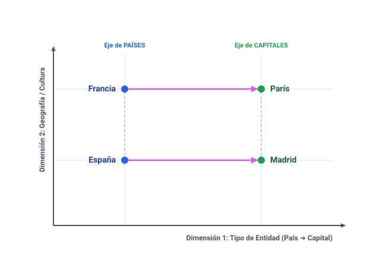
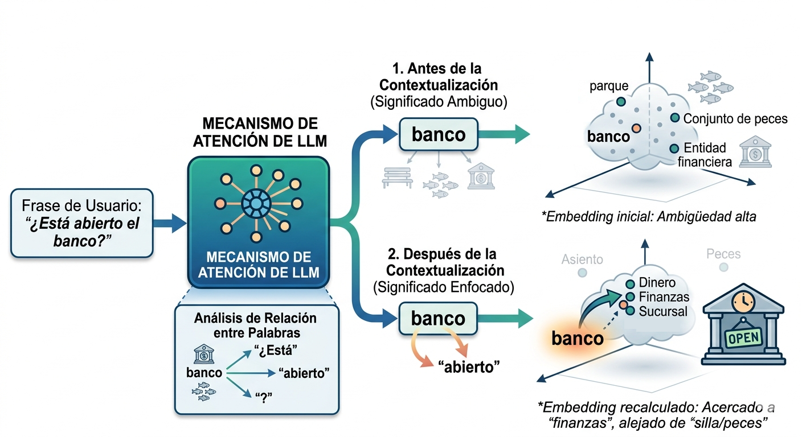
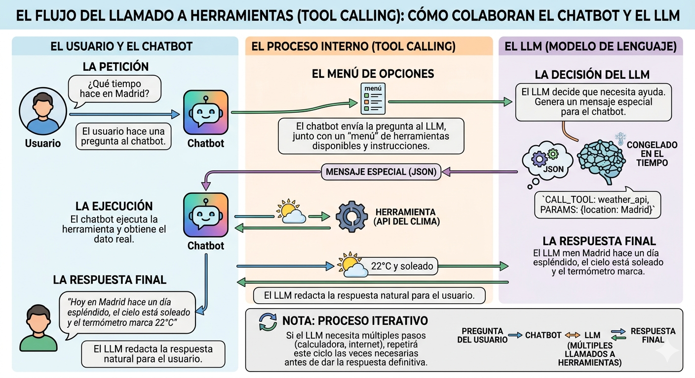

## ¿Qué es un modelo de lenguaje grande (LLM)?

En noviembre de 2022, OpenAI lanzó ChatGPT, un modelo de lenguaje grande (LLM) que se hizo viral casi de inmediato. Desde entonces, los LLM se han convertido en una de las tecnologías más disruptivas en el campo de la inteligencia artificial, con aplicaciones que van desde la generación de texto hasta la traducción automática y la creación de aplicaciones. Hoy todos estamos usando modelos de lenguaje en nuestro día a día para infinidad de tareas. El campo del desarrollo de software es uno de los más afectados por esta tecnología, y es fundamental que los programadores comprendan cómo funcionan los LLM para aprovechar al máximo su potencial.

Cuando un LLM responde a una petición de un usuario, da la impresión de que ha comprendido la tarea que se le ha encomendado y que sabe construir una respuesta adecuada. En definitiva, que el LLM conoce el significado de las palabras y las reglas que gramaticales que rigen el lenguaje en el que se está comunicando. En realidad, no es así, el LLM no ha aprendido en su entrenamiento reglas, sino asociaciones entre palabras. Sabe, por ejemplo, que la palabra "gato" a menudo se asocia con palabras como "maullar", "pelaje", "ratón", etc., pero no sabe qué es un gato ni por qué esas palabras están asociadas con él. A diferencia de los humanos, los LLM no tienen experiencia directa con el mundo físico, por lo que no pueden aprender el significado de las palabras a través de la experiencia. En cambio, los LLM aprenden a asociar palabras con otras palabras a través de un proceso de entrenamiento en el que se les muestra una gran cantidad de texto y se les pide que predigan la siguiente palabra en una secuencia. A través de este proceso, los LLM aprenden a asignar números a las palabras, y estas asociaciones numéricas les permiten generar texto coherente y relevante en respuesta a las solicitudes de los usuarios. Sin embargo, también hay parecidos entre el proceso de aprendizaje de los LLM y el de los humanos. Cuando un niño aprende a hablar no necesita saber lo que es el sujeto y el predicado ni conjugar verbos cara construir oraciones gramaticalmente correctas. En cambio, aprende a asociar palabras con otras palabras a través de la exposición al lenguaje en su entorno.

## Definiciones

### NLP

El procesamiento de lenguaje natural (NLP) es una rama de la inteligencia artificial que se enfoca en la interacción entre las computadoras y el lenguaje humano. El objetivo del NLP es permitir que las máquinas comprendan, interpreten y generen texto de manera similar a como lo hacen los humanos.

### LLM

Los modelos de lenguaje grandes (LLM) son un tipo de modelo de inteligencia artificial que ha sido entrenado con una gran cantidad de datos de texto para comprender y generar lenguaje humano de manera efectiva. Estos modelos utilizan técnicas avanzadas de aprendizaje automático, como las redes neuronales profundas, para aprender patrones y relaciones en el lenguaje. Los LLM pueden realizar tareas como traducción automática, generación de texto, respuesta a preguntas y análisis de sentimientos, entre otras aplicaciones.

### Fine-tuning

El fine-tuning es el proceso de ajustar un modelo de lenguaje grande (LLM) preentrenado para que se adapte a una tarea específica o a un dominio de aplicación determinado. Esto se logra mediante la exposición del modelo a un conjunto de datos más pequeño y específico que está relacionado con la tarea que se desea realizar. Durante el fine-tuning, el modelo ajusta sus parámetros internos para mejorar su rendimiento en la tarea específica, lo que puede resultar en una mayor precisión y relevancia en las respuestas generadas por el modelo.

Algunos ejemplos de tareas para las que se puede realizar fine-tuning incluyen la clasificación de texto, la generación de resúmenes, la traducción automática y la respuesta a preguntas específicas. El fine-tuning es una técnica importante para adaptar los LLM a aplicaciones del mundo real y mejorar su rendimiento en tareas específicas.

### Alucinación

La alucinación en el contexto de los modelos de lenguaje se refiere a la generación de información incorrecta o inventada por parte del modelo con apariencia de ser real. Esto puede ocurrir cuando el modelo produce respuestas que parecen plausibles pero que no están basadas en datos reales o hechos verificables. La alucinación es un desafío importante en el desarrollo de modelos de lenguaje, ya que puede afectar la confiabilidad y la utilidad de las respuestas generadas por el modelo.

Unos de los objetivos de este curso es entender por qué ocurre la alucinación y cómo mitigarla en los modelos de lenguaje grandes.

:::{.callout-note collapse="true"}
# Ver ejemplos de alucinaciones

* Perplexity mayo 2025:

* [ChatGPT septiembre 2025](https://chatgpt.com/share/6a0b3242-8ae0-83eb-b649-e1225bcb188a):

* [ChatGPT septiembre 2025](https://chatgpt.com/share/68c0066a-23e8-8007-ad8b-618dcd20f01c):

* [ChatGPT septiembre 2025](https://chatgpt.com/share/6a0b34ef-4a74-83eb-ba24-155ebe56a9f3):

* [Perplexity mayo 2026](https://www.perplexity.ai/search/928ceeb0-27f2-448c-95f7-4258a96ac59b):

* [Perplexity mayo 2026](https://www.perplexity.ai/search/71b2a7f4-77c3-420c-8b5d-32f27851637e):

* [Perplexity mayo 2026](https://www.perplexity.ai/search/928ceeb0-27f2-448c-95f7-4258a96ac59b):

:::

### Tokenización

La tokenización es el proceso de dividir un texto en unidades más pequeñas llamadas tokens. Estos tokens pueden ser palabras, subpalabras o caracteres, dependiendo del enfoque utilizado. La tokenización es un paso fundamental en el procesamiento de lenguaje natural, ya que permite a los modelos de lenguaje comprender y manipular el texto de manera más efectiva. Por ejemplo, en la frase "El gato está en la casa", los tokens podrían ser ["El", "gato", "está", "en", "la", "casa"].

### Embeddings

Los embeddings son representaciones numéricas de palabras, frases o documentos que capturan su significado semántico en un espacio vectorial. Estas representaciones permiten a los modelos de lenguaje comprender y procesar el texto de manera más efectiva, ya que pueden comparar y manipular estas representaciones para realizar tareas como clasificación, búsqueda y generación de texto. Los embeddings se utilizan ampliamente en el procesamiento de lenguaje natural y son fundamentales para el funcionamiento de los modelos de lenguaje grandes (LLM).

Los embeddings son la forma en que un LLM captura el significado de una palabra o frase. Por ejemplo, en un espacio de embeddings, las palabras "gato" y "perro" podrían estar cerca una de la otra, mientras que la palabra "automóvil" estaría más lejos, reflejando su relación semántica.

El modelo de lenguaje aprende a generar embeddings a partir de grandes cantidades de texto durante su entrenamiento, lo que le permite comprender el contexto y las relaciones entre las palabras. Al ser vectores, los embeddings pueden ser manipulados matemáticamente, lo que permite a los modelos de lenguaje realizar tareas complejas como la analogía (por ejemplo, "rey" - "hombre" + "mujer" ≈ "reina") y la clasificación de texto.

### Transformers

Los transformers son una arquitectura de red neuronal que ha revolucionado el campo del procesamiento de lenguaje natural. Introducidos por Vaswani et al. en 2017, los transformers utilizan un mecanismo de atención para procesar secuencias de texto de manera más eficiente que las arquitecturas anteriores, como las redes neuronales recurrentes (RNN) y las redes neuronales convolucionales (CNN).

### Mecanismo de atención

El mecanismo de atención es una técnica utilizada en los transformers que permite al modelo enfocarse en diferentes partes de la entrada de texto al generar una respuesta. En lugar de procesar el texto de manera secuencial, el mecanismo de atención permite al modelo asignar diferentes pesos a diferentes partes del texto, lo que le permite capturar relaciones a largo plazo y comprender mejor el contexto. Esto es especialmente útil para tareas como la traducción automática y la generación de texto, donde el contexto es crucial para producir respuestas coherentes y relevantes.

## El proceso de entrenamiento de un LLM

El entrenamiento dde un LLM es de tipo auto-supervisado, lo que significa que el modelo se entrena utilizando grandes cantidades de texto sin necesidad de etiquetas o anotaciones manuales. El entrenamiento consiste en predecir la siguiente palabra en una secuencia de texto, por lo que la etiqueta para cada ejemplo de entrenamiento es simplemente la siguiente palabra en el texto.

1. **Recolección de datos**: Se recopila una gran cantidad de texto de diversas fuentes, como libros, artículos, sitios web y redes sociales. Estos datos deben ser representativos del lenguaje que el modelo se espera que comprenda y genere.

2. **Preprocesamiento de datos**: El texto recopilado se limpia y se prepara para el entrenamiento. Esto puede incluir la eliminación de caracteres no deseados, la tokenización (dividir el texto en unidades más pequeñas como palabras o subpalabras) y la normalización (convertir el texto a una forma estándar).

3. **Entrenamiento del modelo**: El modelo se entrena utilizando técnicas de aprendizaje automático, como el aprendizaje supervisado o no supervisado. Durante el entrenamiento, el modelo ajusta sus parámetros internos para minimizar la diferencia entre sus predicciones y los datos de entrenamiento. Esto se hace a través de un proceso iterativo que puede llevar semanas o meses, dependiendo del tamaño del modelo y la cantidad de datos.

4. **Evaluación y ajuste**: Después del entrenamiento, el modelo se evalúa utilizando conjuntos de datos de prueba para medir su rendimiento en tareas específicas. Si el rendimiento no es satisfactorio, se pueden realizar ajustes en la arquitectura del modelo, los datos de entrenamiento o los hiperparámetros para mejorar su desempeño.

5. **Despliegue**: Una vez que el modelo ha sido entrenado y evaluado, se puede desplegar para su uso en aplicaciones del mundo real, como chatbots, sistemas de recomendación o herramientas de generación de texto.

## Preguntas frecuentes

### ¿Cómo genera su respuesta un LLM?

Cuando un LLM recibe una solicitud de un usuario (*prompt*), procesa el texto y genera una respuesta basada en los patrones estadísticos y asociaciones que ha aprendido durante su entrenamiento. Este proceso se realiza en los siguientes pasos:

1. **Tokenización**
El LLM divide el texto del usuario en unidades más pequeñas llamadas *tokens*. Estos fragmentos pueden ser palabras enteras, sílabas o caracteres. 

*(Puedes ver un ejemplo de cómo se fragmenta la frase "El gato está en la casa" usando herramientas como el [Tokenizer de OpenAI](https://platform.openai.com/tokenizer)).*

2. **Conversión a Embeddings (Vectores numéricos)**
Como los modelos no entienden de letras, convierten cada token en una lista de números llamada *embedding*. Estos números sitúan a la palabra en un espacio vectorial según su significado semántico.

3. **Mecanismo de Atención (Contextualización)**
El LLM analiza la relación entre todas las palabras de la frase para entender el contexto exacto. 

> **Ejemplo:** Si el usuario pregunta *"¿Está abierto el banco?"*, la palabra "banco" es ambigua (puede ser una entidad financiera, un asiento de parque o un conjunto de peces). El mecanismo de atención examina las palabras cercanas como *"abierto"*. Gracias a esto, el modelo recalcula el *embedding* de "banco", acercándolo matemáticamente al concepto de "dinero/finanzas" y alejándolo de "silla" o "peces".

4. **Predicción del siguiente token**
A diferencia de lo que se suele pensar, el modelo no genera la respuesta entera de golpe, sino **palabra por palabra**. El LLM procesa los embeddings contextualizados a través de sus capas neuronales y calcula una distribución de probabilidad para todo su vocabulario. El sistema elige el siguiente token basándose en esa probabilidad (aquí influye un parámetro modificable por el usuario: *temperatura*. A mayor temperatura, más riesgo y creatividad; a menor temperatura, más predecible).

5. **Generación autorregresiva**
El LLM repite el proceso continuamente. Para elegir la tercera palabra, toma como entrada el *prompt* original **más** la primera y segunda palabra que él mismo acaba de generar. Por eso se dice que es un proceso **autorregresivo**: el contenido que genera se convierte en su propio combustible para seguir escribiendo.

6. **Finalización de la respuesta**
Este bucle se repite hasta que ocurre una de dos condiciones: el modelo genera un token especial invisible llamado **EOS** (*End of Sequence* / Fin de secuencia) que indica que la respuesta ha concluido, o bien se alcanza el límite máximo de tokens configurado por el sistema.

### ¿Tiene memoria un LLM?

Cuando conversamos con un `chatbot`, da la sensación de que el modelo recuerda lo que se ha dicho anteriormente en la conversación. Sin embargo, esto no es exactamente cierto. Un LLM no tiene memoria en el sentido tradicional, ya que no puede almacenar información a largo plazo ni recordar conversaciones pasadas. En cambio, un LLM procesa cada entrada de manera independiente y genera respuestas basadas únicamente en la información proporcionada en esa entrada. Esa apariencia de memoria se debe a que el LLM utiliza el **contexto** de la conversación actual para generar respuestas coherentes y relevantes. Es decir, que escribimos en el `prompt`, el `chatbot` envía al LLM el `prompt` junto con los mensajes anteriores de la conversación, y el LLM utiliza esa información para generar una respuesta que tenga sentido en el contexto de la conversación. Sin embargo, una vez que la conversación termina, el LLM no retiene ninguna información sobre lo que se ha dicho, y cada nueva conversación comienza con una "pizarra en blanco".

La memoria de un LLM es la almacenada en los pesos de la red neuronal con la que fue entrenado. Estos pesos se ajustan durante el proceso de entrenamiento para capturar patrones y relaciones en el lenguaje. Así que la memoria de un LLM es estática y actualmente no puede ser actualizada con nueva información después de su entrenamiento, a menos que se realice un proceso de fine-tuning o que se incorpore en el contexto.

### ¿Puede aprender un LLM después de su entrenamiento?

Un LLM no puede aprender de manera tradicional después de su entrenamiento, ya que no tiene la capacidad de almacenar nueva información ni actualizar sus pesos de manera autónoma. Sin embargo, existen técnicas como el fine-tuning que permiten ajustar un LLM preentrenado para adaptarlo a tareas específicas o para incorporar nueva información. Sin embargo, si puede incorporar nueva información a través del contexto, lo que les permite generar respuestas basadas en información actualizada sin necesidad de un nuevo entrenamiento completo.

### ¿Puede un LLM consultar información en internet o usar herramientas como una calculadora?

Si le preguntas la hora a un *chatbot* o le pides que haga un cálculo matemático complejo, normalmente te dará una respuesta correcta. Esto suele dar la falsa impresión de que el LLM tiene acceso directo a información en tiempo real o a herramientas externas. Sin embargo, no es así. 

Es habitual confundir el **LLM** con el **chatbot** que lo utiliza:
* **El LLM (Modelo de Lenguaje):** Es el motor inteligente, pero está "congelado" en el tiempo con los datos con los que fue entrenado. No puede navegar por internet ni calcular por sí mismo.
* **El chatbot:** Es la aplicación que envuelve al LLM. El *chatbot* sí puede integrar bases de datos, calculadoras o conexiones a internet para vitaminar las capacidades del modelo.

El proceso mediante el cual colaboran (conocido técnicamente como *Tool Calling*) funciona así:

1. **La petición:** El usuario hace una pregunta al *chatbot* (ej. *"¿Qué tiempo hace en Madrid?"*).
2. **El menú de opciones:** El *chatbot* envía la pregunta al LLM junto con un "menú" de las herramientas que tiene disponibles y las instrucciones de cómo usarlas. El LLM no puede tocarlas, solo sabe que existen.
3. **La decisión del LLM:** El LLM analiza la pregunta. Al darse cuenta de que no sabe el clima actual, decide que necesita ayuda. En lugar de responderle al usuario, genera un mensaje en un formato especial (como JSON) dirigido al *chatbot*. Por ejemplo: `CALL_TOOL: weather_api, PARAMS: {location: Madrid}`.
4. **La ejecución:** El *chatbot* lee ese código, ejecuta la herramienta (hace la consulta a la API del clima) y obtiene el dato real (ej. *"22°C y soleado"*).
5. **La respuesta final:** El *chatbot* le devuelve ese dato al LLM. Ahora que el LLM ya tiene la información que le faltaba, redacta una respuesta natural y amigable para el usuario: *"Hoy en Madrid hace un día espléndido, el cielo está soleado y el termómetro marca 22°C"*.

> **Nota:** Este proceso puede ser iterativo. Si para resolver un problema el LLM necesita primero usar una calculadora y luego buscar un dato en internet, repetirá este ciclo con el *chatbot* las veces que sea necesario antes de dar la respuesta definitiva.

## Desafíos en el desarrollo de LLM

El desarrollo de modelos de lenguaje grandes (LLM) presenta varios desafíos, entre los cuales se incluyen:

1. **Requerimientos computacionales**: El entrenamiento de LLM requiere una gran cantidad de recursos computacionales, incluyendo potentes GPUs y grandes cantidades de memoria. Esto puede ser costoso y limitar el acceso a la tecnología para algunos investigadores y desarrolladores.

2. **Calidad de los datos**: La calidad y la diversidad de los datos de entrenamiento son cruciales para el rendimiento del modelo. Si los datos contienen sesgos o información incorrecta, el modelo puede aprender y perpetuar esos problemas.

3. **Alucinación**: Como se mencionó anteriormente, la alucinación es un desafío importante en el desarrollo de LLM, ya que puede afectar la confiabilidad de las respuestas generadas por el modelo.

4. **Ética y privacidad**: El uso de LLM plantea preocupaciones éticas y de privacidad, especialmente en lo que respecta a la generación de contenido inapropiado o la recopilación de datos personales sin consentimiento.

5. **Interpretabilidad**: Los LLM son a menudo considerados como "cajas negras" debido a su complejidad, lo que dificulta la comprensión de cómo toman decisiones y generan respuestas. Esto puede ser un obstáculo para la confianza y la adopción de la tecnología.

## Aplicaciones de LLM

Los modelos de lenguaje grandes (LLM) tienen una amplia gama de aplicaciones en diversos campos, incluyendo:

1. **Chatbots y asistentes virtuales**: Los LLM se utilizan para crear chatbots y asistentes virtuales que pueden interactuar con los usuarios de manera natural y proporcionar respuestas útiles a sus preguntas.

2. **Generación de contenido**: Los LLM pueden generar texto de alta calidad para una variedad de propósitos, como redacción de artículos, creación de resúmenes y generación de código.

3. **Traducción automática**: Los LLM se utilizan para mejorar la traducción automática, permitiendo que los sistemas de traducción comprendan mejor el contexto y produzcan traducciones más precisas.

4. **Análisis de sentimientos**: Los LLM pueden analizar el sentimiento detrás de un texto, lo que es útil para aplicaciones como el monitoreo de redes sociales y la atención al cliente.

5. **Búsqueda y recuperación de información**: Los LLM pueden mejorar los sistemas de búsqueda al comprender mejor las consultas de los usuarios y proporcionar resultados más relevantes.

6. **Educación y tutoría**: Los LLM pueden ser utilizados para crear sistemas de tutoría personalizados que ayuden a los estudiantes a aprender de manera más efectiva.

