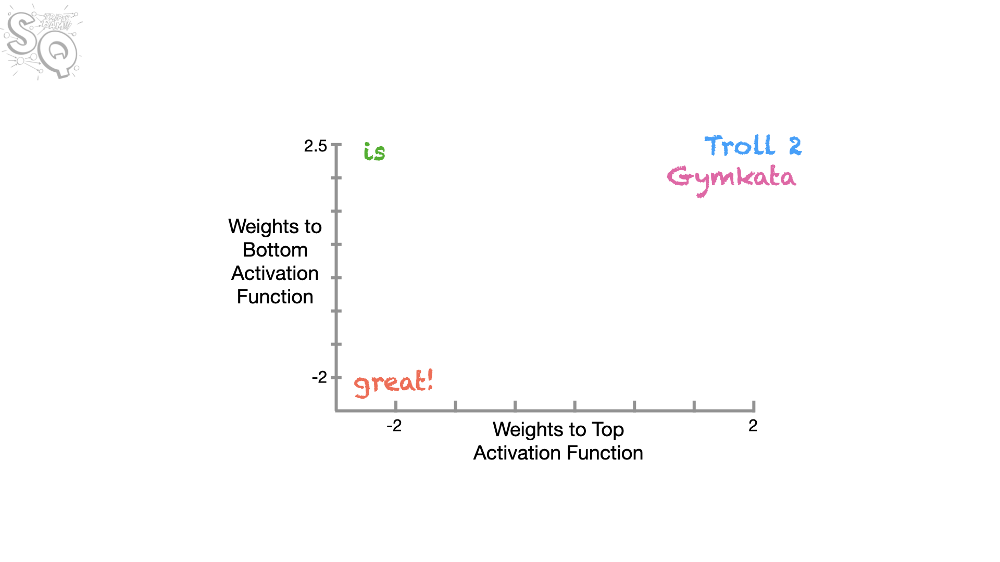
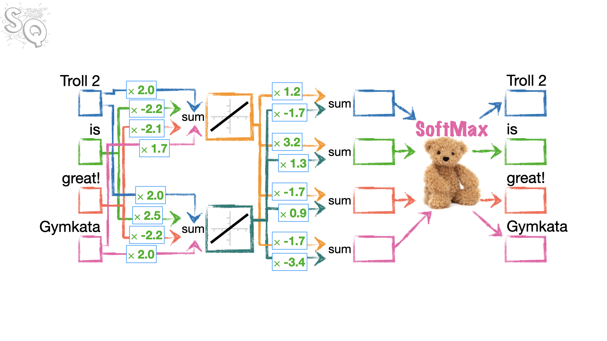

## Introducción

Las redes neuronales funcionan con números, no con palabras.

* **Por lo tanto,** si queremos introducir palabras en una red neuronal, necesitamos una forma de convertirlas en números.
* **En teoría,** podríamos simplemente asignar números aleatorios a las palabras...

::: {.card .border .border-primary .p-3}
### Números aleatorios

* Troll 2 -> 12
* is -> -3.05
* great -> 4.2
* awesome -> -32.1
:::

* ...pero entonces, aunque **great** y **awesome** significan cosas similares, tienen números muy diferentes asociados a ellos: **4.2** y **-32.1**...
* ...y eso significa que la red neuronal probablemente necesitará mucha más complejidad y entrenamiento, porque aprender a usar correctamente la palabra **great** no ayudará a la red neuronal a usar correctamente la palabra **awesome**.

Por lo tanto, sería ideal si a palabras similares que se usan de maneras similares se les pudieran asignar números similares, de modo que aprender a usar una palabra ayude a la red neuronal a aprender a usar la otra al mismo tiempo.

Y debido a que las mismas palabras se pueden usar en diferentes contextos, o ponerse en plural, o usarse de alguna otra manera, podría ser una buena idea asignar a cada palabra más de un número, para que la red neuronal pueda adaptarse más fácilmente a los diferentes contextos.

Estos números que asignamos a las palabras se llaman **Word Embeddings**, y las redes neuronales que los crean son bastante simples.Estas redes simples también pueden crear múltiples Word Embeddings por palabra para manejar los diferentes contextos en los que se puede usar una palabra.

* Por ejemplo, las palabras **great** y **awesome** tienen significados similares y a menudo se usan en contextos similares. Se pueden usar de una manera positiva...
  * *¡StatQuest es **great**!*
  * *¡Este libro es **awesome**!*
* ...y también se pueden usar de una manera sarcástica y negativa...
  * *Mi celular está roto, ¡**great**!
  * *El sentido del humor de mi papá es **awesome**.*
* ...y una red simple de Word Embedding puede crear dos números de Word Embedding para cada palabra. El primer número, **Embedding #1**, podría capturar la forma en que estas palabras se usan en contextos positivos.
* Y el segundo número, **Embedding #2**, podría capturar la forma en que estas palabras se usan en contextos negativos.
 
| Palabra | Embedding #1 (Positivo) | Embedding #2 (Negativo) |
| :--- | :---: | :---: |
| great | 1.85 | 0.98 |
| awesome | 1.81 | 0.99 |

Ahora profundicemos en los detalles de cómo se crean los Word Embeddings.

## Práctica de entrenamiento de Word Embeddings

Supongamos que tenemos únicamente dos frases con cuatro palabras en total para el entrenamiento de nuestros Word Embeddings:

1. *¡Troll 2 is great!*
2. *¡Gymkata is great!*

Para cada palabra, queremos crear dos Word Embeddings: **Embedding #1** y **Embedding #2** de dos números cada uno. Lo interesante es que nuestro modelo tiene que ser capaz de aprender que las palabras `Troll 2` y `Gymkata` son similares, ya que aparecen en contexto similares y, por lo tanto, deberían tener embeddings similares.

Los embeddings se podrían representar gráficamente así:



### Creación de los datasets de entrenamiento

Realizamos las importaciones de los módulos necesarios.

```{python}
import torch # torch will allow us to create tensors.
import torch.nn as nn # torch.nn allows us to create a neural network and allows
                      # us to access a lot of useful functions like:
                      # nn.Linear, nn.Embedding, nn.CrossEntropyLoss() etc.

from torch.optim import Adam # optim contains many optimizers. This time we're using Adam
from torch.distributions.uniform import Uniform # So we can initialize our tensors with a uniform distribution
from torch.utils.data import TensorDataset, DataLoader # these are needed for the training data

import lightning as L # lightning has tons of cool tools that make neural networks easier

import pandas as pd ## to create dataframes from graph input
```

Ahora vamos a crear nuestros datos de entrenamiento a partir de dos frases, **Troll 2 is great** y **Gymkata is great**, lo que nos da un vocabulario simple de 4 palabras, o tokens: **Troll 2**, **is**, **great**, **Gymkata**. Nuestros datos de entrenamiento constan de dos partes: `inputs` (entradas), que son las entradas para la red neuronal, y `labels` (etiquetas), que son las salidas esperadas de las redes neuronales.

La idea es hacer que cada token de una frase prediga el token que le sigue. Por ejemplo, utilizando la **codificación de un solo uno (one-hot-encoding)** para representar cada token, dado que **Troll 2** es el primer token de nuestro vocabulario, codificaremos la entrada (`input`) para **Troll 2** como `[1., 0., 0., 0.]`. Y dado que **Troll 2** predice el segundo token, **is** (que es el segundo token de nuestro vocabulario), codificaremos la etiqueta (`label`) para **Troll 2** como `[0., 1., 0., 0.]`. De la misma manera, podemos codificar las entradas (`inputs`) y etiquetas (`labels`) para **is**, **great** y **Gymkata**. **NOTA: Gymkata** predice el segundo token, **is**, por lo que su etiqueta es `[0., 1., 0., 0.]`.

```{python}
## create the training data for the neural network.
inputs = torch.tensor([[1., 0., 0., 0.], # one-hot-encoding for Troll 2...
                       [0., 1., 0., 0.], # ...is
                       [0., 0., 1., 0.], # ...great
                       [0., 0., 0., 1.]]) # ...Gymkata

labels = torch.tensor([[0., 1., 0., 0.], # "Troll 2" is followed by "is"
                       [0., 0., 1., 0.], # "is" is followed by "great"
                       [0., 0., 0., 1.], # "great" isn't followed by anything, but we'll pretend it was followed by "Gymkata"
                       [0., 1., 0., 0.]]) # "Gymkata", just like "Troll 2", is followed by "is".
```

Ahora que hemos creado los datos con los que queremos entrenar las incrustaciones (embeddings), los almacenaremos en un `DataLoader`. Dado que nuestro conjunto de datos es tan pequeño, usar un `DataLoader` es un poco exagerado, pero es fácil de hacer y nos permitirá escalar fácilmente a un vocabulario mucho más grande cuando llegue el momento.

```{python}
dataset = TensorDataset(inputs, labels)
dataloader = DataLoader(dataset)
```

### Creación de la red neuronal de Word Embeddings

Ahora que ya tenemos listos los datos y el `DataLoader`, vamos a crear la clase que se encargará de generar word embeddings para cada token (palabra) del vocabulario.

La red neuronal que queremos entrenar, tiene esta estructura:



Cada palabra está representada por 4 números. Esa palabra se envía a dos neuronas (porque queremos embeddins de tamaño 2). Cada una tendrá 4 parámetros que se multiplicarán por los 4 números de la palabra. La función de activación es lineal, lo que significa que el valor de salida de cada neurona es simplemente la suma de los productos de los números de entrada y sus pesos correspondientes.  Cada neurona emite 4 valores de salida, uno correspondiente a cada palabra ya que todas las palabras se introducen a la vez en el modelo. Estos 4 valores de salida se pasan a la capa de salida formada por 4 neuronas que reciben los 2 valores de cada neurona de la capa anterior. Estas dos entradas se multiplican por sus pesos correspondientes y se suman para producir un valor de salida para cada neurona de la capa de salida. Finalmente, los 4 valores de salida se concatenan en un solo tensor que se pasa a la función `sofmax` para calcular las probabilidades de la siguiente palabra.

Observe que al multiplicar los 4 números de cada palabra por los pesos correspondientes de la primera capa, resultan 3 multiplicaciones a 0 y una multiplicación distinta de 0, ya que la palabra se codifica con un vector de une-hot.

Los embeddings de cada palabra se pueden obtener a partir de los pesos que van desde la capa de entrada a la capa oculta. Por ejemplo, el embedding de **Troll 2** se puede obtener a partir de los pesos `input1_w1` y `input1_w2`, que son los pesos que conectan la primera neurona de la capa oculta con las entradas correspondientes a **Troll 2**.

¿Por qué esperamos que los embeddings de **Troll 2** y **Gymkata** sean similares? Porque ambas palabras aparecen en contextos similares (ambas son seguidas por la palabra **is**), por lo que el modelo debería aprender a asignarles pesos similares para que puedan predecir la palabra **is** de manera similar.


```{python}
class WordEmbeddingFromScratch(L.LightningModule):

    def __init__(self):
        ## __init__() initializes the weights and sets everything up for training

        super().__init__()

        ## The first thing we do is set the seed for the random number generorator.
        ## This ensures that when someone creates a model from this class, that model
        ## will start off with the exact same random numbers as I started out with when
        ## I created this demo. At least, I hope that is what happens!!! :)
        L.seed_everything(seed=42)

        ###################
        ##
        ## Initialize the weights.
        ##
        ## NOTE: We're initializing the weights using values from a uniform distribtion
        ##       that goes from -0.5 to 0.5 (this is notated as U(-0.5, 0.5).
        ##       This is because of how nn.Linear() initializes weights -
        ##       nn.Linear() uses U(-sqrt(k), sqrt(k)), where k=1/in_features.
        ##       In our case, we have 4 inputs, so k=1/4 = 0.25. And the sqrt(0.25) = 0.5.
        ##       Thus, nn.Linear() would use U(-0.5, 0.5) to initialize the weights, so
        ##       that's what we'll do here as well.
        ##
        ###################
        min_value = -0.5
        max_value = 0.5

        ## Now we initialize the weights that feed 4 inputs (one for each unique word)
        ##       into the 2 nodes in the hidden layer (top and bottom nodes)
        ##
        ## NOTE: Because we want words (or tokens) that are used in the same context to have similar
        ##       weights, we are excluding bias terms from the connections from the inputs to the
        ##       nodes in the hidden layer (alternatively, you could think that
        ##       we set the bias terms to 0 and are not going to optimize them).
        ##
        ## ALSO NOTE: We're using nn.Parameter() here instead of torch.tensor() because we want
        ##       to easily print out the parameters before and after training. Parameters are just
        ##       tensors that are added to model's parameter list.
        self.input1_w1 = nn.Parameter(Uniform(min_value, max_value).sample())
        self.input1_w2 = nn.Parameter(Uniform(min_value, max_value).sample())

        self.input2_w1 = nn.Parameter(Uniform(min_value, max_value).sample())
        self.input2_w2 = nn.Parameter(Uniform(min_value, max_value).sample())

        self.input3_w1 = nn.Parameter(Uniform(min_value, max_value).sample())
        self.input3_w2 = nn.Parameter(Uniform(min_value, max_value).sample())

        self.input4_w1 = nn.Parameter(Uniform(min_value, max_value).sample())
        self.input4_w2 = nn.Parameter(Uniform(min_value, max_value).sample())

        ## Now we initialize the weights that come out of the hidden layer to the "output"
        ## NOTE: Again, we are excluding bias terms. This time, we exclude them simply because
        ##       we do not need them.
        self.output1_w1 = nn.Parameter(Uniform(min_value, max_value).sample())
        self.output1_w2 = nn.Parameter(Uniform(min_value, max_value).sample())

        self.output2_w1 = nn.Parameter(Uniform(min_value, max_value).sample())
        self.output2_w2 = nn.Parameter(Uniform(min_value, max_value).sample())

        self.output3_w1 = nn.Parameter(Uniform(min_value, max_value).sample())
        self.output3_w2 = nn.Parameter(Uniform(min_value, max_value).sample())

        self.output4_w1 = nn.Parameter(Uniform(min_value, max_value).sample())
        self.output4_w2 = nn.Parameter(Uniform(min_value, max_value).sample())

        ## For the loss function, we'll use CrossEntropyLoss, which we'll use in training_step()
        ## NOTE: The nn.CrossEntropyLoss automatically applies softmax for us, so we don't need to import it.
        self.loss = nn.CrossEntropyLoss()


    def forward(self, input):
        ## forward() is where we do the math associated with running the inputs through the
        ## network

        ## The input is delivered inside of a list, like this...
        ##   [[1., 0., 0., 0.]]
        ## ...and it's just easier if we remove the extra pair of brackets so we only have...
        ##   [1., 0., 0., 0.]
        ## ...so let's do it.
        input = input[0]

        ## First, for the top node in the hidden layer,
        ## we multiply each input by its weight,
        ## and then calculate the sum of those products...
        inputs_to_top_hidden = ((input[0] * self.input1_w1) +
                                (input[1] * self.input2_w1) +
                                (input[2] * self.input3_w1) +
                                (input[3] * self.input4_w1))

        ## ...then, for the bottom node in the hidden layer,
        ## we multiply each input by its weight,
        ## and then calculate the sum of those products.
        inputs_to_bottom_hidden = ((input[0] * self.input1_w2) +
                                   (input[1] * self.input2_w2) +
                                   (input[2] * self.input3_w2) +
                                   (input[3] * self.input4_w2))

        ## Now, in theory, we could run inputs_to_top_hidden and inputs_to_bottom_hidden through
        ## linear activation functions, but the outputs would be the exact same as in the inputs,
        ## so we can just skip that step and instead compute the 4 output values from the 2 nodes in hidden layer
        ## by summing the products of the hidden layer values and a pair of weights for each output.
        output1 = ((inputs_to_top_hidden * self.output1_w1) +
                   (inputs_to_bottom_hidden * self.output1_w2))
        output2 = ((inputs_to_top_hidden * self.output2_w1) +
                   (inputs_to_bottom_hidden * self.output2_w2))
        output3 = ((inputs_to_top_hidden * self.output3_w1) +
                   (inputs_to_bottom_hidden * self.output3_w2))
        output4 = ((inputs_to_top_hidden * self.output4_w1) +
                   (inputs_to_bottom_hidden * self.output4_w2))

        ## Now we need to concatenate the 4 output tensors so that we can run them through
        ## the SoftMax function. However, because they are tensors (and have gradients attached to them),
        ## we can't just combine them in a simple list like this...
        # output_values = [output1, output2, output3, output4] ## THIS WILL NOT WORK
        ## ...because that would strip off the gradients.
        ## Instead, we use torch.stack(), which retains the gradients.
        output_presoftmax = torch.stack([output1, output2, output3, output4])
        ## NOTE: The the loss function we are using, nn.CrossEntropyLoss, automatically applies softmax for us, so we
        ##       need to do that ourselves. If we want to actually use this network to predict the next word
        ##       (instead of just using it for the Word Embedding values), then we'll need to apply the softmax() function
        ##       ourselves (or just look to see what output value is largest).

        return(output_presoftmax)


    def configure_optimizers(self):
        # configure_optimizers() configures the optimizer we want to use for backpropagation.

        return Adam(self.parameters(), lr=0.1) # lr=0.1 sets the learning rate to 0.1


    def training_step(self, batch):
        # training_step() takes a step of gradient descent.

        input_i, label_i = batch # collect input
        output_i = self.forward(input_i) # run input through the neural network
        loss = self.loss(output_i, label_i[0]) ## loss = cross entropy

        return loss
```


Ahora que hemos creado nuestra nueva clase, `WordEmbeddingFromScratch`, vamos a crear un modelo e imprimir los parámetros iniciales.


```{python}
modelFromScratch = WordEmbeddingFromScratch() # create the model...

print("Before optimization, the parameters are...")
for name, param in modelFromScratch.named_parameters():
    print(name, torch.round(param.data, decimals=2))
```

Observa cómo los pesos para **input1** (`w1 = 0.3832` y `w2 = 0.4150`) e **input4** (`w1 = -0.2434` y `w2 = 0.2936`) son muy diferentes, a pesar de que ambos representan títulos de películas (**Troll2** y **Gymkata**) que se utilizan en el mismo contexto. Podemos verlo más gráficamente en una tabla.

```{python}
data = {
    "w1": [modelFromScratch.input1_w1.item(), ## item() pulls out the tensor value as a float
           modelFromScratch.input2_w1.item(),
           modelFromScratch.input3_w1.item(),
           modelFromScratch.input4_w1.item()],
    "w2": [modelFromScratch.input1_w2.item(),
           modelFromScratch.input2_w2.item(),
           modelFromScratch.input3_w2.item(),
           modelFromScratch.input4_w2.item()],
    "token": ["Troll2", "is", "great", "Gymkata"],
    "input": ["input1", "input2", "input3", "input4"]
}
df = pd.DataFrame(data)
df
```

Gráficamente:

```{python}
from plotnine import *

(
    ggplot(df, aes(x="w1", y="w2", color="token"))
    + geom_point(size=5)
    + geom_text(
        aes(label="token"),
        ha="left",  # Alineación horizontal izquierda
        size=10,  # 'medium' suele equivaler a un tamaño base (ajustable)
        color="black",
        fontweight="semibold",
        nudge_y=0.02,
        nudge_x=-0.04
    )
    + theme_bw()
    + theme(legend_position="none")
)
``` 

En el gráfico podemos ver que los pesos para **Troll2** y **Gymkata**  no son más similares entre sí que los de las demás entradas. Sin embargo, al entrenar esta red neuronal, esperamos que esos pesos se vuelvan similares. Así que vamos a crear un `Trainer` y entrenar la red de incrustación (embedding network).

```{python}
trainer = L.Trainer(max_epochs=100)
trainer.fit(modelFromScratch, train_dataloaders=dataloader)
```

Ahora, con la red neuronal ya entrenada, vamos a imprimir los valores de cada peso...


```{python}
print("After optimization, the parameters are...")
for name, param in modelFromScratch.named_parameters():
    print(name, torch.round(param.data, decimals=2))
```

...y después de **100** épocas, los pesos para **input1** (`w1 = 2.0244` y `w2 = 1.9754`) son ahora relativamente similares a los pesos para **input4** (`w1 = 1.7264` y `w2 = 1.9912`).

Primero, vamos a crear el `DataFrame()` de pandas...

```{python}
data = {
    "w1": [modelFromScratch.input1_w1.item(), ## item() pulls out the tensor value as a float
           modelFromScratch.input2_w1.item(),
           modelFromScratch.input3_w1.item(),
           modelFromScratch.input4_w1.item()],
    "w2": [modelFromScratch.input1_w2.item(),
           modelFromScratch.input2_w2.item(),
           modelFromScratch.input3_w2.item(),
           modelFromScratch.input4_w2.item()],
    "token": ["Troll2", "is", "great", "Gymkata"],
    "input": ["input1", "input2", "input3", "input4"]
}
df = pd.DataFrame(data)
df
```

Gráficamente:

```{python}
from plotnine import *

(
    ggplot(df, aes(x="w1", y="w2", color="token"))
    + geom_point(size=5)
    + geom_text(
        aes(label="token"),
        ha="left",  # Alineación horizontal izquierda
        size=10,  # 'medium' suele equivaler a un tamaño base (ajustable)
        color="black",
        fontweight="semibold",
        adjust_text={
            'expand_points': (2,2),
            'arrowprops': {'arrowstyle': '-', 'color': 'gray', 'lw': 0.5}
        }
    )
    + theme_bw()
    + theme(legend_position="none")
)
``` 

Por último, podemos verificar que cada token del vocabulario predice correctamente el token que le sigue ejecutando los valores de entrada de la **codificación de un solo uno (one-hot-encoded)** para cada token a través de la red neuronal.

```{python}
## Let's see what the model predicts

## First, let's create a softmax object...
softmax = nn.Softmax(dim=0) ## dim=0 applies softmax to rows, dim=1 applies softmax to columns

# Note that the forward() method is flattening the input, i.e., input = input[0].
# Because we are stacking 4 scalar values, the shape of the output vector 
# is a 1D tensor with shape (4), i.e., [val1, val2, val3, val4]:
# output_presoftmax = torch.stack([output1, output2, output3, output4])
# Therefore dim=0 applies softmax to the only dimension (the list of values)

## Now let's...

## print the predictions for "Troll2"
print(torch.round(softmax(modelFromScratch(torch.tensor([[1., 0., 0., 0.]]))),
                  decimals=2))

## print the predictions for "is"
print(torch.round(softmax(modelFromScratch(torch.tensor([[0., 1., 0., 0.]]))),
                  decimals=2))

## print the predictions for "great"
print(torch.round(softmax(modelFromScratch(torch.tensor([[0., 0., 1., 0.]]))),
                  decimals=2))

## print the predictions for "Gymkata"
print(torch.round(softmax(modelFromScratch(torch.tensor([[0., 0., 0., 1.]]))),
                  decimals=2))
```

Y vemos que todos los tokens predicen correctamente (otorgan la mayor probabilidad a) el token que les sigue. En este caso, tanto **Troll2** como **Gymkata** predicen correctamente el segundo token, **is**, con una probabilidad de **1.0**.


