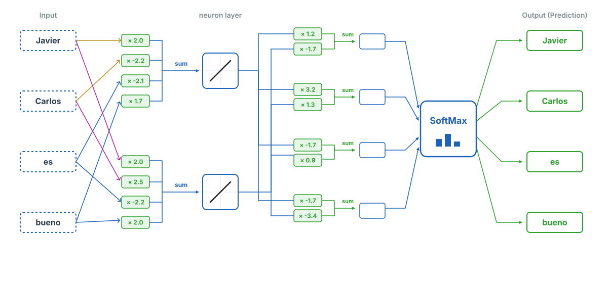

## Introducción

En la lección anterior se explicó que los modelos de lenguaje representan las palabras con números, y que esos vectores numéricos son los llamados embeddings. Estos vectores se aprenden durante el entrenamiento, y se espera que las palabras que se usan de manera similar tengan embeddings similares. Es la forma que tiene el modelo de lenguaje de almacenar el "significado" de las palabras. 

Los embeddings de palabras se fundamentan en la hipótesis distribucional, que habitualmente se resume con una famosa frase del lingüista John Rupert Firth (1957):

> "Conocerás a una palabra por las compañías que mantiene".

El concepto se ilustra mejor con un ejemplo. Supongamos que un amigo chileno le dice:

> "A mis hijos les encantan las cabritas dulces; el olor a caramelo cuando las haces en la sartén inunda toda la casa".

Si no es usted chileno, es posible que no sepa qué son las "cabritas". Pero por el contexto ya sabe muchas cosas: es algo dulce, que les gusta a los niños y que se hace en una sartén. Supongamos que la conversación continúa y su amigo dice:

> "Compramos un cubo gigante de cabritas saladas en el mostrador del cine antes de que empezara la película".

¡Vaya! También se pueden comprar cabritas saladas, y se venden en el cine dentro de un cubo. Seguramente ahora tiene claro que las "cabritas" son lo que en otros países llamamos palomitas de maíz. ¿Cómo lo supo si su amigo nunca lo aclaró? Porque las palabras "cabritas" y "palomitas" se usan exactamente en los mismos contextos.

Un modelo de lenguaje aprende a asignar números a las palabras de tal manera que las palabras que se usan en contextos similares tengan números similares. En esta lección explicaremos cómo se crean estos números.

## Un ejemplo sencillo

### Datos de entrenamiento

Los modelos de lenguaje se entrenan con grandes cantidades de texto. Puede ser tan grande como toda la Wikipedia, o incluso mayores. Pero para entender cómo se crean los embeddings de palabras, vamos a imaginar que solo tenemos dos frases para entrenar nuestro modelo de lenguaje:

1. Javier es bueno.
2. Carlos es bueno.

Aunque este ejemplo no tenga interés práctico, es útil para entender cómo se crean los embeddings de palabras.

En este caso, nuestro vocabulario solo tiene cuatro palabras: **Javier**, **Carlos**, **es** y **bueno**. Para cada una de estas palabras, el modelo de lenguaje un vector de números que representa su significado. ¿Cuántos números debería asignar el modelo a cada palabra? Bueno, eso depende de la complejidad del modelo. Cuántos más números asigne a cada palabra, más compleja será la red neuronal que se necesitará para aprender a asignar esos números correctamente, pero, también permitirá que el modelo capture más matices del significado de cada palabra.

Para entender por qué los embeddings necesitan ser listas de números (vectores) y no un único dígito, supón que tenemos estas palabras en nuestro vocabulario: **España**, **Francia**, **perro** y **gato**. Si solo pudiéramos asignar un número a cada palabra, podríamos intentar organizarlas de la siguiente manera:

Podríamos asignar el número 1 a "España", el 1.2 a "Francia", el 9 a "perro" y el 9.2 a "gato". A simple vista funciona: los países están a un lado y los animales al otro. El problema llega cuando queremos añadir matices:

* ¿Dónde colocamos "Madrid"? Debería estar cerca de España por ser su capital, pero si la ponemos en el 1.1, ¿cómo indicamos que es una ciudad y no un país como Francia? La ponemos en 0.9, pero surgen nuevos problemas: ¿Dónde colocamos "Barcelona"? Es una ciudad, así que va por la zona del 0.9, pero al ser una ciudad española debería estar pegada a "Madrid", aunque "Madrid" a su vez necesita estar pegada a "España" por ser la capital de ese país.

* ¿Dónde colocamos "tigre"? Es un animal, así que va por la zona del 9. Pero al ser un felino debería estar pegado a "gato" (9.2), aunque "gato" a su vez necesita estar pegado a "perro" (9) por ser las dos mascotas.

Supongo que se entiende la idea. Lo anterior es un ejemplo obvio de las complicaciones: España tiene que estar cerca de Francia por estar próximas, pero cerca de Argentina por idioma, y así podríamos seguir razonando sobre todas los distintos ámbitos en los que se puede usar una misma palabra. Y aquí ni siquiera hemos abordado el tema de que una misma palabra puede tener diferentes significados dependiendo del contexto.

Para resolver este rompecabezas los modelos de lenguaje reales utilizan embeddings de tamaños colosales, como 768, 1024 o incluso más dimensiones por palabra.

Pero volvamos al ejemplo de las dos frases. Con sólo 4 palabras, no  tenemos las complicaciones anteriores y podemos limitarnos a usar un único número. Por ejemplo::

::: {.card .border .border-primary .p-3}

* Javier -> 12
* Carlos -> 13
* es -> 6
* bueno -> 2 
:::

Hemos asignado números similares a "Javier" y "Carlos" porque se usan en contextos similares (siempre va la palabra "es" detrás). Con estos datos de entrenamiento, el modelo no puede aprender más. Sin embargo, para hacerlo más interesante, nuestro modelo creará embeddings de tamaño 2, es decir, asignará dos números a cada palabra.

### Definición de la red neuronal

Vamos a crear una red neuronal que dada una palabra, prediga la siguiente. Por ejemplo, si le damos "Javier", debería predecir "es". Si le damos "es", debería predecir "bueno". Y así sucesivamente. En definitiva, se trata de un problema de clasificación múltiple

::: {.callout-warning appearance="minimal"}
Un momento, ¿el objetivo del entrenamiento no era crear embeddings de palabras? Sí, pero vamos a diseñar la red neuronal de tal manera que los embeddings de palabras se aprendan como parte del proceso de entrenamiento, que consiste en predecir palabras. De hecho, los embeddings de palabras serán simplemente los pesos que conectan la capa de entrada con la capa oculta de la red neuronal. Parece complicado, pero para eso está este sencillo ejemplo.
:::

### Creación de los datasets de entrenamiento

Realizamos las importaciones de los módulos necesarios.

```{python}
import torch # torch will allow us to create tensors.
import torch.nn as nn # torch.nn allows us to create a neural network and allows
                      # us to access a lot of useful functions like:
                      # nn.Linear, nn.Embedding, nn.CrossEntropyLoss() etc.

from torch.optim import Adam # optim contains many optimizers. This time we're using Adam
from torch.distributions.uniform import Uniform # So we can initialize our tensors with a uniform distribution
from torch.utils.data import TensorDataset, DataLoader # these are needed for the training data

import lightning as L # lightning has tons of cool tools that make neural networks easier

import pandas as pd ## to create dataframes from graph input
```

Ahora vamos a crear nuestros datos de entrenamiento a partir de las dos frases, **Javier es bueno** y **Carlos es bueno**. Nuestros datos de entrenamiento constan de dos partes: `inputs` (entradas), que son las entradas para la red neuronal, y `labels` (etiquetas), que son las salidas esperadas de la red.

La idea es hacer que cada token de una frase prediga el token que le sigue. Por ejemplo, utilizando la **codificación de un solo uno (one-hot-encoding)** para representar cada token, dado que **Javier** es el primer token de nuestro vocabulario, codificaremos la entrada (`input`) para **Javier** como `[1., 0., 0., 0.]`. Y dado que **Javier** predice el segundo token, **es** (que es el segundo token de nuestro vocabulario), codificaremos la etiqueta (`label`) para **es** como `[0., 1., 0., 0.]`. De la misma manera, podemos codificar las entradas (`inputs`) y etiquetas (`labels`) para **es**, **bueno** y **Carlos**.

```{python}
## create the training data for the neural network.
inputs = torch.tensor([[1., 0., 0., 0.], # one-hot-encoding para Javier...
                       [0., 1., 0., 0.], # ...es
                       [0., 0., 1., 0.], # ...bueno
                       [0., 0., 0., 1.]]) # ...Carlos

labels = torch.tensor([[0., 1., 0., 0.], # "Javier" es seguido por "es"
                       [0., 0., 1., 0.], # "es" es seguido por "bueno"
                       [0., 0., 0., 1.], # "bueno" no es seguido por nada, pero lo asignamos a "Carlos"
                       [0., 1., 0., 0.]]) # "Carlos", al igual que "Javier", es seguido por "es".
```

::: {.callout-info collapse="true"}
## ¿Por qué se utiliza la codificación de un solo uno (One-Hot Encoding)?

La codificación **One-Hot Encoding** es una pieza fundamental para el funcionamiento de las redes neuronales que procesan lenguaje natural. Debido a que los algoritmos no entienden el significado intrínseco de las palabras, necesitamos traducirlas a números sin alterar su naturaleza categórica. 

A continuación, se detallan las tres razones principales de su uso en esta red:

### 1. Evita relaciones de orden artificiales (El problema jerárquico)
Si asignáramos una codificación numérica simple y secuencial a nuestro vocabulario (por ejemplo: *Javier* = 1, *Carlos* = 2, *es* = 3, *bueno* = 4), el algoritmo asumiría matemáticamente que existe una jerarquía o un orden de magnitud entre los elementos. 

> **Ejemplo:** La red interpretaría erróneamente que *Carlos* ($2$) vale "el doble" que *Javier* ($1$), o que la palabra *es* ($3$) está más cerca de *bueno* ($4$) que de las demás. 

Como estas categorías son puramente nominales (ninguna palabra es "mayor" o "mejor" que otra), el One-Hot Encoding soluciona el problema situando a todas las palabras a la misma distancia geométrica dentro del espacio vectorial.

### 2. Permite seleccionar los embeddings de cada palabra
Aunque la red procesa el vocabulario de forma simultánea, el One-Hot Encoding actúa como un **interruptor de activación**. Al contener un único $1$ y el resto ceros, anula matemáticamente el impacto de las palabras ausentes y aísla los pesos específicos de la palabra activa.

Para entenderlo visualmente, supongamos que las dos neuronas de nuestra capa oculta tienen los siguientes pesos asignados:
* **Neurona 1:** $[2.0, -2.2, -2.1, 1.7]$
* **Neurona 2:** $[2.0,  2.5, -2.2,  2.0]$

Cuando la red procesa la entrada para la palabra **"Javier"** (cuyo vector es $[1, 0, 0, 0]$), la magia de la multiplicación de matrices ocurre así:

* **Salida Neurona 1:** $$(2.0 \times 1) + (-2.2 \times 0) + (-2.1 \times 0) + (1.7 \times 0) = \mathbf{2.0}$$
* **Salida Neurona 2:** $$(2.0 \times 1) + (2.5 \times 0) + (-2.2 \times 0) + (2.0 \times 0) = \mathbf{2.0}$$

Como resultado, el **embedding extraído para "Javier" es $[2.0, 2.0]$**. Gracias a los ceros del One-Hot Encoding, ninguna otra palabra del vocabulario puede interferir ni contaminar este vector en la capa actual.

### 3. Sirve como etiqueta perfecta para el entrenamiento
En este modelo, el objetivo es entrenar a la red para que sea capaz de **predecir la siguiente palabra de una frase**. Por ejemplo, queremos que al recibir la entrada "Javier", la red sea capaz de predecir la palabra "es".

Para evaluar si la red se está equivocando o no, el One-Hot Encoding se utiliza para estructurar las respuestas correctas (etiquetas o *targets*):

* Si la palabra que debe seguir a "Javier" es **"es"**, la etiqueta ideal para la capa de salida será **$[0, 1, 0, 0]$**. 

Al comparar la distribución de probabilidades que predice la red (por ejemplo, tras pasar por la función *SoftMax*) contra esta etiqueta limpia, el algoritmo puede calcular matemáticamente el error exacto y ajustar los pesos mediante el descenso de gradiente.

### ⚠️ El único "pero": La maldición de la dimensionalidad
A pesar de sus enormes ventajas para mantener la neutralidad de las palabras, este sistema tiene un límite físico drástico: **la escala**. Si estuviéramos trabajando con un vocabulario real de 50,000 palabras, cada palabra requeriría un vector masivo de 50,000 posiciones, donde 49,999 valores serían ceros redundantes.

Por esta razón, en la arquitectura de los modelos modernos de lenguaje, el One-Hot Encoding se reduce estrictamente a ser **la puerta de entrada** (el índice inicial) para que la red comience a operar, transformándose de inmediato en vectores densos, continuos y compactos: los *embeddings*.


::: 

### Creación del dataloader

Ahora que hemos creado los datos con los que queremos entrenar embeddings, los almacenaremos en un `DataLoader`. Dado que nuestro conjunto de datos es tan pequeño, usar un `DataLoader` es un poco exagerado, pero es fácil de hacer y nos permitirá escalar fácilmente a un vocabulario mucho más grande cuando llegue el momento.

```{python}
dataset = TensorDataset(inputs, labels)
dataloader = DataLoader(dataset)
```

### Creación de la red neuronal de Word Embeddings

Esta es la red propuesta:




Cada palabra está representada por un vector de 4 dimensiones (4 números). Cada una de estas palabras se envía de forma simultánea a dos neuronas de la capa oculta, reflejando nuestro objetivo de proyectar el vocabulario a un espacio de *embeddings* de tamaño 2. 

Para procesar esta información, cada neurona cuenta con 4 parámetros (pesos) que se multiplican por los 4 números correspondientes a la palabra de entrada. Como se explicó anteriormente, debido a la naturaleza del *One-Hot Encoding*, esta multiplicación matemática actúa de manera simplificada como un selector directo del vector de *embedding* de la palabra activa.

La función de activación implementada en esta capa es lineal; esto implica que el valor de salida de cada neurona se calcula estrictamente como la suma de los productos entre los números de entrada y sus respectivos pesos. En la práctica, esto se traduce en algo extremadamente simple: la salida de la neurona es, sencillamente, **la suma de los embeddings de cada palabra activa**. Si alimentamos la red con una sola palabra, la neurona nos devolverá su vector de embedding individual. En cambio, si activamos varias palabras a la vez en la entrada, sus respectivos embeddings se fusionarán sumándose directamente componente a componente, sin sufrir ninguna deformación matemática.

Es importante destacar que **esta red no incluye términos de sesgo (*bias*)**. En consecuencia, el valor de salida final de cada neurona se reduce a esta combinación lineal pura, permitiendo que la capa oculta extraiga o combine los embeddings del vocabulario según las palabras presentes en la entrada.

:::{.callout-info collapse="true"}
## ¿Por qué no hay términos de sesgo?

En los modelos de *embeddings* no se utiliza sesgo (*bias*) por una razón matemática y conceptual fundamental: su inclusión rompería la pureza y el propósito geométrico del espacio vectorial.

Cada neurona de la capa oculta aprende la representación vectorial idónea para cada palabra de forma independiente. Si añadiéramos un parámetro de sesgo a una neurona, este valor sería constante y se sumaría por igual a todas las palabras del vocabulario. 

Matemáticamente, esto provocaría que los vectores de todas las palabras se desplazasen rígidamente en la misma dirección dentro del espacio. Dado que este desplazamiento uniforme no altera en absoluto las distancias relativas ni los ángulos entre los vectores de las palabras (que es donde reside el significado semántico), el término de sesgo resulta redundante y no aporta ninguna capacidad de aprendizaje adicional a la red.
:::

La capa oculta, que está compuesta por 2 neuronas, emite un total de 2 valores de salida que se distribuyen hacia la capa de salida. Esta capa está formada por 4 unidades de procesamiento (una para cada palabra de nuestro vocabulario), las cuales reciben los 2 datos provenientes de la capa anterior. En cada una de estas 4 unidades, las dos entradas se multiplican por sus respectivos pesos y se suman (junto con su término de sesgo, si lo hubiera) para generar un valor de salida individual, comúnmente denominado *logit*.

Finalmente, los 4 valores de salida resultantes se agrupan en un solo tensor de 4 dimensiones. Este tensor se introduce en la función `softmax`, la cual transforma los valores en una distribución de probabilidad que nos indica cuál es la siguiente palabra más probable.

Con esta arquitectura una implementación manual de la red neuronal nos permite entender exactamente cuáles son son pesos:


```{python}
class WordEmbeddingFromScratch(L.LightningModule):

    def __init__(self):
        
        super().__init__()
        ###################
        ##
        ## Initialize the weights.
        ##
        ## NOTE: We're initializing the weights using values from a uniform distribtion
        ##       that goes from -0.5 to 0.5 (this is notated as U(-0.5, 0.5).
        ##       This is because of how nn.Linear() initializes weights -
        ##       nn.Linear() uses U(-sqrt(k), sqrt(k)), where k=1/in_features.
        ##       In our case, we have 4 inputs, so k=1/4 = 0.25. And the sqrt(0.25) = 0.5.
        ##       Thus, nn.Linear() would use U(-0.5, 0.5) to initialize the weights, so
        ##       that's what we'll do here as well.
        ##
        ###################
        min_value = -0.5
        max_value = 0.5

        ## Now we initialize the weights that feed 4 inputs (one for each unique word)
        ##       into the 2 nodes in the hidden layer (top and bottom nodes)
        ##
        ## NOTE: Because we want words (or tokens) that are used in the same context to have similar
        ##       weights, we are excluding bias terms from the connections from the inputs to the
        ##       nodes in the hidden layer (alternatively, you could think that
        ##       we set the bias terms to 0 and are not going to optimize them).
        ##
        ## ALSO NOTE: We're using nn.Parameter() here instead of torch.tensor() because we want
        ##       to easily print out the parameters before and after training. Parameters are just
        ##       tensors that are added to model's parameter list.
        self.input1_w1 = nn.Parameter(Uniform(min_value, max_value).sample())
        self.input1_w2 = nn.Parameter(Uniform(min_value, max_value).sample())

        self.input2_w1 = nn.Parameter(Uniform(min_value, max_value).sample())
        self.input2_w2 = nn.Parameter(Uniform(min_value, max_value).sample())

        self.input3_w1 = nn.Parameter(Uniform(min_value, max_value).sample())
        self.input3_w2 = nn.Parameter(Uniform(min_value, max_value).sample())

        self.input4_w1 = nn.Parameter(Uniform(min_value, max_value).sample())
        self.input4_w2 = nn.Parameter(Uniform(min_value, max_value).sample())

        ## Now we initialize the weights that come out of the hidden layer to the "output"
        ## NOTE: Again, we are excluding bias terms. This time, we exclude them simply because
        ##       we do not need them.
        self.output1_w1 = nn.Parameter(Uniform(min_value, max_value).sample())
        self.output1_w2 = nn.Parameter(Uniform(min_value, max_value).sample())

        self.output2_w1 = nn.Parameter(Uniform(min_value, max_value).sample())
        self.output2_w2 = nn.Parameter(Uniform(min_value, max_value).sample())

        self.output3_w1 = nn.Parameter(Uniform(min_value, max_value).sample())
        self.output3_w2 = nn.Parameter(Uniform(min_value, max_value).sample())

        self.output4_w1 = nn.Parameter(Uniform(min_value, max_value).sample())
        self.output4_w2 = nn.Parameter(Uniform(min_value, max_value).sample())

        ## For the loss function, we'll use CrossEntropyLoss, which we'll use in training_step()
        ## NOTE: The nn.CrossEntropyLoss automatically applies softmax for us, so we don't need to import it.
        self.loss = nn.CrossEntropyLoss()


    def forward(self, input):
        ## forward() is where we do the math associated with running the inputs through the
        ## network

        ## The input is delivered inside of a list, like this...
        ##   [[1., 0., 0., 0.]]
        ## ...and it's just easier if we remove the extra pair of brackets so we only have...
        ##   [1., 0., 0., 0.]
        ## ...so let's do it.
        input = input[0]

        ## First, for the top node in the hidden layer,
        ## we multiply each input by its weight,
        ## and then calculate the sum of those products...
        inputs_to_top_hidden = ((input[0] * self.input1_w1) +
                                (input[1] * self.input2_w1) +
                                (input[2] * self.input3_w1) +
                                (input[3] * self.input4_w1))

        ## ...then, for the bottom node in the hidden layer,
        ## we multiply each input by its weight,
        ## and then calculate the sum of those products.
        inputs_to_bottom_hidden = ((input[0] * self.input1_w2) +
                                   (input[1] * self.input2_w2) +
                                   (input[2] * self.input3_w2) +
                                   (input[3] * self.input4_w2))

        ## Now, in theory, we could run inputs_to_top_hidden and inputs_to_bottom_hidden through
        ## linear activation functions, but the outputs would be the exact same as in the inputs,
        ## so we can just skip that step and instead compute the 4 output values from the 2 nodes in hidden layer
        ## by summing the products of the hidden layer values and a pair of weights for each output.
        output1 = ((inputs_to_top_hidden * self.output1_w1) +
                   (inputs_to_bottom_hidden * self.output1_w2))
        output2 = ((inputs_to_top_hidden * self.output2_w1) +
                   (inputs_to_bottom_hidden * self.output2_w2))
        output3 = ((inputs_to_top_hidden * self.output3_w1) +
                   (inputs_to_bottom_hidden * self.output3_w2))
        output4 = ((inputs_to_top_hidden * self.output4_w1) +
                   (inputs_to_bottom_hidden * self.output4_w2))

        ## Now we need to concatenate the 4 output tensors so that we can run them through
        ## the SoftMax function. However, because they are tensors (and have gradients attached to them),
        ## we can't just combine them in a simple list like this...
        # output_values = [output1, output2, output3, output4] ## THIS WILL NOT WORK
        ## ...because that would strip off the gradients.
        ## Instead, we use torch.stack(), which retains the gradients.
        output_presoftmax = torch.stack([output1, output2, output3, output4])
        ## NOTE: The the loss function we are using, nn.CrossEntropyLoss, automatically applies softmax for us, so we
        ##       need to do that ourselves. If we want to actually use this network to predict the next word
        ##       (instead of just using it for the Word Embedding values), then we'll need to apply the softmax() function
        ##       ourselves (or just look to see what output value is largest).

        return output_presoftmax


    def configure_optimizers(self):
        # configure_optimizers() configures the optimizer we want to use for backpropagation.

        return Adam(self.parameters(), lr=0.1) # lr=0.1 sets the learning rate to 0.1


    def training_step(self, batch):
        # training_step() takes a step of gradient descent.

        input_i, label_i = batch # collect input
        output_i = self.forward(input_i) # run input through the neural network
        loss = self.loss(output_i, label_i[0]) ## loss = cross entropy

        return loss
```

### Entrenamiento
Ahora que hemos creado nuestra nueva clase, `WordEmbeddingFromScratch`, vamos a crear un modelo e imprimir los parámetros iniciales.


```{python}
## The first thing we do is set the seed for the random number generorator.
## This ensures that when someone creates a model from this class, that model
## will start off with the exact same random numbers as I started out with when
## I created this demo. At least, I hope that is what happens!!! :)
L.seed_everything(seed=42)

modelFromScratch = WordEmbeddingFromScratch() # create the model...

print("Before optimization, the parameters are...")
for name, param in modelFromScratch.named_parameters():
    print(name, torch.round(param.data, decimals=2))
```

Observa cómo los pesos para **input1** (`w1 = 0.3832` y `w2 = 0.4150`) e **input4** (`w1 = -0.2434` y `w2 = 0.2936`) son muy diferentes, a pesar de que ambos representan nombres (**Javier** y **Carlos**) que se utilizan en el mismo contexto. Podemos verlo más gráficamente en una tabla.

```{python}
data = {
    "w1": [modelFromScratch.input1_w1.item(), ## item() pulls out the tensor value as a float
           modelFromScratch.input2_w1.item(),
           modelFromScratch.input3_w1.item(),
           modelFromScratch.input4_w1.item()],
    "w2": [modelFromScratch.input1_w2.item(),
           modelFromScratch.input2_w2.item(),
           modelFromScratch.input3_w2.item(),
           modelFromScratch.input4_w2.item()],
    "token": ["Javier", "es", "bueno", "Carlos"],
    "input": ["input1", "input2", "input3", "input4"]
}
df = pd.DataFrame(data)
df
```

Gráficamente:

```{python}
from plotnine import *

(
    ggplot(df, aes(x="w1", y="w2", color="token"))
    + geom_point(size=5)
    + geom_text(
        aes(label="token"),
        ha="left",  # Alineación horizontal izquierda
        size=10,  # 'medium' suele equivaler a un tamaño base (ajustable)
        color="black",
        fontweight="semibold",
        nudge_y=0.02,
        nudge_x=-0.04
    )
    + theme_bw()
    + theme(legend_position="none")
)
``` 

En el gráfico podemos ver que los pesos para **Javier** y **Carlos**  no son más similares entre sí que los de las demás entradas. Sin embargo, al entrenar esta red neuronal, esperamos que esos pesos se vuelvan similares. Así que vamos a crear un `Trainer` y entrenar la red de incrustación (embedding network).

```{python}
trainer = L.Trainer(max_epochs=100)
trainer.fit(modelFromScratch, train_dataloaders=dataloader)
```

Ahora, con la red neuronal ya entrenada, vamos a imprimir los valores de cada peso...


```{python}
print("After optimization, the parameters are...")
for name, param in modelFromScratch.named_parameters():
    print(name, torch.round(param.data, decimals=2))
```

...y después de **100** épocas, los pesos para **input1** (`w1 = 2.0244` y `w2 = 1.9754`) son ahora relativamente similares a los pesos para **input4** (`w1 = 1.7264` y `w2 = 1.9912`).

Primero, vamos a crear el `DataFrame()` de pandas...

```{python}
data = {
    "w1": [modelFromScratch.input1_w1.item(), ## item() pulls out the tensor value as a float
           modelFromScratch.input2_w1.item(),
           modelFromScratch.input3_w1.item(),
           modelFromScratch.input4_w1.item()],
    "w2": [modelFromScratch.input1_w2.item(),
           modelFromScratch.input2_w2.item(),
           modelFromScratch.input3_w2.item(),
           modelFromScratch.input4_w2.item()],
    "token": ["Javier", "es", "bueno", "Carlos"],
    "input": ["input1", "input2", "input3", "input4"]
}
df = pd.DataFrame(data)
df
```

Gráficamente:

```{python}
from plotnine import *

(
    ggplot(df, aes(x="w1", y="w2", color="token"))
    + geom_point(size=5)
    + geom_text(
        aes(label="token"),
        ha="left",  # Alineación horizontal izquierda
        size=10,  # 'medium' suele equivaler a un tamaño base (ajustable)
        color="black",
        fontweight="semibold",
        adjust_text={
            'expand_points': (2,2),
            'arrowprops': {'arrowstyle': '-', 'color': 'gray', 'lw': 0.5}
        }
    )
    + theme_bw()
    + theme(legend_position="none")
)
``` 

Por último, podemos verificar que cada token del vocabulario predice correctamente el token que le sigue ejecutando los valores de entrada de la **codificación de un solo uno (one-hot-encoded)** para cada token a través de la red neuronal.

```{python}
## Let's see what the model predicts

## First, let's create a softmax object...
softmax = nn.Softmax(dim=0) ## dim=0 applies softmax to rows, dim=1 applies softmax to columns

# Note that the forward() method is flattening the input, i.e., input = input[0].
# Because we are stacking 4 scalar values, the shape of the output vector 
# is a 1D tensor with shape (4), i.e., [val1, val2, val3, val4]:
# output_presoftmax = torch.stack([output1, output2, output3, output4])
# Therefore dim=0 applies softmax to the only dimension (the list of values)

## Now let's...

## print the predictions for "Javier"
print(torch.round(softmax(modelFromScratch(torch.tensor([[1., 0., 0., 0.]]))),
                  decimals=2))

## print the predictions for "es"
print(torch.round(softmax(modelFromScratch(torch.tensor([[0., 1., 0., 0.]]))),
                  decimals=2))

## print the predictions for "bueno"
print(torch.round(softmax(modelFromScratch(torch.tensor([[0., 0., 1., 0.]]))),
                  decimals=2))

## print the predictions for "Carlos"
print(torch.round(softmax(modelFromScratch(torch.tensor([[0., 0., 0., 1.]]))),
                  decimals=2))
```

Y vemos que todos los tokens predicen correctamente (otorgan la mayor probabilidad a) el token que les sigue. En este caso, tanto **Javier** como **Carlos** predicen correctamente el segundo token, **es**, con una probabilidad de **1.0**. O más claramente:

```{python}
labels_names = ["Javier", "es", "bueno", "Carlos"]
predictions = torch.argmax(modelFromScratch([inputs]), dim=0)
for i in range(len(predictions)):
    print(f"{labels_names[i]} -> {labels_names[predictions[i]]}")
``` 
### ¿Por qué funciona?

Al entrenar la red neuronal para predecir la siguiente palabra, obligamos al modelo a comprimir la información en la capa oculta. Para optimizar el resultado, los pesos asociados a palabras que aparecen en contextos similares (como **Javier** y **Carlos**) comienzan a alinearse y a parecerse entre sí. 

Esto ocurre porque ambas palabras comparten el mismo objetivo: predecir la palabra **"es"**. Si el modelo falla en esta predicción, el algoritmo de retropropagación ajustará los pesos de "Javier" y "Carlos" en la misma dirección para aumentar la probabilidad de acierto. Al final del entrenamiento, este proceso agrupa las palabras con funciones gramaticales o significados similares en zonas cercanas espacio vectorial.

> **Nota sobre la complejidad:** En esta red tan sencilla (con sólo dos frases y 4 palabras), existe el riesgo de que el modelo encuentre "atajos" y asigne pesos diferentes a ambas palabras logrando una predicción correcta. Sin embargo, en redes más complejas y con conjuntos de datos reales, la red se ve obligada a ser eficiente. Para optimizar el espacio, no le queda más remedio que encontrar una **representación común (embedding)** para todas las palabras que se usan en los mismos contextos^[*Javier* y *Carlos* se usarán en muchos otros contextos similares. Aunque también lo harán en otros diferentes y por eso sus vectores también reflejarán esas diferencias.].

### Red neuronal de embeddings con nn.Linear()

Ahora que ya sabemos cómo crear una red neuronal de embeddings desde cero, vamos a crear la misma red pero utilizando `nn.Linear()`, que es una función que hace exactamente lo mismo que la red que creamos manualmente, pero con menos código y más flexible.

```{python}
class WordEmbeddingWithLinear(L.LightningModule):

    def __init__(self):

        super().__init__()

        ## In order to initialize weights from the 4 inputs (one for each unique word)
        ##       to the 2 nodes in the hidden layer (top and bottom nodes), we simply make
        ##       one call to nn.Linear() where in_features specifies the number of
        ##       inputs and out_features specifies the number of nodes we
        ##       are connecting them to. Since we don't want to use bias terms,
        ##       we set bias=False
        self.input_to_hidden = nn.Linear(in_features=4, out_features=2, bias=False)
        ## Now, in order to connect the 2 nodes in the hidden layer to the 4 outputs, we
        ##       make one call to nn.Linear(), where in_features specifies the number of
        ##       nodes in hidden layer and out_features specifies the number of output values we want.
        ##       And again, we can set bias=False
        self.hidden_to_output = nn.Linear(in_features=2, out_features=4, bias=False)

        ## We'll use CrossEntropyLoss in training_step()
        self.loss = nn.CrossEntropyLoss()


    def forward(self, input):

        ## Unlike before, where we did all the math by hand, now we can
        ## simply pass the input values to the weights we created with nn.Linear()
        ## between the input and the hidden layer and save the result in "hidden"
        ##
        ## NOTE: Unlike before, we don't need to strip off the extra brackets from the
        ##       input. the Linear ojbect knows what to do.
        hidden = self.input_to_hidden(input)

        ## Then we pass "hidden" to the weights we created with nn.Linear()
        ## between the hidden layer and the output.
        output_values = self.hidden_to_output(hidden)

        return(output_values)


    def configure_optimizers(self):
        # this configures the optimizer we want to use for backpropagation.

        return Adam(self.parameters(), lr=0.1)


    def training_step(self, batch):
        # take a step during gradient descent.

        input_i, label_i = batch # collect input
        output_i = self.forward(input_i) # run input through the neural network
        loss = self.loss(output_i, label_i) ## loss = cross entropy

        return loss
```

Entrenamos la red neuronal de embeddings creada con `nn.Linear()`...

```{python}
L.seed_everything(seed=42)
modelWithLinear = WordEmbeddingWithLinear() # create the model...
trainer = L.Trainer(max_epochs=100)
trainer.fit(modelWithLinear, train_dataloaders=dataloader)
```

Mostramos los pesos:

```{python}
# Accedemos a la matriz de pesos de la capa input_to_hidden
# Usamos .detach() para quitar los gradientes antes de convertirlos a floats
weights = modelWithLinear.input_to_hidden.weight.detach()

data = {
    # Fila 0 contiene los pesos que van al primer nodo (equivalente a w1)
    "w1": [weights[0, 0].item(),
           weights[0, 1].item(),
           weights[0, 2].item(),
           weights[0, 3].item()],
    # Fila 1 contiene los pesos que van al segundo nodo (equivalente a w2)
    "w2": [weights[1, 0].item(),
           weights[1, 1].item(),
           weights[1, 2].item(),
           weights[1, 3].item()],
    "token": ["Javier", "es", "bueno", "Carlos"],
    "input": ["input1", "input2", "input3", "input4"]
}

df = pd.DataFrame(data)
df
```

Representamos gráficamente:

```{python}
from plotnine import *

(
    ggplot(df, aes(x="w1", y="w2", color="token"))
    + geom_point(size=5)
    + geom_text(
        aes(label="token"),
        ha="left",  # Alineación horizontal izquierda
        size=10,  
        color="black",
        fontweight="semibold",
        nudge_y=0.02,
        nudge_x=-0.04
    )
    + theme_bw()
    + theme(legend_position="none")
)
```

### Entrenamiento con nn.Embedding

`nn.Embedding` es una capa de PyTorch diseñada específicamente para funcionar como una **tabla de búsqueda (Lookup Table)**. En lugar de realizar una multiplicación de matrices completa para transformar un vector codificado en One-Hot, `nn.Embedding` utiliza el índice entero del token para extraer directamente la fila correspondiente de la matriz de pesos (los embeddings).

Ventajas sobre nn.Linear:

1. **Eficiencia en memoria y computación:** Para un vocabulario grande (por ejemplo, 50,000 palabras), usar `nn.Linear` requiere pasar un vector One-Hot de tamaño 50,000 y realizar miles de multiplicaciones por cero. `nn.Embedding` solo recibe el índice entero (ej. `3`) y extrae los pesos al instante mediante indexación, ahorrando una cantidad masiva de cómputo ($O(1)$ en la búsqueda).
2. **Entradas simplificadas:** No necesitas transformar tus datos de texto a vectores One-Hot dispersos antes de meterlos al modelo. Puedes pasar directamente tensores de enteros con los IDs de las palabras.
3. **Manejo de secuencias:** Facilita enormemente el trabajo con frases de longitudes variables y procesamiento en lotes (batches) de texto en modelos como RNNs o Transformers.


Implementación de la red neuronal de embeddings utilizando nn.Embedding:

```{python}

### 1. Definición del modelo con nn.Embedding
class WordEmbeddingWithEmbeddingLayer(L.LightningModule):

    def __init__(self):
        super().__init__()

        # Reemplazamos nn.Linear por nn.Embedding.
        # num_embeddings = 4 (tamaño del vocabulario)
        # embedding_dim = 2 (dimensión del espacio latente)
        self.input_to_hidden = nn.Embedding(num_embeddings=4, embedding_dim=2)
        
        # La capa de salida permanece igual para poder calcular la distribución de probabilidad
        self.hidden_to_output = nn.Linear(in_features=2, out_features=4, bias=False)

        self.loss = nn.CrossEntropyLoss()

    def forward(self, input_indices):
        # input_indices debe ser un tensor de enteros (LongTensor) con los IDs de las palabras
        # nn.Embedding busca directamente los pesos asociados a esos IDs
        hidden = self.input_to_hidden(input_indices)

        # Pasamos la representación densa por la capa lineal de salida
        output_values = self.hidden_to_output(hidden)

        return output_values

    def configure_optimizers(self):
        return Adam(self.parameters(), lr=0.1)

    def training_step(self, batch):
        # IMPORTANTE: input_i ahora contiene índices enteros (0, 1, 2, 3) y no vectores One-Hot
        input_i, label_i = batch 
        output_i = self.forward(input_i) 
        loss = self.loss(output_i, label_i) 
        return loss
```

Creación de la instancia del modelo:

```{python}
L.seed_everything(seed=21)
modelWithEmbedding = WordEmbeddingWithEmbeddingLayer()
```


Hay volver a crear el `DataLoader` con los índices enteros en lugar de los vectores One-Hot. Para esto, simplemente convertimos cada vector One-Hot a su índice correspondiente:

```{python}
# Convertimos los vectores One-Hot a índices enteros
inputsForEmbed = torch.tensor([0, 1, 2, 3], dtype=torch.long)  # "Javier"=0, "es"=1, "bueno"=2, "Carlos"=3
labels = torch.tensor([1, 2, 3, 1], dtype=torch.long)

datasetForEmbed = TensorDataset(inputsForEmbed, labels)
dataloaderForEmbed = DataLoader(datasetForEmbed)
```                        
Entrenamos el modelo:

```{python}
trainer = L.Trainer(max_epochs=100)
trainer.fit(modelWithEmbedding, train_dataloaders=dataloaderForEmbed)
```

Extracción y preparación de los pesos entrenados:


```{python}
# En nn.Embedding los pesos se guardan en .weight con dimensiones (num_embeddings, embedding_dim)
# Cada fila 'i' es directamente el vector de la palabra 'i'.
weights = modelWithEmbedding.input_to_hidden.weight.detach()

data = {
    # Columna 'w1': guarda la primera dimensión del embedding de cada token
    "w1": [weights[0, 0].item(),
           weights[1, 0].item(),
           weights[2, 0].item(),
           weights[3, 0].item()],
    # Columna 'w2': guarda la segunda dimensión del embedding de cada token
    "w2": [weights[0, 1].item(),
           weights[1, 1].item(),
           weights[2, 1].item(),
           weights[3, 1].item()],
    "token": ["Javier", "es", "bueno", "Carlos"],
    "input": ["input1", "input2", "input3", "input4"]
}

df = pd.DataFrame(data)
print(df)
```
Representación gráfica:

```{python}
graph = (
    ggplot(df, aes(x="w1", y="w2", color="token"))
    + geom_point(size=5)
    + geom_text(
        aes(label="token"),
        ha="left",  
        size=10,  
        color="black",
        fontweight="semibold",
        nudge_y=0.02,
        nudge_x=-0.04
    )
    + theme_bw()
    + theme(legend_position="none")
)
graph
``` 