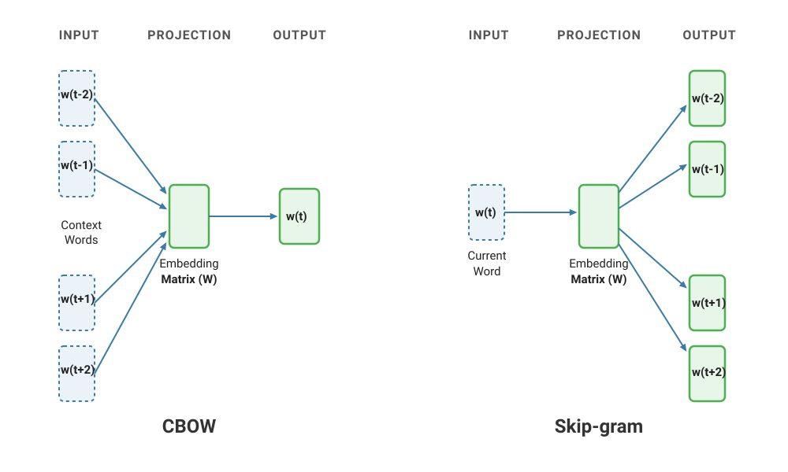
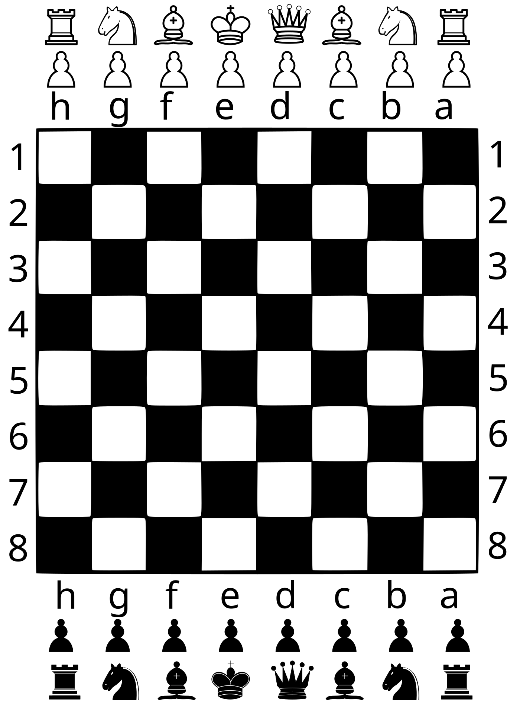

## Introducción

Word2Vec es un modelo de creación de embeddings propuesto por Tomas Mikolov y su equipo en Google en 2013. Word2Vec utiliza una red neuronal para aprender representaciones vectoriales de palabras a partir de grandes corpus de texto. Hasta la aparición de la arquitectura Transformer, Word2Vec fue uno de los algoritmos más populares y se ha usado ampliamente para mejorar los resultados de búsquedas y en traducción.


## Arquitectura

El modelo Word2Vec se basa en una red neuronal de una sola capa oculta y una de salida. El objetivo del modelo es predecir el contexto de una palabra dada o, alternativamente, predecir la palabra dada su contexto. Existen dos variantes principales de Word2Vec: Continuous Bag of Words (CBOW) y Skip-Gram.



### CBOW 

En CBOW (Continuous Bag of Words), el modelo intenta predecir una palabra objetivo a partir de un conjunto de palabras de contexto. Por ejemplo, dado el contexto "el gato __ muy bonito", el modelo intentaría predecir la palabra "es".

### Skip-Gram

En Skip-Gram, el modelo hace lo contrario: intenta predecir las palabras de contexto a partir de una palabra objetivo. Por ejemplo, dado la palabra "es", el modelo intentaría predecir las palabras "el", "gato", "muy" y "bonito".

## Planteamiento de la práctica

Como modelo de lenguaje, Word2Wec necesita un corpus enorme de texto para aprender las representaciones vectoriales de las palabras. El objetivo de esta práctica es entrenar un modelo Word2Vec con un corpus muy pequeño. En lugar de texto, utilizaremos un conjunto sintético con los movimientos de un caballo en un tablero de ajedrez. Podemos ver cada posición del tablero como una "palabra" y cada movimiento del caballo como una "oración". Por ejemplo, si el caballo se mueve de la posición A1 a la posición B3 y luego a la posición C5, podríamos representar esto como la oración "A1 B3 C5".

Este es el tablero de ajedrez:

{fig-align="center" width=50%}

El caballo se mueve en forma de "L", lo que significa que puede moverse dos casillas en una dirección y luego una casilla en una dirección perpendicular. Por ejemplo, desde la posición A1, el caballo puede moverse a las posiciones B3 y C2.

Generamos las 64 casillas y un par de diccionarios para mapear entre casillas y sus índices correspondientes.

```{python}
import random
import torch
import torch.nn as nn
from torch.utils.data import Dataset, DataLoader
import lightning as L  # PyTorch Lightning moderno se importa así
import numpy as np
import pandas as pd
import matplotlib.colors as mcolors
from sklearn.decomposition import PCA
from plotnine import *

# --- CONFIGURACIÓN GLOBAL DEL TABLERO ---
columnas = ['A', 'B', 'C', 'D', 'E', 'F', 'G', 'H']
filas = ['1', '2', '3', '4', '5', '6', '7', '8']
todas_las_casillas = [c + f for c in columnas for f in filas]
casilla_a_idx = {casilla: idx for idx, casilla in enumerate(todas_las_casillas)}
idx_a_casilla = {idx: casilla for casilla, idx in casilla_a_idx.items()}
V_SIZE = len(todas_las_casillas)  # 64 casillas
```

Creamos un `dataset` de Pytorch para almacenar las secuencias de movimientos del caballo. El `dataset` recibe una lista de pares (central, contexto) y los sirve como tensores. En este caso, "central" es la posición actual del caballo y "contexto" es la posición a la que se mueve el caballo. En Word2Vec se puede parametrizar el tamaño de ventana de contexto con que se va a entrenar el modelo. La ventana de contexto es el número de palabras a la izquierda y a la derecha de la palabra central que se consideran. En el caso del movimiento del caballo, una ventana de contexto de 1 significa que el modelo sólo ve un salto del caballo; de dos que se consideran igual de próximas las casillas a las que el caballo puede llegar con un salto o con dos saltos, etc.

:::{.callout-tip}

## CBOW o Skip-Gram
Se ha optado por implementar el algoritmo Skip-Gram en lugar de CBOW por ser más sencillo en este caso. En Skip-Gram, el modelo intenta predecir las palabras de contexto a partir de una palabra objetivo, es decir, dado una posición del caballo, el modelo intenta predecir a qué posiciones podría moverse el caballo. Por eso, el método `__getitem__` del `Dataset` se implementa para devolver los pares (central, contexto) = (input,label). En CBOW, el modelo recibe las palabras de contexto (las posiciones a las que el caballo podría moverse) y tiene que predecir la palabra central (la posición actual del caballo). Habría que lidiar con el problema de longitudes variables de contexto (entre 2 y 8 de pendiendo de la casilla), lo que complica la implementación.
:::

```{python}
# ==========================================
# 1. DATASET NATIIVO DE PYTORCH
# ==========================================
class MovimientosCaballoDataset(Dataset):
    """Recibe la lista de pares (central, contexto) y los sirve como tensores."""
    def __init__(self, pares):
        self.pares = pares

    def __len__(self):
        return len(self.pares)

    def __getitem__(self, idx):
        central, contexto = self.pares[idx]
        return torch.tensor(central, dtype=torch.long), torch.tensor(contexto, dtype=torch.long)
```


Creamos una clase `DataModule` de PyTorch Lightning para manejar la generación de los datos de entrenamiento. El `DataModule` se encarga de generar las secuencias de movimientos del caballo, crear el dataset y el dataloader. En este caso, generamos un número determinado de paseos aleatorios del caballo por el tablero, con una ventana de contexto específica.

```{python}
# ==========================================
# 2. LIGHTNING DATA MODULE
# ==========================================
class CaballoDataModule(L.LightningDataModule):
    def __init__(self, num_paseos=4000, largo_paseo=25, ventana=1, batch_size=1024, num_workers=0, shuffle=True):
        super().__init__()
        self.num_paseos = num_paseos
        self.largo_paseo = largo_paseo
        self.ventana = ventana
        self.batch_size = batch_size
        self.num_workers = num_workers
        self.shuffle = shuffle
        self.pares_entrenamiento = []

    def _obtener_movimientos_caballo(self, casilla):
        col_idx = columnas.index(casilla[0])
        fil_idx = filas.index(casilla[1])
        movimientos = [(2, 1), (2, -1), (-2, 1), (-2, -1), (1, 2), (1, -2), (-1, 2), (-1, -2)]
        legales = []
        for dc, df in movimientos:
            nc, nf = col_idx + dc, fil_idx + df
            if 0 <= nc < 8 and 0 <= nf < 8:
                legales.append(columnas[nc] + filas[nf])
        return legales

    def _generar_paseos(self):
        corpus = []
        for _ in range(self.num_paseos):
            casilla_actual = random.choice(todas_las_casillas)
            paseo = [casilla_actual]
            for _ in range(self.largo_paseo - 1):
                opciones = self._obtener_movimientos_caballo(casilla_actual)
                casilla_actual = random.choice(opciones)
                paseo.append(casilla_actual)
            corpus.append(paseo)
        return corpus

    def prepare_data(self):
        # Operaciones de descarga o escritura en disco si las hubiera (aquí no hace falta)
        pass

    def setup(self, stage=None):
        # Aquí se generan los datos y se construyen los datasets (Se ejecuta por GPU/proceso)
        if stage == "fit" or stage is None:
            paseos = self._generar_paseos()
            self.pares_entrenamiento = []
            
            for paseo in paseos:
                for i, casilla_central in enumerate(paseo):
                    idx_central = casilla_a_idx[casilla_central]
                    for j in range(max(0, i - self.ventana), min(len(paseo), i + self.ventana + 1)):
                        if i != j:
                            idx_contexto = casilla_a_idx[paseo[j]]
                            self.pares_entrenamiento.append((idx_central, idx_contexto))
            
            self.train_dataset = MovimientosCaballoDataset(self.pares_entrenamiento)

    def train_dataloader(self):
        return DataLoader(
            self.train_dataset, 
            batch_size=self.batch_size, 
            shuffle=self.shuffle, 
            num_workers=self.num_workers
        )
```

Probamos que podemos generar los datos correctamente y que el dataloader funciona.

```{python}
L.seed_everything(seed=42)
datamodule = CaballoDataModule(num_paseos=1, ventana=2, batch_size=10, shuffle=False)
datamodule.prepare_data()
datamodule.setup(stage="fit")
train_loader = datamodule.train_dataloader()
for batch in train_loader:
    print(batch)
    df_batch = pd.DataFrame(batch[0].numpy(), columns=["central_idx"])  # Convertir a DataFrame para mostrar
    df_batch["central_casilla"] = df_batch["central_idx"].apply(lambda idx: idx_a_casilla[idx])
    df_batch["contexto_idx"] = batch[1].numpy()
    df_batch["contexto_casilla"] = df_batch["contexto_idx"].apply(lambda idx: idx_a_casilla[idx])
    break
df_batch.style.hide(axis='index')
```

## Definición del modelo y entrenamiento

Definimos el modelo Word2Vec como un `LightningModule` de PyTorch Lightning. El modelo tiene una capa de embedding para convertir los índices de las casillas en vectores densos y una capa de salida que predice la probabilidad de cada casilla del tablero como contexto. La función de pérdida utilizada es la entropía cruzada, que es común para problemas de clasificación.

```{python}

# ==========================================
# 3. LIGHTNING MODULE (MODELO Y SISTEMA)
# ==========================================
class Word2VecLightning(L.LightningModule):
    def __init__(self, tamano_vocabulario=64, dimension_embedding=16, lr=0.01):
        super().__init__()
        # Guarda los hiperparámetros automáticamente para el checkpoint
        self.save_hyperparameters()
        
        # Arquitectura Skip-Gram
        self.embeddings_entrada = nn.Embedding(tamano_vocabulario, dimension_embedding)
        self.lineal_salida = nn.Linear(dimension_embedding, tamano_vocabulario, bias=False)
        self.funcion_perdida = nn.CrossEntropyLoss()

    def forward(self, x):
        h = self.embeddings_entrada(x)
        salida = self.lineal_salida(h)
        return salida

    def training_step(self, batch, batch_idx):
        # Lightning te da el batch ya desempaquetado en tensores
        x, y = batch
        predicciones = self(x)
        loss = self.funcion_perdida(predicciones, y)
        
        # Loguea la pérdida para poder visualizarla en TensorBoard
        self.log("train_loss", loss, prog_bar=True, on_step=False, on_epoch=True)
        return loss

    def configure_optimizers(self):
        return optim.Adam(self.parameters(), lr=self.hparams.lr)
```

Realizamos el entrenamiento con un tamaño de ventana de 1 (el modelo sólo ve un salto del caballo).

```{python}

# ==========================================
# 4. ORQUESTACIÓN Y ENTRENAMIENTO (TRAINER)
# ==========================================
import torch.optim as optim  # Necesario para el configurador de optimizadores

L.seed_everything(seed=42)  # Para reproducibilidad
# Instanciamos los módulos de Lightning
datamodule = CaballoDataModule(num_paseos=4000, batch_size=1024)
modelo_lightning = Word2VecLightning(tamano_vocabulario=V_SIZE, dimension_embedding=16, lr=0.01)

# El Trainer controla todo el bucle, las épocas, la barra de progreso y la CPU
trainer = L.Trainer(
    max_epochs=3,
    accelerator="cpu",     # Forzamos explícitamente el uso de CPU
    enable_checkpointing=False, # Desactivamos para que no genere archivos basura en tu clase
    logger=False           # Desactivamos logs externos para mantener la consola limpia
)

print("Iniciando entrenamiento con PyTorch Lightning en CPU...")
trainer.fit(modelo_lightning, datamodule=datamodule)
print("¡Entrenamiento finalizado con éxito!\n")
```

## Interpretación de los embeddings

Representamos visualmente los embeddings aprendidos utilizando PCA para reducir la dimensionalidad a 2D (no podemos representar las 16 dimensiones de los embeddings).

:::{.callout-note collapse=true}

## ¿Qué es PCA (Principal Components Analysis)?

Los embeddings de modelos como Word2Vec suelen tener muchas dimensiones (en este caso, 16 por defecto), lo que los hace imposibles de visualizar directamente. **PCA (Análisis de Componentes Principales)** es una técnica de reducción de dimensionalidad que resuelve esto proyectando vectores de alta dimensión a un espacio más pequeño (como 2D) intentando conservar la mayor cantidad posible de la información (varianza) original. 

Al aplicarlo a nuestro proyecto, podemos plasmar los embeddings en un gráfico de dispersión bidimensional donde cada punto representa una casilla del tablero, permitiéndonos ver a simple vista si el modelo ha aprendido las relaciones espaciales del juego.

Aquí tienes un gráfico en el que se pasa de 2 dimensiones a 1, eliminando la dimensión vertical por ser poco informativa.^[Es común pensar que PCA reduce dimensiones simplemente "borrando" las columnas menos importantes, pero en realidad funciona de una manera más inteligente: **encuentra las direcciones de máxima varianza y rota los datos** para alinearlos con ellas. Las nuevas dimensiones resultantes (los componentes principales) no son variables originales seleccionadas, sino **combinaciones lineales de todas las dimensiones iniciales**. Por ejemplo, al pasar de un espacio de 2 dimensiones a 1, PCA no elimina el eje vertical; lo que hace es encontrar la diagonal exacta por la que se estiran los datos y proyectarlos sobre ella. Debido a esta transformación matemática, los nuevos ejes pierden su significado habitual. Así, si la interpretación de los embeddings de 16 dimensiones ya era abstracta, tras la reducción de PCA se vuelven puramente geométricos, priorizando la visualización de la estructura y cercanía entre los datos sobre la interpretabilidad de sus ejes.]


```{python}
# 1. Generamos los datos con una diagonal muy estirada (máxima información)
np.random.seed(42)
n_points = 10

pc1 = np.random.normal(0, 3, n_points)
pc2 = np.random.normal(0, 0.3, n_points)

# Rotamos 45 grados para crear variables X e Y correlacionadas
theta = np.radians(10)
c, s = np.cos(theta), np.sin(theta)
R = np.array(((c, -s), (s, c)))
datos_rotados = np.dot(np.vstack((pc1, pc2)).T, R.T)

# 2. Dataset de puntos originales (2D)
df_original = pd.DataFrame(datos_rotados, columns=['X', 'Y'])
df_original['Tipo'] = 'Datos Originales (2D)'

# 3. Dataset de puntos proyectados directamente al eje X original (Y = -6 para que queden abajo, en el "suelo")
# Usamos un valor fijo de Y para la base del gráfico, manteniendo su X exacta.
suelo_y = -6
df_proyectado = pd.DataFrame({
    'X': df_original['X'],
    'Y': suelo_y,
    'Tipo': 'Proyección al eje X (1D)'
})

# Combinamos para graficar
df_total = pd.concat([df_original, df_proyectado])

# 4. Construimos el gráfico compartiendo el mismo eje X
grafico = (
    ggplot(df_total)
    # Dibujamos las líneas de proyección vertical (conectan cada punto 2D con su sombra en el eje X)
    + geom_segment(
        aes(x='X', y='Y', xend='X', yend=suelo_y),
        data=df_original,
        color='gray', alpha=0.3, linetype='dashed'
    )
    # Dibujamos una línea sólida que represente el "eje" de proyección abajo
    + geom_segment(
        aes(x=df_original['X'].min(), y=suelo_y, xend=df_original['X'].max(), yend=suelo_y),
        color='black', alpha=0.5
    )
    # Pintamos los puntos de ambos tipos
    + geom_point(aes(x='X', y='Y', color='Tipo'), size=2.5, alpha=0.8)
    + scale_color_manual(values={'Datos Originales (2D)': '#2b5c8f', 'Proyección al eje X (1D)': '#d95f02'})
    + theme_minimal()
    + labs(
        x="Dimensión informativa",
        y="Dimensión poco informativa",
        color=""
    )
    + theme(
        plot_title=element_text(size=14, weight='bold'),
        legend_position='top'
    )
)

grafico
```
:::

```{python}
# ==========================================
# 5. EXTRACCIÓN Y VISUALIZACIÓN EDUCATIVA (PLOTNINE)
# ==========================================
# Extraemos la matriz de weights final del módulo de embeddings
embeddings_aprendidos = modelo_lightning.embeddings_entrada.weight.data.numpy()

def plot_embeddings(embeddings, df_colores=None, titulo="Embeddings del Tablero"):
    """
    Reduce embeddings a 2D y genera el gráfico utilizando plotnine.
    
    Argumentos:
    - embeddings: Matriz de pesos (numpy array) extraída del modelo.
    - df_colores: DataFrame opcional con columnas ['casilla', 'color_relleno'].
                  Si es None, se usará 'orchid' por defecto.
    - titulo: Cadena de texto para el título del gráfico.
    """
    # 1. Reducción dimensional con PCA estándar
    pca = PCA(n_components=2)
    vectores_2d = pca.fit_transform(embeddings)
    
    # 2. Construcción del DataFrame base
    df_plot = pd.DataFrame({
        'x': vectores_2d[:, 0],
        'y': vectores_2d[:, 1],
        'casilla': [idx_a_casilla[i] for i in range(len(vectores_2d))]
    })
    
    # 3. Gestión dinámica de colores de fondo y texto
    if df_colores is not None and 'casilla' in df_colores.columns and 'color_relleno' in df_colores.columns:
        # Hacer un merge para asegurar que cada casilla mantenga su índice correcto
        df_plot = df_plot.merge(df_colores, on='casilla', how='left')
        # Por si acaso alguna casilla no viene en el mapeo, rellenamos con orchid
        df_plot['color_relleno'] = df_plot['color_relleno'].fillna('orchid')
    else:
        df_plot['color_relleno'] = 'orchid'
        
    # Función interna para calcular si un color es claro u oscuro (Luminancia WCAG)
    def obtener_color_texto(color_hex):
        try:
            # Convertimos nombres de matplotlib (como 'orchid') o hex a tupla RGB (0-1)
            rgb = mcolors.to_rgb(color_hex)
            # Fórmula estándar de luminancia para el ojo humano
            luminancia = 0.2126 * rgb[0] + 0.7152 * rgb[1] + 0.0722 * rgb[2]
            # Si la luminancia es alta (> 0.5), el fondo es claro -> texto negro. Si no, blanco.
            return 'black' if luminancia > 0.5 else 'white'
        except Exception:
            return 'black' # Fail-safe en caso de formatos extraños

    df_plot['color_texto'] = df_plot['color_relleno'].apply(obtener_color_texto)
    
    # 4. Construcción geométrica del gráfico con plotnine
    grafico = (
        ggplot(df_plot, aes(x='x', y='y'))
        # Mapeamos de forma manual el color usando las columnas calculadas
        + geom_point(
            aes(fill='color_relleno'), 
            color='black', 
            size=12, 
            stroke=0.8, 
            show_legend=False
        )
        + geom_text(
            aes(label='casilla', color='color_texto'), 
            fontweight='bold', 
            size=9, 
            ha='center', 
            va='center', 
            show_legend=False
        )
        # Forzamos a plotnine a usar los colores de las columnas de texto/relleno literalmente
        + scale_fill_identity()
        + scale_color_identity()
        + labs(
            title=titulo,
            x="Componente Principal 1",
            y="Componente Principal 2"
        )
        + theme_minimal()
        + theme(
            plot_title=element_text(size=13, weight='bold', hjust=0.5, margin={'b': 15}),
            figure_size=(10, 8)
        )
    )

    return grafico


# Sacas tus embeddings entrenados
embeddings = modelo_lightning.embeddings_entrada.weight.data.numpy()

plot_embeddings(embeddings)
```


¿Cómo interpretar este gráfico? Vemos claramente que hay dos grupos de casillas. Supongo que imagina a qué corresponde cada grupo. Si despliega la siguiente nota lo confirmará.

:::{.callout-note collapse="true"}

## ¿Qué se está mostrando en el gráfico?

Efectivamente, Word2Vec "ha aprendido" que hay dos grupos de casillas:

```{python}
# Creamos un pequeño diccionario con las reglas del ajedrez
datos_colores = []
for casilla in todas_las_casillas:
    col_idx = columnas.index(casilla[0])
    fil_idx = filas.index(casilla[1])
    # Si la suma de índices es par, es casilla negra (usamos un gris oscuro), si no, blanca
    color = '#333333' if (col_idx + fil_idx) % 2 == 0 else '#FFFFFF'
    datos_colores.append({'casilla': casilla, 'color_relleno': color})

df_colores_ajedrez = pd.DataFrame(datos_colores)

# Llamada pasándole el DataFrame de colores
plot_embeddings(
    embeddings=embeddings, 
    df_colores=df_colores_ajedrez, 
    titulo="Blancas vs Negras"
)
```

¿Cómo lo ha hecho?. Es fácil de entender si pensamos en el proceso de entrenamiento: el modelo recibe como input la casilla central (por ejemplo, A1) y tiene que predecir las casillas de contexto (B3 y C2). La casilla central y las de contexto siempre tienen distinto color, así que aprende que las casillas negras van seguidas de blancas y las blancas de negras. Por eso, en el espacio de embeddings, las casillas negras quedan agrupadas en un lado y las blancas en otro, formando dos grupos claramente diferenciados.
:::

## Modelo generativo

Word2Vec se puede utilizar como modelo generativo para crear nuevas secuencias de movimientos del caballo. Se constata que el modelo es capaz de generar secuencias válidas:


```{python}
import torch.nn.functional as F

# ==========================================
# 1. FUNCIÓN DE GENERACIÓN AUTOREGRESIVA
# ==========================================
def generar_secuencia_caballo(modelo_lightning, casilla_inicio, longitud=10, temperatura=1.0):
    """
    Genera una secuencia de casillas usando el modelo de forma predictiva.
    La temperatura controla la creatividad:
    - Alta (> 1.0): Más caótico y variado.
    - Baja (< 0.5): Más conservador, elige siempre lo más seguro.
    """
    modelo_lightning.eval()
    secuencia_generada = [casilla_inicio]
    casilla_actual = casilla_inicio

    for _ in range(longitud - 1):
        idx_actual = casilla_a_idx[casilla_actual]
        tensor_input = torch.tensor([idx_actual], dtype=torch.long)
        
        with torch.no_grad():
            logits = modelo_lightning(tensor_input).squeeze(0)
            # Aplicamos la temperatura a los logits antes de la Softmax
            logits = logits / temperatura
            probabilidades = F.softmax(logits, dim=0).numpy()
        
        # Muestreamos la siguiente casilla basándonos en las probabilidades del modelo
        idx_siguiente = np.random.choice(len(todas_las_casillas), p=probabilidades)
        casilla_actual = idx_a_casilla[idx_siguiente]
        secuencia_generada.append(casilla_actual)
        
    return secuencia_generada


# ==========================================
# 2. EL ÁRBITRO: EVALUADOR DE VALIDEZ
# ==========================================
def evaluar_validez_secuencia(secuencia):
    """
    Analiza paso a paso la secuencia generada y calcula el porcentaje de acierto
    según las reglas reales del movimiento del caballo.
    """
    movimientos_totales = len(secuencia) - 1
    movimientos_legales = 0
    detalles = []

    # Función auxiliar local para verificar un salto individual
    def es_salto_legal_caballo(c1, c2):
        col1, fil1 = columnas.index(c1[0]), filas.index(c1[1])
        col2, fil2 = columnas.index(c2[0]), filas.index(c2[1])
        # Un salto de caballo siempre cumple que la distancia al cuadrado en los ejes es igual a 5
        # (1^2 + 2^2 = 5 o 2^2 + 1^2 = 5)
        return (col1 - col2)**2 + (fil1 - fil2)**2 == 5

    # Evaluar cada transición
    for i in range(movimientos_totales):
        desde = secuencia[i]
        hacia = secuencia[i+1]
        
        if es_salto_legal_caballo(desde, hacia):
            movimientos_legales += 1
            detalles.append(f"  Paso {i+1}: {desde} -> {hacia} | ¡LEGAL!")
        else:
            detalles.append(f"  Paso {i+1}: {desde} -> {hacia} | ¡ILEGAL! (Alucinación)")

    porcentaje_acierto = (movimientos_legales / movimientos_totales) * 100
    
    return porcentaje_acierto, detalles


# ==========================================
# 3. EJECUCIÓN DE LA PRUEBA
# ==========================================
casilla_inicial = "E4"
longitud_paseo = 20

print(f"--- EVALUANDO CABALLO GENERATIVO DESDE '{casilla_inicial}' ---")

# Probamos con una temperatura equilibrada (0.7)
secuencia = generar_secuencia_caballo(modelo_lightning, casilla_inicio=casilla_inicial, longitud=longitud_paseo, temperatura=0.7)

# Evaluamos los resultados
precision, informe = evaluar_validez_secuencia(secuencia)

print(f"\nSecuencia sugerida por la IA:\n{' -> '.join(secuencia)}\n")
print("Informe del Árbitro:")
for paso in informe:
    print(paso)
    
print(f"\nPrecision del modelo: {precision:.1f}% de movimientos válidos.")
```

## Variaciones de los parámetros de entrenamiento

En esta sección exploramos cómo afectan los parámetros de entrenamiento al resultado final. Particularmente, nos centraremos en el tamaño de la ventana de contexto, que es un hiperparámetro clave en Word2Vec. La ventana de contexto determina cuántas palabras a la izquierda y a la derecha de la palabra central se consideran para el entrenamiento. En nuestro caso, esto se traduce en cuántos saltos del caballo se consideran como contexto para cada posición central. El entrenamiento anterior se hizo con una ventana de 1, lo que significa que el modelo sólo ve un salto del caballo. Aumentar la ventana a 2 o más permitiría al modelo ver saltos más lejanos, lo que podría ayudarle a aprender relaciones más complejas entre las casillas, pero también podría introducir ruido si se considera demasiado contexto irrelevante.

Veamos qué sucede al entrenar con una ventana de contexto de 2, lo que significa que el modelo verá tanto los saltos inmediatos como los saltos a dos posiciones de distancia.

```{python}

# ==========================================
# 4. ORQUESTACIÓN Y ENTRENAMIENTO (TRAINER)
# ==========================================
L.seed_everything(seed=42)  # Para reproducibilidad
# Instanciamos los módulos de Lightning
datamodule = CaballoDataModule(num_paseos=4000, batch_size=1024, ventana=2)  # Cambiamos la ventana a 2
modelo_lightning = Word2VecLightning(tamano_vocabulario=V_SIZE, dimension_embedding=16, lr=0.01)

# El Trainer controla todo el bucle, las épocas, la barra de progreso y la CPU
trainer = L.Trainer(
    max_epochs=3,
    accelerator="cpu",     # Forzamos explícitamente el uso de CPU
    enable_checkpointing=False, # Desactivamos para que no genere archivos basura en tu clase
    logger=False           # Desactivamos logs externos para mantener la consola limpia
)

print("Iniciando entrenamiento con PyTorch Lightning en CPU...")
trainer.fit(modelo_lightning, datamodule=datamodule)
print("¡Entrenamiento finalizado con éxito!\n")
```

```{python}
# ==========================================
# 5. EXTRACCIÓN Y VISUALIZACIÓN EDUCATIVA (PLOTNINE)
# ==========================================
# Extraemos la matriz de weights final del módulo de embeddings
embeddings_aprendidos = modelo_lightning.embeddings_entrada.weight.data.numpy()
plot_embeddings(embeddings_aprendidos, df_colores=df_colores_ajedrez, titulo="Embeddings con Ventana de Contexto = 2")
``` 

¡Vaya! Ahora las casillas negras y blancas están totalmente mezcladas. Si lo piensa un momento, esto es lógico: con una ventana de contexto de 2, el modelo ve tanto los saltos inmediatos (que siempre son a casillas del color opuesto) como los saltos a dos posiciones de distancia (que son al mismo color). El problema es que Word2Vec trata de la misma forma saltos inmediatos y saltos a dos posiciones, lo que hace que el modelo no pueda aprender la relación de alternancia entre casillas negras y blancas.

Pero si observa detenidamente el gráfico, está empezando a emerger un nuevo patrón que es más interesante: Las casillas parece que están distribuidas muy cerca de donde físicamente les corresponde estar, lo que sugiere que el modelo está aprendiendo algo sobre la estructura del tablero más allá del simple color de las casillas.

La pregunta inmediata que surge es: ¿Qué pasaría si aumentamos aún más la ventana de contexto? ¿El modelo aprendería mejor la estructura del tablero o se volvería aún más confuso? Esto se lo dejo como ejercicio para que lo pruebe por su cuenta. Puede experimentar con ventanas de contexto de 3, 4 o incluso más, y observar cómo evoluciona la representación de los embeddings. También puede intentar ajustar otros hiperparámetros como la dimensión de los embeddings, el tamaños del `batch`, la tasa de aprendizaje, etc. Por último, puede entrenar el modelo con otras piezas del ajedrez para ver si aprende otros o mejores patrones.


