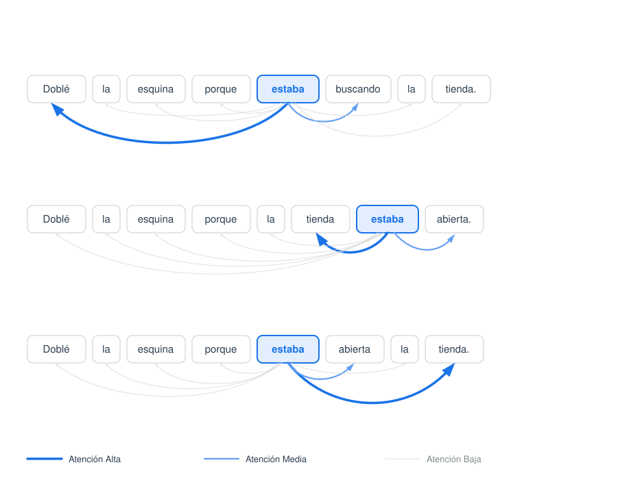
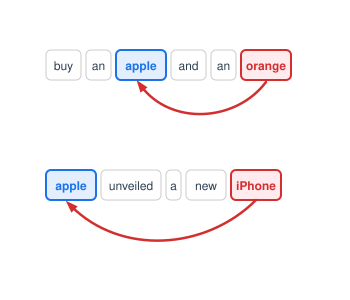
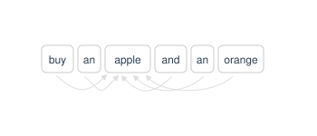
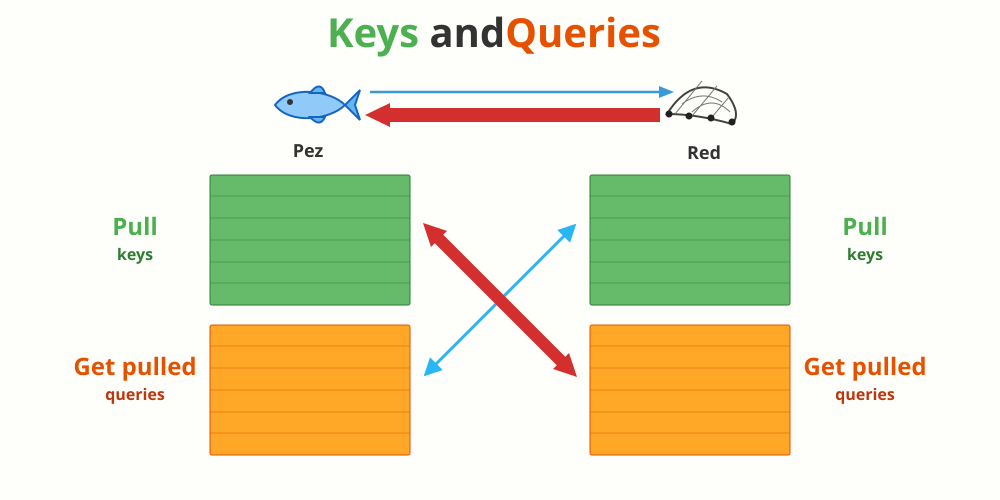
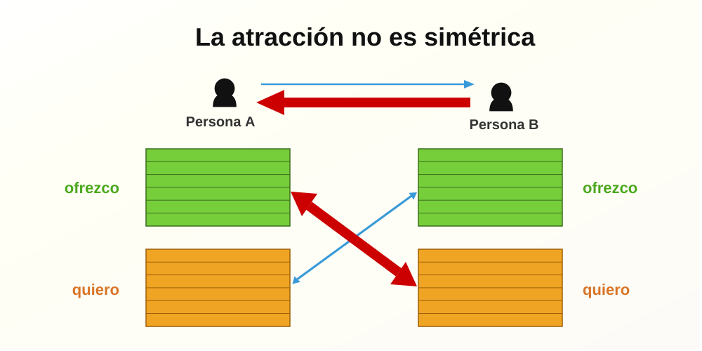
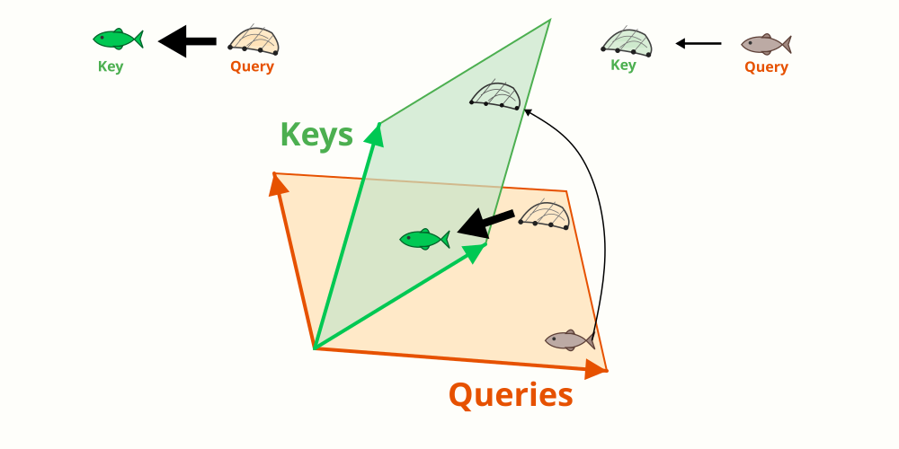

## Introducción

Lea las siguientes oraciones y preste atención a la palabra **"estaba"**:

* *Doblé la esquina porque **estaba** buscando la tienda.*
* *Doblé la esquina porque la tienda **estaba** abierta por el otro lado.*
* *Doblé la esquina porque por el otro lado **estaba** abierta la tienda.*
* *Doblé la esquina porque **estaba** atestada de gente.*


¿A quién o a qué se refiere el verbo "estaba" en cada caso?

* **En la primera oración:** Se refiere a un sujeto implícito (**"yo"**). Nuestro cerebro descarta automáticamente a la tienda y a la esquina porque la semántica nos dicta que son las personas las que buscan objetos y no al revés.
* **En la segunda oración:** Se refiere a **"la tienda"**, que actúa como sujeto explícito inmediatamente anterior al verbo.
* **En la tercera oración:** Se refiere nuevamente a **"la tienda"**, pero con una dificultad añadida: el sujeto se ha desplazado hasta el final de la frase, forzándonos a mantener la información en suspenso hasta leer la última palabra.
* **En la cuarta oración:** No estamos seguros. Podría referirse a la tienda o, más probablemente, a **la calle**. Tendríamos que conocer el contexto de la conversación para resolver esta ambigüedad.

¿Cómo logra nuestro cerebro resolver esta ambigüedad de manera instantánea?

A través del **contexto**. Los seres humanos no procesamos el lenguaje como una lista de palabras aisladas. Comprendemos el significado de cada término analizando cómo se relaciona con las demás palabras de la oración, sin importar si están cerca, lejos o si ni siquiera se han escrito (como el sujeto elíptico).


**El reto computacional: De la mente a la máquina**

Esto nos plantea un problema enorme cuando intentamos que un ordenador procese texto: **¿Cómo conseguimos que un modelo de lenguaje entienda el contexto?** ¿Cómo hacemos para que una máquina sepa con qué otra/s palabra/s debe asociar "estaba" en cada uno de los escenarios anteriores?

Históricamente, los modelos de Inteligencia Artificial leían las frases palabra por palabra, en orden cronológico (de izquierda a derecha). El problema es que para cuando llegaban al final de frases largas, ya habían "olvidado" las conexiones del principio.

La solución revolucionaria a este problema llegó en 2017 con el **Mecanismo de Atención** (*Attention Mechanism*) propuesto por A. Vaswani y su equipo en el trabajo ["Attention is All You Need"](https://arxiv.org/abs/1706.03762). 

En lugar de leer secuencialmente, la Atención permite al modelo mirar **toda la frase a la vez** y calcular dinámicamente una "puntuación de relevancia" entre cada par de palabras. Es el equivalente matemático a hacer que la palabra "estaba" dirija una mirada inquisitiva al resto de la oración para decidir en cuál de las otras palabras debe concentrar su "atención" para cobrar sentido.

## Prestando atención

Lo que queremos es que nuestro modelo replique lo que hacemos los humanos. Es decir, que esa capaz de que cuando procese una palabra mire al resto de palabras de la frase y decida cuáles son relevantes para entender su significado en ese contexto:

<div style="text-align: center;">

</div>

En el [capítulo anterior](./30_similarity.qmd), aprendimos el concepto de **embedding** para representar la similitud entre palabras. Por ejemplo:

```{python}
import plotly.graph_objects as go
import numpy as np
import pandas as pd

# --- CONFIGURACIÓN DE LOS ELEMENTOS ---
elementos_base = {
    "Fútbol": (0, 6, "⚽"),
    "Baloncesto": (1, 6, "🏀"),
    "Tenis": (1, 5, "🎾"),
    "Plátano": (6, 5, "🍌"),
    "Cerezas": (6, 4, "🍒"),
    "Fresa": (5, 4, "🍓"),
    "Castillo": (1, 2, "🏰"),
    "Casa": (2, 2, "🏠"),
    "Edificio": (2, 1, "🏢"),
    "Bicicleta": (5, 1, "🚲"),
    "Camión": (6, 1, "🚚"),
    "Coche": (6, 0, "🚗")
}

# Coordenadas: Base + Letras A(1,4), B(3,1), C(5,5)
x_coords = [coord[0] for coord in elementos_base.values()] + [0, 1, 5]
y_coords = [coord[1] for coord in elementos_base.values()] + [5, 1, 5]

# --- ESTADOS PARA LOS FOTOGRAMAS ---
emojis_init = [coord[2] for coord in elementos_base.values()] + ["A", "B", "C"]
colores_init = ['black'] * 12 + ['#6b0d2f'] * 3
tamaños_init = [26] * 12 + [30] * 3

emojis_final = [coord[2] for coord in elementos_base.values()] + ["", "", "🍎"]
colores_final = ['black'] * 12 + ['rgba(0,0,0,0)', 'rgba(0,0,0,0)', 'black']
tamaños_final = [26] * 12 + [1, 1, 32] 

fig = go.Figure()

# Traza inicial: cambiado 'mode' a 'text' para eliminar puntos
fig.add_trace(go.Scatter(
    x=x_coords, y=y_coords,
    mode='text',
    text=emojis_init,
    textposition="middle center",
    textfont=dict(size=tamaños_init, color=colores_init),
    hoverinfo="text"
))

# Definición de fotogramas
fig.frames = [
    go.Frame(data=[go.Scatter(text=emojis_init, textfont=dict(size=tamaños_init, color=colores_init))], name="inicio"),
    go.Frame(data=[go.Scatter(text=emojis_final, textfont=dict(size=tamaños_final, color=colores_final))], name="aparece_manzana")
]

# --- DISEÑO ---
fig.update_layout(
    title="<b>Cuestionario de Embeddings 1</b><br>¿Dónde estaría la manzana?, ¿A, B, C? ",
    width=600, height=600,
    margin=dict(l=50, r=50, t=80, b=120),
    plot_bgcolor='white',
    xaxis=dict(range=[-0.5, 6.5], showgrid=True, gridcolor='#e0e0e0', zeroline=False),
    yaxis=dict(range=[-0.5, 6.5], showgrid=True, gridcolor='#e0e0e0', zeroline=False),
    updatemenus=[dict(
        type="buttons", direction="left",
        buttons=[
            dict(label="Reiniciar", method="animate", args=[["inicio"], dict(frame=dict(duration=300), mode="immediate")]),
            dict(label="Mostrar 🍎", method="animate", args=[["aparece_manzana"], dict(frame=dict(duration=300), mode="immediate")])
        ],
        x=0.5, xanchor="center", y=-0.15
    )]
)

fig.show(config={'displayModeBar': False})
```

Pero la situación no es siempre tan sencilla. En el gráfico de abajo, la manzana (🍎) es un fruta y debería estar con las frutas, pero también es el nombre de una compañía (Apple) y también debería estar entre los cachivaches electrónicos. Por lo tanto, podría estar en "C". aunque ...


```{python}
import plotly.graph_objects as go

# --- CONFIGURACIÓN DE LOS ELEMENTOS ---
elementos_base = {
    "Fresa": (0, 6, "🍓"),
    "Naranja": (0, 5, "🍊"),
    "Cerezas": (1, 6, "🍒"),
    "Laptop": (6, 0, "💻"),
    "Teléfono": (5, 0, "📱"),
    "TV": (6, 1, "📺"), 
}

# Coordenadas: Base + Letras A(1,4), B(3,1), C(5,5)
x_coords = [coord[0] for coord in elementos_base.values()] + [1, 5, 3]
y_coords = [coord[1] for coord in elementos_base.values()] + [5, 1, 3]

# --- ESTADOS PARA LOS FOTOGRAMAS ---
emojis_init = [coord[2] for coord in elementos_base.values()] + ["A", "B", "C"]
colores_init = ['black'] * 6 + ['#6b0d2f'] * 3
tamaños_init = [26] * 6 + [30] * 3

emojis_final = [coord[2] for coord in elementos_base.values()] + ["", "", "🍎"]
colores_final = ['black'] * 6 + ['rgba(0,0,0,0)', 'rgba(0,0,0,0)', 'black']
tamaños_final = [26] * 6 + [1, 1, 32] 

fig = go.Figure()

# Traza inicial: cambiado 'mode' a 'text' para eliminar puntos
fig.add_trace(go.Scatter(
    x=x_coords, y=y_coords,
    mode='text',
    text=emojis_init,
    textposition="middle center",
    textfont=dict(size=tamaños_init, color=colores_init),
    hoverinfo="text"
))

# Definición de fotogramas
fig.frames = [
    go.Frame(data=[go.Scatter(text=emojis_init, textfont=dict(size=tamaños_init, color=colores_init))], name="inicio"),
    go.Frame(data=[go.Scatter(text=emojis_final, textfont=dict(size=tamaños_final, color=colores_final))], name="aparece_manzana")
]

# --- DISEÑO ---
fig.update_layout(
    title="<b>Cuestionario de Embeddings 2</b><br>¿Dónde estaría la manzana?, ¿A, B, C? ",
    width=600, height=600,
    margin=dict(l=50, r=50, t=80, b=120),
    plot_bgcolor='white',
    xaxis=dict(range=[-0.5, 6.5], showgrid=True, gridcolor='#e0e0e0', zeroline=False),
    yaxis=dict(range=[-0.5, 6.5], showgrid=True, gridcolor='#e0e0e0', zeroline=False),
    updatemenus=[dict(
        type="buttons", direction="left",
        buttons=[
            dict(label="Reiniciar", method="animate", args=[["inicio"], dict(frame=dict(duration=300), mode="immediate")]),
            dict(label="Mostrar 🍎", method="animate", args=[["aparece_manzana"], dict(frame=dict(duration=300), mode="immediate")])
        ],
        x=0.5, xanchor="center", y=-0.15
    )]
)

fig.show(config={'displayModeBar': False})
```

... aunque "C" es una posición neutra no satisfactoria. Lo que queremos es que, si estamos hablando de frutas, los embeddings de "manzana" sean atraídos por las palabras de contexto relacionadas con frutas hacia los embeddings de las frutas y, si estamos hablando de tecnología, que sean atraídos por las palabras de contexto relacionadas con tecnología hacia los embeddings de los cachivaches electrónicos. Por ejemplo:

* En la frase *"buy an apple and an orange"* habría que desplazar el embedding de "manzana" (apple) hacia las frutas.
* En la frase *"apple unveiled a new iPhone"* habría que desplazar el embedding de "manzana" (apple) hacia los cachivaches electrónicos.

¿Qué palabra ayuda a decidir el contexto de "manzana" en cada una de las frases anteriores? 

<div style="text-align: center;">

</div>


```{python}
import plotly.graph_objects as go

# --- CONFIGURACIÓN ---
# Naranja en (0,6), Laptop en (6,0), Manzana inicial en (3,3)
# Destinos: Naranja (1.5, 4.5), Laptop (4.5, 1.5)
x_init = [0, 6, 3, 4]
y_init = [6, 0, 3, 3]
emojis = ["🍊", "💻", "🍎"]

fig = go.Figure()


# 1. Traza para la línea del rastro
fig.add_trace(go.Scatter(
    x=[None, None], y=[None, None],
    mode='lines',
    line=dict(color='gray', width=2, dash='dot'),
    showlegend=False
))


fig.add_trace(go.Scatter(
    x=[3], y=[3],
    mode='text',
    hoverinfo="text",
    text=["🍎"],
    textposition="middle center",
    textfont=dict(size=[30], color=['rgba(0,0,0,.5)']),
    showlegend=False))


fig.add_trace(go.Scatter(
    x=x_init, y=y_init,
    mode='text',
    hoverinfo="text",
    text=emojis,
    textposition="middle center",
    textfont=dict(size=[30, 30, 30]), 
    showlegend=False))


fig.frames = [
    # Naranja: rastro de (3,3) a (1.5, 4.5)
    go.Frame(data=[
        go.Scatter(x=[2.8, 1.5], y=[3.2, 4.5]),
        go.Scatter(),
        go.Scatter(x=[0, 6, 1.5], y=[6, 0, 4.5])
        ],
         name="orange_attention"),

    go.Frame(data=[
        go.Scatter(x=[3.2, 4.5], y=[2.8, 1.5]),
        go.Scatter(),
        go.Scatter(x=[0, 6, 4.5], y=[6, 0, 1.5])], name="laptop_attention"),
    # Reiniciar: ocultamos rastro y volvemos a (3,3)
    go.Frame(data=[
        go.Scatter(x=[None, None], y=[None, None]),
        go.Scatter(),
        go.Scatter(x=[0, 6, 3, 3], y=[6, 0, 3, 3])], name="inicio")
]


fig.update_layout(
    width=600, height=600,
    margin=dict(l=50, r=50, t=80, b=120),
    plot_bgcolor='white',
    xaxis=dict(range=[-0.5, 6.5], showgrid=True, gridcolor='#e0e0e0', zeroline=False),
    yaxis=dict(range=[-0.5, 6.5], showgrid=True, gridcolor='#e0e0e0', zeroline=False),
    updatemenus=[dict(
        type="buttons", direction="left",
        buttons=[
            dict(label="Reiniciar", method="animate", args=[["inicio"], dict(frame=dict(duration=300), mode="immediate")]),
            dict(label="🍎 ⬅️ 🍊", method="animate", args=[["orange_attention"], dict(frame=dict(duration=500), mode="immediate")]),
            dict(label="🍎 ⬅️ 💻", method="animate", args=[["laptop_attention"], dict(frame=dict(duration=500), mode="immediate")])
        ],
        x=0.5, xanchor="center", y=-0.15
    )]
)

fig.show(config={'displayModeBar': False})
```

Es decir, que tendríamos un embedding inicial de "manzana" (apple) que se desplaza dinámicamente hacia el embedding de "naranja" (orange) o hacia el embedding de "laptop" dependiendo del contexto. El problema es cómo hacemos esto. Los seres humanos entendemos el significado de las palabras y sabemos qué otras palabras de la frase son relevantes para entender su significado en ese contexto. Pero, ¿cómo conseguimos que un modelo de lenguaje haga lo mismo?


Lo que podemos hacer es calcular la influencia de cada palabra sobre la que la actual que estamos procesando, en este caso "apple":


<div style="text-align: center;">

</div>


Una forma de hacer esto es calcular la similitud entre el embedding que queremos desplazar ("apple") y el resto de palabras del contexto. Cuanto más similares sean los embeddings, más influencia tendrán sobre el desplazamiento del embedding de "apple".


Para verlo más claro, hagamos un cálculo numérico. Supongamos que queremos ver la influencia de cada palabra de contexto y "apple" y que los embeddings de cada palabra son los siguientes:

```{python}
from IPython.display import Markdown
import numpy as np

buy = np.array([1.3, -2.5])
laptop = np.array([1.5, -.7])
orange = np.array([.6, .4])
apple = np.array([.9, .9])


Markdown(fr"""$$
\mathbf{{buy}} = \begin{{bmatrix}} {buy[0]} \\ {buy[1]} \end{{bmatrix}}, \quad \mathbf{{laptop}} = \begin{{bmatrix}} {laptop[0]} \\ {laptop[1]} \end{{bmatrix}}, \quad \mathbf{{orange}} = \begin{{bmatrix}} {orange[0]} \\ {orange[1]} \end{{bmatrix}}, \quad \mathbf{{apple}} = \begin{{bmatrix}} {apple[0]} \\ {apple[1]} \end{{bmatrix}}
$$""")
```

Supongamos que queremos calcular el nuevo embedding de `apple` en dos contextos diferentes^[En este ejemplo y para simplificar los cálculos, solo vamos a considerar la influencia de tres palabras de contexto, pero en la realidad se consideran todas las palabras de la frase.]:

* Contexto 1: "buy an apple and an orange" (influencia de "buy" y "orange" sobre "apple")
* Contexto 2: "buy an apple and a laptop" (influencia de "buy" y "laptop" sobre "apple")

Lo que queremos calcular es un nuevo embedding de "apple". El nuevo "embedding" de "apple" se construirá con los embeddings de todas las palabras de contexto, pero ponderados por la similitud que tengan con "apple". Es decir, que las palabras de contexto más similares a "apple" tendrán más influencia en el nuevo embedding de "apple" que las palabras de contexto menos similares.

Como vimos en el tema anterior, una forma de calcular la similitud entre dos embeddings es calcular el producto escalar entre ellos. Cuanto mayor sea el producto escalar, más similares serán los embeddings.

Calculamos el producto escalar de "apple" con "orange", "laptop" y "buy"^[Observe que se calcula también el producto escalar de "apple" consigo mismo. Esto es necesario para saber qué parte del embedding de `apple` se conserva en el nuevo embedding.]:

```{python}
Markdown(fr"""$$
\begin{{aligned}}
\mathbf{{apple}} \cdot \mathbf{{apple}} &= \begin{{bmatrix}} {apple[0]} \\ {apple[1]} \end{{bmatrix}} \cdot \begin{{bmatrix}} {apple[0]} \\ {apple[1]} \end{{bmatrix}} = {np.dot(apple, apple):.2f} \\
\mathbf{{apple}} \cdot \mathbf{{orange}} &= \begin{{bmatrix}} {apple[0]} \\ {apple[1]} \end{{bmatrix}} \cdot \begin{{bmatrix}} {orange[0]} \\ {orange[1]} \end{{bmatrix}} = {np.dot(apple, orange):.2f} \\
\mathbf{{apple}} \cdot \mathbf{{laptop}} &= \begin{{bmatrix}} {apple[0]} \\ {apple[1]} \end{{bmatrix}} \cdot \begin{{bmatrix}} {laptop[0]} \\ {laptop[1]} \end{{bmatrix}} = {np.dot(apple, laptop):.2f} \\
\mathbf{{apple}} \cdot \mathbf{{buy}} &= \begin{{bmatrix}} {apple[0]} \\ {apple[1]} \end{{bmatrix}} \cdot \begin{{bmatrix}} {buy[0]} \\ {buy[1]} \end{{bmatrix}} = {np.dot(apple, buy):.2f}
\end{{aligned}}
$$""")
```

El producto escalar no es muy revelante por sí mismo. Lo que nos interesa es la **similitud relativa** entre los productos escalares. Para esto, lo que hacemos es dividir cada producto escalar por la raíz cuadrada de la longitud del embedding (en este caso, 2). Esto se conoce como **atención escalada** y es una técnica que se utiliza para evitar que los productos escalares sean demasiado grandes y dominen el cálculo de la similitud.

```{python}
# En atención, d_k es la longitud del vector (en este caso, 2)
d_k = len(apple) 
raiz_dk = np.sqrt(d_k)

# Operación de atención escalada (Query . Key / sqrt(d_k))
score_apple = np.dot(apple, apple) / raiz_dk
score_orange = np.dot(apple, orange) / raiz_dk
score_laptop = np.dot(apple, laptop) / raiz_dk
score_buy = np.dot(apple, buy) / raiz_dk

# Generación del bloque de LaTeX
Markdown(fr"""$$
\begin{{aligned}}
score\ apple &= \frac{{\mathbf{{apple}} \cdot \mathbf{{apple}}}}{{\sqrt{{{d_k}}}}} \approx {score_apple:.2f}, \\
score\ orange &= \frac{{\mathbf{{apple}} \cdot \mathbf{{orange}}}}{{\sqrt{{{d_k}}}}} \approx {score_orange:.2f}, \\ 
score\ laptop &= \frac{{\mathbf{{apple}} \cdot \mathbf{{laptop}}}}{{\sqrt{{{d_k}}}}} \approx {score_laptop:.2f}, \\
score\ buy &= \frac{{\mathbf{{apple}} \cdot \mathbf{{buy}}}}{{\sqrt{{{d_k}}}}} \approx {score_buy:.2f}  
\end{{aligned}}
$$""")
```

Lo que queremos saber es qué parte del nuevo embedding de "apple" se construye con cada palabra de contexto. Para esto, lo que hacemos es aplicar la función **softmax** a los scores que hemos calculado. La función softmax convierte los scores en una distribución de probabilidad, es decir, en valores entre 0 y 1 que suman 1. De esta forma, podemos interpretar cada score como la "importancia" o "peso" que tiene cada palabra de contexto para construir el nuevo embedding de "apple".

```{python}
def softmax(x):
    e_x = np.exp(x - np.max(x))  # Restamos el máximo para estabilidad numérica
    return e_x / e_x.sum()

attention_apple1, attention_orange1, attention_buy1 = softmax([score_apple, score_orange, score_buy])
attention_apple2, attention_laptop2, attention_buy2 = softmax([score_apple, score_laptop, score_buy])

Markdown(fr"""$$
\begin{{aligned}}
\text{{Atention1}} &= \text{{Softmax}}(score\ apple, score\ orange, score\ buy) &= \left( {attention_apple1:.2f}, {attention_orange1:.2f}, {attention_buy1:.2f} \right) \\
\text{{Atention2}} &= \text{{Softmax}}(score\ apple, score\ laptop, score\ buy) &= \left( {attention_apple2:.2f}, {attention_laptop2:.2f}, {attention_buy2:.2f} \right)
\end{{aligned}}
$$""")
``` 

Con estos pesos de atención, podemos calcular el nuevo embedding de "apple" en cada contexto como una combinación lineal de los embeddings de las palabras de contexto, ponderados por los pesos de atención:

```{python}
Markdown(fr"""$$
\begin{{aligned}}
\mathbf{{apple1}} &= \text{{attention1_apple}} \cdot \mathbf{{apple}} + \text{{attention1_orange}} \cdot \mathbf{{orange}} + \text{{attention1_buy}} \cdot \mathbf{{buy}} \\
&\approx {attention_apple1:.2f} \cdot \begin{{bmatrix}} {apple[0]} \\ {apple[1]} \end{{bmatrix}} + {attention_orange1:.2f} \cdot \begin{{bmatrix}} {orange[0]} \\ {orange[1]} \end{{bmatrix}} + {attention_buy1:.2f} \cdot \begin{{bmatrix}} {buy[0]} \\ {buy[1]} \end{{bmatrix}} \\
&\approx \begin{{bmatrix}} {attention_apple1 * apple[0] + attention_orange1 * orange[0] + attention_buy1 * buy[0]:.2f} \\ {attention_apple1 * apple[1] + attention_orange1 * orange[1] + attention_buy1 * buy[1]:.2f} \end{{bmatrix}} \\
\mathbf{{apple2}} &= \text{{attention2_apple}} \cdot \mathbf{{apple}} + \text{{attention2_laptop}} \cdot \mathbf{{laptop}} + \text{{attention2_buy}} \cdot \mathbf{{buy}} \\
&\approx {attention_apple2:.2f} \cdot \begin{{bmatrix}} {apple[0]} \\ {apple[1]} \end{{bmatrix}} + {attention_laptop2:.2f} \cdot \begin{{bmatrix}} {laptop[0]} \\ {laptop[1]} \end{{bmatrix}} + {attention_buy2:.2f} \cdot \begin{{bmatrix}} {buy[0]} \\ {buy[1]} \end{{bmatrix}} \\
&\approx \begin{{bmatrix}} {attention_apple2 * apple[0] + attention_laptop2 * laptop[0] + attention_buy2 * buy[0]:.2f} \\ {attention_apple2 * apple[1] + attention_laptop2 * laptop[1] + attention_buy2 * buy[1]:.2f} \end{{bmatrix}}
\end{{aligned}}
$$""")
``` 

De la misma forma, podríamos calcular el nuevo embedding de "orange", de "buy" o de "laptop" en sus contextos respectivos, dependiendo de qué palabra queramos analizar. Lo importante es entender que el mecanismo de atención nos permite calcular un nuevo embedding para cada palabra de la frase, teniendo en cuenta la influencia de todas las demás palabras de la frase, ponderada por su similitud con la palabra que estamos analizando.

El siguiente gráfico muestra cómo se ven afectadas las posiciones de los embeddings de "apple", "orange", "buy", "an" y "and" en el espacio vectorial al aplicar el mecanismo de atención^[Vemos que las palabras más próximos "apple" y "orange" se afectan más entre sí que el resto.]:

```{python}
import plotly.graph_objects as go


def calcular_punto_recortado(x1, y1, x2, y2, margen = 0.6):
    """Calcula el punto de inicio y fin recortando el margen en ambos extremos."""
    dist = np.sqrt((x2 - x1)**2 + (y2 - y1)**2)
    
    # Proporción de la línea a quitar
    ratio = margen / dist
    
    # Nuevo inicio y nuevo fin
    x1_new = x1 + (x2 - x1) * ratio
    y1_new = y1 + (y2 - y1) * ratio
    x2_new = x2 - (x2 - x1) * ratio
    y2_new = y2 - (y2 - y1) * ratio
    
    return [x1_new, x2_new], [y1_new, y2_new]

def generar_frame_data(xs, ys, margen = 0.6):
    # El primer elemento es para las palabras
    data = [dict(x=xs, y=ys)]
    # Luego, generamos las nuevas posiciones de las líneas para cada frame
    for i in range(1, 5): # Índices de las líneas
        target_idx = i # Correspondencia simple en este ejemplo
        lx, ly = calcular_punto_recortado(xs[0], ys[0], xs[target_idx], ys[target_idx], margen)
        data.append(dict(x=lx, y=ly))
    return data

# Datos unificados
labels = ["apple", "buy", "an", "orange", "and"]
x_init = [0, -2.5, 4, -1.5, 4]
y_init = [0, 2.5, 1, -1.5, -1]
x_end = [-0.4, -2.6, 3.3, -1.3, 3.6]
y_end = [-0.4, 2.3, 0.75, -1.3, -1]
colors =  ["#b22222", "#008b8b", "#228b22", "#d2691e", "#8b008b"]
fig = go.Figure()

# Un solo trazo para todas las palabras
fig.add_trace(go.Scatter(
    x=x_init, y=y_init, 
    mode='text', text=labels,
    textfont=dict(size=18, color=colors, family="Arial Black"),
    showlegend=False
))

for target in ["buy", "an", "orange", "and"]:
    idx = labels.index(target)
    # Recortar desde el nodo "apple" (índice 0) hasta el nodo destino
    lx, ly = calcular_punto_recortado(0, 0, x_init[idx], y_init[idx])
    
    ancho = 4 if target == "orange" else 1
    dash = 'dash' if target == "orange" else 'dot'
    
    fig.add_trace(go.Scatter(
        x=lx, y=ly,
        mode='lines',
        line=dict(color=colors[idx], width=ancho, dash=dash),
        showlegend=False
    ))

fig.frames = [
    go.Frame(name="inicio", data=generar_frame_data(x_init, y_init)),
    go.Frame(name="attention", data=generar_frame_data(x_end, y_end))
]


# 3. Configurar Layout con Botones
fig.update_layout(
    width=700, height=500,
    margin=dict(l=20, r=20, t=20, b=20),
    plot_bgcolor='#ffffff',
    xaxis=dict(showgrid=False, zeroline=False, showticklabels=False, range=[-3, 5]),
    yaxis=dict(showgrid=False, zeroline=False, showticklabels=False, range=[-2, 3]),
    updatemenus=[dict(
        type="buttons", direction="left",
        buttons=[
            dict(label="Reiniciar", method="animate", args=[["inicio"], dict(frame=dict(duration=300), mode="immediate")]),
            dict(label="Calcula atención", method="animate", args=[["attention"], dict(frame=dict(duration=300), mode="immediate")])
        ],
        x=0.5, xanchor="center", y=-0.15
    )]
)

fig.show()
``` 


## Key, Queries, Values

En el apartado anterior, vimos una forma de calcular los nuevos embeddings de cada palabra teniendo en cuenta la influencia de las demás palabras. A eso le llamamos **mecanismo de atención**. Sin embargo, la atención basada simplemente en el producto punto de los embeddings originales es limitada, ya que estos no siempre reflejan bien las relaciones semánticas complejas entre palabras.

Supongamos que dos personas, Miguel y Ana, tienen los siguientes embeddings iniciales para sus gustos en física y matemáticas:


```{python}
df = pd.DataFrame({
    "Persona": ["Miguel", "Ana"],
    "Física": [1.0, 0.0],
    "Matemáticas": [0.0, 1.0]
})

df = df.set_index("Persona")
df.columns = pd.MultiIndex.from_product([["Le gusta"], df.columns])

df
```

Si calculamos la similitud entre Miguel y Ana (su producto punto), obtenemos 0.0, indicando que no tienen nada en común. Pero, ¿es este embedding adecuado? A veces queremos capturar relaciones latentes: quizás ambos son científicos. Necesitamos una forma de transformar estos embeddings para proyectarlos en un espacio donde sus relaciones sean más evidentes. Esto lo podemos conseguir transformando sus respectivos embeddings:

```{python}
import numpy as np
import plotly.graph_objects as go

# ---------------------------------------------------------
# 1. DICCIONARIO DE LETRAS VECTORIALES CORREGIDO (Con Tildes)
# ---------------------------------------------------------
LETRAS = {
    'm': [(0,0), (0,0.6), (0.25,0.6), (0.25,0), (0.25,0.6), (0.5,0.6), (0.5,0)],
    'a': [(0.5,0.3), (0,0.3), (0,0), (0.5,0), (0.5,0.6), (0,0.6)],
    'á': [(0.5,0.3), (0,0.3), (0,0), (0.5,0), (0.5,0.6), (0,0.6), 
          (None,None), (0.2,0.75), (0.35,0.9)], # Tilde integrada en la 'á'
    't': [(0.25,0), (0.25,0.8), (0,0.6), (0.5,0.6)],
    'e': [(0.5,0), (0,0), (0,0.6), (0.5,0.6), (0,0.3), (0.5,0.3)],
    'i': [(0.25,0), (0.25,0.55), (None,None), (0.25,0.75), (0.25,0.8)],
    'í': [(0.25,0), (0.25,0.55), (None,None), (0.2,0.75), (0.35,0.9)], # Tilde integrada en la 'í'
    'c': [(0.5,0), (0,0), (0,0.6), (0.5,0.6)],
    's': [(0,0), (0.5,0), (0.5,0.3), (0,0.3), (0,0.6), (0.5,0.6)],
    'f': [(0.4,0.8), (0.2,0.8), (0.2,0), (None,None), (0,0.5), (0.4,0.5)]
}

def generar_palabra_vectorial(palabra, x_inicio, y_inicio, angulo_deg, escala=0.35):
    rad = np.radians(angulo_deg)
    cos_a, sin_a = np.cos(rad), np.sin(rad)
    
    x_total, y_total = [], []
    offset_x = 0.0
    
    for letra in palabra:
        if letra in LETRAS:
            for pt in LETRAS[letra]:
                if pt[0] is None:
                    x_total.append(None)
                    y_total.append(None)
                else:
                    lx = (pt[0] + offset_x) * escala
                    ly = pt[1] * escala
                    
                    # Rotación cinemática de los vectores
                    rx = lx * cos_a - ly * sin_a
                    ry = lx * sin_a + ly * cos_a
                    
                    x_total.append(x_inicio + rx)
                    y_total.append(y_inicio + ry)
            
            x_total.append(None)
            y_total.append(None)
            offset_x += 0.7
            
    return x_total, y_total

# ---------------------------------------------------------
# 2. PARAMETRIZACIÓN SEMÁNTICA Y GEOMETRÍA DESEADA
# ---------------------------------------------------------
emojis = ["👦", "👧"]
x_base = np.array([1.5, 5.0])
y_base = np.array([5.0, 1.2])
L = 6.0 

def generar_datos_embedding(angulo_math_deg, angulo_physics_deg):
    a_m = np.radians(angulo_math_deg)
    a_p = np.radians(angulo_physics_deg)
    
    x_m_end = L * np.cos(a_m)
    y_m_end = L * np.sin(a_m)
    x_p_end = L * np.cos(a_p)
    y_p_end = L * np.sin(a_p)
    
    # Puntas de flecha manuales
    arrow_size = 0.4
    x_arrow_m = [x_m_end - arrow_size * np.cos(a_m - np.radians(25)), x_m_end, x_m_end - arrow_size * np.cos(a_m + np.radians(25))]
    y_arrow_m = [y_m_end - arrow_size * np.sin(a_m - np.radians(25)), y_m_end, y_m_end - arrow_size * np.sin(a_m + np.radians(25))]
    
    x_arrow_p = [x_p_end - arrow_size * np.cos(a_p - np.radians(25)), x_p_end, x_p_end - arrow_size * np.cos(a_p + np.radians(25))]
    y_arrow_p = [y_p_end - arrow_size * np.sin(a_p - np.radians(25)), y_p_end, y_p_end - arrow_size * np.sin(a_p + np.radians(25))]
    
    # Ubicación de los personajes
    px = (x_base / 5.5) * x_m_end + (y_base / 5.5) * x_p_end
    py = (x_base / 5.5) * y_m_end + (y_base / 5.5) * y_p_end
    
    # --- POSICIONAMIENTO AJUSTADO DE LAS PALABRAS ---
    # "matemáticas": Más separada del eje (0.8 de margen en la perpendicular inferior)
    x_start_m = (L - 3.2) * np.cos(a_m) + 0.8 * np.sin(a_m)
    y_start_m = (L - 3.2) * np.sin(a_m) - 0.8 * np.cos(a_m)
    x_word_m, y_word_m = generar_palabra_vectorial("matemáticas", x_start_m, y_start_m, angulo_math_deg)
    
    # "física": Al otro lado del eje Y (perpendicular superior/izquierda para que no cruce)
    x_start_p = (L - 1.6) * np.cos(a_p) - 0.6 * np.sin(a_p)
    y_start_p = (L - 1.6) * np.sin(a_p) + 0.6 * np.cos(a_p)
    x_word_p, y_word_p = generar_palabra_vectorial("física", x_start_p, y_start_p, angulo_physics_deg)
    
    return {
        'eje_m_x': [0, x_m_end], 'eje_m_y': [0, y_m_end],
        'eje_p_x': [0, x_p_end], 'eje_p_y': [0, y_p_end],
        'arrow_m_x': x_arrow_m, 'arrow_m_y': y_arrow_m,
        'arrow_p_x': x_arrow_p, 'arrow_p_y': y_arrow_p,
        'word_m_x': x_word_m, 'word_m_y': y_word_m,
        'word_p_x': x_word_p, 'word_p_y': y_word_p,
        'personajes_x': px, 'personajes_y': py
    }

# Datos de los tres escenarios
d1 = generar_datos_embedding(0, 90)
d2 = generar_datos_embedding(20, 65)
d3 = generar_datos_embedding(-20, 115)

# ---------------------------------------------------------
# 3. CREACIÓN DEL GRÁFICO (Estado Inicial - Embedding 1)
# ---------------------------------------------------------
fig = go.Figure()

# Ejes y Flechas
fig.add_trace(go.Scatter(x=d1['eje_m_x'], y=d1['eje_m_y'], mode='lines', line=dict(color='#d9383a', width=3), showlegend=False))
fig.add_trace(go.Scatter(x=d1['arrow_m_x'], y=d1['arrow_m_y'], mode='lines', line=dict(color='#d9383a', width=3), showlegend=False))
fig.add_trace(go.Scatter(x=d1['eje_p_x'], y=d1['eje_p_y'], mode='lines', line=dict(color='#2a78b3', width=3), showlegend=False))
fig.add_trace(go.Scatter(x=d1['arrow_p_x'], y=d1['arrow_p_y'], mode='lines', line=dict(color='#2a78b3', width=3), showlegend=False))

# Palabras vectoriales con Tildes corregidas
fig.add_trace(go.Scatter(x=d1['word_m_x'], y=d1['word_m_y'], mode='lines', line=dict(color='#d9383a', width=2.5), showlegend=False))
fig.add_trace(go.Scatter(x=d1['word_p_x'], y=d1['word_p_y'], mode='lines', line=dict(color='#2a78b3', width=2.5), showlegend=False))

# Personajes
fig.add_trace(go.Scatter(x=d1['personajes_x'], y=d1['personajes_y'], mode='text', text=emojis, textfont=dict(size=45), showlegend=False))

# ---------------------------------------------------------
# 4. DEFINICIÓN DE LOS FRAMES PARA LA ANIMACIÓN
# ---------------------------------------------------------
fig.frames = [
    go.Frame(data=[
        go.Scatter(x=d1['eje_m_x'], y=d1['eje_m_y']), go.Scatter(x=d1['arrow_m_x'], y=d1['arrow_m_y']),
        go.Scatter(x=d1['eje_p_x'], y=d1['eje_p_y']), go.Scatter(x=d1['arrow_p_x'], y=d1['arrow_p_y']),
        go.Scatter(x=d1['word_m_x'], y=d1['word_m_y']), go.Scatter(x=d1['word_p_x'], y=d1['word_p_y']),
        go.Scatter(x=d1['personajes_x'], y=d1['personajes_y'])
    ], name="embedding_1"),
    
    go.Frame(data=[
        go.Scatter(x=d2['eje_m_x'], y=d2['eje_m_y']), go.Scatter(x=d2['arrow_m_x'], y=d2['arrow_m_y']),
        go.Scatter(x=d2['eje_p_x'], y=d2['eje_p_y']), go.Scatter(x=d2['arrow_p_x'], y=d2['arrow_p_y']),
        go.Scatter(x=d2['word_m_x'], y=d2['word_m_y']), go.Scatter(x=d2['word_p_x'], y=d2['word_p_y']),
        go.Scatter(x=d2['personajes_x'], y=d2['personajes_y'])
    ], name="embedding_2"),
    
    go.Frame(data=[
        go.Scatter(x=d3['eje_m_x'], y=d3['eje_m_y']), go.Scatter(x=d3['arrow_m_x'], y=d3['arrow_m_y']),
        go.Scatter(x=d3['eje_p_x'], y=d3['eje_p_y']), go.Scatter(x=d3['arrow_p_x'], y=d3['arrow_p_y']),
        go.Scatter(x=d3['word_m_x'], y=d3['word_m_y']), go.Scatter(x=d3['word_p_x'], y=d3['word_p_y']),
        go.Scatter(x=d3['personajes_x'], y=d3['personajes_y'])
    ], name="embedding_3")
]

# ---------------------------------------------------------
# 5. LAYOUT (Ampliación del rango X para que no se corte)
# ---------------------------------------------------------
fig.update_layout(
    title=dict(text="<b>¿Qué embedding es mejor? (Matemáticas vs Física)</b>", x=0.5, font=dict(size=18)),
    width=800, height=600,
    margin=dict(l=60, r=60, t=80, b=100),
    plot_bgcolor='white',
    
    # range=[-5, 8] le da suficiente espacio a "física" en el E3 hacia la izquierda
    xaxis=dict(range=[-5, 8], showgrid=False, showticklabels=False, zeroline=False, constrain="domain"),
    yaxis=dict(range=[-3, 8], showgrid=False, showticklabels=False, zeroline=False, scaleanchor="x", scaleratio=1, constrain="domain"),
    
    updatemenus=[dict(
        type="buttons", direction="left", showactive=True,
        buttons=[
            dict(label="Embedding 1", method="animate", args=[["embedding_1"], dict(frame=dict(duration=800, redraw=False), mode="immediate")]),
            dict(label="Embedding 2", method="animate", args=[["embedding_2"], dict(frame=dict(duration=800, redraw=False), mode="immediate")]),
            dict(label="Embedding 3", method="animate", args=[["embedding_3"], dict(frame=dict(duration=800, redraw=False), mode="immediate")])
        ],
        x=0.5, xanchor="center", y=-0.15
    )]
)

fig.show(config={'displayModeBar': False})

    
```

En realidad, no hay un embedding mejor. Dependiendo de las circunstancias cualquiera de los tres puede ser adecuado e, incluso, otras transformaciones podrían ser mejores. Lo importante es entender que el modelo puede aprender a transformar los embeddings de las palabras para proyectarlos en un espacio donde sus relaciones sean más evidentes y útiles para la tarea de predicción de la siguiente palabra.

¿Y cómo transformamos los embeddings? Podemos pedirle a nuestro modelo que aprenda a hacerlo. Pero, antes de entender esto, debemos repasar el apéndice de [álgebra lineal](../90_apendices/20_matrices.qmd). Allí se explica que una matriz no es más que una transformación lineal del espacio vectorial. Por ejemplo, la matriz $\begin{bmatrix} 1 & 0.5 \\ 0.5 & 1 \end{bmatrix}$ transforma el espacio anterior de la siguiente forma:

$$
Miguel = \begin{bmatrix} 1 & 0.5 \\ 0.5 & 1 \end{bmatrix} \cdot \begin{bmatrix} 1.0 \\ 0.0 \end{bmatrix} = \begin{bmatrix} 1.0 \\ 0.5 \end{bmatrix}, \quad
Ana = \begin{bmatrix} 1 & 0.5 \\ 0.5 & 1 \end{bmatrix} \cdot \begin{bmatrix} 0.0 \\ 1.0 \end{bmatrix} = \begin{bmatrix} 0.5 \\ 1.0 \end{bmatrix}
$$

Esta matriz de transformación se correspondería con el `Embedding 2` del gráfico anterior. Y haría que ahora Miguel y Ana sean más similares entre sí.

Por otro lado, hasta ahora, hemos asumido que la influencia de una palabra sobre otra es simétrica. En la frase "el pez rompió la red", consideramos que la influencia de "pez" sobre "red" es igual a la de "red" sobre "pez". Pero esto no es real: "pez" es una palabra concreta que ayuda a desambiguar a "red" (red de pesca), mientras que "red" no cambia tanto el significado de "pez". Gráficamente:



A la palabra que consulta a otra se la llama **query**  y a la palabra que es consultada se la llama **key**. En el gráfico anterior, vemos que "red" y "pez", ambos, se comportan como queries y como keys, pero la influencia de "pez" (key) sobre "red" (query) es mucho mayor que la influencia de "red" (key) sobre "pez" (query). Esto se puede conseguir con dos matrices de transformación diferentes: una matriz de transformación para las queries y otra matriz de transformación para las keys. Se puede entender esto mejor si pensamos cómo funciona la atracción entre astros o entre personas:

* La atracción entre astros depende de la distancia entre ellos, pero también de su masa: La Tierra tiene gran influencia sobre la Luna, pero la Luna no tiene tanta influencia sobre la Tierra.

* Dos personas pueden sentirse atraídas entre sí, pero no necesariamente de forma simétrica: La atracción de una persona A sobre otra persona B depende de lo que quiere B (query) y lo que ofrece A (key) y viceversa. Así en el gráfico siguiente B siente muchas más atracción por A de la que A siente por B.



Así que tenemos dos matrices de transformación diferentes: una matriz de transformación para las queries y otra matriz de transformación para las keys, que llamaremos recpectivamente $Q$ y $K$:



Las tranformaciones $Q$ y $K$ son adecuadas para calcular la influencia de una palabra sobre otra (para calcular la atención), pero no necesariamente son adecuadas para predecir la siguiente palabra. El modelo va a funcionar mejor si definimos una tercera transformación, $V$, value, que sea adecuada para predecir la siguiente palabra. De esta forma, el modelo puede aprender a proyectar los embeddings de las palabras en tres espacios diferentes: un espacio de queries, un espacio de keys y un espacio de values.

Con esto llegamos a la fórmula de la atención, que permite calcular el nuevo embedding de cada palabra a partir de las queries, keys y values:

$$
\text{Attention}(Q, K, V) = \text{softmax}\left(\frac{Q K^T}{\sqrt{d_k}}\right)V
$$


Dónde:

* $Q = X \cdot W^Q$ es la matriz de transformación de las queries. $X$ son los embeddings originales de las palabras aprendidos por el modelo y $W^Q$ es la matriz de pesos que transforma los embeddings en queries. Esta matriz de pesos se aprende durante el entrenamiento del modelo.
* $K = X \cdot W^K$ es la matriz de transformación de las keys. $W^K$ es la matriz de pesos que transforma los embeddings en keys (se aprende durante el entrenamiento del modelo).
* $V = X \cdot W^V$ es la matriz de transformación de los values. $W^V$ es la matriz de pesos que transforma los embeddings en values (se aprende durante el entrenamiento del modelo).
* $\sqrt{d_k}$ es un factor de normalización que se utiliza para evitar que los productos escalares sean demasiado grandes y dominen el cálculo de la atención. $d_k$ es la dimensión de las keys (y también de las queries).


Veamos un ejemplo numérico de cómo se calculan las queries, keys y values a partir de los embeddings originales de las palabras y de las matrices de pesos de transformación:


```{python}
import numpy as np
from IPython.display import Markdown, display

words = ["buy", "orange", "apple"]
X = np.array([
    buy,
    orange,
    apple,
])

# 2. Definición de las matrices de pesos (W)
W_Q = np.array([[1, 0], [0, 1]])   # Identidad
W_K = np.array([[0, 1], [1, 0]])   # Intercambio
W_V = np.array([[1, 0.5], [0, 1]]) # Transformación

# Función para convertir matriz numpy a LaTeX string
def matrix_to_latex(matrix, labels=None):
    rows = []
    for row in matrix:
        rows.append(" & ".join([f"{val:.2f}" for val in row]))
    matrix = "\\begin{bmatrix} " + " \\\\ ".join(rows) + " \\end{bmatrix}"

    if labels is not None:
        matrix += " \\quad \\begin{matrix} " + " \\\\ ".join([f"\\leftarrow \\text{{{label}}}" for label in labels]) + " \\end{matrix}"

    return matrix


def show_results(name, matrix, labels=None):
    latex_matrix = matrix_to_latex(matrix, labels)
    display(Markdown(f"$$ {name} = {latex_matrix} $$"))

show_results("X", X, labels=words)

show_results("W^Q", W_Q)
show_results("W^K", W_K)
show_results("W^V", W_V)

Q = X @ W_Q
K = X @ W_K
V = X @ W_V


display(Markdown(fr"""$$
\begin{{aligned}}
Q &= X \cdot W^Q = {matrix_to_latex(Q, labels=words)} \\
K &= X \cdot W^K = {matrix_to_latex(K, labels=words)} \\
V &= X \cdot W^V = {matrix_to_latex(V, labels=words)}
\end{{aligned}}
$$"""))

def softmax(x):
    # Restamos el máximo de cada fila para estabilidad numérica (truco estándar)
    exp_x = np.exp(x - np.max(x, axis=1, keepdims=True)) 
    return exp_x / np.sum(exp_x, axis=1, keepdims=True)

atention_scores = softmax(Q @ K.T / np.sqrt(K.shape[1]))

display(Markdown(fr"""$$
\text{{Attention Scores}} = \text{{softmax}}\left(\frac{{Q K^T}}{{\sqrt{{d_k}}}}\right) = {matrix_to_latex(atention_scores, labels=words)}
$$"""))


new_embeddings = atention_scores @ V

display(Markdown(fr"""$$
\text{{New Embeddings}} = \text{{Attention Scores}} \cdot V = {matrix_to_latex(new_embeddings, labels=words)}
$$"""))
```

Replicamos el modelo en Pytorch para ver que conseguimos los mismos resultados:

```{python}
import torch
import torch.nn as nn
import torch.nn.functional as F
import numpy as np

class SelfAttention(nn.Module):
    def __init__(self, vocab):
        super().__init__()

        self.vocab = vocab
        self.vocab_to_idx = {word: idx for idx, word in enumerate(vocab)}
        self.idx_to_vocab = {idx: word for idx, word in enumerate(vocab)}

        # Obtenemos dimensiones
        num_embeddings, d_model = X.shape
        
        self.embedding = nn.Embedding(num_embeddings, d_model)
        
        with torch.no_grad():
            self.embedding.weight.copy_(torch.tensor(X, dtype=torch.float32))

        self.W_Q = torch.tensor(W_Q, dtype=torch.float32)
        self.W_K = torch.tensor(W_K, dtype=torch.float32)
        self.W_V = torch.tensor(W_V, dtype=torch.float32)

    def forward(self, words):
        
        try:
            indices = [self.vocab_to_idx[word] for word in words]
        except KeyError as e:
            raise ValueError(f"Palabra '{e.args[0]}' no encontrada en el vocabulario.") from None

        x = self.embedding(torch.tensor(indices))

        Q = x @ self.W_Q
        K = x @ self.W_K
        V = x @ self.W_V

        # Escalamiento (1 / sqrt(d_k))
        d_k = Q.size(-1)
        scores = (Q @ K.T) / np.sqrt(d_k)

        # Softmax para obtener los pesos de atención
        attn_weights = F.softmax(scores, dim=-1)

        # Resultado: Pesos * Valores
        output = attn_weights @ V
        
        return output, attn_weights

# 3. Ejecución (Forward Pass)
model = SelfAttention(words)
new_embeddings, weights = model(words)

show_results("Attention\\ Weights", weights.detach().numpy(), labels=words)
show_results("New\\ Embeddings", new_embeddings.detach().numpy(), labels=words)
``` 

## Multi-Head Attention

Hasta ahora, hemos visto cómo calcular un nuevo embedding para cada palabra utilizando el mecanismo de atención con matrices $Q, K$ y $V$. Sin embargo, con una sola "cabeza" de atención, el modelo se ve limitado a capturar un solo tipo de relación por vez. Por ejemplo, en la frase "el pez rompió la red", una sola cabeza podría enfocarse en la relación sujeto-verbo ("pez" - "rompió"), pero podría ignorar la relación objeto-verbo ("red" - "rompió") o relaciones sintácticas más complejas.Para solucionar esto, utilizamos Multi-Head Attention. En lugar de tener una sola transformación, proyectamos nuestras consultas, claves y valores en varios subespacios de representación paralelos.

Imagina que cada "cabeza" (head) es un experto diferente mirando la misma frase con gafas distintas:

* Una cabeza puede especializarse en la gramática (sujeto-objeto).

* Otra cabeza puede enfocarse en la semántica (significado y contexto).

* Otra podría detectar pronombres y referencias (a qué se refiere "la").

La salida de este proceso se define como:$$\text{MultiHead}(Q, K, V) = \text{Concat}(\text{head}_1, \text{head}_2, \ldots, \text{head}_h) W^O$$

Donde cada componente es:

* Cabezas individuales ($\text{head}_i$): Cada cabeza $i$ realiza su propia atención, utilizando sus propias matrices de proyección aprendidas ($W_i^Q, W_i^K, W_i^V$):$$\text{head}_i = \text{Attention}(Q W_i^Q, K W_i^K, V W_i^V)$$

* Concatenación: Juntamos los resultados de todas las cabezas. Si cada cabeza tiene una dimensión de 64 y usamos 8 cabezas, nuestra salida concatenada tendrá una dimensión de $64 \times 8 = 512$.

* Proyección Final ($W^O$): Esta matriz es la "mezcladora". Toma la información concatenada de todas las cabezas y la proyecta de nuevo a la dimensión original del modelo, permitiendo que las distintas relaciones capturadas por cada cabeza interactúen entre sí.