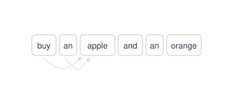

## Conceptos fundamentales

En la [lección anterior](40_attention.qmd) vimos cómo el mecanismo de atención permite a los modelos de lenguaje capturar las relaciones entre palabras en una secuencia. Sin embargo, para construir un modelo de lenguaje completo, necesitamos entender cómo se organiza la arquitectura del modelo.

La **arquitectura Transformer** es un diseño de red neuronal profunda que revolucionó la inteligencia artificial al permitir el procesamiento de datos secuenciales (como texto) de forma paralela en lugar de secuencial. Fue introducida por Google en 2017 en el artículo "Attention Is All You Need".

A diferencia de modelos anteriores (como las RNN o LSTMs) que procesaban las palabras una por una y a menudo olvidaban el inicio de una frase al llegar al final, el Transformer utiliza el mecanismo de atención para analizar la relación entre todos los elementos de una secuencia simultáneamente.

El Transformer se compone de dos partes principales: el **encoder** y el **decoder**:

* El **encoder (Codificador)**: Su función es comprender y representar. Recibe una secuencia de entrada y la transforma en una representación numérica (vectores contextualizados) que captura el significado profundo, la semántica y las relaciones gramaticales del texto. Uso principal: Tareas donde necesitas "entender" todo el contexto antes de actuar, como la clasificación de texto, análisis de sentimiento o extracción de entidades (NER).

* El **decoder (Decodificador)**: Su función es generar y predecir. Recibe una representación (o un inicio de secuencia) y predice, paso a paso, cuál es el siguiente elemento (token) más probable. Uso principal: Tareas de generación de texto, resumen creativo, diálogos o traducción automática.

## Arquitecturas transformer

Existen diferentes arquitecturas de Transformer, dependiendo de cómo se utilicen el encoder y el decoder:

* **Encoder-Decoder (Seq2Seq)**: Es la arquitectura original presentada en el paper *Attention Is All You Need*. Combina ambas partes: el Encoder procesa la entrada y el Decoder genera la salida basándose en esa representación.

Ejemplo: Traducción automática (ej. T5, BART). El modelo "entiende" la frase en inglés (Encoder) y "escribe" la traducción en español (Decoder).


* **Encoder-Only (Auto-encoding)**: El modelo se centra exclusivamente en la comprensión profunda. No tiene capacidad nativa para generar texto largo de forma coherente. Arquitectura: Utiliza el mecanismo de auto-atención bidireccional (cada palabra puede "ver" tanto las palabras a su izquierda como a su derecha simultáneamente).

Ejemplo: BERT, RoBERTa. Son excelentes para clasificar o etiquetar texto.

* **Decoder-Only (Autoregressive)**: Es la arquitectura que domina la era actual de la Inteligencia Artificial Generativa. Aquí, no hay un Encoder separado. Arquitectura: Utiliza auto-atención causal (o enmascarada). Para predecir el siguiente token, el modelo solo tiene permitido "ver" los tokens anteriores; no puede mirar hacia el futuro (la derecha).

Ejemplo: La serie GPT (OpenAI), Llama (Meta), Mistral. Al entrenarse para predecir la siguiente palabra en una enorme cantidad de datos, desarrollan una capacidad emergente de razonamiento, programación y creatividad.

## Decoder-Only Transformers

En esta lección aprenderemos a implementar un modelo de lenguaje basado en la arquitectura Decoder-Only. Este tutorial es una traducción del tutorial de StatQuest, que puede encontrar en el repositorio de GitHub: [StatQuest-Decoder-Only-Transformer](https://github.com/statquest/StatQuest-Decoder-Only-Transformer)

```{python}
import torch # torch nos permite crear tensores y también proporciona funciones auxiliares
import torch.nn as nn # torch.nn nos proporciona nn.Module(), nn.Embedding() y nn.Linear()
import torch.nn.functional as F # Esto nos da softmax() y argmax()
from torch.optim import Adam # Usaremos el optimizador Adam, que es, esencialmente,
                             # una versión ligeramente menos estocástica del descenso de gradiente estocástico.
from torch.utils.data import TensorDataset, DataLoader # Almacenaremos nuestros datos en DataLoaders

import lightning as L # Lightning facilita escribir, optimizar y escalar nuestro código
```


### Crear la entrada, la salida y los datos

En este tutorial construiremos un Transformer "solo decodificador" (Decoder-Only) sencillo que puede responder dos preguntas muy simples: **¿Qué es StatQuest?** y **¿StatQuest es qué?**, y dar a ambas la misma respuesta: **¡¡¡Asombroso!!!**

Crearemos un diccionario que asocie las palabras y los tokens con números de identificación (ID). Esto se debe a que la clase que usaremos para realizar el word embedding, `nn.Embedding()`, solo acepta números de ID como entrada, en lugar de palabras o tokens. Luego, usaremos el diccionario para crear un **Dataloader** que contenga las preguntas y las respuestas deseadas codificadas como números de ID. Finalmente, utilizaremos el **Dataloader** para entrenar el transformer.

**NOTA:** Los Dataloaders están diseñados para escalar a conjuntos de datos muy grandes, por lo que este ejemplo sencillo debería ser útil incluso cuando tengas un terabyte de texto.

**NOTA ADICIONAL:** Las **entradas** (inputs) y **etiquetas** (labels) para los datos de entrenamiento utilizados con un Transformer "solo decodificador" pueden parecer un poco extrañas al principio. Esto se debe a que un Transformer "solo decodificador" genera gran parte de la entrada del usuario además de la respuesta. Para entender qué significa esto, imaginemos que queremos entrenar a nuestro Transformer para responder a la pregunta **¿Qué es StatQuest?** con la respuesta **Asombroso**. Si al modelo lo alimentamos con el primer, **Qué**, debe generar la salida **es**. Durante el entrenamiento, podemos comparar esta salida con el segundo token conocido en la entrada y, si es diferente, utilizar esa diferencia para modificar los pesos y sesgos del modelo. Por lo tanto, aunque **es** forma parte de la **entrada**, también es parte de la **etiqueta** que usamos para evaluar si está está funcionando el Transformer y si los pesos y sesgos deben cambiarse o no. Del mismo modo, **StatQuest**, **<\EOS>** y **asombroso** también deben estar tanto en la **entrada** como en la **etiqueta**, porque sabemos que queremos que el Transformer los utilice como entradas y los genere como salidas.


```{python}
## Primero, creamos un diccionario que mapea tokens de vocabulario a números de ID...
token_to_id = {'qué' : 0,
               'es' : 1,
               'statquest' : 2,
               'asombroso': 3,
               '<EOS>' : 4, ## <EOS> = fin de secuencia
              }
## ...luego creamos un diccionario que mapea los IDs a tokens. Esto nos ayudará a interpretar la salida.
## Usamos la función "map()" para aplicar la función "reversed()" a cada tupla (ej. ('qué', 0))
## almacenada en el diccionario token_to_id. Luego usamos dict() para crear un nuevo diccionario
## a partir de las tuplas invertidas.
id_to_token = dict(map(reversed, token_to_id.items()))

## NOTA: Debido a que estamos usando un Transformer "solo decodificador", las entradas contienen
##       las preguntas ("qué es statquest?" y "statquest es qué?") seguidas
##       por un token <EOS> y luego la respuesta, "asombroso".
##       Esto es porque todos esos tokens se usarán como entradas para el Transformer
##       durante el entrenamiento.
## NOTA ADICIONAL: Cuando entrenamos de esta manera, se llama "teacher forcing" (entrenamiento supervisado).
##       El "teacher forcing" nos ayuda a entrenar la red neuronal más rápido.
inputs = torch.tensor([[token_to_id["qué"], ## entrada #1: qué es statquest <EOS> asombroso
                        token_to_id["es"],
                        token_to_id["statquest"],
                        token_to_id["<EOS>"],
                        token_to_id["asombroso"]],

                       [token_to_id["statquest"], # entrada #2: statquest es qué <EOS> asombroso
                        token_to_id["es"],
                        token_to_id["qué"],
                        token_to_id["<EOS>"],
                        token_to_id["asombroso"]]])

## NOTA: Debido a que usamos un Transformer "solo decodificador", las salidas, o
##       las predicciones, son las preguntas de entrada (menos la primera palabra) seguidas por
##       <EOS> asombroso <EOS>. El primer <EOS> significa que terminamos de procesar la pregunta
##       de entrada y el segundo <EOS> significa que terminamos de generar la salida.
labels = torch.tensor([[token_to_id["es"],
                        token_to_id["statquest"],
                        token_to_id["<EOS>"],
                        token_to_id["asombroso"],
                        token_to_id["<EOS>"]],

                       [token_to_id["es"],
                        token_to_id["qué"],
                        token_to_id["<EOS>"],
                        token_to_id["asombroso"],
                        token_to_id["<EOS>"]]])

## Ahora empaquetamos todo en un DataLoader...
dataset = TensorDataset(inputs, labels)
dataloader = DataLoader(dataset)
```

Para verificar que el DataLoader se ha creado correctamente, podemos imprimir su contenido:

```{python}

for batch in dataloader:
    print(batch)

```

Podemos ver que el DataLoader contiene dos lotes (batches), cada uno con entrada y una etiqueta. Cada entrada es una secuencia de números de ID que representan las palabras y tokens, y cada etiqueta es la secuencia de números de ID que el modelo debe aprender a generar a partir de la entrada correspondiente.

Mostramos la secuencia de tokens correspondiente a cada lote utilizando el diccionario id_to_token para convertir los números de ID de vuelta a palabras y tokens:


```{python}
for batch in dataloader:
    input_ids, label_ids = batch
    input_tokens = [id_to_token[id.item()] for id in input_ids[0]]  # Convertimos el primer lote de entrada a tokens
    label_tokens = [id_to_token[id.item()] for id in label_ids[0]]  # Convertimos el primer lote de etiqueta a tokens
    print("Entrada:", input_tokens)
    print("Etiqueta:", label_tokens)    
```

### Position Encoding (Codificación de Posición)

La codificación de posición ayuda al transformer a realizar un seguimiento del orden de las palabras en la entrada y en la salida. Por ejemplo, en la frase **El gato persigue al ratón** y **El ratón persigue al gato** tienen exactamente las mismas palabras, pero debido a las diferencias en el orden de las palabras, tienen significados muy distintos. Por lo tanto, realizar un seguimiento del orden de las palabras es muy importante. El mecanismo de atención por sí solo no puede realizar un seguimiento del orden de las palabras, ya que se basa únicamente en la similitud entre los embeddings de las palabras. Por lo tanto, necesitamos un método adicional para codificar la posición de cada palabra en la secuencia.


Hay varias formas de que un transformer realice un seguimiento del orden de las palabras, pero un método popular es utilizar una serie de curvas alternas de seno y coseno (que se muestran a continuación). El número de curvas de seno y coseno depende de cuántos números, o valores de word embedding, usemos para representar cada token. En el contexto de los Transformers, el número de números, o valores de word embedding, que usamos para representar cada token es la **dimensión** del transformer. Entonces, si la dimensión del transformer es 2, lo que significa que usa 2 números para representar cada token, entonces solo necesitamos un seno y un coseno para generar dos valores de codificación de posición.

```{python}
import numpy as np
import pandas as pd
from plotnine import *

# Ajustamos el periodo para que coincida con la visualización (posiciones 1, 2, 3...)
# Usamos un periodo donde las curvas se crucen en los puntos de posición
x_linea = np.linspace(1, 4.25, 200)
posiciones_x = np.array([1, 2, 3, 4]) 
etiquetas_x = ['1ra', '2da', '3ra', 'etc...']

# Datos para las líneas
# La 1ra dimensión (Seno) comienza en 0, la 2da (Coseno) comienza en 1
df_lineas = pd.DataFrame({
    'x': np.concatenate([x_linea, x_linea]),
    'y': np.concatenate([np.sin(x_linea * np.pi*2.5), np.cos(x_linea * np.pi*2.5)]),
    'Embedding': np.repeat(['1ra Dimensión (Seno)', '2da Dimensión (Coseno)'], 200)
})

# Datos para los puntos en las posiciones 1, 2, 3, 4
df_puntos = pd.DataFrame({
    'x': np.concatenate([posiciones_x, posiciones_x]),
    'y': np.concatenate([np.sin(posiciones_x * np.pi*2.5), np.cos(posiciones_x * np.pi*2.5)]),
    'Embedding': np.repeat(['1ra Dimensión (Seno)', '2da Dimensión (Coseno)'], 4),
    'tipo': 'Position encoding value'
})

# Graficar
plot = (
    ggplot()
    + geom_line(df_lineas, aes(x='x', y='y', color='Embedding'), size=1.2, show_legend=False)
    + geom_vline(xintercept=posiciones_x, color="grey", linetype="dotted")
    + geom_point(df_puntos, aes(x='x', y='y', shape='tipo'), size=4, fill='white', stroke=1.5)
    + facet_wrap('~Embedding', ncol=1)
    + scale_y_continuous(breaks=[-1, 0, 1], limits=[-1.2, 1.2])
    + scale_x_continuous(breaks=posiciones_x, labels=etiquetas_x)
    + scale_shape_manual(values={'Position encoding value': 'o'}) # 'o' es un círculo
    + theme_minimal()
    + labs(x="Posición del Token en la entrada", y="Valor", shape="")
    + theme(legend_position="bottom", strip_background=element_rect(fill="#eeeeee"))
)

plot
```

Por el contrario, como vemos en la ilustración a continuación, si la dimensión del transformer es 4, necesitaremos 2 curvas de seno alternadas con 2 curvas de coseno, para un total de 4 curvas.

```{python}
import numpy as np
import pandas as pd
from plotnine import *

# Definir posiciones y datos
posiciones_x = np.array([1, 2, 3, 4]) 
etiquetas_x = ['1ra', '2da', '3ra', 'etc...']
x_linea = np.linspace(1, 4.25, 200)

# Frecuencias
y1 = np.sin(x_linea * np.pi * 1.5)
y2 = np.cos(x_linea * np.pi * 1.5)
y3 = np.sin(x_linea * np.pi * 0.75)
y4 = np.cos(x_linea * np.pi * 0.75)

# Datos de líneas
df_lineas = pd.DataFrame({
    'x': np.tile(x_linea, 4),
    'y': np.concatenate([y1, y2, y3, y4]),
    'Embedding': np.repeat(['Dim 0 (Seno)', 'Dim 1 (Coseno)', 'Dim 2 (Seno)', 'Dim 3 (Coseno)'], 200)
})

# Datos de puntos (una fila por cada combinación de posición y dimensión)
df_puntos = pd.DataFrame({
    'x': np.tile(posiciones_x, 4),
    'y': np.concatenate([
        np.sin(posiciones_x * np.pi * 1.5),
        np.cos(posiciones_x * np.pi * 1.5),
        np.sin(posiciones_x * np.pi * 0.75),
        np.cos(posiciones_x * np.pi * 0.75)
    ]),
    'Embedding': np.repeat(['Dim 0 (Seno)', 'Dim 1 (Coseno)', 'Dim 2 (Seno)', 'Dim 3 (Coseno)'], 4),
    'tipo': 'Position encoding value'
})

# Graficar
plot = (
    ggplot()
    + geom_line(df_lineas, aes(x='x', y='y', color='Embedding'), size=1.0, show_legend=False)
    # Al mapear el mismo 'Embedding' aquí, plotnine automáticamente filtra los puntos por facet
    + geom_point(df_puntos, aes(x='x', y='y', shape='tipo'), size=3, fill='white', stroke=1.5)
    + geom_vline(xintercept=posiciones_x, color="grey", linetype="dotted")
    + facet_wrap('~Embedding', ncol=2)
    + scale_y_continuous(breaks=[-1, 0, 1], limits=[-1.2, 1.2])
    + scale_x_continuous(breaks=posiciones_x, labels=etiquetas_x)
    + scale_shape_manual(values={'Position encoding value': 'o'})
    + theme_minimal()
    + labs(x="Posición del Token", y="Valor", shape="")
    + theme(legend_position="bottom", strip_background=element_rect(fill="#eeeeee"))
)

plot
```


Como vemos en la ilustración anterior, el par adicional de curvas de seno y coseno tiene un periodo más amplio (se repiten con menos frecuencia) que el primer par. Aumentar el periodo para cada par adicional de curvas asegura que cada posición esté representada por una combinación única de valores.

**NOTA:** La razón por la que nos tomamos la molestia de crear una clase para realizar la codificación posicional, en lugar de simplemente añadir este código directamente al transformer, es que podemos reutilizarla fácilmente en un Transformer "solo codificador" (Encoder-Only) o en un Transformer "codificador-decodificador" (Encoder-Decoder). Así, al crear una clase que realice la codificación posicional, podemos programarla una vez y luego simplemente crear instancias cuando y donde las necesitemos.

**NOTA ADICIONAL:** Dado que los valores de codificación de posición nunca cambian, lo que significa que el primer token siempre utiliza los mismos valores de codificación de posición independientemente de cuál sea ese token, los precalculamos y los guardamos en una tabla de búsqueda (lookup table). Esto hace que añadir los valores de codificación de posición sea muy rápido.

Ahora que entendemos las ideas que queremos implementar en la clase de Codificación de Posición, ¡vamos a programarla!

```{python}
class PositionEncoding(nn.Module):

    def __init__(self, d_model=2, max_len=6):
        ## d_model = La dimensión del transformer, que también es el número de valores de embedding por token.
        ##           d_model=2, así que eso es lo que usaremos por defecto por ahora.
        ##           Sin embargo, en "Attention Is All You Need", d_model=512.
        ## max_len = número máximo de tokens que permitimos como entrada.
        ##           Como estamos precalculando los valores de codificación posicional y almacenándolos en una 
        ##           tabla de consulta (lookup table), podemos usar d_model y max_len para determinar el número 
        ##           de filas y columnas en dicha tabla.
        ##
        ##           En este ejemplo sencillo, solo estamos usando frases cortas, por lo que usamos
        ##           max_len=6 como configuración predeterminada.
        
        super().__init__()
        ## Llamamos al init de la superclase porque al crear nuestro propio método __init__(), sobrescribimos el que
        ## heredamos de nn.Module. Por tanto, debemos llamar explícitamente al __init__() de nn.Module, de lo contrario 
        ## no se inicializará. NOTA: Si no escribiéramos nuestro propio __init__(), no tendríamos que llamar a super().__init__().
        ## Alternativamente, si no quisiéramos acceder a ninguno de los métodos de nn.Module, tampoco tendríamos que llamarlo.

        ## Ahora creamos una tabla de consulta, pe, de valores de codificación posicional e inicializamos todos a 0.
        ## Para hacer esto, crearemos una matriz de ceros que tenga max_len filas y d_model columnas.
        ## por ejemplo...
        ## torch.zeros(3, 2)
        ## ...devuelve una matriz de 0s con 3 filas y 2 columnas...
        ## tensor([[0., 0.],
        ##         [0., 0.],
        ##         [0., 0.]])
        pe = torch.zeros(max_len, d_model)

        ## Ahora creamos una secuencia de números para cada posición que un token puede tener en la entrada (o salida).
        ## Por ejemplo, si los tokens de entrada fueran "I'm happy today!", entonces "I'm" obtendría la primera
        ## posición, 0; "happy" obtendría la segunda, 1; y "today!" obtendría la tercera, 2.
        ## NOTA: Dado que vamos a hacer cálculos matemáticos con estos índices de posición para crear la
        ## codificación posicional para cada uno, necesitamos que sean flotantes (floats) en lugar de enteros (ints).
        ##
        ## NOTA: Dos formas de crear flotantes son...
        ##
        ## torch.arange(start=0, end=3, step=1, dtype=torch.float)
        ##
        ## ...y...
        ##
        ## torch.arange(start=0, end=3, step=1).float()
        ##
        ## ...pero la última es igual de clara y requiere menos escritura.
        ##
        ## Por último, .unsqueeze(1) convierte la lista única de números que crea torch.arange en una matriz con
        ## una fila para cada índice y todos los índices en una sola columna. Entonces, si "max_len" = 3, crearíamos
        ## una matriz con 3 filas y 1 columna así...
        ##
        ## torch.arange(start=0, end=3, step=1, dtype=torch.float).unsqueeze(1)
        ##
        ## ...devuelve...
        ##
        ## tensor([[0.],
        ##         [1.],
        ##         [2.]])
        position = torch.arange(start=0, end=max_len, step=1).float().unsqueeze(1)

        ## Aquí es donde empezamos a hacer los cálculos para determinar las coordenadas del eje Y en las
        ## curvas de seno y coseno.
        ##
        ## Las ecuaciones de codificación posicional utilizadas en "Attention is all you need" son...
        ##
        ## PE(pos, 2i)   = sin(pos / 10000^(2i/d_model))
        ## PE(pos, 2i+1) = cos(pos / 10000^(2i/d_model))
        ##
        ## ...y vemos, dentro de las funciones sin() y cos(), que dividimos "pos" por un número que depende
        ## del índice (i) y del número total de valores PE que queremos por token (d_model).
        ##
        ## NOTA: Cuando el índice i es 0, estamos calculando las coordenadas del eje Y en el **primer par**
        ##       de curvas de seno y coseno. Cuando i=1, calculamos las coordenadas en el **segundo par**, etc.
        ##
        ## Ahora, casi todo el mundo calcula primero el término que usamos para dividir "pos", con un código así...
        ##
        ## div_term = torch.exp(torch.arange(start=0, end=d_model, step=2).float() * -(math.log(10000.0) / d_model))
        
        ## Creemos un índice para las posiciones de embedding para simplificar un poco el código...
        embedding_index = torch.arange(start=0, end=d_model, step=2).float()
        ## NOTA: Establecer step=2 da como resultado la misma secuencia de números que obtendríamos si multiplicáramos i por 2.
        ##       Así que nos ahorramos un poco de matemáticas solo configurando step=2.

        ## Y ahora, finalmente, creemos div_term...
        div_term = 1/torch.tensor(10000.0)**(embedding_index / d_model)

        ## Ahora calculamos los valores reales de la codificación posicional. Recuerda que 'pe' se inicializó como 
        ## una matriz de 0s con max_len filas y d_model columnas.
        pe[:, 0::2] = torch.sin(position * div_term) ## cada dos columnas, empezando por la 1ª, tiene valores sin()
        pe[:, 1::2] = torch.cos(position * div_term) ## cada dos columnas, empezando por la 2ª, tiene valores cos()
        
        ## Ahora "registramos" 'pe'.
        self.register_buffer('pe', pe) ## "register_buffer()" asegura que 'pe' se moverá adonde sea que se mueva el modelo.
                                       ## Entonces, si el modelo se mueve a una GPU, 'pe' también se moverá a esa GPU,
                                       ## lo que hace que acceder a 'pe' sea relativamente rápido.

    ## Debido a que esta clase hereda de nn.Module, el método forward() se llama por defecto cuando usamos un objeto
    ## PositionEncoding(). Así, pe(word_embeddings) llamará a forward(), que es donde añadiremos los 
    ## valores de codificación posicional a los valores de word embedding.
    def forward(self, word_embeddings):
        return word_embeddings + self.pe[:word_embeddings.size(0), :]
```

Observe que los embeddings posicionales se añaden a los embeddings de las palabras. Esto se debe a que el mecanismo de atención solo puede realizar un seguimiento de la similitud entre los embeddings de las palabras, por lo que al añadir los embeddings posicionales a los embeddings de las palabras, el mecanismo de atención también puede realizar un seguimiento del orden de las palabras. Por ejemplo, si el primer token en la entrada es "qué", el segundo token es "es" y el tercer token es "statquest", entonces el embedding posicional para "qué" se añadirá al embedding de "qué", el embedding posicional para "es" se añadirá al embedding de "es", etc. De esta manera, cada token tiene una representación única que combina tanto su significado (a través del embedding de la palabra) como su posición en la secuencia (a través del embedding posicional).


Podemos probar qué valores de codificación posicional se añaden a los embeddings de las palabras para cada token en la entrada. Para hacer esto, crearemos una instancia de la clase PositionEncoding() y luego llamaremos a forward() con un tensor de word embeddings de ejemplo.

```{python}
# Crear una instancia de PositionEncoding
position_encoding = PositionEncoding(d_model=4, max_len=6)
# Crear un tensor de word embeddings de ejemplo (6 tokens, cada uno con un embedding de dimensión 4)
word_embeddings = torch.tensor([[0.0, 0.0, 0.0, 0.0],
                                [0.0, 0.0, 0.0, 0.0],
                                [0.0, 0.0, 0.0, 0.0],
                                [0.0, 0.0, 0.0, 0.0],
                                [0.0, 0.0, 0.0, 0.0],
                                [0.0, 0.0, 0.0, 0.0]])  # shape: (6, 4)
# Llamar a forward() para obtener los embeddings con codificación posicional añadida
embeddings_con_posicion = position_encoding(word_embeddings)
print(embeddings_con_posicion)
```

### Atención (Attention)

Vamos a programar una clase `Attention` para realizar todos los tipos de atención que un transformer podría necesitar: **Auto-Atención (Self-Attention)**, **Auto-Atención Enmascarada (Masked Self-Attention)** (la cual es utilizada por el Decodificador durante el entrenamiento) y **Atención Codificador-Decodificador (Encoder-Decoder Attention)**.

La **Auto-Atención** es un tipo de atención utilizada en transformers de tipo "Codificador-Decodificador" y "Solo Codificador". Permite que cada palabra en una frase defina una relación con cualquier otra palabra en la misma frase, independientemente del orden de las palabras. En otras palabras, si la frase es **Buy an apple and an orange**, entonces la palabra **apple** puede definir su relación con cada palabra en esa frase, incluyendo palabras que vinieron después, como **orange** y antes, como **buy**, tal como ilustran las flechas azules en la figura a continuación.


La **Auto-Atención Enmascarada** es utilizada por transformers de tipo "Codificador-Decodificador" y "Solo Decodificador", y permite que cada palabra en una frase defina una relación consigo misma y con las palabras que vinieron antes. En otras palabras, la **Auto-Atención Enmascarada** evita que el transformer "mire hacia adelante". Esto se ilustra a continuación, donde la palabra **apple** puede definir relaciones consigo misma y con todo lo que vino anteriormente en la entrada. En los transformers de tipo "Codificador-Decodificador", la **Auto-Atención Enmascarada** se utiliza durante el entrenamiento, cuando sabemos cuál debería ser la salida, pero aun así forzamos al decodificador a generarla un token a la vez, limitando así la atención solo a las palabras de salida que aparecieron antes. Por el contrario, los transformers de tipo "Solo Decodificador" utilizan la **Auto-Atención Enmascarada** todo el tiempo, tanto en la entrada como en la salida, durante el entrenamiento y la inferencia. Por lo tanto, aunque el transformer "Solo Decodificador" puede ver toda la entrada durante el entrenamiento y la inferencia, sigue permitiendo que los valores de atención para cada palabra dependan únicamente de las palabras que vinieron antes.





La **Atención Codificador-Decodificador** se utiliza únicamente en transformers de tipo "Codificador-Decodificador", donde existe una separación clara entre la parte del transformer que procesa la entrada (el codificador) y la parte que genera la salida (el decodificador). La **Atención Codificador-Decodificador** permite que cada palabra en la salida (en el decodificador) defina relaciones con todas las palabras en la entrada (en el codificador).


Ahora que tenemos una idea general de los tres tipos de atención utilizados en los transformers, podemos hablar de cómo se calcula. Ya vimos en la [lección anterior](40_attention.qmd) que el mecanismo de atención se calcula utilizando la siguiente fórmula:


$$
\text{Attention}(Q, K, V) = \text{softmax}\left(\frac{Q K^T}{\sqrt{d_k}}\right)V
$$


La fórmula para la atención enmascarada es muy similar, pero con un término adicional, $M$, que representa la máscara que se aplica a los valores de atención para evitar que el transformer "mire hacia adelante". Lo que se hace es poner un valor muy negativo en las posiciones que no deben ser consideradas. Así, al aplicar softmax, esas posiciones tendrán valores muy pequeños tendrán probabilidad cero y no influirán en la atención:

$$
\text{Masked Attention}(Q, K, V) = \text{softmax}\left(\frac{Q K^T}{\sqrt{d_k}} + M\right)V
$$

En el siguiente ejemplo se muestra cómo se aplica una máscara a los valores de atención antes de aplicar softmax. Vemos que la primera fila del tensor, que representa a la primera palabra, sólo puede prestar atención así misma, ya que no tiene palabras anteriores. La segunda fila, que representa a la segunda palabra, puede prestar atención a la primera y a sí misma, pero no a la tercera. La tercera fila, que representa a la tercera palabra, puede prestar atención a las dos palabras anteriores y a sí misma:

```{python}
scores = torch.tensor([[1.0, 2.0, 3.0],
                   [4.0, 5.0, 6.0],
                   [7.0, 8.0, 9.0]])

mask = torch.tensor([[False, True, True],
                    [False, False, True],
                    [False, False, False]])

masked_scores = scores.masked_fill(mask=mask, value=-1e9)

attention_percents = F.softmax(masked_scores, dim=1)

print("Scores originales:")
print(scores)
print("\nScores enmascarados:")
print(masked_scores)
print("\nPorcentajes de atención después de aplicar softmax:")
print(attention_percents)


``` 

Programamos una capa capaz de calcular todos los tipos de atención que un transformer podría necesitar, incluyendo la atención enmascarada:

```{python}
class Attention(nn.Module):

    def __init__(self, d_model=2):
        ## d_model = el número de valores de embedding por token.
        
        super().__init__()

        self.d_model = d_model

        ## Inicializamos los pesos (W) que usaremos para crear los números de 
        ## consulta (q), clave (k) y valor (v) para cada token.
        self.W_q = nn.Linear(in_features=d_model, out_features=d_model, bias=False)
        self.W_k = nn.Linear(in_features=d_model, out_features=d_model, bias=False)
        self.W_v = nn.Linear(in_features=d_model, out_features=d_model, bias=False)

        ## NOTA: En este ejemplo simple, no estamos entrenando con los datos en "lotes" (batches).
        ##       Sin embargo, al definir variables para row_dim y col_dim, podríamos 
        ##       permitir lotes configurando row_dim a 1 y col_dim a 2.
        self.row_dim = 0
        self.col_dim = 1


    def forward(self, encodings_for_q, encodings_for_k, encodings_for_v, mask=None):
        ## Creamos las consultas, claves y valores usando las codificaciones
        ## asociadas con cada token.
        ##
        ## NOTA: Para la Atención Codificador-Decodificador, las codificaciones para q provienen
        ##       del decodificador y las codificaciones para k y v provienen de la salida
        ##       del codificador.
        ##       En todos los demás tipos de atención, las codificaciones provienen 
        ##       de la misma fuente.
        q = self.W_q(encodings_for_q)
        k = self.W_k(encodings_for_k)
        v = self.W_v(encodings_for_v)

        ## Calculamos las puntuaciones de atención
        ## la ecuación es (q * k^T) / sqrt(d_model)
        ## NOTA: Parece que la mayoría de la gente usa "indexación inversa" para las dimensiones al trasponer k.
        ##       k.transpose(dim0, dim1) traspondrá k intercambiando dim0 y dim1.
        ##       En notación matricial estándar, querríamos intercambiar filas (dim=0) con columnas (dim=1).
        sims = torch.matmul(q, k.transpose(dim0=self.row_dim, dim1=self.col_dim))

        scaled_sims = sims / torch.tensor(k.size(self.col_dim)**0.5)

        if mask is not None:
            ## Aquí estamos enmascarando elementos a los que no queremos prestar atención,
            ## como los tokens que vienen después del token actual.
            ## También podemos usar el enmascaramiento para bloquear el token <PAD>,
            ## que se utiliza cuando tenemos un lote de secuencias de entrada y no 
            ## todas tienen exactamente la misma longitud.
            ##
            ## Reemplazamos <PAD>, o los tokens que vienen después del actual,
            ## con un número negativo muy grande para que la función SoftMax() 
            ## asigne a todos los elementos enmascarados un valor de salida 
            ## (o "probabilidad") de 0.
            scaled_sims = scaled_sims.masked_fill(mask=mask, value=-1e9)

        ## Aplicamos softmax para determinar qué porcentaje del valor de cada token
        ## usar en los valores de atención finales.
        attention_percents = F.softmax(scaled_sims, dim=self.col_dim)

        ## Escalamos los valores por sus porcentajes asociados y los sumamos.
        attention_scores = torch.matmul(attention_percents, v)

        return attention_scores
```

### Decoder-Only Transformer

En esta sección vamos a construir un Transformer "solo decodificador" (Decoder-Only) simplificado. Se compone de los siguientes elementos:

- Word Embedding
- Position Encoding
- Masked Self-Attention
- Residual Connections
- A fully connected layer
- SoftMax (la función de pérdida utilizada `nn.CrossEntropyLoss()`, ya aplica sofmax, con lo que no es necesaria).

Los tres primeros elementos deberían ya ser conocidos:

* Word Embedding: es una capa que convierte los números de ID de los tokens en vectores de números flotantes (floats) que representan el significado de cada token.

* Position Encoding: es una capa que añade información sobre la posición de cada token en la secuencia.

* Masked Self-Attention: es una capa que permite que cada token preste atención a sí mismo y a los tokens anteriores en la secuencia.

* **Residual Connections**: son conexiones que permiten que la información fluya directamente a través de la red sin ser modificada por las capas intermedias, lo que ayuda a prevenir el problema del gradiente desaparecido. También preservan la identidad. Ya que permiten que la red aprenda a realizar mejoras sobre la información existente en lugar de intentar recrearla desde cero en cada capa. Si una capa no tiene nada útil que aportar, la red simplemente puede aprender a ignorarla, haciendo que la salida de esa capa sea cercana a cero (aprendiendo la función identidad). Por último, aportan estabilidad al ayudar a que el entrenamiento sea posible en modelos con cientos de capas; sin ellas, el entrenamiento sería inestable o simplemente no convergería.

* **Fully connected layer**: es una capa que toma la salida del Masked Self-Attention y la transforma en un vector del mismo tamaño que el vocabulario, donde cada valor representa la probabilidad de que ese token sea el siguiente en la secuencia. Puede haber varias capas fully connected con una función de activación entre ellas, pero en este ejemplo simple solo usaremos una. La justificación para usar una capa fully connected es que si la atención es el mecanismo de búsqueda (¿a qué información debo prestar atención?), la capa FFN es el mecanismo de procesamiento (¿qué significa esta información?). Es donde el modelo realmente "razona" o integra la información que acaba de recopilar. El mecanismo de atención es principalmente una operación de mezcla lineal (un promedio ponderado). Las capas FFN añaden una no linealidad (usualmente mediante funciones como ReLU o GELU). Esto le da al modelo la capacidad de aprender funciones complejas y patrones que no son simples combinaciones lineales. Gran parte del conocimiento que el modelo "sabe" (datos, hechos, gramática) parece almacenarse en los pesos de estas capas FFN, funcionando como una base de conocimiento distribuida.

```{python}
class DecoderOnlyTransformer(L.LightningModule):

    def __init__(self, num_tokens=4, d_model=2, max_len=6):
        super().__init__()
        
        ## NOTA: En este ejemplo simple, solo usamos un decodificador de "una sola capa".
        ##       Si quisiéramos tener múltiples capas de decodificador, tomaríamos
        ##       la salida de un módulo decodificador y la usaríamos como entrada
        ##       para el siguiente módulo.

        self.we = nn.Embedding(num_embeddings=num_tokens,
                               embedding_dim=d_model)

        self.pe = PositionEncoding(d_model=d_model,
                                   max_len=max_len)

        self.self_attention = Attention(d_model=d_model)
        
        ## NOTA: En este ejemplo simple, no estamos haciendo atención multi-cabezal (multi-head).
        ##       Si quisiéramos hacerla, podríamos inicializar más objetos Attention 
        ##       y usar una capa lineal para reducir la dimensión de vuelta a d_model.

        self.fc_layer = nn.Linear(in_features=d_model, out_features=num_tokens)

        self.loss = nn.CrossEntropyLoss()


    def forward(self, token_ids):
        word_embeddings = self.we(token_ids)
        position_encoded = self.pe(word_embeddings)

        ## Para el transformer solo decodificador (decoder-only), necesitamos usar 
        ## "auto-atención enmascarada" para que, durante el entrenamiento, el modelo 
        ## no pueda hacer trampa mirando qué palabras vienen después de la actual.
        ## Creamos una matriz donde el triángulo inferior tiene 1s y el resto 0s.
        mask = torch.tril(torch.ones((token_ids.size(dim=0), token_ids.size(dim=0)), device=self.device))
        
        ## NOTA: device=self.device asegura que la máscara esté en el mismo dispositivo (CPU/GPU) que el modelo.

        ## Reemplazamos los 0s (que representan palabras futuras que queremos enmascarar) 
        ## con "True", y los 1s del triángulo inferior con "False".
        mask = mask == 0

        self_attention_values = self.self_attention(position_encoded,
                                                    position_encoded,
                                                    position_encoded,
                                                    mask=mask)

        ## Conexión residual: sumamos la entrada original a la salida de la atención
        residual_connection_values = position_encoded + self_attention_values

        ## Capa totalmente conectada para proyectar de vuelta al tamaño del vocabulario
        fc_layer_output = self.fc_layer(residual_connection_values)

        return fc_layer_output


    def configure_optimizers(self):
        ## configuramos el optimizador y la tasa de aprendizaje
        return Adam(self.parameters(), lr=0.1)


    def training_step(self, batch, batch_idx):
        ## training_step() es llamado por el trainer de Lightning durante el entrenamiento.
        input_tokens, labels = batch # recoger entrada y etiquetas
        output = self.forward(input_tokens[0])
        loss = self.loss(output, labels[0])

        return loss
```

Ahora que hemos programado la clase `DecoderOnlyTransformer()`, veamos si funciona correctamente sin necesidad de entrenamiento. ¡Nunca se sabe, podría funcionar así tal cual!

Para usar el transformer, pasamos una frase de entrada, ya sea **qué es statquest <EOS>** o **statquest es qué <EOS>**, a través del transformer para obtener el siguiente token predicho. Si el siguiente token predicho no es **<EOS>**, entonces agregamos el token predicho a los tokens de entrada, volvemos a pasarlo por el transformer y repetimos el proceso hasta que obtengamos el token **<EOS>** o alcancemos la longitud máxima de la secuencia.

```{python}

## Establecemos la semilla reproducir los resultados.
L.seed_everything(seed=42)

## Primero, creamos una instancia del modelo DecoderOnlyTransformer()
model = DecoderOnlyTransformer(num_tokens=len(token_to_id), d_model=2, max_len=6)

## Ahora creamos la entrada para el transformer...
model_input = torch.tensor([token_to_id["qué"],
                            token_to_id["es"],
                            token_to_id["statquest"],
                            token_to_id["<EOS>"]])
input_length = model_input.size(dim=0)

## Obtenemos las predicciones del modelo
predictions = model(model_input)

## NOTA: "predictions" es la salida de la capa totalmente conectada,
##       no de una función softmax(). Como vamos a seleccionar el elemento 
##       con el valor más alto, podemos usar argmax directamente.
## NOTA: "predictions" es una matriz, con una fila de valores predichos
##       por cada token de entrada. Como solo queremos la predicción de la
##       última fila (la predicción más reciente), usamos el índice -1.
predicted_id = torch.tensor([torch.argmax(predictions[-1, :])])

## Almacenaremos predicted_id en un array, predicted_ids, al que 
## añadiremos cada vez que predigamos un nuevo token.
predicted_ids = predicted_id

## Usamos un bucle para predecir tokens hasta obtener un token <EOS>.
max_length = 6
for i in range(input_length, max_length):
    if (predicted_id == token_to_id["<EOS>"]): # si la predicción es <EOS>, terminamos
        break

    model_input = torch.cat((model_input, predicted_id))

    predictions = model(model_input)
    predicted_id = torch.tensor([torch.argmax(predictions[-1, :])])
    predicted_ids = torch.cat((predicted_ids, predicted_id))

## Imprimimos la frase resultante.
print("Tokens predichos:\n")
for id in predicted_ids:
    print("\t", id_to_token[id.item()])
``` 

Y, sin entrenamiento, el transformer predice **<EOS>**, pero queríamos que predijera **awesome <EOS>**. Por lo tanto, dado que el transformer no respondió correctamente al *prompt*, tendremos que entrenarlo.

### Entrenamiento del Transformer "Solo Decodificador"

Simplementa llamamos a `trainer.fit()` para entrenar el modelo. Dado que nuestro modelo es muy simple, no necesitamos entrenarlo durante muchas épocas.

```{python}
trainer = L.Trainer(max_epochs=30)
trainer.fit(model, train_dataloaders=dataloader)
```

### Prueba del Transformer entrenado

Para utilizar el transformer que acabamos de entrenar, simplemente repetimos lo que hicimos anteriormente, solo que esta vez usamos el transformer entrenado en lugar de uno sin entrenar. Primero, veremos si responde correctamente al prompt **¿qué es statquest?**?

```{python}
model_input = torch.tensor([token_to_id["qué"],
                            token_to_id["es"],
                            token_to_id["statquest"],
                            token_to_id["<EOS>"]])
input_length = model_input.size(dim=0)

predictions = model(model_input)
predicted_id = torch.tensor([torch.argmax(predictions[-1,:])])
predicted_ids = predicted_id

for i in range(input_length, max_length):
    if (predicted_id == token_to_id["<EOS>"]): # if the prediction is <EOS>, then we are done
        break

    model_input = torch.cat((model_input, predicted_id))

    predictions = model(model_input)
    predicted_id = torch.tensor([torch.argmax(predictions[-1,:])])
    predicted_ids = torch.cat((predicted_ids, predicted_id))

print("Predicted Tokens:\n")
for id in predicted_ids:
    print("\t", id_to_token[id.item()])
```

Vemos que responde correctamente. Ahora probemos el otro prompt, **statquest es qué?**.

```{python}
model_input = torch.tensor([token_to_id["statquest"],
                            token_to_id["es"],
                            token_to_id["qué"],
                            token_to_id["<EOS>"]])
input_length = model_input.size(dim=0)
predictions = model(model_input)
predicted_id = torch.tensor([torch.argmax(predictions[-1,:])])
predicted_ids = predicted_id
for i in range(input_length, max_length):
    if (predicted_id == token_to_id["<EOS>"]): # if the prediction is <EOS>, then we are done
        break

    model_input = torch.cat((model_input, predicted_id))

    predictions = model(model_input)
    predicted_id = torch.tensor([torch.argmax(predictions[-1,:])])
    predicted_ids = torch.cat((predicted_ids, predicted_id))

print("Predicted Tokens:\n")
for id in predicted_ids:
    print("\t", id_to_token[id.item()])
```

Vemos que también responde correctamente a este prompt. Por lo tanto, nuestro transformer "solo decodificador" funciona correctamente. Sin embargo, es un modelo muy simple y no es capaz de generar respuestas creativas o interesantes. Para eso, necesitaríamos un modelo más grande y entrenarlo con una gran cantidad de datos.


## Simulador de un Transformer "Solo Decodificador"

En el siguiente [enlace](https://poloclub.github.io/transformer-explainer/) puedes encontrar un simulador interactivo de un Transformer "Solo Decodificador"