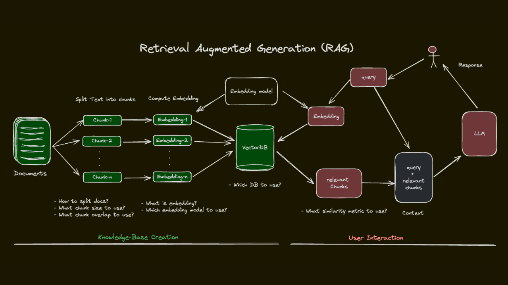

## Introducción

RAG (Retrieval-Augmented Generation) es una técnica que combina la generación de texto de los LLM con la recuperación de información de fuentes externas, como bases de datos vectoriales. Esta metodología permite superar las limitaciones de conocimiento estático de los LLM, proporcionando respuestas más precisas y actualizadas al aprovechar datos relevantes almacenados externamente.

En un sistema RAG, cuando un usuario realiza una consulta, el proceso se divide en tres etapas principales:

1. **Recuperación:** El sistema utiliza la consulta para buscar información relevante en una base de datos vectorial. Esta búsqueda se basa en la similitud semántica, lo que permite encontrar datos que no coinciden exactamente con las palabras de la consulta pero que son conceptualmente relacionados.

2. **Integración:** La información recuperada se integra con el conocimiento interno del LLM. Esto puede implicar la combinación de fragmentos de texto, datos estructurados o cualquier otro tipo de información que el modelo pueda procesar.

3. **Generación:** Una vez obtenida la información relevante, el sistema utiliza un modelo de lenguaje (LLM) para generar una respuesta coherente y contextualmente apropiada, integrando la información recuperada con el conocimiento interno del modelo.

Esta combinación de recuperación y generación permite a los sistemas RAG proporcionar respuestas más precisas, actualizadas y contextualmente relevantes, superando las limitaciones de los LLM tradicionales que dependen únicamente de su conocimiento preentrenado.





## Chunking

Cuando tenemos un documento extenso, es necesario dividirlo en fragmentos más pequeños (chunking) para que el modelo pueda procesarlos y recuperarlos de manera eficiente. 

Elegir una buena estrategia de fragmentación de texto es clave para construir una solución RAG. Al fragmentar texto, tenemos varias estrategias entre las que elegir. Los objetivos generales de una estrategia de fragmentación son los siguientes:

* Capturar con precisión el significado del texto dentro de nuestros embeddings.

* Garantizar que se incluya suficiente información contextualmente relevante.

*Mantener la longitud de los tokens dentro del límite de solicitud del modelo de embedding


Estos objetivos pueden ser contradictorio, por lo que elegir una estrategia de fragmentación es un acto de equilibrio.

### LangChain

LangChain es una biblioteca de Python que facilita la construcción de aplicaciones de lenguaje natural utilizando modelos de lenguaje. Proporciona herramientas para manejar la fragmentación de texto, la generación de embeddings y la integración con bases de datos vectoriales, lo que la convierte en una opción ideal para implementar un sistema RAG.

### Estrategias de chunking

* Tamaño fijo: El enfoque más básico. Divide el texto basándose en un conteo de caracteres. Generalmente no se recomienda, pero es bueno para entender el concepto.
* Recursivo: El mejor fragmentador de texto general para empezar. Tiene en cuenta la estructura del texto dividiéndolo según separadores comunes (por ejemplo, párrafos, saltos de línea y espacios). Los fragmentos son de tamaño variable, pero tenemos una mayor probabilidad de capturar ideas más completas.
* Basado en documentos: El mejor para tipos de documentos específicos. Un fragmentador que considera el tipo de documento (como Markdown, PDF o HTML). Es esencialmente igual al recursivo, pero utiliza caracteres de división personalizados según el tipo de documento que se esté fragmentando.
* Semántico: Para un enfoque más personalizado. Intenta construir fragmentos utilizando embeddings de oraciones para identificar contenido relacionado semánticamente. Requiere un modelo de embedding. Generalmente es más lento y requiere más recursos de computación que las estrategias anteriores.
* Agéntico: Más experimental que listo para producción. Utiliza un agente para construir fragmentos semánticos. Al momento de escribir esto, este método es lento y no escala bien, pero puedes experimentar con opciones para tus casos de uso (consulta la Parte V para más información sobre agentes).


### Ejemplos de estrategias de chunking

```{python}
from langchain_text_splitters import CharacterTextSplitter

text = """Nuestro sistema requiere autenticación de múltiples factores (MFA). Esto ayuda a mantener su cuenta segura. Esta guía paso a paso lo guiará a través de la configuración de MFA."""

splitter = CharacterTextSplitter(
  separator="",
  chunk_size=70,
  chunk_overlap=20,
  keep_separator='end'
)

chunks = splitter.split_text(text)

print("Fragmentos:\n")

for idx, chunk in enumerate(chunks):
  print(f"{idx + 1}:  {chunk}\n- número de caracteres: {len(chunk)}")
```

```{python}
from langchain_text_splitters import RecursiveCharacterTextSplitter

text = """"Nuestro sistema requiere autenticación de múltiples factores (MFA). Esto ayuda a mantener su cuenta segura. Esta guía paso a paso lo guiará a través de la configuración de MFA."""

splitter = RecursiveCharacterTextSplitter(
  separators=["\n\n", "\n", ".", " ", ""],
  chunk_size=70,
  chunk_overlap=0,
  keep_separator='end'
)

chunks = splitter.split_text(text)

print("Fragmentos:\n")

for idx, chunk in enumerate(chunks):
  print(f"{idx + 1}:  {chunk}\n- número de caracteres: {len(chunk)}")
```


## Ejemplo

En este ejemplo, implementaremos un sistema RAG utilizando el modelo `jina/jina-embeddings-v2-base-es` que está entrenado para generar embeddings en español y en inglés, y la base de datos vectorial Chroma para almacenar y recuperar información relevante. Este modelo admite una ventana de contexto de 8.192 tokens.

Vamos a crear un sistema RAG para la documentación de este repositorio. La siguiente función devuelve todas las páginas HTML que son enlaces internos a una URL dada. El parámetro `max_depth` controla la profundidad de la búsqueda (0 = solo la URL dada, -1 = profundidad infinita).

```{python}
import asyncio
from urllib.parse import urljoin, urlparse, urlunparse
from playwright.async_api import async_playwright

async def get_internal_links(
    url: str, max_depth: int = -1, extensions: list[str] = ["html", "htm"]
) -> list[str]:
    
    parsed_initial = urlparse(url)
    
    if parsed_initial.path.endswith(tuple(f".{ext}" for ext in extensions)):
        base_dir = parsed_initial.path.rsplit('/', 1)[0] + '/'
    else:
        base_dir = parsed_initial.path if parsed_initial.path.endswith('/') else parsed_initial.path + '/'

    def normalize_url(target_url: str) -> str:
        parsed = urlparse(target_url)
        path = parsed.path
        
        for ext in extensions:
            if path.endswith(f"/index.{ext}"):
                path = path[:-len(f"index.{ext}")]
                break
                
        if not path.endswith('/') and not path.endswith(tuple(f".{ext}" for ext in extensions)):
            path += '/'
            
        return urlunparse((parsed.scheme, parsed.netloc, path, '', '', ''))

    base_clean = normalize_url(url)
    
    # Usaremos un diccionario para guardar el estado: {url_normalizada: existe_bool}
    # Esto nos sirve para el resultado final y como registro de visitados
    discovered_urls = {} 
    to_visit = [(base_clean, 0)]

    def is_valid_internal_structure(target_url: str) -> bool:
        parsed_target = urlparse(target_url)
        
        if parsed_target.netloc != parsed_initial.netloc:
            return False
            
        if not parsed_target.path.startswith(base_dir):
            return False
            
        has_valid_ext = parsed_target.path.endswith(tuple(f".{ext}" for ext in extensions))
        is_folder = parsed_target.path.endswith('/')
        if not (has_valid_ext or is_folder):
            return False
                
        return True

    async with async_playwright() as p:
        browser = await p.chromium.launch(headless=True)
        page = await browser.new_page()

        while to_visit:
            current_url, depth = to_visit.pop(0)

            if current_url in discovered_urls:
                continue

            # Si max_depth es 0, solo validamos la primera y paramos
            if max_depth == 0:
                try:
                    response = await page.goto(current_url, wait_until="domcontentloaded")
                    if response and response.status == 200:
                        discovered_urls[current_url] = True
                except:
                    pass
                break

            try:
                # Navegar a la URL
                response = await page.goto(current_url, wait_until="domcontentloaded")
                
                # SI LA PÁGINA DEVUELVE UN 404 (O CUALQUIER ERROR), LA MARCAMOS COMO FALSA Y PASAMOS
                if not response or response.status != 200:
                    discovered_urls[current_url] = False
                    continue
                
                # Si es un 200 OK, es una página real y válida
                discovered_urls[current_url] = True

                # Control de profundidad máxima para seguir explorando hacia adentro
                if max_depth != -1:
                    parsed_current = urlparse(current_url)
                    relative_path = parsed_current.path[len(base_dir):]
                    if relative_path.endswith(tuple(f".{ext}" for ext in extensions)):
                        relative_path = relative_path.rsplit('/', 1)[0] if '/' in relative_path else ''
                    actual_depth = len([p for p in relative_path.split('/') if p])
                    
                    if actual_depth >= max_depth:
                        continue # No extraemos más enlaces de esta página si ya alcanzamos el límite

                # Extraer enlaces de la página actual válida
                hrefs = await page.eval_on_selector_all("a", "elements => elements.map(e => e.href)")
                
                for href in hrefs:
                    if not href:
                        continue
                    
                    absolute_url = urljoin(current_url, href)
                    clean_abs = normalize_url(absolute_url)

                    if clean_abs not in discovered_urls and is_valid_internal_structure(clean_abs):
                        to_visit.append((clean_abs, depth + 1))
                        
            except Exception as e:
                # Si da un error de carga de red, asumimos que no es válida
                discovered_urls[current_url] = False

        await browser.close()

    # Filtrar el diccionario para devolver SOLO las URLs confirmadas (True) y ordenarlas
    valid_links = [url for url, exists in discovered_urls.items() if exists]
    return sorted(valid_links)
```

Ejemplo de uso:

```{python}
url = "https://surtich.github.io/IA-para-desarrolladores/qmd/index.html"

internal_links = await get_internal_links(url, max_depth=1)
print(f"Enlaces internos encontrados en {url}:\n")
internal_links
```

Ahora creamos una función que permita extraer el texto de cada página HTML dada una URL. Esta función también utiliza Playwright para cargar la página y extraer su contenido textual.

```{python}
import asyncio
from playwright.async_api import async_playwright

async def extract_text_from_urls(urls: list[str]) -> dict[str, str]:
    """
    Extrae el texto de una lista de URLs preservando la estructura de párrafos
    y saltos de línea, ideal para procesar con un RecursiveCharacterTextSplitter.
    """
    results = {}

    async with async_playwright() as p:
        browser = await p.chromium.launch(headless=True)
        page = await browser.new_page()

        for url in urls:
            try:
                await page.goto(url, wait_until="domcontentloaded")
                
                # Eliminamos la basura visual e informativa directamente en el DOM
                clean_text = await page.evaluate("""() => {
                    const bodyClone = document.body.cloneNode(true);
                    
                    const selectorsToRemove = [
                        'script', 'style', 'noscript', 'iframe', 
                        'header', 'footer', 'nav', 'aside', 
                        '.menu', '.sidebar', '#sidebar', '#header', '#footer'
                    ];
                    
                    selectorsToRemove.forEach(selector => {
                        bodyClone.querySelectorAll(selector).forEach(el => el.remove());
                    });
                    
                    return bodyClone.innerText;
                }""")
                
                # --- PROCESAMIENTO MANTENIENDO SALTOS DE LÍNEA ---
                # 1. Dividimos por líneas para limpiar espacios fantasmas en los extremos
                lines = [line.strip() for line in clean_text.splitlines()]
                
                # 2. Agrupamos manteniendo la separación, pero evitando acumular 
                # decenas de líneas vacías seguidas si el HTML tenía mucho espacio en blanco.
                cleaned_lines = []
                for line in lines:
                    if line:  # Si la línea tiene contenido, se añade tal cual
                        cleaned_lines.append(line)
                    elif cleaned_lines and cleaned_lines[-1] != "":  
                        # Si es una línea vacía, solo dejamos UNA para separar párrafos/secciones
                        cleaned_lines.append("")

                # 3. Volvemos a unir el texto usando el salto de línea estándar
                final_text = "\n".join(cleaned_lines).strip()
                
                results[url] = final_text
                
            except Exception as e:
                print(f"Error al extraer texto de {url}: {e}")
                results[url] = ""

        await browser.close()
        
    return results
``` 


Ejemplo de uso:

```{python}
texts = await extract_text_from_urls(internal_links)
for url, text in texts.items():
    print(f"Texto extraído de {url}:\n{text[:200]}...\n")
``` 


```{python}
import chromadb
from chromadb import Collection
from typing import List
from langchain_text_splitters import RecursiveCharacterTextSplitter
from chromadb.utils.embedding_functions.ollama_embedding_function import (
    OllamaEmbeddingFunction
)

class DocumentVectorStore:
    def __init__(
        self, 
        corpus_data: dict[str, str], 
        collection_name: str = "paginas_web_ia", 
        batch_size: int = 20,
        model_name: str = "jina/jina-embeddings-v2-base-es"
    ):
        """
        Inicializa la base de datos vectorial usando Jina Embeddings v2 (Español).
        
        :param corpus_data: Diccionario con formato {url: texto_extraido}
        :param collection_name: Nombre de la colección en ChromaDB
        :param batch_size: Número de fragmentos procesados por lote al generar embeddings
        """
        # Configurar la función de embedding para usar Jina v2 en Ollama
        jina_embedding_function = OllamaEmbeddingFunction(
            url="http://localhost:11434",
            model_name=model_name
        )

        # Inicializar cliente de Chroma
        client = chromadb.Client()

        # --- PREVENCIÓN DE DUPLICADOS: BORRAR SI EXISTE ---
        try:
            client.get_collection(name=collection_name)
            client.delete_collection(name=collection_name)
            print(f"Colección antigua '{collection_name}' eliminada para evitar conflictos.\n")
        except (ValueError, Exception):
            pass

        # Crear la colección limpia
        self.collection: Collection = client.create_collection(
            name=collection_name,
            embedding_function=jina_embedding_function,
        )

        # Configurar el splitter óptimo para mantener párrafos estructurados
        splitter = RecursiveCharacterTextSplitter(
            chunk_size=1500,
            chunk_overlap=200,
            separators=["\n\n", "\n", " ", ""]
        )

        all_chunks = []
        all_metadatas = []
        all_ids = []
        
        global_chunk_idx = 1
        total_documentos = len(corpus_data)

        # ==========================================
        # FASE 1: LOG DE PROCESAMIENTO DE TEXTO
        # ==========================================
        print("--- FASE 1: Procesando y troceando documentos ---")
        for idx, (url, document_text) in enumerate(corpus_data.items(), start=1):
            print(f"[{idx}/{total_documentos}] Procesando: {url}")
            
            if not document_text.strip():
                print(f"   ⚠️ Documento vacío o con error de carga. Omitiendo...")
                continue
                
            chunks = splitter.split_text(document_text)
            print(f"   ✨ Generados {len(chunks)} fragmentos.")
            
            for chunk in chunks:
                all_chunks.append(chunk)
                all_metadatas.append({"source": url})
                all_ids.append(f"doc_{global_chunk_idx}")
                global_chunk_idx += 1

        print("\n--- FASE 2: Generando Embeddings e indexando en ChromaDB ---")
        total_chunks = len(all_chunks)
        
        if total_chunks == 0:
            print("❌ No se encontraron textos válidos para indexar.")
            return

        # ==========================================
        # FASE 2: LOG DE EMBEDDINGS (Por lotes configurables)
        # ==========================================
        for i in range(0, total_chunks, batch_size):
            # Extraer el lote actual usando el parámetro batch_size
            batch_chunks = all_chunks[i:i + batch_size]
            batch_metadatas = all_metadatas[i:i + batch_size]
            batch_ids = all_ids[i:i + batch_size]
            
            # Calcular el límite superior para el mensaje de log
            hasta_chunk = min(i + batch_size, total_chunks)
            print(f"[{hasta_chunk}/{total_chunks}] Generando embeddings e insertando fragmentos...")
            
            # Añadir el lote a la colección
            self.collection.add(
                documents=batch_chunks,
                metadatas=batch_metadatas,
                ids=batch_ids
            )

        print(f"\n¡Hecho! Indexados con éxito los {total_chunks} fragmentos en la colección '{collection_name}'.")

    def query(self, question: str, n_results=3) -> List[dict]:
        """
        Consulta la base de datos y devuelve los fragmentos junto con su URL de origen.
        """
        results = self.collection.query(
            query_texts=[question], 
            n_results=n_results
        )
        
        formatted_results = []
        documents = results.get('documents')[0]
        metadatas = results.get('metadatas')[0]
        
        for doc, meta in zip(documents, metadatas):
            formatted_results.append({
                "texto": doc,
                "fuente": meta["source"]
            })
            
        return formatted_results
```

Generamos los embeddings e indexamos los fragmentos en la base de datos vectorial:

```{python}
vector_store = DocumentVectorStore(corpus_data=texts)
```

Ahora podemos realizar consultas a la base de datos vectorial para recuperar fragmentos relevantes:

```{python}
question = "¿Qué es una regresión lineal?"

results = vector_store.query(question, n_results=5)
print(f"Resultados para la pregunta: '{question}'\n")
for idx, result in enumerate(results, start=1):
    print(f"Resultado {idx}:\nTexto: {result['texto']}\nFuente: {result['fuente']}\n")
```

Ahora podemos integrar esta funcionalidad de recuperación con un modelo de lenguaje para generar respuestas más completas y contextualmente relevantes, utilizando la información recuperada como parte del contexto para la generación de texto. Usamos un template de Jinja2 para construir el prompt que se le enviará al modelo de lenguaje, incluyendo la pregunta del usuario y los fragmentos recuperados de la base de datos vectorial. Esto permite al modelo generar una respuesta que esté informada por la información relevante almacenada en la base de datos.

```{python}
from jinja2 import Template
from ollama import chat

import os
from dotenv import load_dotenv

load_dotenv(override=True)
model = os.getenv('OLLAMA_MODEL')

def generate_answer(question: str, retrieved_chunks: list[dict]) -> str:
    template_str = """Eres un experto en inteligencia artificial y aprendizaje automático. Responde a la siguiente pregunta utilizando la información proporcionada en los fragmentos recuperados. Si la información no es suficiente, responde con lo que sabes sobre el tema.

Pregunta: {{ question }}

Fragmentos recuperados:
- {{ chunk.texto }} (Fuente: {{ chunk.fuente }})

"""
    template = Template(template_str)
    prompt = template.render(question=question, retrieved_chunks=retrieved_chunks)

    response = chat(model=model, messages=[{"role": "user", "content": prompt}])
    return response.message.content

# Ejemplo de uso
question = "¿En redes neuronales, qué es la función de activación?"
retrieved_chunks = vector_store.query(question, n_results=5)
answer = generate_answer(question, retrieved_chunks)
print(f"Pregunta: {question}\n")
print(f"Respuesta generada:\n{answer}")
```

