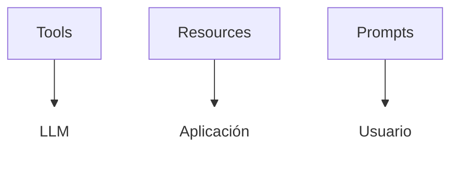

### Introducción

El ***Protocolo de Contexto de Modelo** (MCP, por sus siglas en inglés) es un estándar abierto desarrollado por Anthropic que busca estandarizar la forma en que los LLM interactúan con fuentes de datos y herramientas externas. MCP permite la integración de tools de forma sencilla, escalable y estandarizada y segura.

**Componentes de MCP**

- **MCP Hosts**: Aplicaciones o entornos donde los usuarios interactúan con modelos de IA y desean acceder a datos o herramientas externas a través de MCP (por ejemplo, Claude Desktop, IDEs, asistentes personalizados).
- **MCP Clients**: Componentes ligeros dentro del host que mantienen conexiones 1:1 con servidores MCP, gestionando la comunicación y transmisión de solicitudes y datos.
- **MCP Servers**: Programas independientes que exponen capacidades concretas (herramientas, recursos o prompts) a través del protocolo MCP estandarizado, pudiendo ejecutarse localmente o en la nube.
- **Local Data Sources**: Archivos, bases de datos y servicios que residen en el ordenador del usuario y a los que los servidores MCP pueden acceder de forma segura.
- **Remote Services**: Sistemas externos accesibles a través de Internet (por ejemplo, mediante APIs) a los que los servidores MCP pueden conectarse para obtener datos o ejecutar acciones.

```{mermaid}
%%{init: {"themeVariables": {
  "fontFamily": "Inter, Arial, sans-serif",
  "clusterBkg": "#fff9c4",
  "clusterBorder": "#bdb76b",
  "clusterTextColor": "#000",
  "nodeTextColor": "#000",
  "nodeBorder": "#888",
  "nodeBkg": "#fff"
}}}%%
flowchart LR
    subgraph local["Your Computer"]
        Host["Host with MCP Client\n(Claude, IDEs, Tools)"]
        S1["MCP Server A"]
        S2["MCP Server B"]
        S3["MCP Server C"]
        Host <-->|"MCP Protocol"| S1
        Host <-->|"MCP Protocol"| S2
        Host <-->|"MCP Protocol"| S3
        S1 <--> D1[("Local\nData Source A")]
        S2 <--> D2[("Local\nData Source B")]
    end
    subgraph remote["Internet"]
        S3 <-->|"Web APIs"| D3[("Remote\nService C")]
    end
    style local color:#000;
    style remote color:#000;

```

### Primer Servidor MCP

Vamos a crear un primer servidor MCP que exponga una herramienta simple para sumar dos números. Este servidor estará implementado en Python utilizando el paquete `FastMCP`.

```python
#| file: 95_demos/01_FirstMCPServer/server.py

```

Para probarlo, creamos un cliente:

```python
#| file: 95_demos/01_FirstMCPServer/client.py

```

Para probar, situarse en el directorio y arrancar el servidor y el cliente en dos terminales diferentes.

```python
uv run server.py
```

```python
uv run client.py
```

También podemos ejecutar la tool desde el inspector de MCP. Para ello, ejecutar en el terminal el siguiente comando:

```bash
DANGEROUSLY_OMIT_AUTH=true npx @modelcontextprotocol/inspector
```

O podemos ejecutar el inspector sin la variable de entorno `DANGEROUSLY_OMIT_AUTH`. En ese caso se ejecutaría así.

```bash
npx @modelcontextprotocol/inspector
```

Para poder conectar con el servidor MCP, hay que copiar el valor de la variable `MCP_PROXY_AUTH_TOKEN` que se genera en la línea de comandos al arrancar el inspector y copiarlo en el inspector pulsado sobre el botón `Configuration` y pegarlo en la caja `Proxy Session Token`.

También, podemos probar la Tool desde el Chat de Copilot si elegimos el Agente y luego añadimos la tool pulsado sobre el icono "Configurar herramientas". Actualmente VS Code no soporta el transporte `Streamable HTTP`. Si se desea probar, hay que cambiar el transporte a `SSE` o a `stdio`.Aunque el primero de ellos, está obsoleto y no se debe usar.

Por último, se puede configurar el servidor MCP en algunas herramientas de chat como Claude Desktop o Cherry Studio.

### Transports

MCP utiliza JSON-RPC 2.0 como formato de mensajes. El transporte convierte los mensajes del protocolo MCP a JSON-RPC para transmitirlos y viceversa al recibirlos.

Hay tres tipos de mensajes:
- **Requests (Solicitudes):** Incluyen método, parámetros e identificador.
- **Responses (Respuestas):** Devuelven resultados o errores asociados a una solicitud.
- **Notifications (Notificaciones):** Mensajes sin respuesta esperada.


**Tipos de transporte integrados**

Actualmente, MCP define dos mecanismos estándar:

1. **Standard Input/Output (stdio):**
   - Usa los flujos estándar de entrada y salida del sistema operativo.
   - Es útil para herramientas de línea de comandos, integraciones locales y scripts.
   - Suele usarse para pruebas en la fase de desarrollo.
   - Ejemplo: conectar un cliente o servidor MCP usando procesos locales y stdio[1][3].

2. **Streamable HTTP:**
   - Utiliza peticiones HTTP POST para la comunicación cliente-servidor.
   - Opcionalmente, emplea Server-Sent Events (SSE) para transmitir mensajes del servidor al cliente.
   - Soporta sesiones con estado, múltiples clientes concurrentes y conexiones reanudables.
   - Permite la persistencia de sesión mediante un header `Mcp-Session-Id` y la reanudación de mensajes perdidos usando `Last-Event-ID`.


  En el siguiente ejemplo, se muestra cómo crear un servidor MCP que no usa sesiones. Vemos que el cliente es mucho más sencillo.

  ```python
  #| file: 95_demos/02_TransportMethods/streamable_http/server.py
  
  ```
  ```python
  #| file: 95_demos/02_TransportMethods/streamable_http/client.py
  
  ```

En el siguiente ejemplo se usa el transporte `stdio`. En este caso no se debe arrancar el servidor, ya que se ejecuta el fichero `server.py` directamente desde el cliente.

```python
#| file: 95_demos/02_TransportMethods/stdinout/server.py

```

```python
#| file: 95_demos/02_TransportMethods/stdinout/client.py

```

### Componentes MCP: Tools, Resources y Prompts

El Model Context Protocol (MCP) organiza la interacción entre modelos de lenguaje, aplicaciones y usuarios en tres componentes esenciales, cada uno actuando en un nivel diferente del ecosistema de IA. La imagen siguiente ilustra cómo estos elementos se conectan y fluyen dentro de una arquitectura típica MCP.



**Tools (Herramientas)**

Las tools son funciones o acciones que el modelo de lenguaje (LLM) puede invocar directamente. Están diseñadas para que el modelo ejecute tareas externas como consultar una API, modificar una base de datos o realizar cálculos.

- Ejemplo: El LLM llama a una tool para buscar información en una base de datos de clientes o para enviar un correo electrónico.

**Resources (Recursos)**

Los resources representan datos estructurados que la aplicación expone al LLM. Son gestionados y controlados por la propia aplicación, y sirven como entradas de solo lectura, similares a endpoints GET en una API REST. Incluyen archivos, logs, respuestas de APIs o cualquier fuente de datos relevante.

- Ejemplo: La aplicación expone logs recientes, archivos de configuración o información de usuario como recursos para que el modelo los utilice al responder una consulta.

**Prompts (Plantillas)**

Los prompts son plantillas reutilizables y predefinidas que estructuran las interacciones entre el usuario y el modelo. Facilitan la estandarización y reutilización de tareas comunes.

- Ejemplo: Un usuario selecciona el prompt "Analizar logs y código", que solicita los archivos y logs relevantes como argumentos, y guía al modelo a través de un flujo de análisis estructurado.

En el siguiente ejemplo, se muestra cómo crear un servidor MCP que expone tools, resources y prompts. Los resources pueden recibir parámetros.

```python
#| file: 95_demos/03_RessourcesPromptsTools/server.py

```

El cliente permite listar las tools, resources y prompts disponibles y utilizarlos. Observe que cuando el listado de resources no incluye los parametrizados.

```python
#| file: 95_demos/03_RessourcesPromptsTools/client.py

```

### Context

El contexto en MCP permite que el servidor comunique información al cliente durante la ejecución de una solicitud. Esto es útil para proporcionar datos adicionales o resultados intermedios que el cliente puede necesitar para completar la tarea.

En el siguiente ejemplo, el servidor simula el procesamiento de una lista de elementos y la comunicación al cliente durante la ejecución de una solicitud. Observe que el cliente recibe dos tipos de mensajes: uno de tipo log y otro de tipo progress.


```python
#| file: 95_demos/04_Context/server.py

```

El cliente usa un `handler` para cada uno de los tipos de mensajes enviados por el servidor. Observe también que se ha usado el paquete `fastmcp` en lugar de `mcp`, ya que no se ha conseguido que el paquete `mcp` funcione correctamente con context.

```python
#| file: 95_demos/04_Context/client.py

```

### Tools dinámicas

En ocasiones, es necesario que el servidor MCP pueda exponer tools dinámicamente, es decir, que el cliente pueda solicitar al servidor que le envíe una tool específica en lugar de tener que conocerla de antemano. Esto es útil cuando las tools dependen de datos específicos o del contexto de la solicitud.

```python
#| file: 95_demos/05_Discovery/server.py

```

```python
#| file: 95_demos/05_Discovery/client.py

```

### Integración con LangChain

Un agente de LangChain puede usar las tools de un servidor MCP como si fueran tools de LangChain.

```python
#| file: 95_demos/08_agents_MCP/server.py

```

```python
#| file: 95_demos/08_agents_MCP/client_langchain.py

```

### Autenticación con OAuth2

Los servidores MCP permiten autenticación de clientes MCP utilizando el protocolo OAuth2. La autenticación se hace a nivel de cliente, no de usuario. Para ello se requiere un servidor OAuth de autentificación (GitHub, Google, auth0, ...). 

```{mermaid}
sequenceDiagram
    participant Cliente as 🤖 Cliente
    participant ServidorAuth as Servidor de Autorización
    participant ServidorMCP as Servidor MCP

    Cliente->>ServidorAuth: 1. Solicita token de acceso
    ServidorAuth-->>Cliente: 2. Devuelve JWT (token)
    Cliente->>ServidorMCP: 3. Usa token en cabecera HTTP para llamar a la tool
    ServidorMCP->>ServidorAuth: 4. Valida el token (incluyendo "scope")
    ServidorMCP-->>Cliente: 5. El cliente recibe la respuesta del servidor
```

Para registrar una nueva API y aplicación cliente en Auth0:

1.- Registrarse e ir al [`Dashboard`](https://manage.auth0.com/dashboard) de Auth0.
2.- Pulsar sobre `Applications` en el menú de la izquierda.
3.- Pulsar sobre `APIs`.
4.- Pulsar sobre `+ Create API`.
5.- Introducir un nombre y una descripción para la API.
6.- En `Identifier`, introducir: `http://localhost:8000/mcp`.
7.- Pulsar  sobre `Create`.
8.- Pulsar sobre `Permissions`.
9.- Añadir un nuevo permiso con el nombre `read:add` y la descripción `Permite usar tool read del servidor MCP`.
10.- Pulsar sobre `Machine to Machine Applications`.
11.- Seleccionar el permiso y pulsar `Update` y `Continue`.
12.- Pulsar sobre `Applications` en el menú de la izquierda.
13.- Seleccionar la aplicación que se ha creado.
14.- Copiar `DOMAIN`, `Client ID` y `Client Secret` que se han generado en el fichero `.env` con los nombres de variables `AUTH0_DOMAIN`, `AUTH0_CLIENT_ID` y `AUTH0_CLIENT_SECRET`, respectivamente.

```python
#| file: 95_demos/09_Authorization/server.py

```

```python
#| file: 95_demos/09_Authorization/client.py

```

Se puede probar desde el inspector de MCP añadiendo el Bearer Token en la configuración del inspector. Para obtener el token, en el `Dashboard` de Auth0, pulsar sobre `Applications` y luego sobre selección la aplicación; pulsar sobre `Quickstart` y con la pestaña `CURL` seleccionada, pulsar `Get Token`. Copiar el token que se genera y pegarlo en el inspector en la cada `Bearer` (pulsar `Authentication` para ver la caja).

### Integración con FastAPI

Observe que se puede definir endpoints de FastAPI y tools de MCP. Los endpoints de FastAPI se usan como `tools` de MCP.

```python
#| file: 95_demos/10_Fastapi_Integration/server.py

```

```python
#| file: 95_demos/10_Fastapi_Integration/client.py

```

Otra forma de integrar FastAPI con MCP se muestra en el siguiente código. En este caso, los endpoint de FastAPI se sirven desde fuera de MCP. MCP está montado en `http://localhost:8000/mcp-server/mcp`.


```python
#| file: 95_demos/10_Fastapi_Integration/server2.py

```

```python
#| file: 95_demos/10_Fastapi_Integration/client2.py

```

